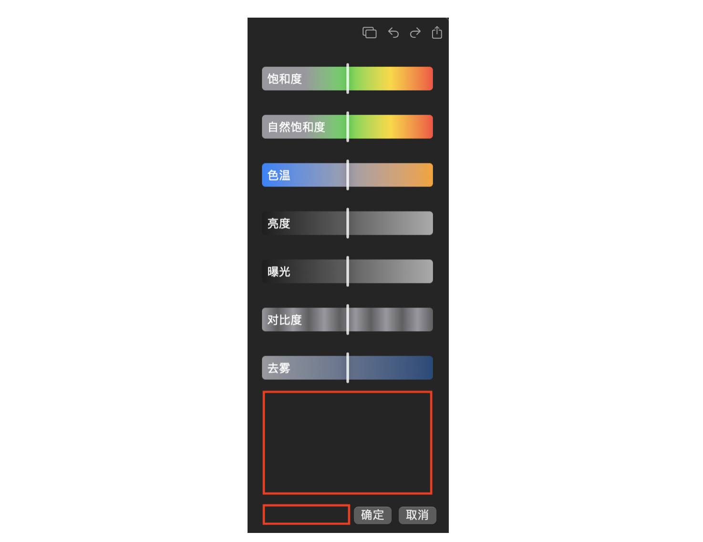

## Appearance 适配
超！居然忘了 light mode 的适配，自己一直在使用 dark mode，导致根本就没想起来要适配 light mode，偶然间切换了一次 light mode 后，app 整个 UI 太辣眼睛了，立马抓紧适配。

## 快捷键支持
SwiftUI 虽好用但绑太多东西在固定框架下了，就一个快捷键而言它必须依赖组件本身带有 Control Modifier 的修饰，假设你使用了 Image 组件，给 Image 添加了 OnTapGesture 事件，但因为 Image 本身并不具备 Control Modifier 的实现，通过 `.keyboardShortcut()` 无法响应快捷键。

不过仔细想想也是，对于 Image 来说我们给它添加上的 OnTapGesture 只是额外的手势修饰符，其本身并不具备响应快捷键能力。

## 善用 Spacer() 
当你想完成类似以下布局时，但没有很好的办法按照 Apple 官方交互文档做间距时，切记你正在使用的是 SwiftUI，Apple 有史以来最智能的 UI 框架，仅需在关键的位置放上 `Spacer()` 标签，即可自动完成最佳间距控制和布局。

