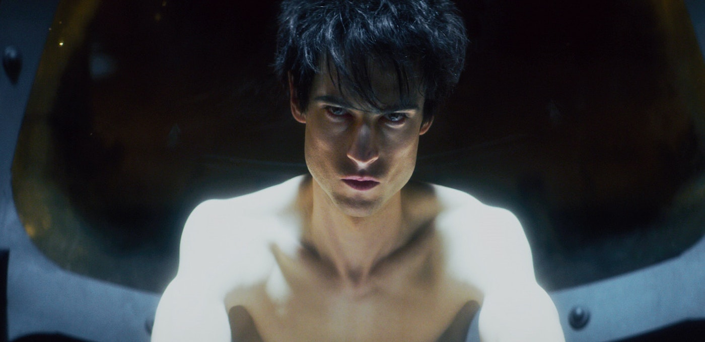
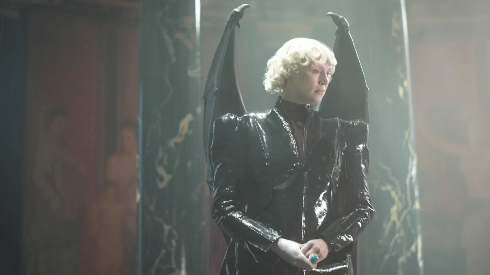
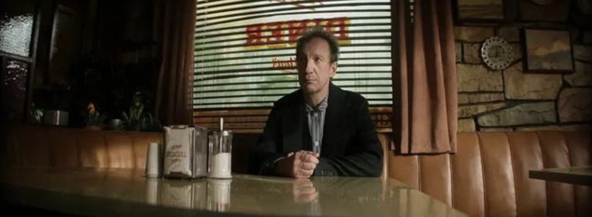
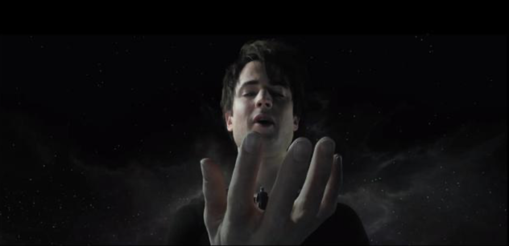

从上周开始追的《睡魔》到今天凌晨两点半终于看完了，好久没有如此畅快的追完一部有如此深度的剧了，引起了我很多思考，记下了不少东西，上一次还是学校里追的黑镜系列。睡魔因为我并没有查看过任何的资源，原著更是没有看过，看了前两集觉得这不会又是什么中土魔幻吧，中间完全脱离了一个星期，而后在推上看到了 tinyfool 在说这部剧，决定还是看完吧，没想到《睡魔》的世界是这样的......

## 序
Netflix 真的是一个非常不错的内容平台，注意前提一定得是框在“内容”下面，我并不理解这到底是国内外 app 设计差异还是人群使用习惯不同，为什么 Netflix 的 web 和 app 可以做得如此差劲，经常找不到自己看过什么，有段时间我都随缘了，如果这一次打开能够看到上一次的记录就继续看下去，如果找不到就不看了。

我也不清楚这种每隔一段时间放出一个大招是不是 Netflix 拿来刺激订阅量的方法，但我是非常喜欢这种套路的，每隔一段时间让自己接受到一种相对较新的理念。我之前受到这方面的熏陶很少，所以现在但凡出现过一些沾边的东西，总是会往前够一点，让自己多一些输入。

睡魔就是这样的，如果不是我从推上看到了大家的讨论，说是第五第六集是亮点外，可能这部剧我真的要丢弃了，因为前面一两集真的不知道在干嘛，整体流程的观感比较费解，得亏前面的召唤仪式把我看呆了停留一会，我是真不明白这前后是怎么关联上的。事先说明，我并不想做任何的剧透，我对人名甚至都不想说，只想描述一个场景，在这个场景下发生的人和事给到了自己怎么样的思考，我只说这个。

## 思考

### 光明使者

发生在地狱的一场梦境之王和光明天使的决斗，如果“梦”赢了他可以拿回自己的护国头盔，输了成为那只恶魔的奴隶。看到这里我才明白，原来“决斗”是一件非常重要的事情，大家都会非常尊重双方的选择，上一次对决斗有感触是从电影《沙丘》开始的，这比小时候“打架”和“单挑”高级多了，更有尊严和人格。

在双方互相说明决斗条件时，没想到这个恶魔自己不出马，让光明天使这个地狱领主代替自己，哇...看到这里我对决斗这件事又有了新的认识。接下来我又以为是一个各种烧钱的特效大杂烩，没想到是我把神明想得低级了，神和神之间的决斗玩的很文明，是一场思想上的决斗，根本没有凡人世界的那种打打杀杀，比的就是一个想象力，凭我的印象说两段。

> 光明天使：“我变成凶恶大灰狼，匍匐在田野上，通过锋利的前爪给猎物致命一击”
> 梦：“我化身骑马的猎人，手持百发百中的弓箭，射杀大灰狼”
> 光明天使：“我是毒液威力最大的毒蛇，对准马的脚狠狠的咬下去”
> ......

然后光明天使和梦就在那“哎呀哎呀”的东倒西歪，身体上都出现了对应的伤口，在此之间二者没有任何的肢体接触，决斗的方式就是通过语言，结合自己的思考和想象力战胜对方，尤其是到后面深度一下子上来了，“我是宇宙”“我是反生命”“我是...希望”。看到这种决斗方式的我，两眼都直了，深深的感叹到原著作者的脑洞之大，感谢他能够把这些带给我们。这是我从未想象过的决斗方式，这和我对决斗的印象完全不同，当我还抱着一种常规的特效大战来预期时，最终体现出来的效果却是这般落差之大，才得知神与凡人确实不可言喻。

尤其是梦最后说给光明使者的话，“梦想是有用的，身处地狱的你们又何曾不梦想去往银河城呢？”

### 红宝石

第五集主要是讲了约翰从母亲营造的“监狱”里跑出来了，之所以能跑出来是因为母亲和约翰和解了，这部分内容我当时看得也比较懵逼，甚至都没 get 到他俩之前到底因为啥结下了梁子导致约翰关在监狱里 30 年。约翰跑出来后来到了坐了一个女士的车来到了一家饭馆，在这个饭馆里发挥了“红宝石”的作用，这个红宝石会使得人们变得诚实，不再撒谎。

我到现在也没明白这个红宝石的作用到底是不是这个，还是说红宝石的具体作用会因为拿在不同人的手中而变得不同。我估计他是因为有一定的精神疾病，毕竟小时候一直被妈妈欺骗，而妈妈的欺骗却是因为一个女人带着一个孩子独立生活非常困难，需要利用一些生存的手段才能养育一个孩子成人，可能是这个过程里妈妈的一些话语和行为对约翰的童年记忆产生了异常，最终导致自己的精神世界发生了变化，总觉得如果这个世界上的人不再撒谎，那一定是个非常完美的世界。

最终看完约翰在饭馆里和红宝石发生的所有事情时，我整个人都呆住了...又是在上厕所时脑海里飞速的过着如果这件事真的发生在我所生活的这个世界会是怎么样，因为在剧中的那个饭馆里，所有人都开始坦然相待，敢想敢做，纯粹变成了一个思想表达器。我所惊叹的点就在此，原来不经修饰的表达自己脑子里的想法是一件如此可怕的事情。

如果说我们周遭的这个世界真的变成了这样的话，要知道人类对自己脑子的了解还无法完全 copy 一个相同的脑子出来，目前最强大无比的超算也无法等同于人脑一秒中所计算得出的结果，在这短短的一秒里我们已经根据身体上的各种感官器官结合自己的思维做出了决定，如果我们真的对眼前所看到这一切不加修饰、不顾一切的直接说出来，会发生什么，我之前从未想过，但第五集给了一个方向。

很多互联网公司都有自己 slogan，爱奇艺的“简单想简单做”，字节的“坦诚清晰”等等都在透露出了我们要敢于表达真实的自己，不要对一件事有太多复杂的考虑，这一点我很认同，因为事情越想越难、越想越复杂，甚至想着想着就不想做了。但在实际工作待人接物的过程中，这两点都非常难做到，举一个非常简单的例子，我经常说“想不想和一个人聊下去，5 分钟就够了”，上文也已经说过了，人脑的处理速度非常快，一秒钟的时间可以处理非常多的信息，5 分钟你和一个人面对面的交流沟通，你们之间产生的信息流动已经非常庞大了。这一点我验证过了非常多次，每一次都得到了近乎完美的答案，但这仅限于聊天本身，无法套用在对一个人的了解上。每个人都是一本历史，有长有短，有丰富有贫瘠，只有与他一同生活在一起才能较为立体的认识一个人，读完这本书。

梦拿回自己的红宝石过程还有些曲折，因为红宝石对于他自己来说不但是个法器还是个禁锢自己的法力的容器，每使用一次红宝石就会被它吸收一点法力，渐渐的红宝石里蕴含了大量梦的法力，梦借用了约翰自己的梦想，梦想创造一个诚实，没有谎言的世界梦想，把红宝石给破坏掉了，这一破坏居然释放出了原先聚集在红宝石里梦的法力，给到了这个我尬得不行的画面...

在这里梦和约翰还进行了一番较为深刻的对话，推荐大家自行看一遍，是关于“虚伪和诚实”的讨论。在剧集开头约翰乘坐那位女士的车子里时，他也问过那位女士，“你会欺骗他人吗？”，不得不说的是做人确实得坦坦荡荡，只要你心中无愧，做什么事情都不会觉得亏欠。那位女士最后说道“有时候欺骗是为了保护”，诚实并不是一定是完美的，有时候需要伪装或欺骗来保护自己，降低他人对自己或者自己对他人的伤害。

我承认自己就是靠着梦想前进的，如果没有梦想，我完全不知道自己该去往何方，但这个梦想是自己所经历的一切所决定的，每个人的经历不同，造就了每个人的梦想不同，每个阶段的梦想也可能会不同。虽然说一直拿过去的东西来反反复复的炒是不好的，但那趟 WWDC 之旅真的是我人生中最改命的一次，一直舍不得去描述那段旅程，因为我担心一旦我写出来了，我对它的印象就固化了，而那段时间里给到我的冲击太大了，想留着日后慢慢回忆。

### 其他
以上是睡魔这部剧里两个对我改观较大的点，接下来再分享一些较为零碎的点。

死亡是梦的姐姐，掌管着宇宙间所有生物的死亡，当宇宙的最后一个生命死去后，她会锁上宇宙的大门。她在和梦边散步边带走一个个死亡的人类途中，说了这么一句话**“死亡和出生一样自然，为什么人类要惧怕死亡。”**。

是啊，我也不理解为什么人类这种生物为什么不明白出生不是自己决定的，而却要自己决定死亡呢？如果这个星球上生活的 70 多亿人能够明白这一点的话，这个世界会不会变得更积极向上一些呢？不会有那么多的无意义的事情，这个世界会变得更美好一些吗？我们人类会变得不那么功利一些吗？甚至我也在畅想，如果有一天我们全人类都觉醒了，明白了我们不过这是这个星球甚至这个宇宙中无意义的一个“东西”，我们的社会会不会发生倒退？仔细想想好像是这么个道理，太阳系都没走出去，宇宙那么大，我们那么小，日常做的这些东西到底是为了些什么呢？

站在人生道路上的分叉口上的我，父母即将年过半百，而我在可预期的未来会有自己的孩子，但我为什么要让自己的孩子来到这个世界呢？就像我也不知道为什么自己会来到这个世界一样，如果说我来到这个世界的意义是让我的孩子可以让他的孩子来到这个世界...啊，这是什么回溯算法。

梦给了一个凡人永不死亡的能力，并约定每过一百年后都在同一个酒馆里见面，聊聊发生在自己身上过去一百年的事情。第一个一百年结束了，梦问凡人“你的意思是依旧想活着”？“噢，是的”“那一百年后见”，第三个一百年，梦神来了，他看到这一百年的凡人变得无比堕落，被同类嫌弃，他问了凡人还想活下去吗？对方却说“死亡有什么意思？有这么多可以享受的东西。”

噢，我好像有点明白凡人为什么之所以是凡人了，也明白神为什么总是爱拿凡人开玩笑，因为这二者每天的所思所想是完全不同的，凡人认为神无所不能，长生不老，梦想着自己有自己能够变成神，神认为凡人无可救药，但却因为自己是服务于人，却要仔细观察人间可能出现一点思想之光，并于此散播智慧。发现了吗？神也无奈，人也无奈，神无法脱离人或者生物的世界，因为有了人或生物才能有了神，神才有意义，换句话说，神也不知道自己的意义在哪，一旦人无了，神也没有了存在的必要。

不禁感叹文艺复兴赋予“人”的全新视角对后代影响真的太大了，渺小无知的人类居然敢把神拟人化，贬同为凡人的形象，看来人间和地狱并无差异，地狱的恶魔们总想着逆天，人间也总想着上天堂，那天堂里的人想去哪呢？看来阶级概念从古至今也·一直存在，所有生物都存在阶级。

莱塔在陪同罗丝乘坐飞机寻找自己外婆途中做梦梦见了自己故去的丈夫，和丈夫展开了一次也较为深刻的对话。“当人失去父母时，才会意识到一直以来让我们有踏实感的并非重力，而是清楚自己是某人的女儿或者姐妹或妻子。”这点和家庭是我们温暖的港湾之意不谋而合，暂不评论，先分享出来。

下面这两句话是莱塔和罗丝来到了外婆在伦敦的家里，走楼梯上楼的过程中说的，成年人的世界果然有很多令人不解的事情啊！

> “他们每次都要查看我的身份证，真烦”
> “等到他们不查看你的身份证时，那才是真的烦，相信我 ”

莱塔和绿地之主开车前往麦片展会酒店接自己的弟弟时，绿地之主给莱塔分享了自己在全球各地旅行的思考，其中说到了这么一句话“对我而言，旅游的目的不是为了踏上外国的土地，而是为了最终回到故土时，能以崭新的眼光看待故土。”

但我看到这句话时才恍然大悟，原来我对自己的家乡现在有这么多的意见，正是因为在外这么多年的过程中所经历的事情所遇见的人所做的事情等等汇集起来给到我自己的全新视野，我的视野比以前变得宽广了，所以再回到家乡时，看待家乡的感觉也变得不同了，这是我的问题，要改。

## 跋
这部剧在我这里很伟大，在此之前我还看完了《黑暗夏日》、《末日列车》、《鱿鱼游戏》等等也都给到了我不少思考，但远没有睡魔给我的思考层级更丰富，这是一部我要等同于《黑镜》一起推荐给未来我的孩子的作品。

梦想，是啊！每个人都要有梦想。