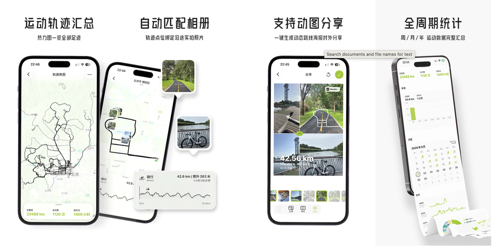

Movinn 是一款专注于个人户外轨迹管理的工具。它不做社区，也不提供复杂的专业分析或教练指导，而是把重点放回轨迹本身：你去过哪里、如何移动、路线如何展开。无论跑步、骑行、徒步还是日常通勤，Movinn 都能帮你快速回看过往记录。只需很少的成本，你就可以把控自己的数据，并通过地图、时间线与多种可视化方式，重新浏览那些走过的路。

## 起源
刚好三年前，我启动了 PFollow app 的[重建计划](https://my.feishu.cn/docx/VhsZd0SEYocNyBx92YIcuXFcnjf)，但直到 25 年初都没有很好的推进，一直在被工作上的事情耽误。再加上那两年每开始做一个新 feature 就要用「古法编程」构思半天、写半天再加调试半天，一个周末经常干不了多少活，也就一直断断续续的写着。直到 25 年初 AI Coding 这件事逐渐发生了一些转变才得以加速，节省了一半以上的精力专注在思考产品本身。

在做 PFollow 这几年的时间里，尤其是今年上半年我得到了极大的满足感。卖出去了二三十份，虽然只赚了几百块，但至少能证明这个产品至少在某些方面满足了大家需求，不是纯意淫的产物更不是我个人的幻想。此外，PFollow 也是我开始正式商业化的产品，我尝试在这个如此小众垂直的产品里找到了可以商业化的地方，这一点对我来说是个挑战。

在此之前我都是按部就班的接受「别人的定价」，比如在工作中我所负责的这个模块这个业务方向对外的具体价格是多少，这件事是不可能让我介入的。这里面有完整的一套测算方案和计价方式，甚至有完善的宣发策略，作为一名在庞大的运转机器里一颗研发螺丝来说，我能做的就是让这个模块这个业务方向不在我这里卡住。可以开门见山的说，在过去的工作经历里我只能通过结果去反推甚至是观察大家的决策结果来总结出一部分归因，但你问我为什么是这样为什么不是那样，真的很难说清楚。

但成长还是有的，至少我已经把不敢发布产品到真实环境中这一个缺点给改掉了。在学校里我写的这么多 app 都没有发布，导致在工作的前几年时间里都懒得写 app，甚至都冒出过再也不想写 app 的情绪里，这一切的原因就是因为成本太高了。我是真的很担心凭自己的一腔热血做出来的东西真实发布后，别人真的在用它来做一些事情了，遇到问题后我无法及时快速的解决，耽误了别人，这件事就很得不偿失了。从做出 PhotoP 开始这个毛病才改掉，我担心了太多的问题设想了太多的场景，导致自己被局限住了，这个转折发生的时间点在 22 年夏天和 dandy 大哥在广州吃的那顿饭。

这个毛病改掉后胆子大了很多，我想去做一些「因为某个功能好所以付费」的事情，但怎么找到的合适的付费点又是一个挑战。作为程序员来说几乎不存在搞不定写不出来的功能，只存在需求不明确、拆分不清晰导致写出了不负预期的代码。所以要说服自己把某个功能作为壁垒作为特色功能去进行商业化，本身和我们的思维模式是相抵触的。

在 PhotoP 和 PFollow 两个产品中我选择了两条不同的路。PhotoP 是一个修图工具，工具属性非常强，用户就是为了你的某些功能来用这个产品，后续的迭代思路也很清晰，不断的推出新的功能即可。PhotoP 的第一个付费点是与薄桑合作的「自动修图」功能，仅需点一个按钮，自动调色，售价 3 元。PFollow 的商业化思路是售卖独特的数据集，目前总共整理了 10 套供地点收藏者群体打卡用的数据集，可以通过相册照片自动检索出去过的地方，一年 18 元，终身 28 元。

发展到现在这个阶段，我做新产品的思路会先思考怎么商业化而不是能不能做出来以及做什么。先不管能赚多少钱，只要能想出来一部分或者几个付费点，并且这个事情自己还挺喜欢不反感，那就先开始。在做的过程中肯定会持续性的看更多的信息，综合这些信息再实时的调整迭代方向。换句话说就是，从新产品开始上架的第一天第一个版本就要带上商业化，如果用户都能在你早期如此简单的版本付费了，剩下的事就很简单了，扩大你的受众群体，收集反馈，持续迭代即可。

那多少个付费用户才算是 PMF 达成呢？才能够持续不断的投入精力去继续维护呢？这个问题我没有答案也在持续性的摸索中，现在的判断思路是这样的：如果你每次对外宣传都有用户付费，只要有一个，就可以认为 PMF 成功。至于不宣传就没有付费用户，宣传了才有付费用户这种事情就是运营侧的事情了，你要么找人专门去做，要么划分出固定的时间自己去做运营宣发，否则裂变会很难，再加上现在的获客成本越来越高，PMF 统计口径不能再像之前那样粗旷。

因此，在做新产品 Movinn 时我的思路也发生了新的转变，第一天就想好了付费点是哪几个，以及不做什么。6 月 12 日的下午 17 点开始动手做 demo，当天晚上就完成了 mvp。马上拿给女票看了下，我们都觉得这个思路可行，第二天开始我马上进行 demo 拓展，正式作为全新的产品进行开发。

## 要解决的事

Movinn 这款产品主要解决**可视化运动轨迹这件事**。

市面上有大量的服务各种运动的 app 和平台，甚至包括 AI 教练本身都大量集成进了产品中，用户只需要同步自己的运动数据到这些产品中就可以获得提升的训练方案计划。运动是一件反人性的事情，每一次运动结束，我们都想「装逼」都想分享自己的数据页面，这点无可厚非。但这些事情要么是服务运动期间，要么是服务运动结束那一刻，要么是从你的历史运动数据里挖宝，给你看过去的运动数据的各种总结。要么就是做社区，加一堆网上邻居，看大家做了什么运动在哪里运动以及运动数据怎么样等等。从这些角度出发，运动方向的事情貌似都被做完了，几乎找不到一个缝隙是没有被抹平的。

是的，曾经的我也是如此认为的，就算是如此喜欢户外运动的我都很难在这个自己喜欢的方向里做些什么，一直想了好久。直到今年 6 月初决定开始在北京好好骑车一个月哪也不去，和新入坑公路车运动的小伙伴一起骑车时才猛的反应过来。

过去的这些平台和产品都是服务于人本身，都专注在你自己运动得怎么样，下一次怎么提高，按照什么训练计划可以达成你的赛季目标，却几乎很少人关注「轨迹」本身。既然我已经把 PFollow 这个产品验证了存在「收集地点」的垂域需求，而且完成收集地点的前置条件是必须到这个地方拍下一张照片才能证明去过了，通过这种和真实物理世界产生联系的方式，让用户和它所拍摄的照片耦合在了一起。其实这种通过照片来证明自己去过这个地方的逻辑也是被先验过的，在登山圈中，登顶后必须要进行「360 环拍」才能证明登顶成功。

所以我认为可以通过专注在「轨迹」这个方向去做，彻底避开「人」本身，放弃社交、放弃数据、放弃训练，只专注在轨迹本身，以后的运动社交资本有一个方向可以是「轨迹库」。如果还是圈定在攀比这个思路里，那就是看在那些城市地区里运动过，直接看你的轨迹热图，叠加在地图上运动轨迹越多的地方颜色越深，你的运动半径是什么，你最常去的路线，你对某座城市的探索程度。如果是圈定在生活方向，那就是看自己的生活轨迹。我有一段时间每天就是骑车上下班，虽然只有不到 10 分钟的骑车时间，但我还是开了表记录，用 Movinn 看那段时间的轨迹，深深的感受到了生活的单一性，每天就是上班然后下班，第二天继续上班然后下班，如此反复。

转变成关注自己后可做的事情就很多了。我选择了从运动轨迹切入，绝大部分人都会在进行来之不易的户外运动时开启运动记录，开启运动记录后就会产生轨迹，Movinn 通过可视化这些运动轨迹让用户直观的感受到过去一段时间自己的户外运动情况。原来在楼下小河边跑步 10km 要往返这么多趟，原来骑车 178km 要爬这么多山头，原来徒步的这条短短 14km 路线居然全是小起伏，这些东西用户一打开 app 仅需两步能感受到，毕竟在产品层面往往只是比竞品相同功能多省几步就能带来质变。

让身边几个朋友试用后，其中一个反馈我觉得特别有意思。他也是和我去年一样每天骑车上下班，但他更长久一些，几乎每天只要上下班就骑车，每次骑车都开表进行记录。打开 Movinn 后他往下滑了几次都是相同的运动轨迹，在群里给我一顿抱怨，做的这个 app 太丑了，根本没有让人打开的欲望。其实我是开心的，因为他发现了问题，发现了他的日常生活轨迹的固定化，他说的「丑」，说的「没有让人打开的欲望」等等，在我当时看来其实说的是他自己，只是把这种对生活的不变性和无奈发泄在了发现这个问题的东西身上。

这何尝不是一种做 app 的收获和乐趣呢？这就是我想在 Movinn 这个新产品上要做的事，通过换到关注轨迹本身来发现一些我们之前发现不了的问题。

## 商业化
**轨迹热图。**把自己的所有运动轨迹都合并显示在一张地图上，一块区域一条路线运动轨迹越多颜色越深。运动日历、运动类型占比，周月年统计等都打包进轨迹热图模块里，还可以翻看过去不同年份的运动轨迹。我好几次就是想看看自己过去一年骑车的轨迹总览不得不花费高昂的订阅费，后来出现了一些专门做轨迹热图的小工具平台才缓解一些，但交互和品质都比较糟糕，勉强能用。

**多动图分享。**目前几乎所有运动健身的 app 分享页面都做没有做动图叠加运动数据进行分享，但这件事本身也不难，大概率是 ROI 不高。只能先保存一份带透明通道的 png 图片，接着转移到某些修图 app 中做动图和数据叠加，这已经不是多几步的问题了，都离开了自己的 app，有一些机会在里面。Movinn 首先是支持动图叠加数据导出，其次是解锁高级功能后最高支持 9 张动图叠加数据，最终导出成为一张动图保存。这个多动图导出能力就用到了我之前在剪映的工作经验，又快又准还稳定的进行多动图合并导出。

**轨迹合并。**多段轨迹合并是户外运动常见的场景，确实也有不少工具和产品可以做到这件事，但都需要依赖 web 或者脚本进行合并，对于普通 C 端用户来说不够便捷。甚至前几年还出现过收费合并轨迹，当时知道这个事后自己有些受惊，居然真的存在搜都不愿意搜一下的人，只想花钱解决。这也是个机会，确实有人愿意通过花钱来解决一件事，完全不想让这件事耗费自己一点精力。

**iCloud 同步导入路线**。Movinn 的一大宣传点就是构建自己私人化的轨迹库，用户可以从不同的产品和平台导入 GPX 文件到 Movinn 中，开启 iCloud 同步后，只要你的 AppleID 在这批轨迹线就一直在。哪天想要走线了，直接从 Movinn 中选择一条路线进行路书导航。前几天去朔州玩耍时，就从广武明长城走到了雁门关，路线从两步路导入到 Movinn 中的，一路上就靠着 Movinn 进行路书导航，这种感觉还挺奇妙的。

目前 Movinn 正在进行促销活动，大概持续两三周的时间（三个版本），仅需 3 元即可解锁所有高级功能。这些功能 Strava 要收费 368 元一年，行者要 180 元一年，更何况不是所有平台都能够做完以上所有事情，但 Movinn 可以。

## 未来规划
不能给产品设限，就像我们不能给自己设限一样，Movinn 的短期规划是有的，但长期规划我不想去思考太多。最近几个版本准备把基础功能继续完善一波，还有很多户外运动场景没有满足得很好。比如昨天刚做完显示坡度轨迹线的功能，我原本以为通过轨迹线来看前方道路坡度如何没必要，实际上在我走向雁门关的山路上，因为一路无补给我要尽可能的把两瓶水和一听可乐做精准分配，平均走多长喝一口白水，走到距离雁门关景区多远把可乐喝了等等。

这些事情需要非常频繁的对比前方路口，但在之前的 Movinn 版本中我只简单的做了高度曲线组件，还是不够直观，在户外大太阳以及频繁上下坡的情况下，反复掏取手机本身就是个风险动作，只能尽量去缩短看路况的时间。我也才理解为什么这些户外运动 app 显示轨迹时都会优先显示坡度，还真是事教人一教就会呐！

我还在克制给 Movinn 加上实时轨迹记录功能，但快有点克制不住了。因为目前市面上做轨迹记录的软件和硬件非常多，没有任何必要去做一件已经被解决得很好的事情。我现在戴的是佳明 fenix 7 手表，23 年 8 月购入，当时就是因为 apple watch ultra 无法满足越野跑既要导航还要记录心率、轨迹以及各种姿态数据长达 10 个小时的基本诉求才买的佳明。这块表马上就戴了满三年了，性能依旧强劲如初，原装表带都断了重新买了一根换上继续戴，就是因为品质太好了，也十分耐操，不管任何场景下都踏踏实实的工作着。现在我连骑车都用它来记录了，把码表都卖了。

但为什么还是想做实时轨迹记录呢？因为在户外运动中我们的感官会被打开，不管是心情还是思维都会因为进入到了户外接触了自然而变得敏感了起来。脑子经常会冒出不少奇妙的想法，甚至有感而发，此时如果能够快速的记录下来，事后间隔一段时间甚至几年后再回看这段运动轨迹时，听听当年的自己所思所想所感，是一件非常奇妙的事情。更何况如果走这条线时如果发现了风景点、补给点、测试或者风险点时，都可以实时记下。在 18 年做「原始版」PFollow 时完全就是基于实时记录去做的，用户只需要按下一个按钮，就可以自动记录下当前环境的所有信息，这个奇妙的用户体验种子从当时就种在了我的心里，久久不能忘怀。

不过这个事情高驰终于在最新推出的表里自带了。开始运动后，按下录音功能键，可以直接进行录音，后续结束运动后可以在轨迹线上回放当时的录音，或者看到手动的标注点。这样你的运动轨迹就是像富文本一样的「富运动轨迹」了，分享到社区后可以作为社交资产或收费轨迹进行售卖，不管对个人还是对社区都是一个不错的思路，只是没想到真的有厂商内置了这个能力在硬件里。

## 总结
其实 Movinn 做的这些事情市面上都能找到类似甚至一模一样产品里的某个功能进行对应，但就是因为各自主打的侧重点不一样才造就了各自的受众不一样，这点也不用我多说了，抖音和快手本质上也没有什么区别，但他们的受众群体就是不一样。与上半年做 PFollow 时状态一样，Movinn 也是我思考了很久才决定做的，但导火索是 B 哥赞助的 Token 费用，可以让我不用考虑研发成本去肆无忌惮的做真正想做的产品，**感谢 B 哥！**

从提审到最终上架总共被 apple 拒了五次。印象最深的是 apple 要求我提交测试账号进行测试，但 Movinn 不需要登录，我压根就没有测试账号可提供。说明了一次情况后被打回，再强硬的说明了一次后继续被打回，但第二次被打回 apple 好心的提醒我，可以做一个演示模式在 app 里提交审核，但不能提交演示视频。所以你现在用 Movinn 时，可以看到在更多页面里的其他模块下有个「演示模式」的入口，全拜 apple 所赐。

不过这也至少说明了如果 apple 审核人员认为 ta 都没有足够的测试数据进行测试使用，那必然会存在一部分用户也无法正常使用，用户会感觉自己下了「寂寞」，所以从审核环节直接拦住要求开发者要么提供测试账号要么提供内置在 app 中的演示模式，这倒也能理解。这点还挺 apple 的，事后看来我还挺喜欢。正式上架也才四五天的时间，截止到目前为止卖了 10 份左右，对比 PFollow 来说前期的付费速度变快了，是个好事。

7 月 9 日是 Movinn 正式上架的日子，也是我正式 gap 半年的日子。过去的这半年时间里过的太舒服了，是一种内心富足的舒服，没有感觉一天是白过的，无比珍惜过去的每一天，无比期待到来的新一天。甚至每一天起得比上班更早睡得比上班时更晚，因为想做的事情很多，也终于有时间可以无忧无虑的去思考自己到底想做啥。

是啊！从小到大，几乎明天都被定义好了。大人口中的「上大学以后就好了」，实际上就是因为上了大学，见到了更多的可能性，才觉得自己欠缺的东西太多了，疯狂的吸取周围的能量，像饿虎扑食一般给自己创造机会。爽倒也是挺爽的，但就当时的内心一直有种我不能停下来的声音在 push 着自己，不知道是当时的自己内心不够强大，无法正确的审视自己，还是什么别的原因。反而现在的我从 1 月 9 日离开字节后到现在的每一天都能很坦然的面对，不管发生任何事情都可以平静的接受。

不知道再过半年状态会发生什么样的变化，总之期待吧！希望我的新产品 Movinn 你能喜欢。