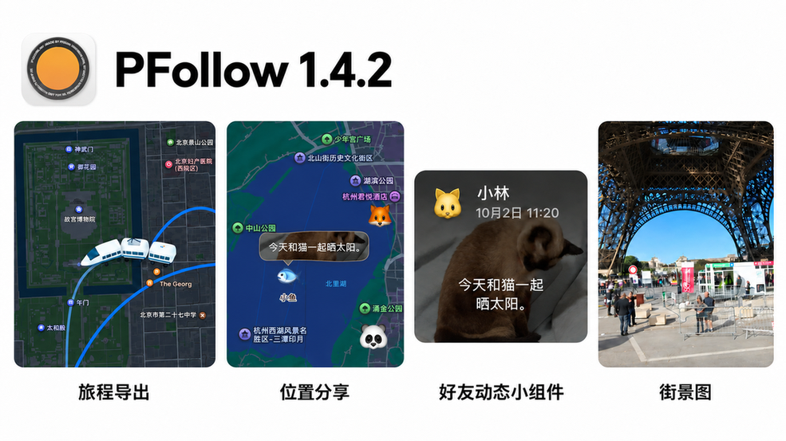

PFollow 最近来了一波大更新。旅程线可以导出成轨迹视频了，好朋友位置分享加上了文字和图片，从照片回到拍摄地点的街景图也做进来了。地图上除了自己的照片，也开始多出一点社交的味道。做起来挺痛苦，也挺有趣，希望 PFollow 能继续给你带来一些美好。

## 序

好久没有正儿八经地更新一波 PFollow 了。它是承载我品味的第一款产品，但做了这么久，有些旧想法确实已经过期。现在有 AI Coding 工具帮忙，不少人都想做自己的旅行回顾产品，做出来又往往差不多。就算如此，大家还是前仆后继地往里跳，总觉得没有一款完全符合自己的心意。这倒也能理解。跟以前比，做产品的成本已经低了太多，能做一个自己喜欢、符合自己品味的东西，自己用得开心，确实就够了。现在何尝不是一个最好的时代呢？

PFollow 早在好几个版本前就满足了我的诉求，后来更多是在解决大家的问题。最近也慢慢转了个方向：分辨哪些是共性需求，哪些现有产品没解决好，再把它们拆成可以落地的功能。欢迎大家在使用 PFollow 的过程中多多反馈，我来帮你解决问题。旅程导出就是这种变化的一个例子。以前一直在琢磨怎么替用户认出一趟旅行，现在更在意怎么让用户把想分享的那段路讲出来，就从它说起吧。

## 旅程导出

之前的旅程线把照片按时间连到地图上，已经能看出一次出行大概经过了哪些地方。但「把照片连起来」和「把一趟旅行讲清楚」，还真是两回事。早期按相邻照片的时间间隔划分旅程，超过一天就可能切成两段。旅行中恰好有一天没拍照，前后明明还是同一趟；反过来，在家随手拍的日常照片又可能把列表刷满。后来改成先按天整理照片，再根据一段时间里经常出现的城市估计常驻地，从离开常驻地到回来组织旅程，途中几天没照片也能接上。

可相册提供的线索就这么多。算法调了好几个版本，怎么弄都不合适，搞到最后自己都没多大信心。这个功能还是留在了「实验室」，没有放到首页主推。隔了较长一段时间再回头看，「旅程」这件事的重点开始变了。与其继续纠结自动识别得准不准，不如把「线路的分享」做好。可能用户自己都说不明白该如何定义一段旅程，其中还有心理活动和外界影响。之前的旅程线也不太方便分享，虽然做过一些交互上的小巧思，放了一段时间再看，还是粗糙。

于是「旅程导出」围绕路线分享来做：让用户更快选出兴趣点，自动生成路线，快速导出，还得有趣。

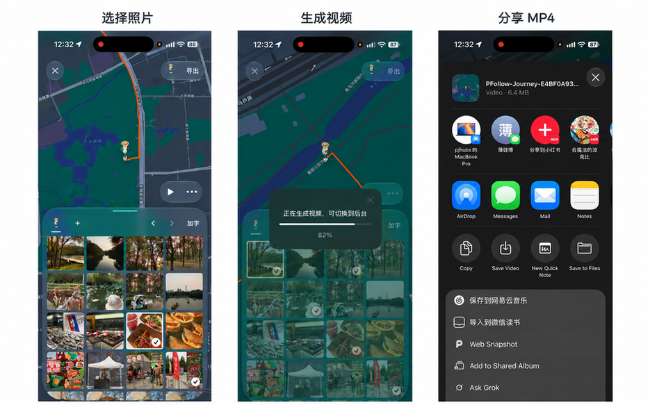

### 行程数据模型

假设要做一段「从住处坐车到机场，飞到另一个城市，再坐火车去下一站」的视频。三段路的交通工具不一样，用户还可能回头换掉机场那张照片。给一长串照片统一加个「小汽车」选项，到这里就不够用了。

现在一份旅程分成几个可以独立编辑的段。每段保留照片的选择顺序、交通方式和轨迹颜色，照片本身提供稳定的身份、拍摄时间和经纬度，地点名称再单独跟照片关联。切回第一段改颜色，第二段选过的照片还在；自动播放到第三段，也不会偷偷切掉用户正在编辑的第一段。编辑状态留在各段里，生成回放时再按编排顺序展开成路线节点。照片只保存一份，路线里却可以多次到访。

选片顺序和分段顺序得分开记。每段内部按实际选片顺序排列，段与段之间再按用户安排连接。依次选 A、C、B，路线就是 A → C → B。不能因为 B 拍得更早或离 A 更近，就擅自改成 A → B → C。取消 C 再选回来，C 就排到这一段末尾。光用集合存勾选状态不够，哪些照片被选中要记，它们的媒体 ID 也要另外存成有序列表。

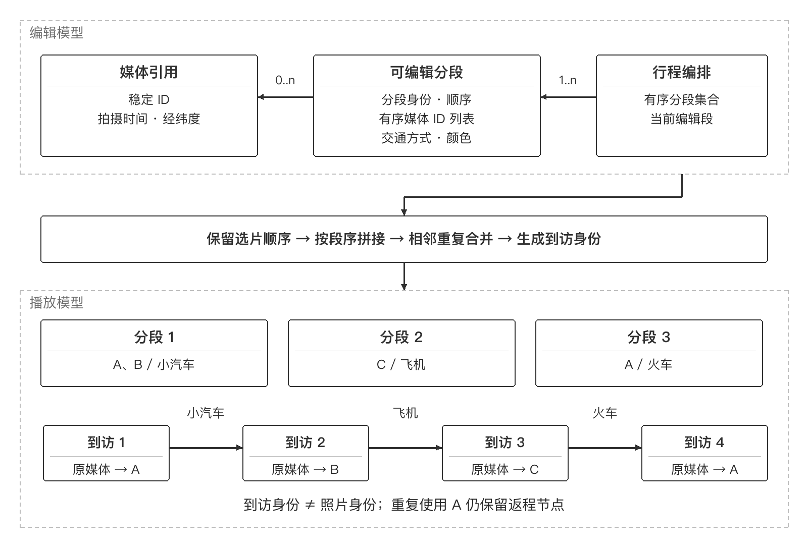

图里把编辑数据和播放数据分成了两层。上面保留每段独立的照片选择和样式，下面展开成带到访身份的路线节点。第一段用 A、B，第二段只选 C，就自动从上一段的 B 接过去。第三段再选 A，又能从 C 回到 A。相邻段反复选了同一张边界照片时，合并这个重复节点；隔着一段路重新回到同一张照片，则保留这次到访。路线里的每一次到访都单独记身份，同时保留它对应的原照片。照片没有复制，行程里可以有两次不同的「来到这里」。

这些关系统一放在旅程数据里，选择面板只读取当前段。面板自己记一份勾选，回放再记一份路线，切几次段就容易出现照片看着选中了、地图却没变的问题。删除某段也只移走它的内容，再重新衔接前后路线，不用让界面去猜其他段还该剩下什么。

### 道路规划与请求调度

前一版用弧线连接照片，把照片、载具和视频导出做通了。再看步行和开车的回放，总觉得少了点什么。车明明在城市里，却直接从几个街区上面划过去，哪有沿路行进的感觉。所以思来想去，赶紧又把真实路线接了进来：照片决定途经哪里，中间交给 MapKit 规划，载具沿返回的道路折线移动。照片没有记录当时完整的 GPS 轨迹，这里还原的是这些地点之间可通行的路线。

道路类型跟着每段的交通方式走。步行用步行路线，自行车用骑行路线，小汽车、摩托车和大巴共用驾车路线。火车、飞机和轮船继续沿弧线移动，不把公路规划套上去。飞机的弧度仍然更高，跨城和市内行进也就有了区别。这可能不是用户当时真正走过的路线，但从分享来看，我觉得这种表现更容易传播。

按 A → C → B 选片，规划层收到的是 A → C、C → B 两个独立请求。缓存键包含起点、终点和交通方式，还要区分方向。单行道可能让去程和返程走不同的路，步行与开车也不能共用结果。改颜色或视频比例可以直接复用路线；换交通方式就查对应缓存，没有才重新规划。缓存按坐标点数量控制，预算是 25 万点。清理时优先移除旧记录，当前行程仍在用的路线留下。

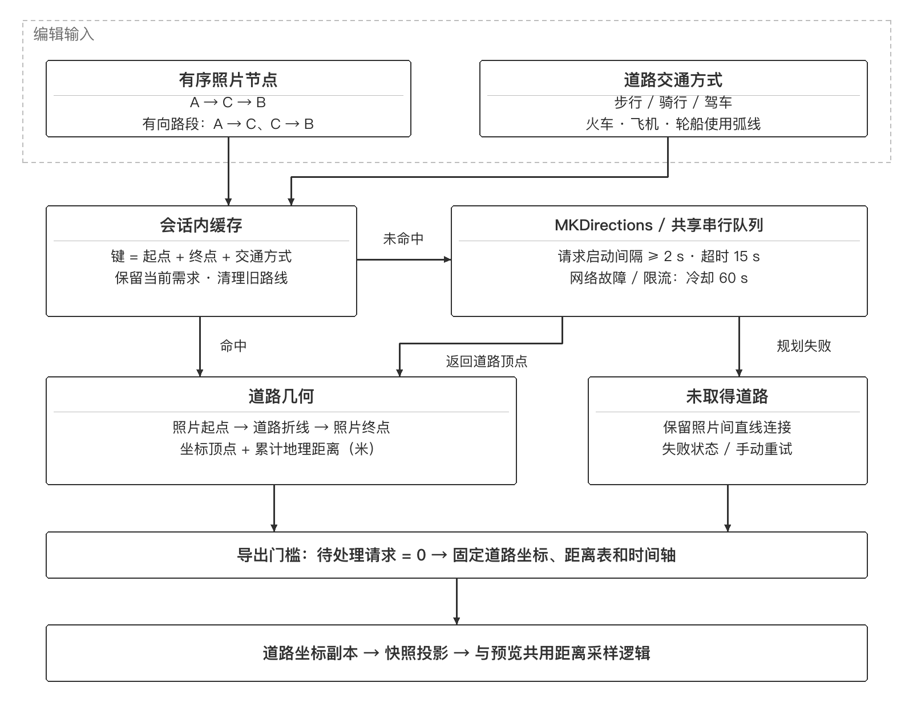

请求也不能跟着每次界面刷新发。所有道路请求进入共享队列串行处理，相邻两次启动至少间隔两秒。超过 15 秒没有结果就取消，遇到网络故障、MapKit 服务端失败或限流，队列暂停 60 秒。界面保留失败状态和重试入口，重试一样遵守冷却时间，避免连点几次又堆上一串失败请求。

道路折线拿回来，两端还没完。照片可能拍在广场里，规划结果却只到附近路边。直接拿来用，车到了路边就停了，照片还在前面。于是保留原始道路顶点，分别补上「照片起点 → 道路起点」和「道路终点 → 照片终点」的连接线，让到达位置仍然落在照片上。没有可用路线就保留照片间的直线连接，并提示规划失败；请求还在进行时暂不允许导出。原本觉得复杂度不高的需求，做到收尾，时间还是越拖越长。

### 路径插值与时间分配

道路接上了，但顶点不能均分给每一帧。地图返回的顶点疏密不一，弯道密、直路疏。如果每帧前进同样多的顶点，小汽车就会在直路上突然加速，到弯道又慢下来。同一条路径现在保留两份累计距离。一份按相邻经纬度计算地表距离，单位是米，用来确定播放进度落在哪两个道路顶点之间。另一份按投影后的平面坐标累计，处理屏幕上的路径长度和绘制几何。

比如道路总长 2000 米，当前进度 40%，目标就是第 800 米。累计距离表里相邻两项是 740 和 860 米，按 `(800−740)/(860−740)=0.5` 在对应的两个屏幕顶点之间插值，就得到当前位置。查询用二分查找，不必每帧从头扫完整条路。地图拉近或导出比例改变时，屏幕坐标重新投影，按米累计的距离表不变。同一播放时刻仍然落在同一段道路上，车头取该段的方向，已走过的轨迹也截到同一位置。预览和视频的地图尺寸可以不同，道路行进进度要一致。

不接道路规划的交通方式仍沿弧线移动。起点记为 A、终点记为 B，在地图投影后的平面上沿直线插值，再用 `4t(1-t)` 控制抬高幅度。`t` 从 0 走到 1，这个值在两端为 0，正中间为 1。起终点留在照片原来的位置，中间才达到完整弧高。弧高随两点距离增加，但有上限，飞机再提高一些；接近南北走向时补上横向偏移，免得弧线还挤在原来的直线上。

弧线也按距离查找位置，只是输入换成了 48 个间隔的采样点，累计投影平面上的长度。下图里的 200、74 和 86 都是这个平面中的长度。目标路程 80 落在相邻两项中间，继续插值得到当前位置。后面让火车车厢沿曲线向后找位置，用的也是这份长度。

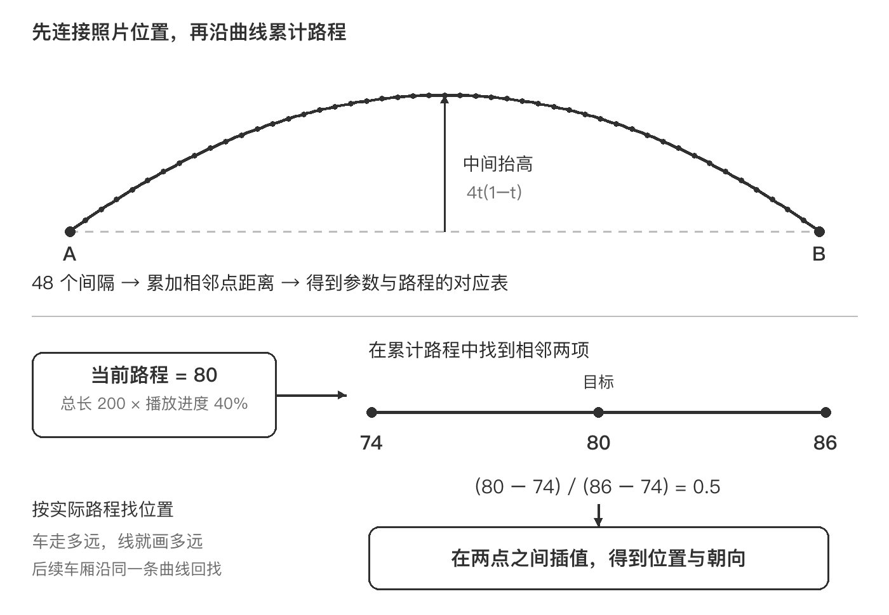

路段时长另算，不跟道路内部的匀速插值混在一起。当前按两张照片之间的地理距离安排：10 公里以内每段两秒，100 公里五秒、500 公里九秒、1000 公里十二秒，中间线性过渡，更远也封顶十二秒。道路规划完成或切换交通方式后，即使路线绕了点远，整段时间轴也不会跟着变。到达照片通常停留 0.4 秒，长短路段切换、镜头需要大幅缩放时再适当延长。

### 载具渲染与车厢运动

路线能播放了，还得有个沿着它移动的模型标签，增加趣味性。这次做了步行、自行车、摩托车、小汽车、大巴、火车、飞机和轮船八种模型。神奇的事情来了！没用任何建模工具，全靠代码把球体、圆柱、圆角盒体和曲面组合起来，再安排材质、光照和动作。对我来说，这比打开建模工具更合适，也方便 AI Agent 发挥能力。小汽车是短车身配奶油色车顶，火车是白蓝色三节车厢，步行小人戴着帽子，还带了相机和背包。

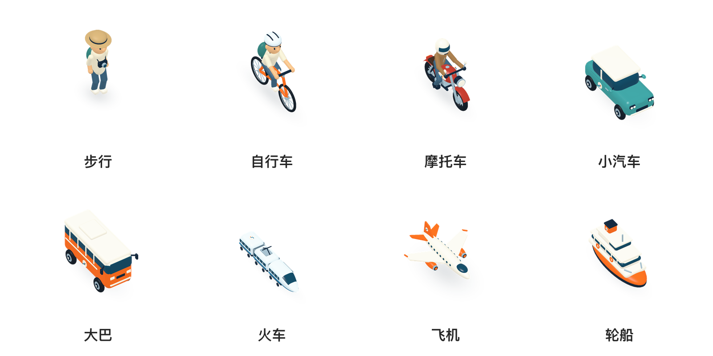

三维造型有了，播放时却不用一直算几何和光照。当前地图俯视、北向上，载具主要沿路线转向，提前把各个方向画好就够了。制作素材时从 32 个方向分别生成透明图片，步行和自行车再为每个方向准备 12 帧动作，排成一张图集。路线朝向决定取哪一列，动作进度决定取哪一行，交叉的那一格就是当前姿态。

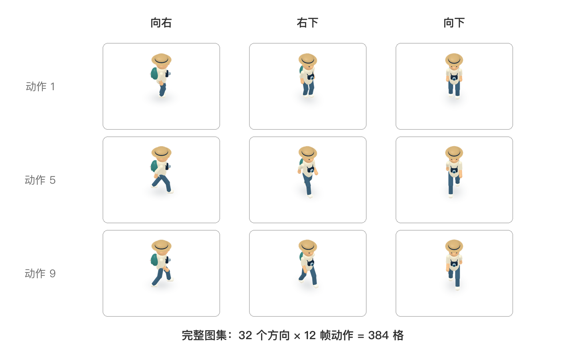

图里抽出了三个方向和三个动作。小人朝右走，就在「向右」这一列循环切换；路线转向换一列，停靠时动作也停住。三维造型提供体积感，实际播放只画透明图片。本质上就是序列帧，有局限，也有点投机取巧。以后镜头要自由绕着人物转，这份素材肯定不够，但当前把固定视角做好就能解决问题。

实时三维计算省了，图片内存还得管。步行图集有几百格，完全展开的像素数据接近 100MB，压缩后的 PNG 再小，也不代表运行时占得少。菜单改用单独的小图标，回放只加载当前行程用到的载具，取出的动作帧独立解码并限制缓存。从大图裁出一小格时尤其要确认它已有独立像素数据，否则看着只留了一帧，背后还可能引用整张大图。

火车又是另一回事。我把它做成了类似高铁动车的样式，三节车厢不能像其他载具那样作为一个整体转向。一直放在同一张图片里，车头一转，后两节也整齐地转过去，像拿根尺子在地图上比划。所以车头、中间车厢和尾节确实是分别做、分别画的。素材保持同一套造型和材质，每次只输出其中一节，把地面中心放到统一的定位位置。三节各自生成 32 个方向的图片，完整列车另外保留一组用于缩略展示。播放时用三张独立的车厢图片，各有自己的位置和朝向。

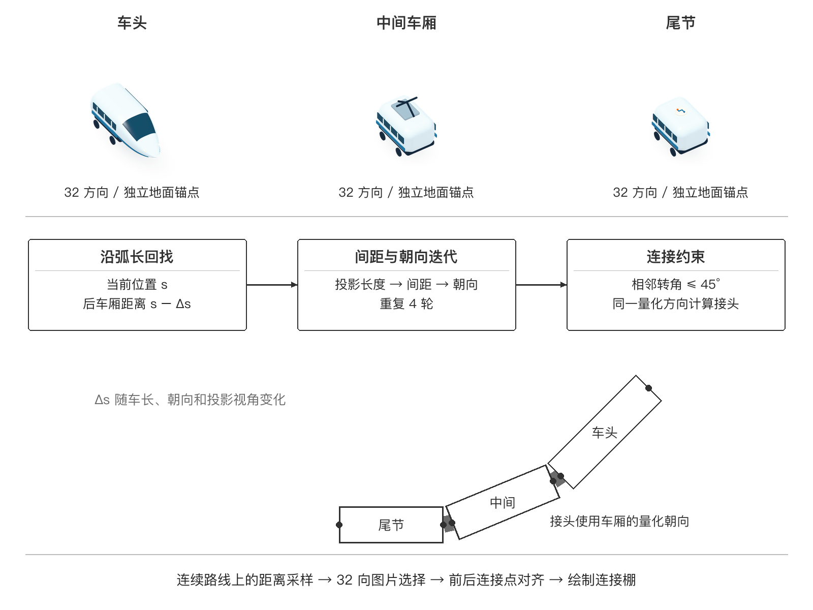

车厢拆开，还要排成一列。按播放进度确定车头位置，再沿已经走过的曲线向后找中间车厢和尾节。往回找的是距离，不能让后车厢晚播放零点几秒，否则速度一变，间距也变了。前面为匀速移动计算的曲线长度，这时又派上了用场。不过后退距离不能写死。车头比后两节长，图片又有俯视透视，同一节朝右和朝下时，屏幕上占的长度不同。按车身长度、当前朝向和制作素材时的视角估计间距，再找出后车厢前后两侧对应的路线位置，确定它的朝向。用新朝向重新估计间距，迭代四轮。

转弯处仍然可能有缝隙。以前一节的后连接点为准，把后一节的前连接点接过来，再单独画一小段带褶皱的连接棚填上空间。车身只能从预先生成的 32 个方向里选，连接点也得按同一方向计算。车身用了一张图片，接头却按更细的另一个角度转，还是会分家。急弯时把相邻两节的转角限制在 45° 以内，避免后车厢折进前车厢。

经过照片节点时，车头可以进入下一段曲线，尾节还在上一段走，不会切个路段就把整列车重摆一次。开场也要把路线向起点后方延伸，给尚未出发的后两节留位置。下面是渲染器输出的两个过弯时刻。三节各自取对应方向的图片，连接棚在它们之间绘制，留在弯道上的车尾不必跟车头朝向一致。

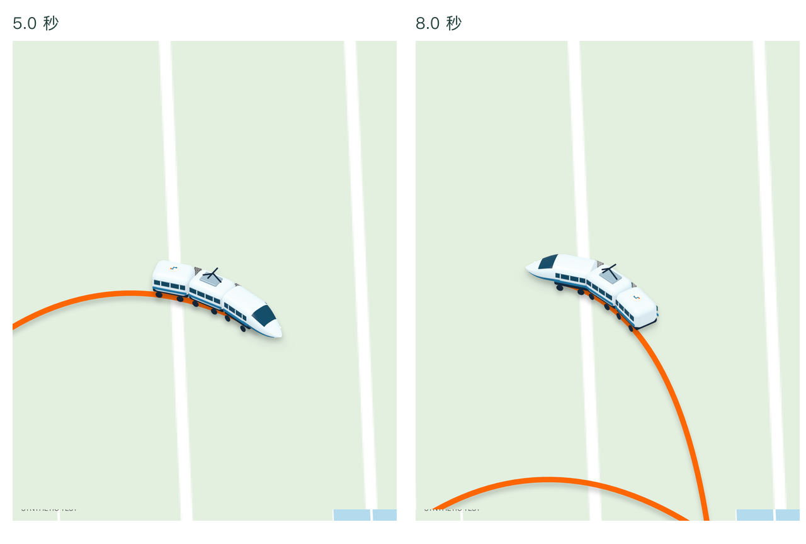

### 尾气与尾迹渲染

载具跑起来后，又加了一层烟雾。摩托车、小汽车和大巴从车尾冒淡灰尾气，轮船从烟囱顶部排烟，飞机两侧发动机各留一道白色尾迹。步行、自行车和高铁没有烟雾。这三种效果共用按时间生成的烟团，喷口数量、漂移方式和寿命各自设置。

选烟雾方案，得把它放回整段旅程里看。预览可以暂停，从第 8 秒跳回第 3 秒；视频导出按帧序号逐张生成。同一个行程时刻，烟团的位置和扩散程度应该相同。载具已经烘焙成二维图集，视频又通过 Core Graphics 合成位图，选型就要同时考虑任意时刻重建、离屏输出和接入现有绘制流程的工作量。常见的路有四条。

[CAEmitterLayer](https://developer.apple.com/documentation/quartzcore/caemitterlayer?language=objc) 提供出生率、寿命和速度等现成参数，往界面叠烟雾很直接。但喷口一直沿路线移动，回退播放要恢复此前产生的烟，导出还得拿到对应时刻的离屏画面。用了发射器，仍然要协调图层时钟、移动喷口的历史和导出接口。加到预览层并没有把问题都解决。

SpriteKit 或 SceneKit 的粒子系统，对场景和粒子行为的控制更完整。[SpriteKit 可以推进或重置粒子模拟](https://developer.apple.com/documentation/spritekit/skemitternode/advancesimulationtime(_:))，[SceneKit 也支持粒子与场景几何、物理场交互](https://developer.apple.com/documentation/scenekit/scnparticlesystem?language=objc)。烟雾要绕过物体、参与三维场景时，这些能力有价值。不过地图和载具已经走二维绘制，为几团淡烟再维护一套场景、模拟状态和输出合成，接入工作反而超过了这次效果的需求。

沿用载具的做法，把烟雾烘焙成序列帧也可以。纹理能提前做得更细，但转弯后的烟要留在之前的位置，停车后还得逐团消散。序列帧只解决外观，出生时间、历史坐标和漂移照样要算，还多了一套素材和解码管理。当前只有淡灰烟和白色尾迹，几层柔边渐变就能表达扩散，没必要再增加素材。

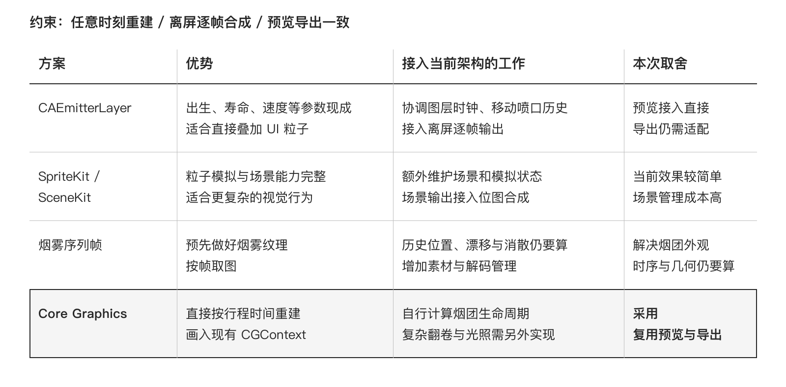

这次选的是自己计算二维粒子，再用 Core Graphics 绘制。一个烟团就是一个粒子，`CGGradient` 定义颜色和边缘透明度。位置、半径、不透明度算好后，通过 [CGContext 的径向渐变绘制](https://developer.apple.com/documentation/coregraphics/cgcontext/drawradialgradient(_:startcenter:startradius:endcenter:endradius:options:)) 直接画进当前帧。地图、路线和载具的合成流程都能复用，粒子状态也能从行程时间直接求出来。导出第 8 秒，不用把前 8 秒动画再跑一遍。代价是烟雾轮廓比较简单。复杂翻卷、三维光照或大量粒子，还得重新考虑方案。但这次要的是行进更有动感，而且能把同样的效果完整导出。

选定绘制方式后，喷口先得对上。直接在模型后面减个固定偏移，转弯时烟可能冒到车身侧面。轮船烟囱还有高度，更不能用船尾坐标代替。制作模型时就在它自己的三维坐标系里标记排气口、烟囱顶和发动机后端，播放时再换算成屏幕上的二维偏移。投影采用与载具图集相同的俯视正交投影，朝向也对齐那 32 个方向。模型选哪一格，喷口就用对应偏移。

飞机和轮船有轻微摆动，喷口还要叠加出生时刻的摆动角度。镜头缩放时，偏移和烟团大小与车身共用一套比例，烟才不会从模型上脱开。

烟雾的位置按行程时间回算。绘制当前时刻 t，最多往前看 2.2 秒，把这段时间按每秒 30 个出生时刻排列，出生时间 b 就是序号除以 30。逐个查询 b 时刻的路段、位置和朝向，只留下出生时正在移动、支持排放、目前又没超过寿命的样本。飞机每个发动机每秒生成 30 次，车尾和烟囱只取偶数序号，每秒 15 次。车尾烟雾寿命 1.1 秒，烟囱 1.8 秒，飞机尾迹 2.2 秒。计算范围始终是最近这一小段，不会跟着旅程变长而积累更多粒子。

每个烟团的年龄是 t−b。绘制第 8 秒时，第 7.6 秒出生的烟年龄就是 0.4 秒。除以车尾烟雾的 1.1 秒寿命，得到约 0.364 的消散进度。半径随进度线性增大，不透明度按衰减曲线降低。车尾和烟囱再加短暂淡入，免得刚出生就冒一个灰点。

位置以出生时的路线点和喷口偏移为基础，沿当时的行进方向向后漂，烟囱上升得更多。侧向扰动由出生序号算出，随年龄变化，重复计算同一播放时刻，偏移仍然相同。车转弯了，之前的烟继续沿各自出生时的方向漂，不会跟着当前车头把整段烟一起转过去。

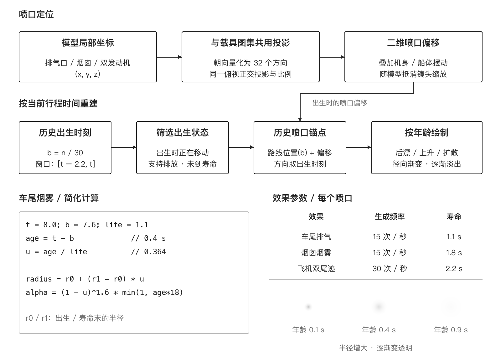

飞机移动快，只在出生点画烟团，中间可能断开。于是按「同一航段、同一个发动机、连续的出生序号」连接相邻样本，根据两点距离补上重叠的渐变烟团，每对最多补十次。两侧发动机分开连接，形成两道连续、逐渐变宽的柔边尾迹。抵达后不再产生新烟，之前的烟继续按年龄扩散、淡出。暂停或跳到某个时刻，也可以直接重建当时的烟雾。预览和导出共用这套计算，不依赖粒子系统此前跑了多久。

### 时间轴与渲染架构

前面的运动和烟雾都能按时间计算，导出就不该再依赖当前 UI。用户在第几秒点按钮、有没有拖地图，都不能改变最终视频的起点和内容。地点顺序、路段时长、停靠时间、载具和颜色整理成时间轴，渲染器接收明确的播放时间，算出这一帧的路线、姿态、镜头和尾迹。

预览和导出复用时间轴与绘制逻辑，渲染器实例分开。点击导出时复制当前配置，导出实例持有自己的路径、地名位图和载具帧缓存，只交给一个串行绘制任务使用。预览继续播放或编辑，就不会跟编码任务互相改缓存。输入参数和播放时间相同，画面也应该相同。

视频时间和行程时间还要分清。设帧序号为 n、帧率为 30、播放倍率为 r，写入文件的显示时间戳 PTS 是 n/30，渲染器读取的行程时间是 r×n/30。比如三张照片连成两段市内短途，每段两秒，到站各停留 0.4 秒，加上开头和结尾各两秒，时间轴一共 8.8 秒。按 2 倍速导出，得到 4.4 秒、132 帧：

| 帧序号（从 0 开始） | 视频时间 | 2 倍速的行程时间 |
| --- | --- | --- |
| 0 | 0 秒 | 0 秒 |
| 30 | 1 秒 | 2 秒 |
| 90 | 3 秒 | 6 秒 |
| 131 | 4.367 秒 | 8.733 秒 |

第 90 帧的 PTS 是 3 秒，取的是行程第 6 秒的画面。编码耗时只影响任务什么时候完成，不参与时间轴计算，设备性能不会改变影片里的运动速度。

进入逐帧循环前，资源要准备好。画布默认 1080×1080，还支持 1920×1080、1080×1920 和 1080×1350。照片选择、分段、载具、颜色、地点名称、播放倍率，以及已经确定的道路坐标和累计距离表，都在此时固定。道路请求结束后，导出前还会读取一次最新几何数据，避免最后一个完成通知没送到，点击导出却拿了旧路径。

预览有正在运行的地图，导出却不适合每画一帧都去截它。地图加载要时间，镜头移动又可能请求新底图，直接带进编码很难保证每帧完整。先向 MapKit 取一张覆盖整条路线的总览快照，再为要拉近的局部路段准备更清晰的底图。道路规划和地图请求都在逐帧编码前结束。

快照也不能刚好卡住起终点。镜头会先拉近，再跟着载具走，到了路线边缘仍然要看到周围的地图。飞机弧线还会抬到照片连线之外。准备快照时，把沿途镜头可能看到的范围一起算进去，在路线四周留出空间，并提高底图像素密度，免得一拉近就糊。快照受最长边 4096 像素和总像素 1200 万两项约束，放大倍率取两项预算允许的较小值。

跨两个城市的总览图，放大到某条街还是会糊，像素上限摆在那里。于是按分段镜头的缩放计划补局部快照，相邻路段能共用的范围合并请求。局部图逐张准备，写入临时文件，绘制时只缓存两张，不把长旅程的所有底图都留在内存里。

底图齐了，照片锚点和道路顶点分别投影到同一张图的坐标系。预览从屏幕地图取得投影，导出从快照取得投影，使用的是同一份道路坐标、累计地理距离和路径采样逻辑。照片位置在进入规划前完成地图坐标转换，MapKit 返回的道路坐标直接使用。不能再转一次，否则路线会整体偏离底图。地图上绘制路线，再叠上尾迹、载具和地点名称。

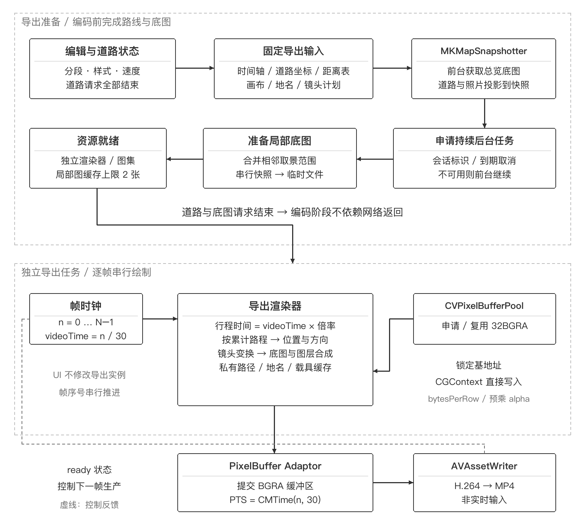

### 镜头变换与屏幕尺度

画面能合成了，镜头还得知道怎么看。导出从整趟行程开头开始，出发前逐渐拉近载具，随后沿路跟随，抵达后停留。每段按实际道路计算取景范围，市内短途拉近，长距离移动拉远。不然为了装下两个城市，每一段步行都要缩成一个点。画面中心死盯模型，转向和到站时会很硬。跟随位置参考最近一小段时间经过的位置，让镜头缓一下。长航段移动快，这种滞后又要受限制，不能飞机都飞走了，镜头还在后面慢慢追。

道路顶点多，运镜也会增加计算。纯平移只是给顶点加同一个偏移，路径形状和累计长度没变，已有路径和距离表可以继续用。但要同时检查照片锚点与道路顶点，光看照片不够。道路请求刚完成，两端没变，中间的路线却换了。缩放或路线更新时，才重新构建绘制路径。火车的镜头光看车头，尾节容易甩出画面。每节车厢的位置已经算过，就用这些位置确定整列车的取景中心。载具切换时也平滑过渡，避免从飞机换成火车，画面突然跳一下。

另一个实际修过的问题是模型大小。手机预览和最终视频尺寸不同，要按预览区域与输出画布的关系换算。可镜头拉近时，底图、轨迹位置和模型一起缩放，直接整张放大，车会越走越大，线也越来越粗。位置和显示尺寸得拆开。地图位置跟着镜头移动、缩放，车身大小和线宽则抵消这次运镜放大。比如镜头放大两倍，绘制模型时先把尺寸除以二，两步抵消，地图拉近了，车在画面里还保持合适的大小。三节车厢的间距、连接棚、尾迹和阴影也按这套关系处理。只把车身缩回去，接头和烟雾还留在原处，一样不对。

下面几帧来自实际导出的地图视频，用的是检查运镜和载具衔接的测试路线。底图、已走过的彩色轨迹、小汽车、飞机和火车都合成在画面里。分段设置决定载具的变化，镜头跟随每一帧算出的位置。

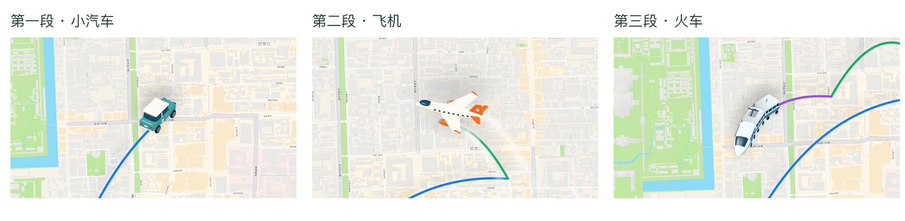

### 视频编码与任务管理

合成结果通过 `AVAssetWriterInputPixelBufferAdaptor` 送进 `AVAssetWriter`。输出使用 H.264 和 MP4 容器，目标平均码率 8 Mbps，帧率 30，最大关键帧间隔 60 帧。输入设为非实时模式，按文件导出的节奏提交，不用追赶屏幕播放时钟。

像素格式统一为 32 位 BGRA。每帧从 adaptor 对应的 `CVPixelBufferPool` 申请缓冲区，锁定基地址，用这块内存创建 `CGContext`，直接在里面合成地图、路线、尾迹、载具和文字。不必先生成整张 `UIImage` 再复制像素。创建 context 时读取实际的 `bytesPerRow`，行跨度不能写死成宽度乘四。位图采用预乘 alpha，再把坐标原点翻到左上角，与 UIKit 的绘制方向一致。

编码分成初始化、逐帧提交和收尾三个阶段。初始化确定编码参数，循环由输入端的就绪状态推进，正常完成、失败和取消进入各自的收尾路径。

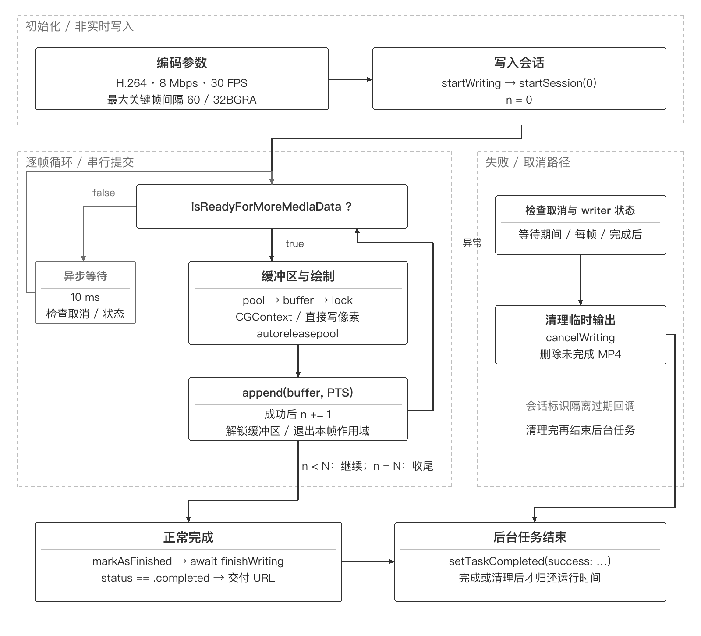

提交节奏看 `AVAssetWriterInput.isReadyForMoreMediaData`。输入端忙，就不分配下一帧，也不继续渲染。异步等 10 毫秒后重试，同时检查取消标记和 writer 状态。这就是编码背压：消费端接得住，生产端再继续，不让绘制超过编码速度，把待写入帧堆在内存里。一帧 1080×1080 的四通道像素约占 4.7MB。前面那段视频才 4.4 秒，132 帧全留着也会超过 600MB。现在逐帧申请和提交，由像素池复用缓冲区，每帧的临时图像对象放进独立的 `autoreleasepool`。

`append` 的返回值也要检查，写入成功才推进帧序号。哪块内存何时能复用，由像素池和编码器管理。提交调用返回，不代表可以马上重写同一块内存。进度每提交 15 帧更新一次，减少跨任务回调。正常结束，调用 `markAsFinished()` 后等待 `finishWriting()`，状态达到 `.completed` 才交付文件 URL。失败和取消共用清理路径：停止 writer，删除临时 MP4，把结果交还上层。刚完成还要再核对本次导出的身份，过期任务返回的文件直接清掉，不能覆盖后来发起的导出。

总览快照在前台完成，随后通过 `BGContinuedProcessingTask` 申请继续运行，准备局部底图，再进入 CPU 位图合成和编码。每次导出都有独立的会话标识，进度、取消和系统到期回调都要核对；不支持或申请失败，就退回前台导出。系统要求结束任务时，先传播取消，等 writer 停止、半成品删完，再调用 `setTaskCompleted`。清理做完了，才归还后台运行时间。

## 位置分享

回看自己去过哪里之后，很自然就会想看看朋友最近在哪里。大家各自出门，一条「我到这里了」的消息如果能直接落在地图上，就不用把地名复制出去再搜一遍。这次从手动更新开始。在 app 或桌面小组件上点一下，获取一次位置，再发布这次结果。登录、授予定位权限、打开页面都不会直接上传 GPS。朋友打开链接，看到的是最近一次主动分享的位置，旁边保留采集时间，知道这条信息有多新。

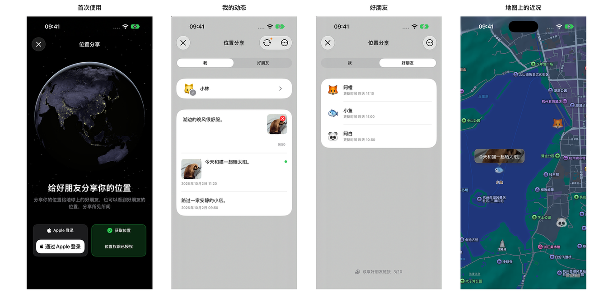

「朋友刚刚刷新了页面」和「我刚刚更新了位置」得分清楚。刷新只是读取服务器上已有的内容，不会让对方的手机重新定位。改头像和昵称也不能把旧坐标变成「刚刚的位置」。否则在机场发了定位，到了酒店改个头像，机场那个点又被包装成新的了，看着还不如不看。

### 分享身份与生命周期

第一次通过 Apple 登录并主动分享后，会得到一个固定链接。后面更新位置、头像和文字都沿用它，朋友收藏一次就够了。浏览器也能直接打开，不必先安装 PFollow。固定链接解决了查看入口，修改权限则由登录身份管理。服务端验证 Apple 登录结果，再给设备一份后续操作使用的登录凭证。发布者凭它修改自己的内容，查看者凭分享链接读取公开结果。链接本身就是访问凭证，拿到的人也能转发，适合主动发给朋友，但不等于只有好友名单里的某个人才能看。

「好友」也没做得太重。保存一个朋友，主要是在本机记下 ta 的分享链接，再读取对应的最新内容，暂时没有另建一套好友申请、双向确认和服务端关系链。自己的位置可以单独暂停，某位朋友在首页地图上是否显示也可以单独控制。不想在地图上看见一个头像，没必要把人删掉。

现在统一使用永久链接，位置仍需主动更新。暂停分享后，服务端不再向新的读取请求返回坐标、头像和动态图文；恢复时重新获取位置，继续用原链接。删除分享才会让原链接失效，重新创建则换一条新链接。

### 服务架构与存储成本

一说到加服务端，账号、好友关系、消息历史、轨迹历史很容易就顺手全建起来了。每一项单看都挺合理，叠在一起却成了另一个产品。PFollow 现在要回答的问题很具体：这条分享链接最近发布了什么？

服务端每个账号只保留一份当前分享资料，包括最新位置、采集时间、头像、昵称、当前动态的文字与照片引用，以及分享状态。更新时覆盖相应内容，不把每次定位都追加成历史轨迹。同一个人连续分享十次位置，服务器最终只需提供第十次的结果，存储量不必跟着操作次数一直涨。

自己回看的动态历史放在本机，再通过个人 iCloud Drive 备份，照片也跟文字一起保存。好友名单的备份恢复同样放在个人文件里，作为会员能力提供。让朋友看到最新内容，不需要把这些历史和名单全部留在公共分享服务里。历史记录包含发布身份、文字、JPEG 和发布时间，不带位置坐标或登录凭证。删掉记录后还会留下删除标记，导入旧备份或者另一台设备同步过来，不能又把它恢复出来。

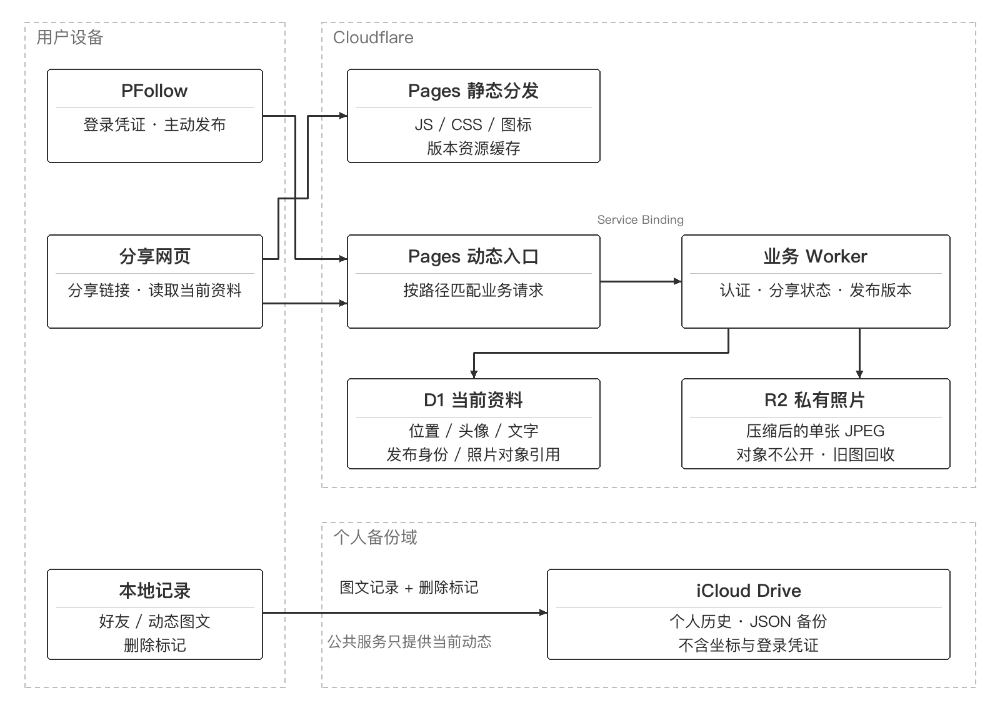

好友名单也是如此。手机上已经删了一位朋友，另一台离线设备还留着旧名单，合并时仍要按删除标记排除 ta。只有用户明确重新添加，才把 ta 放回去。省下服务端的关系管理，多设备上的这些细节还是跑不掉。

对外提供服务的部分放在 Cloudflare 上。Pages 分发网页脚本、样式和图标，动态入口通过 Service Binding 把请求交给业务 Worker。认证、分享状态校验和数据访问都在 Worker 处理，当前资料存入 D1，动态照片则进入私有 R2 对象存储。数据库只记图片引用、摘要和尺寸，不把照片字节塞进每次资料查询的结果，也不用维护一台常驻业务服务器。

静态资源直接分发，没必要所有请求都绕进业务处理。按 [Cloudflare Pages 当前的计费规则](https://developers.cloudflare.com/pages/functions/pricing/)，没有调用 Functions 的静态资源请求免费且不限次数，动态请求则占用另一套额度。在路由层把静态请求排除出业务 Worker，同一份地图脚本被一百个人加载，就不用执行一百次业务逻辑。

公开脚本按版本缓存。具体位置、分享状态、头像和配图仍走动态校验，并使用 `Cache-Control: no-store`。暂停或删除分享后，新请求不会继续读到公共缓存里的旧资料。头像也能省下一笔开销。手机原图好几 MB，最后在地图上却只有那么一点大，上传前就该在设备上裁切、压缩，去掉附带信息。服务端只保存这份小图，Live Photo 也先在本机生成短 GIF，动态头像压到几十 KB。列表、地图和点开后的放大查看共用它，没有再存一张高清原图。

### 图片处理与发布一致性

文字能告诉朋友「今天到这里了」，照片还能把这个地方的样子带出来。现在动态输入区支持拍摄或从相册选择一张静态照片，可以只发照片，也可以和文字一起发。选好后留一个可移除的缩略图；取消确认或发布失败，草稿继续保留，服务端接受结果后才清空。

到了地图上，照片没有再撑开一张完整卡片。纯照片显示小缩略图，图文按文字所需的空间排版，让照片铺在背景上，再加黑色蒙版保证文字可读。自己和好友共用气泡布局，网页也沿用相同的尺寸关系，点开图片才进入大图查看。下面用本地素材渲染原生组件，看看配图放进地图气泡后的样子。

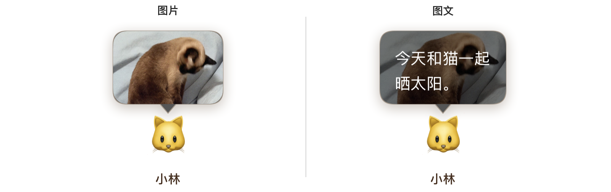

上传前，用 ImageIO 直接生成带方向矫正的缩略图。最长边先取 1024 像素，重新编码成 JPEG，目标控制在 256 KiB 以内。细节太多就降低编码质量，仍然超出上限，再降到 768、512 像素。限制的是最终上传的实际字节，EXIF、GPS 等元数据也不会随原文件进入公共分享。

选图时检查一次，发布前再检查最终上传的 JPEG。审核在设备上完成，从本地恢复的草稿也要重新检查。确认内容可发布后才请求位置并提交，检查失败就留下草稿，不会额外发一次定位。服务端还会验证 JPEG 的结构、尺寸和字节上限，不能只看文件名或声明的类型。

压缩好图片，接下来麻烦的反而是「这次到底发成功了没」。文字和照片组成一条动态，用同一个 UUID 标识，照片另算 SHA-256 摘要，核对字节是否相同。草稿没变，重试就沿用原来的身份；换了文字或照片，才生成新身份。否则上传成功但应答丢了，用户再点一次发布，同一张图就可能变成两条动态，好友收到两次未读。

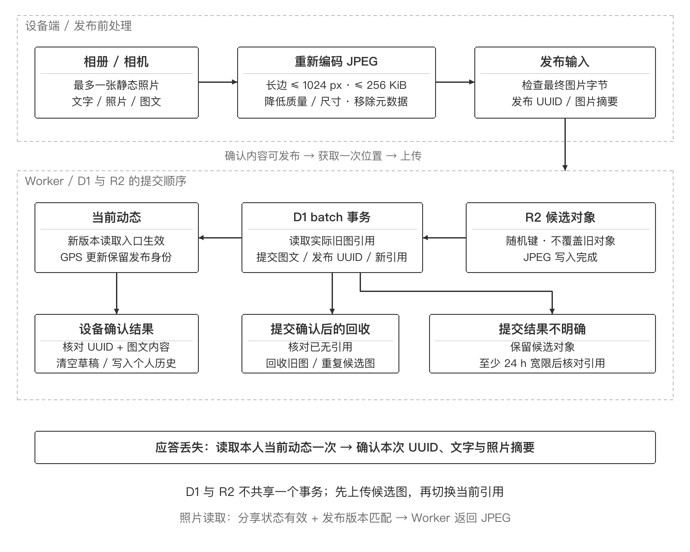

照片先写进 R2，每次上传生成新的对象键，旧图暂时留着。写完后，用 D1 的批量事务读取实际被替换的旧图引用，再提交这条动态的文字、发布身份和新照片引用。确认提交成功，才回收已经失去引用的旧对象。并发发布时，回收对象必须来自事务里刚读到的记录。两次请求如果都拿之前缓存的旧图去删，中间那张照片就漏在存储里了。

D1 和 R2 不能共享一个事务，出错时也不能一律删除刚上传的图。数据库可能已经提交，只是结果没传回来，贸然删图就会把成功发布的动态变成坏链接。结果不明确，先保留候选对象，每日任务等过了至少一天的宽限期，再核对数据库引用，清理未被使用的图片。客户端遇到应答丢失，只读取一次自己的当前资料，核对 UUID、文字和照片摘要，确认是不是刚才那次发布。不自动重发，也不再次请求定位。

照片没有直接变成公网存储链接。读取经过 Worker，检查分享状态和请求的动态版本后，才返回当前 JPEG。旧版本被替换后拒绝读取，暂停分享也不再返回照片。地图只在好友气泡展开时加载配图，不会为了画二十个头像，同时下载二十张照片。下载完成还要核对动态身份与图片地址，内容已经换了，旧请求就不能把照片贴回新的气泡。没有文字和照片时，更新操作只同步位置，保留之前的动态。

### 小组件交互与字体动画

桌面小组件把「打开 app、找到入口、再点更新」缩成了一次点击。地球背景也跟位置有关：使用 app 内置的卫星纹理，根据最近一次分享的经纬度计算球面朝向，再裁出这块视野。它不是 MapKit 组件的真实快照，不用每次刷新都请求一张在线地图。

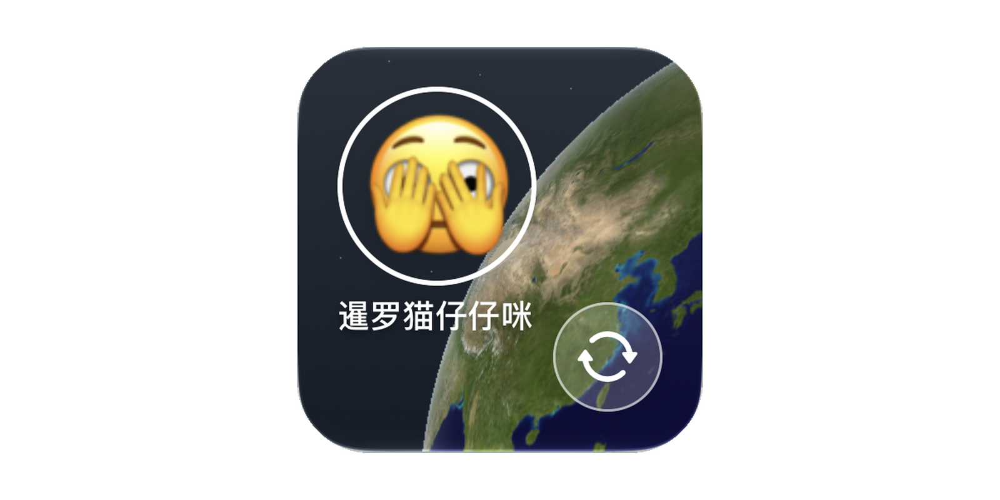

小组件重新生成时间线，只从 App Group 共享缓存读取头像、昵称、最近位置和状态，重新画一张桌面内容。点刷新按钮，才通过 App Intent 主动更新位置。显示和发布是两条分开的流程，连 app 里正在编辑的内容也不能直接拿来上传。

更新时从共享 Keychain 取得当前账号凭证，向服务端读取已经发布的资料，确认分享存在且没有暂停，再请求定位。新坐标与采集时间提交回原分享，头像和昵称沿用服务端已接受的内容，文字与配图保持不动。app 里写到一半的草稿不会被顺手发出去，好友也不会因为一次位置更新，又收到旧文字的未读提示。定位和网络请求可能还没结束，用户就退出账号了。这种任务不能把上一位用户的结果画回现在的小组件，所以定位完成后、写回本地缓存前，都要重新核对凭证是否属于同一次登录。连点刷新则共用正在执行的任务，不并排发出好几次定位。

刷新按钮的动画用了一个不太常见的方案（刷 X 刷到的hhhh）。WidgetKit 把界面交给独立的系统渲染进程，app 内的定时器没法每隔几毫秒去改一次旋转角度。但系统可以持续更新计时文本，这个能力能借过来用：把「时间」作为动画输入，自定义字体负责选择帧。构建时用矢量轮廓生成 100 个箭头字形，每个相差 3.6°，写入 TTF 的 `glyf` 表。数字、小数点和分隔符通过 `cmap` 映射到基础字形，再由 [OpenType 的 GSUB 字形替换](https://learn.microsoft.com/en-us/typography/opentype/spec/gsub)把小数点后的两位数字合成一个箭头。规则放在 `rlig` 特性里，例如 `.37` 整体替换成第 37 帧，数字 3 和 7 不会各显示一个图标。

拿 `12:34.37` 来看，先匹配末尾的 `.37`，得到箭头字形，再把前缀数字和冒号替换为空白。空白的前进宽度设为 0，箭头固定为一个 em，也就是一个字体尺寸的排版宽度。前面的计时数字再长，最后也只占一个图标的位置，分钟、小时位数变了不会左右晃。替换顺序不能反过来，先清掉数字，末尾两位数就匹配不到了。

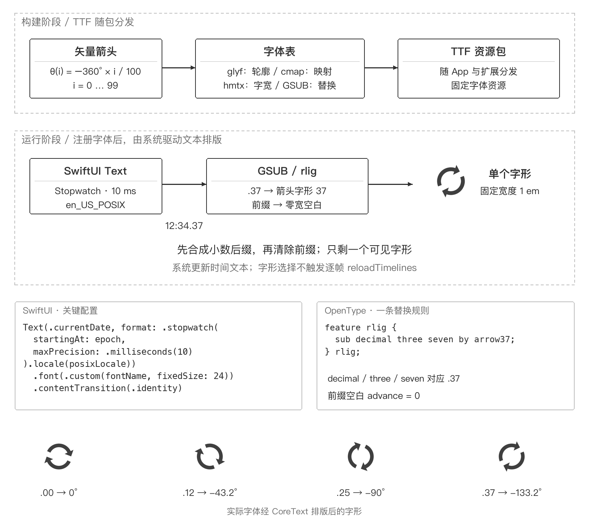

运行时使用精度为 10 毫秒的秒表格式，固定 `en_US_POSIX`，让小数点和数字形态与字体规则一致。SwiftUI 显示的仍是系统时间文本，排版结果却变成了箭头。100 帧指可选的字形数量，实际刷新节奏由系统决定，没有在小组件里循环刷新时间线。字体在构建时生成、随包分发，并在使用它的进程里注册，避免临时生成的字体无法被 WidgetKit 的独立渲染进程读取。

点按钮到开始定位，还有一段等待。交互式 `Toggle` 的乐观状态负责接住这段时间：WidgetKit 预先准备开、关两种外观，点击后立即切到带秒表字形的开态，App Intent 再异步定位和上传。任务结束才刷新时间线，回到正常状态或显示失败，动画不用等网络请求先返回。

成功反馈用了另一份彩色字体，把绿色勾和圆环一起放进 `COLR/CPAL` 的颜色图层。服务端确认写入后记录完成时间，等小组件准备好新背景，再确定两秒的反馈截止时间，并保存这次成功的回执。重复生成时间线，复用同一个截止时间，绿色状态就不会一刷新又续两秒。

倒计时的非零数字显示绿色勾，归零后，字体自己恢复箭头和普通圆环。即使下一条时间线稍晚到，颜色也能一起恢复。iOS 18 及以上使用百分之一秒选择字形，旧系统退回整数秒计时；开启「减弱动态效果」，显示静态箭头。动态头像在 app 和网页里播放，小组件只取静态画面。验证字体时，把 00 到 99 全部送进 CoreText，检查每个后缀只产生一个可见字形、排版宽度固定，也确认这 100 个后缀确实落在不同字形上。

### 好朋友动态小组件

位置更新小组件用来告诉朋友自己在哪，好朋友动态小组件则把朋友最近发布的内容放到桌面。当前做成小尺寸，从可以查看的好友里自动选出最新一条动态。纯文字用白底黑字，照片铺满背景，顶部渐变保住头像、昵称和时间的可读性。有文字再加一层遮罩，正文居中，最多显示五行。点击整块小组件，进入 App 的好朋友页面。

选哪条动态，不能只看资料更新时间。A 十点发了一条动态，十二点只更新位置；B 十一点发了新照片，桌面应该展示 B。按整个资料的更新时间排序，A 的旧动态反而被顶上来了。

每条动态因此保留独立的发布时间，只按它选择最新内容。时间相同，再用稳定的身份排序，避免刷新一次就换一个人。纯照片也算动态，空内容、暂停分享和当前不可查看的好友则排除在候选之外。

好友范围沿用 App：免费可以查看前三位，会员最多二十位。App 把当前账号、可查看名单和资料快照写入 App Group，名单或权益变化就同步更新。小组件生成时间线时，先核对共享 Keychain 里的账号，再并发读取这些好友的公开资料。即使 App 没打开，系统唤醒小组件后也能读到新动态。

发布凭证到期不影响读取朋友的公开分享，主动退出账号才会清掉身份和共享状态，两者不能混在一起处理。

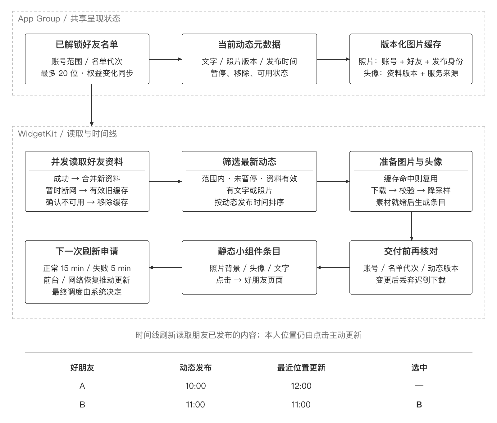

网络失败也不能都算成超时。临时超时，继续使用仍然有效的上次结果，标记稍后重试；服务端明确确认暂停、删除或内容清空，就保存这次失效结果，不能离线后又从旧缓存里恢复。每位好友分别合并读取结果，并记录请求开始时间。稍晚确认的删除，得能挡住更早发起、却更晚返回的成功请求。

App 和小组件是两个进程，JSON 文件原子写入只能保证文件不写坏，挡不住它们同时读到旧版本，再由后写的一方覆盖前面的更新。「读取、检查、合并、写回」要在文件锁保护下连着完成。锁也限制等待时间，持锁进程被系统挂起，不能把另一边的刷新一直拖住。

账号和好友名单另外有版本身份。删掉再添加同一个好友，退出再登录同一账号，都已经是新的一次操作，上一次任务不能恢复旧状态。

图片在交给 WidgetKit 前准备好。确定入选动态后，读取本地缓存，缺少的照片与头像并行下载。照片在准备阶段降采样到最长边 1024 像素，作为 `UIImage` 放进时间线条目；头像以下载好的数据随条目传递，显示时解码最长边 128 像素的静态帧，GIF 只取第一帧。网络读取在生成条目前结束，显示时直接使用条目素材，不通过 `AsyncImage` 发请求。磁盘保留好友资料，图片缓存只留当前入选的一张照片和一个头像，刷新再多次，缓存文件也不会跟着越堆越多。

下载等过一段异步时间，还得确认图片仍属于这次展示。缓存按账号、好友和发布身份绑定，头像另外绑定资料版本与服务来源。下载完成、写入缓存、交付条目之前，都重新核对这些信息。期间换账号、移除好友或者出现了更新的动态，就丢弃迟到的图片，不能塞进刚生成的桌面内容。正常情况下申请十五分钟后再刷新，临时失败改为五分钟，实际执行时间由 WidgetKit 决定。App 回到前台、网络恢复、受保护数据重新可读，也会推动更新。进入后台后，再通过 `BGAppRefreshTask` 申请读取朋友的新资料。任务只更新桌面呈现，自己的位置依然要点击主动发布。

免费用户可以发布文字和照片、查看前三位好友，所有用户都能先保存最多 20 位好友。更多好友的显示、备份恢复等放在会员里。会员到期，名单仍然留下，超出免费范围的内容暂不展示，小组件同步收回这部分缓存。用户自己整理的东西，没必要因为一次会员到期就全删掉。

## 街景图

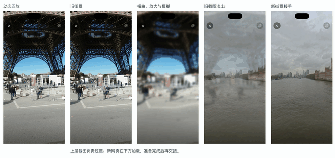

PFollow 一直在做从地点找回照片这件事。打开地图，点进一个有照片的地方，就能想起那天在这里拍过什么。但照片只留下了镜头前的一小块，转过身是什么样，旁边那条街通向哪里，还是得靠记忆去补。既然已经知道照片在哪拍的，能不能顺手回去看看？

Google 和 Apple Maps 都有街景能力，问题是怎么接进 PFollow。之前尝试过用系统 MapKit 接 Apple Maps 的街景，但在国内，即使科学上网也无法预览。这个方案在我这里没跑通，只能转向 Google Maps。直接接 Google Maps SDK 又得引入新的依赖，继续处理各个平台的适配。只为这一块能力再背上一套地图开发套件，代价有些大。我需要的是它已经做好的全景和沿街移动，照片浏览由 PFollow 接在外面就够了。

换个角度想，平时在浏览器里打开 Google Maps 就能看街景，为什么一定要从 SDK 开始？Google 的 [Maps URLs](https://developers.google.com/maps/documentation/urls/get-started) 可以带上经纬度直接打开全景，也不需要 API key。那好办！把网页拿进来，再整理它的展示和交互。主要的工作就变成了怎么改这个网页，让它适合用来回看照片。

### 网页裁剪与 DOM 观察

网页打开了，真正费事的地方才开始。Google Maps 面向地图用户，搜索框、菜单、地点卡片、小地图、指南针和各种按钮都有用，放进 PFollow 的照片详情却太满了。手机网页还可能引导用户安装 Google Maps，于是先请求桌面版全景页面，再调整显示范围，让它铺满当前窗口。剩下的直接对加载后的 HTML 动手。注入脚本找到不需要的组件，把显示、可见性和触摸响应一起关掉。照片条、关闭按钮和陀螺仪开关放在原生界面里。不能只把网页按钮变透明，它虽然看不见了，还挡在原地，手指划过去照样可能点中。

但也不能图省事，「只留一块画布，其他全删了」。街景可能由几层画布共同组成，道路前进箭头、点击区域和拖动处理又挂在周围的组件上。只拿出有图像的那一层，得到的可能是一张能看却走不动的街景。得找到真正承载街景的组件，保住里面的渲染层和交互层，再沿着网页层级向外清理无关内容。清理完一遍还不算结束。走到下一个路口，旧地点卡片可能被移走，新卡片又插进来；也可能什么都没新增，只是把隐藏容器改成了显示。这两种变化都要接住。`MutationObserver` 同时观察节点增删对应的 `childList` 和属性变化对应的 `attributes`，再用 `subtree` 把后代节点纳入观察。

每次变化都重扫也不行。网页动画一直在改样式，如果每改一下 `style` 就从头遍历，街景还没卡，我加的处理先把它拖慢了。实际只关注显示、尺寸和语义相关的属性，并过滤普通节点的 `class`、`style` 变化。已经藏起来的节点、画布、内嵌页面和提示框发生变化，才重新处理。第一次有效通知开一个 60 毫秒的定时器，期间收到的通知合并到同一轮，也不会反复把定时器往后推。执行清理前暂停观察，清理完再监听。不然隐藏控件写入的样式又触发自己，没完没了。

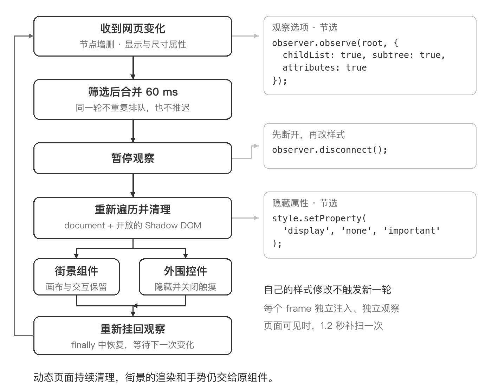

恢复监听放在 `finally` 里，即使清理中途退出，后续变化仍然能收到。隐藏组件除了设置 `display: none`，还要关闭可见性和触摸响应，并提高内联样式的优先级，压住网页原本的显示规则。

网页组件还有自己的边界。Shadow DOM 是组件内部的节点树，普通的 `document.querySelectorAll()` 不会走进去，文档上的观察器也跨不过去。遍历从 `document` 开始，遇到开放的 `shadowRoot` 就加入待处理列表，继续向里面找，每个根节点各挂一份观察器。封闭的组件内部则无法用这个办法访问。

`iframe` 得分开处理。在 WebKit 的每个 frame 里分别注入脚本，通过 `postMessage` 传递当前模式，各自处理自己的页面，不从外面强读跨域内容。有些组件出现以后才挂上 Shadow DOM，光靠观察器仍可能漏掉。因此页面可见时每隔 1.2 秒补扫一次，平时的变化还是交给观察器。沿街走动，新弹出的卡片继续清理，道路箭头和拖动区域留在完整的街景组件里。

商家图标又是另一回事。它们不在普通 HTML 控件里，而是直接画进全景画面，隐藏样式碰不到。最后在网页加载资源时单独屏蔽这类标注图标，同时保留全景影像和沿路前进所需的资源。同样是去掉一个图标，落在哪一层，处理方式就不一样。裁剪还得能撤回。修改前记下原来的样式和优先级，恢复时检查属性是否仍是我写入的强制值。网页后来自己更新过的值继续保留。切回原网页就撤掉这些覆盖，遇到需要用户确认的页面，也让原网页正常显示，不能为了界面干净把必要操作堵死了。

### 输入映射与交互协调

界面收拾好了，操作还没接完。手指拖动和沿街前进沿用网页本来的能力，手机陀螺仪和 Mac 触控板需要另做转换。手机给的是三轴角速度，网页要的是鼠标拖动距离。中间得分出左右转头和抬头低头，按采样时间算成相对角度，再把角度换成距离。

我选的是相对增量。每次只告诉网页「在现在的基础上再转一点」，用户刚用手调整好视角，松手后转动手机，画面就从当前方向接着走。如果直接用设备的绝对朝向，刚刚拖好的视角又被拉回去了，这个体验肯定不对。原生侧用 Core Motion 每秒采样 30 次，读取三轴角速度和重力方向。参考系选择 [xArbitraryZVertical](https://developer.apple.com/documentation/coremotion/cmattitudereferenceframe/xarbitraryzvertical)，只需要重力提供竖直参照，不需要知道手机朝向正北。

三轴角速度记为 ω，重力方向记为 g，都用设备坐标系表达。左右转头取 ω 在 g 上的投影，上下看则取它在当前水平轴上的投影。这个水平轴位于屏幕平面内，与重力在屏幕上的投影垂直，写成公式是 `r = (−gy, gx, 0) / √(gx² + gy²)`。手机竖着拿、横过来或者稍微歪一点，左右和上下仍有同一套参照，不会把设备某一根固定轴一直当成左右转动。接近平放时要停下来：重力在屏幕平面的投影长度不大于 0.2，就暂时停止输出，避免分母太小放大误差。

分出两个角速度后，绝对值小于 0.008 弧度/秒的输入当成零，再用「上一份结果 ×0.55 + 当前输入 ×0.45」平滑。乘上两次采样之间真实的时间间隔 Δt，得到这段时间转过的弧度，再乘 `180/π` 换成度。角度增量还要经过一次 0.008° 的过滤，有效变化才放大到两倍，单次限制在 ±8°。灵敏度放在过滤之后，调快转动响应时不会连静止抖动也一起放大。

第一帧只建立时间基准。采样间隔达到 150 毫秒或数据异常，就清掉滤波状态，不能把一次延迟积分成突然的大幅转头。角度到了网页，还得换单位。读取实际全景交互区域的宽度 W，单位是 CSS 像素，再从当前网页 URL 读取视野角 FOV。没有这个字段时按 90° 处理，并限制在 10°～100°。每度对应的拖动距离取 `W/FOV`，左右位移为 `−Δyaw × W/FOV`，上下为 `Δpitch × W/FOV`，正负号对齐网页原有的拖动方向。两轴都用宽度和同一个视野角作为灵敏度标尺，竖向没有另拿高度去乘。

举个例子，交互区域宽 390 CSS 像素，视野角 90°。网页收到经过灵敏度处理的左右 +2°、上下 +1°，换出来就是横向 −8.67、纵向 +4.33 像素。不能再乘 Retina 的屏幕倍率，DOM 鼠标事件使用的就是 CSS 坐标。这套换算是在按视野调整拖动灵敏度，属于近似处理，最后的全景转动仍由网页自己的拖动逻辑完成。

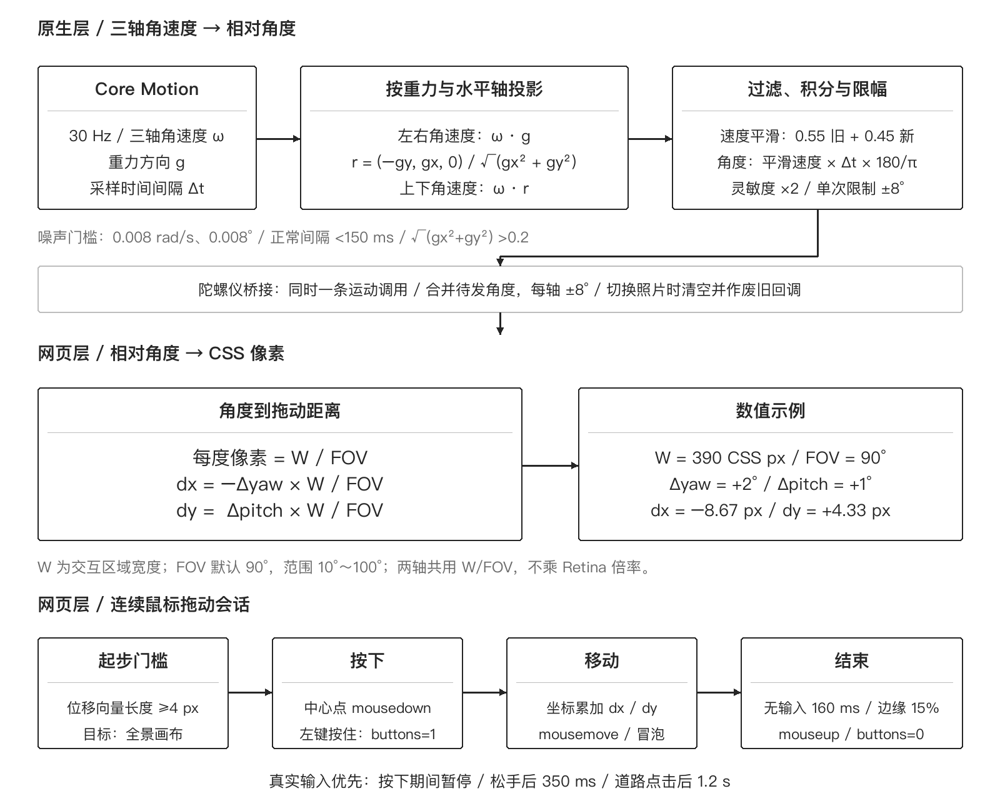

有了距离也不能只发一个 `mousemove`。找到保留下来的全景交互画布，从中心发出 `mousedown`，随后把位移累加到同一个鼠标坐标上，持续发送左键按住状态下的 `mousemove`。事件允许冒泡和跨过 Shadow DOM 边界，全景组件原有的监听器才能收到输入。画布在内嵌页面里，就把相对角度转交给那个页面，在它自己的坐标系里完成换算和拖动。

模拟鼠标也得有起止。累计位移向量的长度至少达到 4 CSS 像素才真正按下，避免细小抖动变成一次短按。连续 160 毫秒没有新输入，或者坐标进入画布边缘 15% 的区域，就发出 `mouseup` 结束拖动。下一段重新从中心开始，不让这个虚拟鼠标一路走出画布。

传感器和网页的处理速度未必一致。原生侧同时只允许一条陀螺仪运动的 JavaScript 调用执行，期间的新角度合并到下一次有效输入里，每个方向仍限制在 ±8°。不把每次采样都排成长队，否则手机停了，网页忙完还在补过时的转动。切换照片、关闭陀螺仪或离开页面时清空累计量，旧页面的异步回调也不能重新放开当前页面的发送状态。

真实手势优先。网页只把 `isTrusted` 为真的输入当作用户操作，不把自己注入的鼠标事件误判成新触摸。手指按住期间停止模拟拖动，松手后再等 350 毫秒恢复。真实点击或双击把等待延长到 1.2 秒，留给沿街前进的过渡动画。监听时不拦截原本的点击和手势，手动调整、道路前进和设备转动就能接着用。

Mac 上把触控板双指滑动转成看向四周的拖动，捏合继续负责缩放，普通鼠标滚轮保留自己的行为。底部照片条是原生组件，它的横向滚动也不会混进街景里。到这一步，网页才像 PFollow 里一个正常的浏览界面，手放上去就知道该怎么用。

### 截图转场与就绪检测

切换照片还有一个明显的断点。新网页加载完成，不代表街景已经画出来。网页结构准备好了，全景画布可能还是黑的，此时撤掉加载状态，就会先闪一下黑屏，再突然出现下一条街。摆个转圈当然也能等，但刚才还在街上四处看的感觉一下就断了。

我给这段等待加了一层空间扭曲。上一条街留在画面上，建筑、道路和天空开始轻微流动，慢慢虚化，下一处街景准备好后再从下面显现出来。切换前用 `WKWebView.takeSnapshot` 截下**已经显示出来的街景**，放到新网页上方。下面的 WebView 正常加载，上面的截图负责变形。关闭按钮、陀螺仪按钮和底部照片条在更上方，不跟着街道扭曲，用户仍然能继续选照片或者退出。

变形用的是 Metal 像素采样。平常显示图片，屏幕上的 `(x, y)` 去原图的 `(x, y)` 取颜色，现在改去附近一个随时间变化的位置取颜色。每一行左右偏一点，每一列上下偏一点，笔直的边缘就弯了。横向叠加两组频率、方向不同的正弦波，纵向再补一组，整张街景不会像一块平板来回平移。下图用同一组采样偏移画出网格变化，取色过程缩成两行代码：算出偏移，再把新坐标限制在图片范围内。网格标出的就是输出像素去哪里取颜色，也就是 `distortionEffect` 收到的采样坐标。

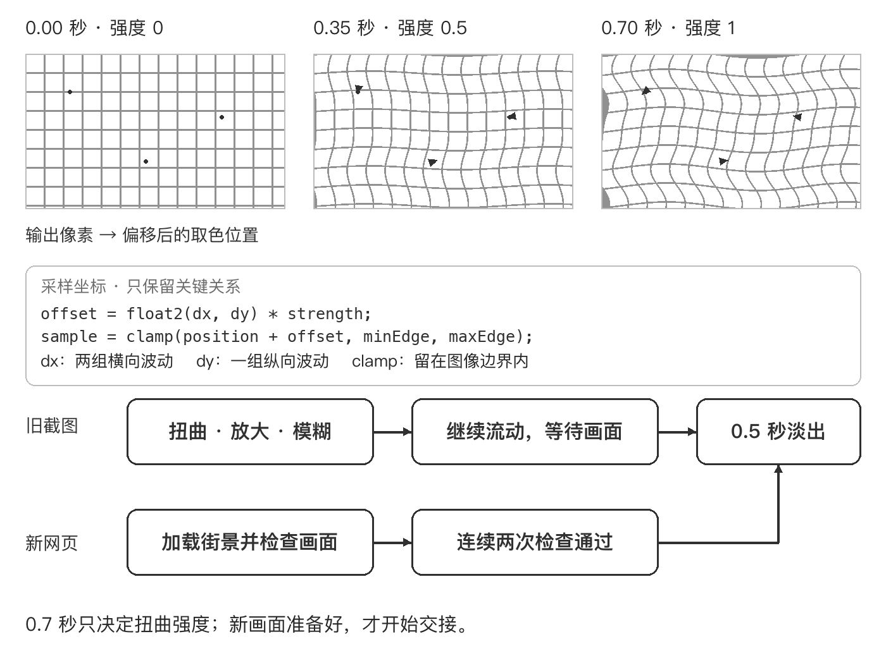

波动每秒更新 30 次，强度逐渐增加，截图同时最多放大到 1.025 倍，模糊半径增加到 5。旧场景逐渐失去清晰边界，采样位置又被限制在图像内部，四周不会被拉出透明缝。0.7 秒是扭曲强度达到上限的时间，不是露出新网页的截止时间。网络慢一点，旧画面就继续流动。

何时交接，得看新街景有没有画出来。确认页面已找到街景组件后，每隔约 220 毫秒取一次画面，只检查中央 70% 的区域。把它缩小到 24×24，检查亮度是否有足够变化、非黑像素是否占到一定比例。连续两次通过，再用半秒把旧截图淡出。检查中间一块可以尽量避开周边控件，连续确认则避免全景刚开始绘制时一闪而过的内容被当成已经就绪。

## 跋

最近给包括 PFollow 在内的几个产品做新功能，我都在找更便宜，甚至免费的方案。实在不想把钱花了，还要每天投入大量时间维护。需要上云的能力就先小规模迭代，能少花钱就少花钱，稳定以后再考虑固定的服务器支出。fengyu 给我介绍了 Apple 之前面向游戏产品的资源热更新方案。从 iOS 26 开始，模型、资源等大文件也可以走 Apple 的官方资源下载服务，费用包含在每年的开发者服务费里。我觉得比另外找资源托管服务更靠谱，目前正在尝试接入，也想借它继续优化包大小。

PFollow 也成了我试那些好玩点子的一个容器，已经在里面折腾了不少东西。产品和研发还能琢磨，运营和宣传是真的搞不懂。想做的东西很多，怎么让合适的人看到它，却又是另一回事，琢磨人性太艰难了。越来越觉得，一个人既要有独特的产品思路，又要有很强的研发能力，还得精通运营和宣传，最后还能过好自己的生活。这种人到底存不存在啊，想想都难于上青天。

难归难，还是想去试一试。只是别忘了做这些事的目的，走一遭呗！
