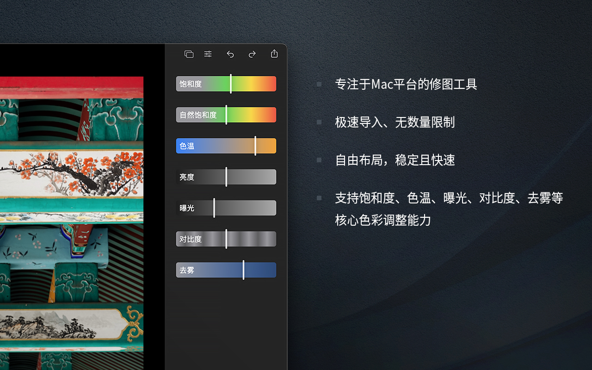
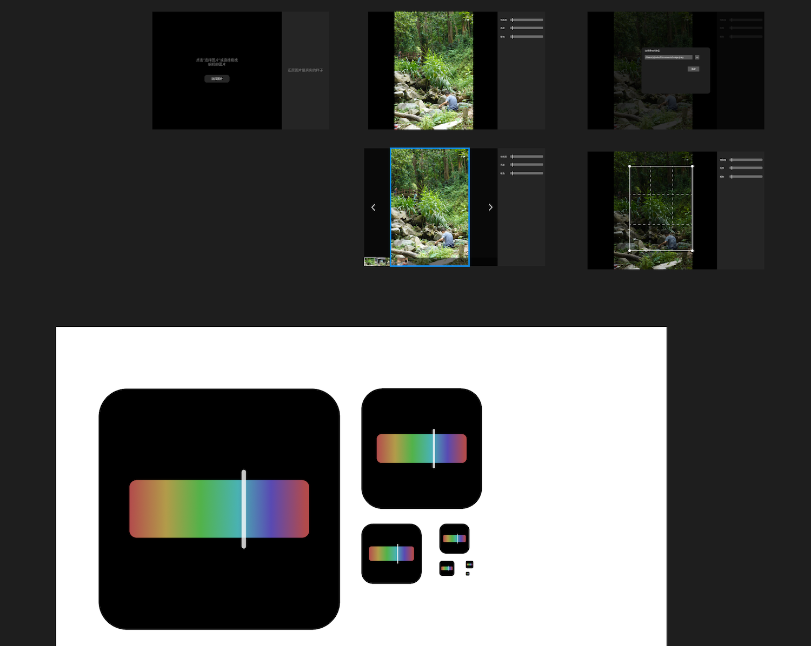

拖了整整两个月终于发布了！从原定的中秋节发布改到国庆节，再改到现在，心态上经历了太多的变化，深刻的感受到成年人生活的不易，既要又要的状态非常难以平衡，稍不注意满盘皆输。不过好在和小伙伴“恩平”的努力下，总算发布了，我们都有一个美好的未来！

## 为什么

[PhotoP](https://apps.apple.com/cn/app/photop/id1639575048) 是一个专注 macOS 平台，小而美的修图工具，当前 1.0 版本只有 1.1MB 大小，关于它更多的前因后果可以看这篇[《PhotoP 开发日志 01》](http://pjhubs.com/2022/08/13/photop-app-init/)。

但距离写下那篇文章已经过去了三个月，在过去的这三个月时间里遇见了更多的人做了更多的事，整个人的状态也发生了很大的变化。当初豪言壮志地在广州珠江边的香格里拉酒店房间里立下了 flag，“中秋节一定能做完！”，然而无数个小细节问题在临近收尾时越来越多。而且从广州回到北京家中时，重新回到一个无比熟悉的环境时，那种懒散、那般悠闲自得其乐的状态又回来了，变得不再像那个看着珠江潺潺东流，每晚下班回到酒店还要挠着头，转着笔思考问题的自己。

尤其是到了 9 月份工作上进入了一个白热化阶段，早上在讨论和确认无数个工作上的问题中度过，几乎每晚到家都临近 10 点，脑子已经被榨干了，甚至有一段时间已经没有继续打开 Mac 投入 PhotoP 的剩余开发工作中了。这种状态持续了一个多星期后爆发了，我觉得自己不能再这样乱糟糟的下去，我要让生活和工作回归到自己能够把控的状态中来。

在《工作、消费主义和新穷人》这本书中（并不喜欢这本书）有句话是这么说的，“工作的价值取决于产生愉悦体验的能力，不能使人获得‘内在满足感’的工作没有价值”，这句话粗看其实挺对的，但细看的话很容易被驳倒。之前我一直认为不喜欢的工作那我为什么要做的呢？但随着工作中接触到不同的人越来越多，逐渐发现把自己的感兴趣的事情和工作结合起来对于大部分人来说非常困难，但每当我发现自己的兴趣不能很好的结合工作时，内心总是有一种声音让我去改变。

当日常的工作模式固定导致思维定势一段时间后，这种声音也会出现，它会 push 我去改变，如果我一直不改变，发展到最后我可能会去做一件金钱上花费更大、精力上投入更多的事情，但如果能够借助这个声音出现的机会做一次改变，大多数情况下我会拿到自己相对满意的结果。这次 PhotoP 就是被这种声音 push 了，同时我也明白如果我肆意让它生长，顺势而为去做一些短视的事情，这些东西最终又会仅仅只拿到几十甚至上百个 star 后，流落于茫茫 github 众多开源 repo 中淡忘。

所以！我一直在拖，等一个时机的爆发，等一次我真正思考后的结论，正如《上学记》中所说，

> 看书如看人，你渴望什么，便看到什么。你执著于八卦，你便看到八卦；你关注教育，便看到教育；你渴望心灵，便看到心灵；书也是一面镜子，其实你看到的是自己。你渴望什么，便看到什么；你选择什么，便走进什么。然后，你就会慢慢变成你渴望的样子。

生活其实你我身边存在很多稀奇古怪的人，而且总是自己才是对的别人都是错的，总是想去说服别人接受自己的观点，但立场不同，双方的经历不同，想要去的接受同一个观点势必困难至极，甚至还会引起不必要的矛盾。

也如前面几篇博客中透露的那般，这么些年我其实一直在逃避很多东西，但当时我自己看不透，许多东西无从用常识表示，只有你在观念上达到更高的层次才能感受到它的存在。人，确实是有局限性的，我的局限性在于“没有耐心”，之前做的东西东西再坚持一会就可以达到自己想要的目的，但就差那么一点放弃了，或者其实自己并不是特别想要？之前也跟其他小伙伴说过这件事，

> 在这个星球上，存在一个伟大的真理：不论你是谁，不论你做什么，当你渴望得到某种东西时，最终一定能够得到。因为这个愿望来自宇宙的灵魂，整个宇宙会合力助你实现愿望。

看完这段话不要发出不屑的微笑，从我个人的亲人经历告诉你这是千真万确的，在去到广州的时候突然猛的想要给自己加一个计划，今年跑完 500km！确实，今年开始跑步也是在广州开始的，在珠江边跑过多次后，想明白了一些东西，关于跑步的细节蹲另外一篇文章，等我先把今年的 500km 跑完，一年跑完 500km 对于曾经的我来说简直难到爆炸，但通过早起跑步是可以引导自己把控状态的，我们后面再展开。

跑步调整了一段时间后，发现自己的状态又变得好了一些，开始继续做 PhotoP，重新梳理剩余的内容。很快，又推进了一大步，但此时中秋节已经过了，开始延期到国庆节发布，但好在我遇到了新的小伙伴[“恩平”](https://www.jianshu.com/u/704f62f0ff6f)！

## 都有谁
目前 PhotoP 第一个版本的开发工作只有我和恩平两个人完成，我们俩平常都很忙，一个要工作一个在上学，谁都不可能 100% 的全身心投入在 PhotoP 上。平常我们俩也非常佛系，谁有空了就做一点，但到了后期最近的一个月基本上都是他在做，我只负责引导到正确的产品设计方向上以及提供一些方法论而已，恩平是一个非常不错的小伙子！我很开心能够认识他。

那么说到了小伙伴，我是怎么认识他的呢？4 月份还在西瓜时部门里三个小组共同举办了一个《西瓜视频客户端挑战赛》，恩平刚好是我 mentor 的那一组的组员，同时他们组是唯一一个在 one one 沟通时开了会议并大胆的表达自己想法的组。他们组里两个人，都给我留下了极深刻的印象，同时也是因为开了视频的原因，在整个赛事中我也给了他们尽自己最大可能的帮助，包括结束后也一直在沟通交流。

在飞书上聊着聊着就发现这小伙子一点都不简单，他身上有我自己当初的影子，仿佛看到了当年大一大二的自己，看到了一个机会就想抓住。说到“抓住机会”又突然的想起了当初大二找暑期实习时高高兴兴踩着共享单车去北辰面京东，一份 iOS 试卷只做出了三道题的我十分郁闷的愤自己不争气，晚上左思右想睡不着，发了人生中第一条“低声下气”的短信给面试官，几乎是“求”着他给自己一次实习的机会，因为当时的我知道自己急缺一份能够接触到真正“大工程”的实习来让自己的技术水平跃迁，而京东刚好非常合适，但自己步子迈得太大扯到了蛋。发出这条短信后我自己也变了一个人，觉得自己非常的“恶心”，我怎么能求别人给自己一份工作呢，我以后再也不要这样，也就有了后面大家耳熟能详“毕业的时候我要工作来找自己”的说法。

看着恩平跟我说的这些话时，跟当初我与[大哥](https://blog.dandyweng.com)说的几乎一摸一样，太像了！甚至那会都有些热泪盈眶，但我只能感叹历史的相似度，万万没有攀附后辈之意，你们真的是越来越强了！有时候机会就是这样，当它出现的时候你要有很好的眼光发现，有勇气抓住它。我当时没做好邀请别人一起来做 PhotoP 的准备，因为太简单了实在是不好意思开口让别人一起写，但命运有时候就是这么好玩。毕竟要想超越前人，必得先看出前人的不足，要是拜倒在他的脚下，那就永远也超不过他。

好几次我们都在互相讨论这一个地方到底要怎么设计怎么写才更合适，但绝大多数的情况下我也只是在阐述自己当初这么设计时的想法，恩平也是如此，在互相表达完看法后，我们自然而然会选择一个更好的方案。其实在这种情况下我并不会去说服他一定要这么做，而是要让他明白我当初这么设计的原因，如果他能明白或者能够反应出一个更好的方案，说明我当初的设计是清晰的，有缺点但明晰，就怕说完了后对方不知道是啥意思，这就十分不利于合作。当然，这也是在锻炼我如何把自己的设计说给他人听，还能够依次实现出来，一举两得。

## 怎么做
原本打算 PhotoP 第一版直接开源，但自己已经奉献了这么多，好不容易才憋出来一个新的产品，想想还是算了。PhotoP 是基于 macOS 使用 Swift 语言，结合 SwiftUI 和 Metal 框架驱动的修图工具。纯单机，没有任何一行网络请求的代码，断网依旧可使用。我们不关心你都用了什么功能，不关心哪些功能用户更喜欢，不关心次日、七日、十四日留存，你爱怎么用就怎么用。

之前在 19 年时自己也下了一个很大的决心，只用 SwiftUI 完成一个 app，后来又被打脸了。因为当时不管你怎么做都无法绕过 UIKit 的支持。到了今年做 PhotoP 时总算可以一马平川的做到这件事了，截止到目前为止你看到的、使用的所有功能均由 SwiftUI 完成。

但实际上在开发工程中 SwiftUI 这种特立独行的数据驱动 && 声明式 UI 的开发理念还是有很多憋屈的地方，换句话说，如果我用 UIKit 去做同样 feature list 的 PhotoP 虽然代码会更多，但写起来会更自由和舒服。我不知道这种纯 SwiftUI 开发的方式还能持续多久坚持多久，但单是交互这块已经很头疼了，希望后面能顶住。

PhotoP 的产品设计上有着“泼辣修图”的影子，如果不是因为泼辣真的有很大的适配问题，也就没有我做 PhotoP 这码事了。我很喜欢泼辣的滑杆，后面也会继续参考泼辣的设计并结合自己对图片处理和工具产品的理解，给 PhotoP 做出一些更符合它定位的设计。

最开始我一直使用 Sketch 进行原型和高保真设计，但不知道为啥 Sketch 突然就没人用了，工作中转为了使用 Figma。我个人其实对设计软件没有偏好，所以也就跟着工作中的流程去走。

关于 Metal 的使用，对于我来说是一个全新的方向。计算机图形学的东西我只有略微的写过一点点，但就这一点点的经历已经完全折服在她的石榴裙下了，后续也会结合 PhotoP 的实际功能来给大家分享 Metal 和计算机图形学相关的知识，这是一门充满魅力的技术方向。

再说回来为什么非得是一个只在 macOS 平台上的产品，为什么不跨平台不支持 windows，不适配 iPadOS 和 iOS 呢？其实很简单，我是真的很不喜欢 windows，除了打游戏和写游戏，我根本不想使用它。不适配 iPadOS 和 iOS 是原因也很简单，我写了太多年太多个的 iOS app，已经几乎没有想要挖掘它的热情了，很疲惫很累。

## 还有啥
PhotoP 很小，非常小，小到我都不好意思去更大更多的平台上去宣传它，没有杀手锏 feature，没有特色，没有差异化。在开头的列举的那篇文章中也已经说明，做 PhotoP 是因为我真的只想解决自己的问题，作为一名开发者，自己的问题都解决不好还妄想去解决更多人的问题，这就是个妄想啊。

我已经不敢再说某个固定的更新频率了，在现如今这种背景下只会 flag 一直倒，倒到最后自己会毫无更新动力。但目前来说，最近几个月是一直都有事情要做的，如果你感兴趣的话，可以看这个 [list](https://github.com/users/windstormeye/projects/8)，看看我们最近都在琢磨什么。

其实还有很重要的一点，在工作中，作为一名客户端业务开发，我几乎没有机会触碰到底层的渲染 SDK 代码（代码等级很高），但字节内部有大量的图形学相关学习资料，既然自己工作中是在做图形图像和音视频相关的事情，学习资料也有，但还是缺少很多更具象化的实操机会，业务代码都太封装了，屏蔽了太多的实现细节。这种方式对工作、对实现一个庞大的工程非常有必要，但对个人来说弊端很大，这也是我的破局手段之一，希望自己能顶住。

## 审核意见
在正式发布之前我们已经跑了 3 个版本的 testFlight 测试，有效测试量达到了将近 50 人，我十分满意了。顺势而已的就用了第三版 tf 测试包进行了发布，过了几个小时后收到了 reviewer 的审核意见，主要有两点：

* 在 Connect 平台上填写应用程序信息的“Subtitle”部分我填了“专注于 macOS 平台的修图工具”，出现了“macOS”关键词。
* 在用户点击左上角红叉关闭按钮时没有入口再次恢复窗口。我想把 PhotoP 做的精简去除不必要的东西，把所有菜单栏入口去除了，没想到红叉点击事件系统的默认实现是隐藏窗口而不是关闭...解决方案跟着 reviewer 意见就行，“如果你是一个单 window app，点击红叉时保存用户数据并退出应用程序”。

这两点确实是之前没注意到的，现在的审核意见终于说人话了，也告诉你可以怎么改了，太难得了。可能是因为我太久没有发新 app，一旦发现状态修改为“In Review”就会每隔一段时间，甚至十几分钟一两个小时刷一次 Connect App，查看是否通过或需要修改，这种感觉仿佛又回到了从前。

## 总结
做 PhotoP 最大的收获是认识到了自己做一件事时的心态变化，从一开始的踌躇满志，到差点中道崩殂，再到恩平小伙伴的加入坚定了自己做完的决心。虽然说这三个多月的时间突然就这么过去了，但果然人还是只会记住那些美好时刻留下的印象，而不会记住那些让自己痛苦的回忆。

在实现自己的想法，做自己想做的事情道路上，那些阻挠你的人、事或物最终在结束的那一瞬间都会变成嘴角上扬时那一抹自信的微笑。
