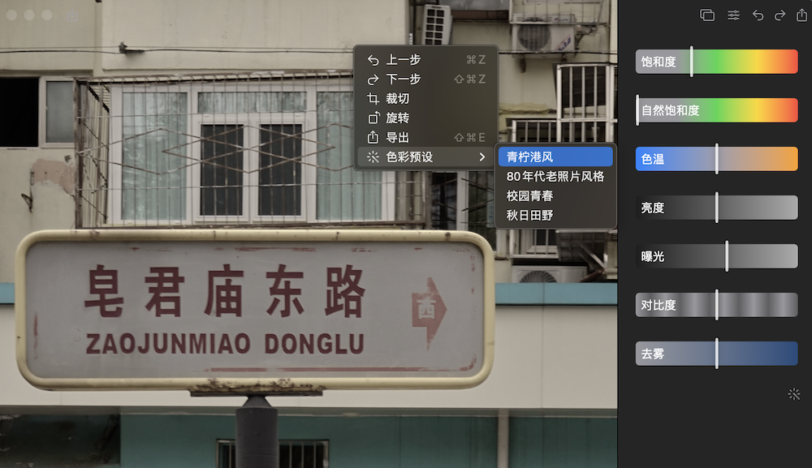
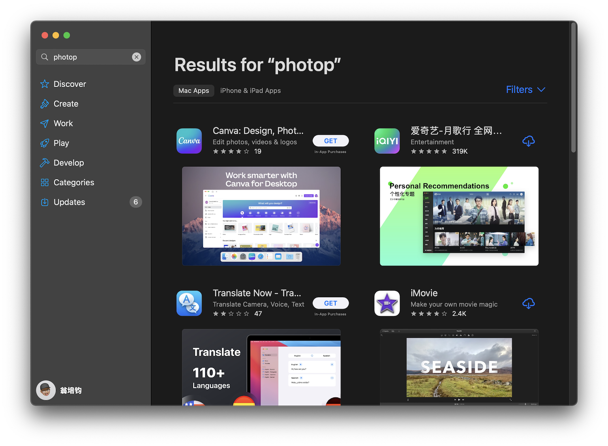
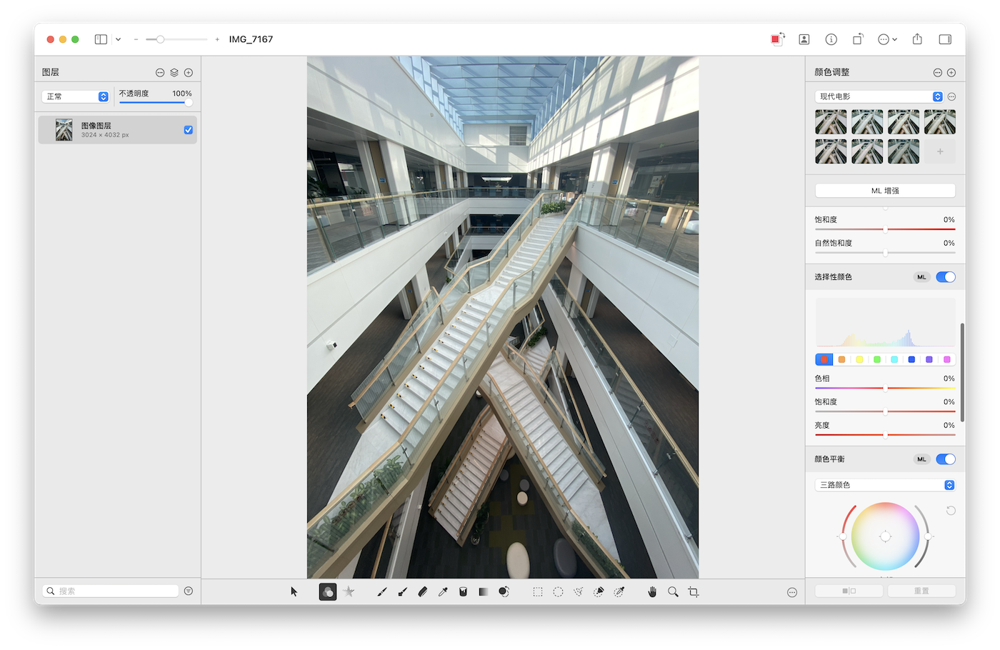
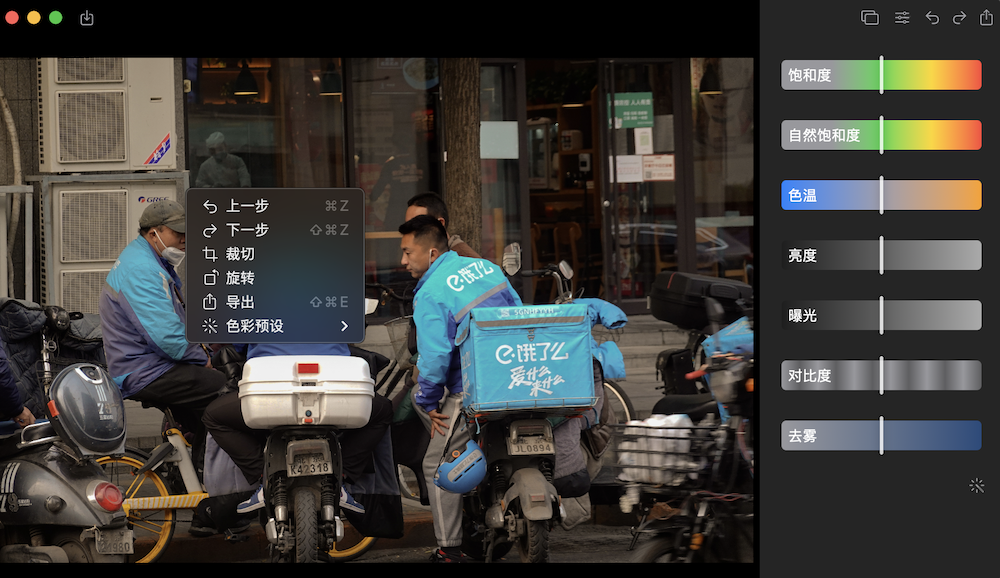
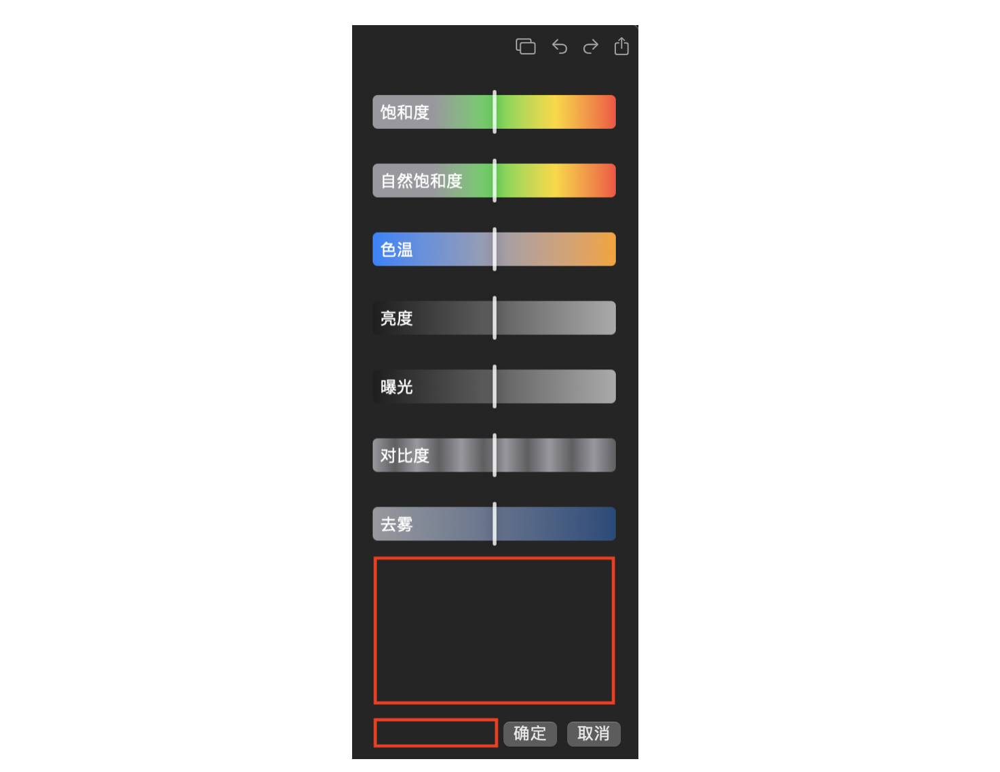
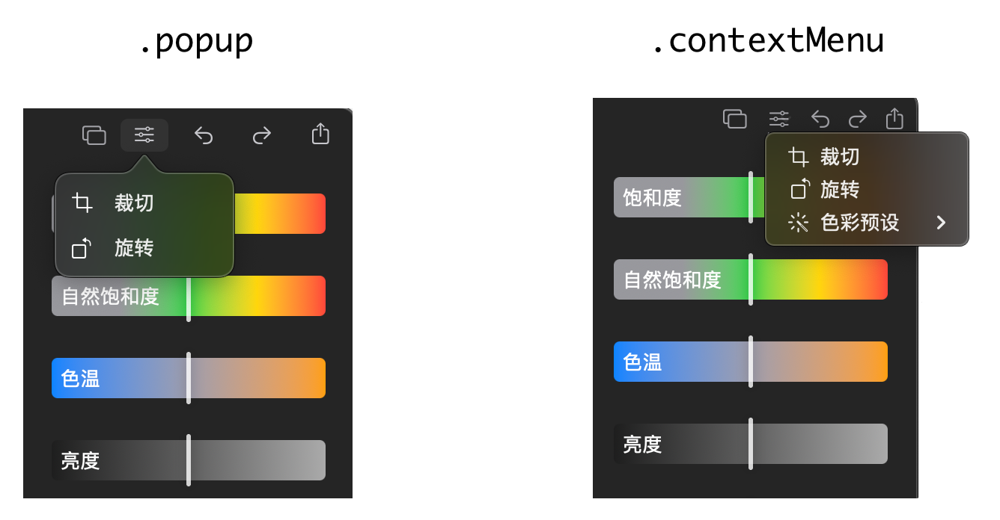

又是整整一个月过去了，赶在今年圣诞节前期 PhotoP 也迎来了第二个版本 1.1 的更新。实话实说在 1.0 发布出去后仅仅只是在朋友圈发了一篇开发日志，轻描淡写了两句算是给这件事做了个了结，因为 1.0 版本实在是太多问题而不好意思大肆宣传，在这段时间里身边几个小伙伴的使用过程中也发现了很多小问题。综上所述，1.1 版本就仅仅只是作为基础体验完善，并加上了之前一直都很想做的“保存预设”。

## 就离谱
上线 1.0 之前做了几件离谱的事情......

### 应用商店搜不到
PhotoP 这个名字被其他 app 作为关键词占用了，目前直接搜索 PhotoP 需要往下滑好几行才能看到，实在是失大策了。幸亏当初还加了我的 id，至少能够保证搜“pjhubs”时能必现，长了教训，以后切记切记在确定自己的 app 叫什么之前先去 App Store 上搜一发，确保完全搜不出任何东西后才用这个名字。




### Appearance 适配
对，我居然完全忘了在上线之前过一遍 light mode，事后回想起来大概率是自己完全不用 light mode 而导致直接忽略了这个场景。实际上 SwiftUI 的`Button`组件默认是自动适配的外观主题切换的，但我总觉得一个修图软件如果是用白色做主色调容易视觉上引起误差，所以就去除了对主题的切换。

后来买了 Pixelmator Pro 后居然发现我觉得白色底色不适合作为修图软件的主色调是因为自己的设计并不符合视觉统一规范，而且使用上非常舒服，果味非常浓，而且和系统 app 设计上高度统一，在一些基础操作上几乎不需要做任何预先的熟悉，但在自己独特的场景下又能够做出设计舒服的差异化，以后不抄泼辣抄 Pixelmator Pro！



## 右键菜单和快捷键
SwiftUI 虽好用但有太多东西都是既定事实了，就一个快捷键而言它必须依赖组件本身带有`Control Modifier`的修饰，假设你使用了`Image`组件，给`Image`添加了`OnTapGesture`事件，但因为`Image`本身并不实现`Control Modifier`协议，通过`.keyboardShortcut()`无法响应快捷键。

并且本来打算抱着在 Qt 中写 QML 的那套跨平台 UI 的思想自行监听用户按下鼠标右键后自行弹出对应的自定义菜单，最后才发现仅需一个 `.contextMenu` modifier 即可完成，真的很香！！！

不过仔细想想也是，对于`Image`来说我们给它添加上的`OnTapGesture`只是额外的手势修饰符，其本身并不具备响应快捷键能力。就目前来说，我的实现是快捷键必须依赖`Button`，这样你的`Button`就可以随意处在任意一个例如`.contextMenu`等容器组件下符合平台规范的 UI 表现了。



## 一些技巧

### 善用 Spacer() 
当你想完成类似以下布局时，但没有很好的办法按照 Apple 官方交互文档做间距时，切记你正在使用的是 SwiftUI，Apple 有史以来最智能的 UI 框架，仅需在关键的位置放上 `Spacer()` 标签，即可自动完成最佳间距控制和布局。




### 修改光标样式
如果你想要在某些时刻修改光标样式，Apple 提供了一份完整的在不同系统下支持的光标样式[集合文档](https://developer.apple.com/documentation/appkit/nscursor)，非常完善。在 SwiftUI 中修改光标样式，可以在`onHover`方法中这么做：

```swift
Rectangle()
    .onHover { inside in
        inside ? NSCursor.resizeLeftRight.push() : NSCursor.pop()
    }
```

### Menu
周日正常是一个浏览信息的日子，从各种信息中翻到了一个台湾的小姐姐讲 SwiftUI，看了开头两集发现小姐姐在介绍如何使用 Xcode 自带的 Snippets 帮助学习 SwiftUI 组件和布局方式，我也跟着点开看了看，之前完全忽略了这个入口。

就这么一看，发现了好几个通过 SwiftUI 提供的组件大大降低了原先通过 AppKit 那冗长的调用逻辑，更惊喜的是发现了 `Menu` 这个组件，原来自己寻找许久的菜单样式在这里！！！经过一番改造后，剔除了原先通过 `.popup` 方式唤出的菜单给改造好了，最终变得更符合 macOS 平台的 UI 规范，但这个向下的箭头一直无法去除，最后用了一个非常骚的操作规避掉了。

我也不想写这种逻辑，但这是目前最合适的办法了，谁让用了 SwiftUI 呢，在下图中仔细看还是能看出来“功能”入口按钮中间部分有一个隐约可见的向下箭头。

```swift
Menu()
    .opacity(0.09)
```




## 总结
1.1 版本严格意义上来说才是 1.0，但 1.0 无奈拖得太久再拖我就要放弃了，所以才出此下策。在 1.1 开发过程中确实加了好多交互优化，比如裁切功能部分一开始只做了四点和四边的拖拽，但就猛得那么一次使用过程中发现居然没法把整个裁切框拖着走，惊呼自己连这个功能都没做上！

其实这看着长不长短不短的三四月个时间里，自己算是得以反复的从两种角色中切换去看一个产品。日常工作中就是不停的协调，PM 对各种功能卡得严，这个不做就不能上，那个有 bug 卡体验，交互不好，不解决不能上，但几乎每个需求都很紧张，都在倒排，在如此情况下还要保证如何多的东西严丝合缝的推上线，这中间一定有至少一个角色在负重前行，我也不知道在赶什么。

回到做自己产品的开发环节里，时间一长，原本热血沸腾的 feature 可能过了几天后，我就完全提不起兴趣了，因为经过时间沉淀后发现这并不是一个急需解决的问题，而出现这个状况后内心里一定有另外一个答案，另外一个问题在占据上风，去把那个问题解决就好了。

接下里 PhotoP 的开发工作可能要停一段时间，因为最近一直在观察三年前做的一个[实验项目](https://xiaozhuanlan.com/pjhubs-swift-game)。在过去整整的三年时间里，这个项目一直有人在付费，目前总付费人数时 192 人，远超我对这个事情的最初预期，而且不管对我还是大家来说吸引力确实很大，原本说好的至少一年更新却因为 20 年那恶心人的疫情影响完全打乱了我的计划，环境发生了改变进而影响到了我，对付了钱的大家我表示真的很抱歉。

现在看着好像这荒唐的一切终于按下了停止键，先不管能不能回到当初的样子，就目前而言我的状态算是跟三年前有所匹配，PhotoP 的成功上线也给了我很大的动力，当初那件想要做成前无古人后无来者的大事一直沉浸在心里挥之不去，那么就直面它吧！