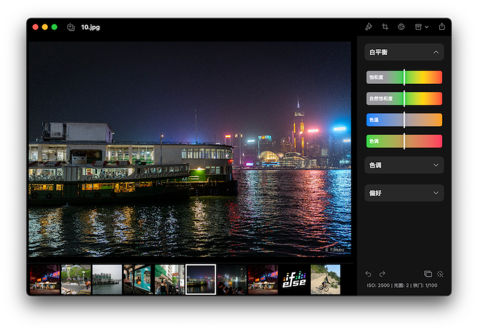
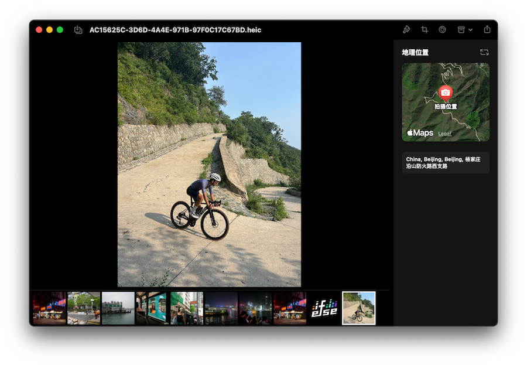
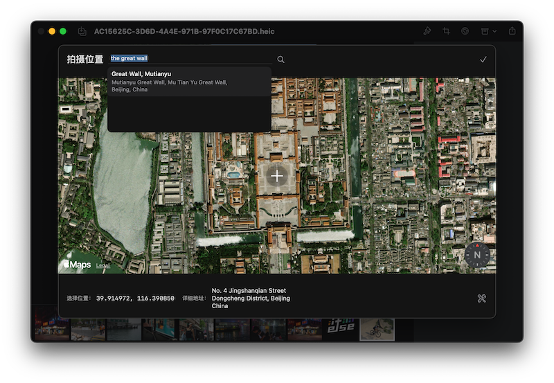
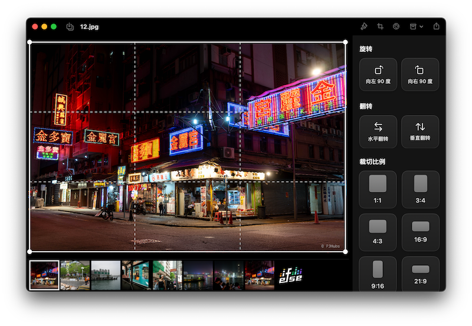
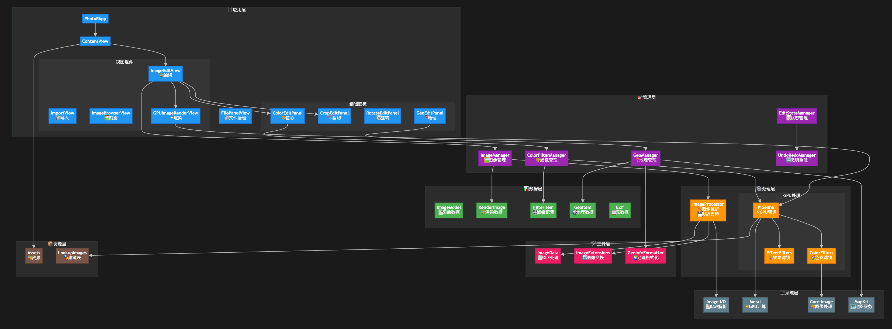

终于赶在 7 月份前把 PhotoP 的 1.3 版本给做完了！薄桑正式加入开发，带来了 RAW 文件导入和地理位置信息编辑。本来我只是想简单的支持下 macOS 26，没想到顺势而为搞了波大的，彻底把 PhotoP 做到了原本预期的完美版本。

## 支持 RAW
这是一件“惊天地泣鬼神”的事情，大概是在 23 年 10 月下旬我再次尝试介入 Libraw，对相机的 RAW 文件进行解析，最主要的相机品牌当然就是我自己在用的 Sony 了。这里有个比较长的故事，当初开始做 PhotoP 时确实已经开始用相机拍照了，一台索尼黑卡 7，全是拍 jpg。也是在这段时间（22 年 8 月）里我把 PhotoP [第一版](https://pjhubs.com/2022/08/13/photop-app-init/)做出来了，也只是只支持 jpg 格式修图。后来买了 a7m4，开始拍 RAW，RAW 文件不光体积大，对修图产品的要求也高，光是跟随每年相机厂商更新各自特有 RAW 文件格式的能力就十分吃力了，更别说提供精细化操作支持了。

因此在推出 PhotoP 1.0 后我就一直在找机会也支持索尼自家的 RAW 文件格式`ARW`。第一次的尝试非常简单，直接使用了`Core Image`框架的能力，结果也很惨淡，系统自带的[`CIRAWFilter`](https://developer.apple.com/documentation/coreimage/cirawfilter)是能够支持一部分 RAW 文件的解析，但种类不多，尤其是我的想要的 ARW 格式图片不行。过了一段时间后用 ChatGPT 找方案，推荐使用`libraw`这个三方库，跟着 ChatGPT 的思路吭哧吭哧瞎折腾了一波，好多思路和方案都是错的，浪费了很多时间都没能成功集成。又过了一段时间，心里一直还是惦记着想支持 RAW 文件这事，又给捡起来了，这次我啥 AI Copilot 都不用，纯刀耕火种的手搓，终于成功接入`libraw`，但依旧非常可惜！居然还是不支持解析，疯狂报错。但对 ARW 文件的支持是该库官网上白纸黑字写的，因此我给该库提了一个 [issue](https://www.libraw.org/node/2778)，得到的答复居然是我当时 a7m4 上开启了最高规格的 RAW 文件拍摄格式，改格式生产出来的 ARW 文件内部有一个新增的字段太新了，导致这个库无法解析出正确数据...需要等待他们后续的排期支持。

我当时整个人都要傻了，换句话说就是除了我自己相机拍出来的 RAW 文件其他牌子的相机均可，当时气得不行，总感觉这样依赖三方的解决方案不是办法，已经彻底放弃了。随着时间的推移，去年我在更新 PhotoP 1.2.3 版本时重新关注了这件事，`libraw` 已经推出了新版本解决掉了这个问题。但此时的我已经彻底依赖 Lr 去修图，不光是对其他修图产品没有想法，就连我自己的 PhotoP 都没有迭代的欲望了。这一切的转机就发生在薄桑在一个多星期前突然给我发了消息，说是他准备在 PhotoP 上增加地理位置信息编辑，过了几天居然已经做好了。跑起来看了下效果，完成度非常高，再加上新一年的 WWDC 召开，瞬间就激发了我再次对 PhotoP 升级的想法。

但我当时的精力主要在 TranslateP 和 PFollow 上，正在火急火燎的用它们两个来尝试 Liquid Glass UI 风格，完全不清楚薄桑到底在搞什么事情，只是每隔几小时就给我发消息说这个做好了，那个做好了，给我看得一愣一愣的。特别是最后说支持了 RAW 文件的导入解析，尤其还完美兼容了已有调色能力，更是兴奋得不行，有种 PhotoP 重要做完了的感觉！因此，PhotoP 的第四次解析 RAW 文件被远在霓虹的薄桑给搞定了，从第一行代码到现在共经历了差不多三年的时间，真不容易啊。

大概的做法是这样的。apple 官方原生支持对 RAW 文件的完美显示，你可以认为只要是系统相册能够显示的 RAW 格式图片你的 app 里就可以显示。但这里唯一欠缺的是无法对 RAW 格式图片进行原生的“RAW 编辑”，换句话说你没有办法对加载显示到你设备屏幕上的这张 RAW 格式图片进行任何修图行为，只能进行降精度的 RGB 转换，使其变成`NSImage`，从而进行修图行为，仅需一行`CGImageSourceCreateImageAtIndex`。其实这个方案最终看到后我也不是特别满意，因为这相当于根本就没有利用上 RAW 的优势，本质上还是对 jpg 进行修图，但至少可以显示出 RAW，如果只看结果，确实也算实现了这个功能，因此也算满意吧，毕竟有好过没有，毕竟得先做完再做完美。

## 地理位置编辑

去年突然有一段时间非常想写自己的东西，给 PhotoP 已经做上了展示当前照片的位置信息，当初在重点做 PFollow 的新版本，想着把基础产品能力找个地方先练练手，还给做上了“据你多远”这种看着没有意义的事情。实际上要做的事情应该是支持给没有位置信息的照片加上位置，导出时也一块带上，这样既满足了基础图片编辑诉求，也增加了 PhotoP 一个附加特色。这个事情主要也是薄桑完成的，他的诉求比我强。一般情况我到一个地方去玩耍，一定会拿手机拍一张，在加上打开了手机拍摄自动记录 GPS 位置信息的开关，后续再结合 PFollow 一起使用理想情况下可以分别满足好“编辑”和“浏览”两个方向。

我和薄桑的配合非常的“原子化”，他负责做功能的 MVP，我负责打磨到上线标准。主要原因还是薄桑的空闲时间还是比我多，可以专注在核心能力的实现上，而我就可以利用多年来对工具产品的思考和理解来进一步打磨调整到预期的上线标准。这个配合的方式互相不阻塞，跑了快一个月的时间，大家都心照不宣的进行着，谁有空就多推进一步。

除了正常展示出一张原本就具备地理位置信息的照片，在对没有地理位置信息的图片新增位置，薄桑取巧的增加了“搜索”入口，虽然用的是 MapKit 自带的兴趣点搜索，没有特别“智能”，但为了小而美以及继续抛弃对国内 SDK 引入的支持，还是在尽可能做的好了。如果没有搜索到合适的位置，直接在地图上拖拽选择即可。除此之外，有些人是想抹除掉位置信息的，提供了一键擦除 + 恢复逻辑，非常好使十分迅速。但我还没想好是否需要进一步外露擦除位置信息入口，毕竟我自己是喜欢照片一直带着位置信息的，毕竟还有 PFollow 嘛～

## 基础功能完善
以上两个大块的功能是造成了本次 PhotoP 1.3 版本迭代的主要原因，毕竟我还没有成为全职的独立开发者，虽然曾经打着这个名头混吃了好几年，甚至逐渐变成“业余独立开发者˚”，有时候想想还挺好笑的。这里主要的思考是“如何即用上系统规范实现，又保持自己的独特性”。

因为 PhotoP 之前我在两年前实现时完全没有按照 SwiftUI 在 macOS 平台上的规范来，很多地方都是自己的“独特实现”。虽然这些独特实现在当时的自己看来非常自豪非常得意，事到如今带来了非常多令人头大的问题，甚至我刻意的延缓适配 macOS 26 的脚步。这些问题中最头疼的就是把 PhotoP 上的功能入口都换成标准 UI 组件实现，涉及到对整个产品 UI 结构的调整，是一个大工程。

首先把项目入口换成标准的`NavigationSplitView`来承接，对原本的 UI 分层重新进行了抽象、解耦和封装“三件套”，重新梳理清晰了整个 app 的项目结构、UI 划分、模块职责等等，都是经验之谈，每个人都有不同的理解，能够让整个产品顺利 run 就行。其次是对`toolbar`进行了大刀阔斧的调整，基本上把原来的顶部功能入口设计全部删除，重新基于系统标准实现进行原有能力的封装。剔除了众多之前版本引入不符规范的“骚操作”，相信经过这次版本的重构，后续不管是任何版本的任何 UI 变更，都不会再像这次一样耗费如此大的精力了。

毕竟这次做了完整的系统`toolbar`实现，薄桑看了初版设计后觉得大额头很丑，再加上用了菜单的设计收起来了太多的便捷操作入口，原本就比较突兀的大额头在此刻看上去就更突兀了。在思考了一天后，决定废弃掉这种设计改为使用`.unifiedCompact`风格，瞬间就舒服多了，基本上把 PhotoP 目前支持的所有功能都进行了外露。这次还特意重构了“旋转”模块。原本把旋转模块单独交给恩平小伙伴做时就打算让他自己说了算，当初自己对这个模块也不够上心，重点一直在基础调色上，。虽然最后旋转功能做出来了，但整个产品体验非常之糟糕，只能说能跑。这次的对旋转模块的重构重点放在了“如何便捷的提供旋转”，而不是“提供旋转”。这几个字的区别深刻影响了模块的核心设计，到底是 for “有”，还是 for “更好用”，很明显，这次我要更好用。

线上版本提供给用户的旋转入口太自由了，虽然任何一个角度用户都可以自己转得出来，但绝大部分用户都仅仅只是像转个 90 度，甚至翻转下图片即可。放弃掉最本质的诉求，做一个自由度过高的入口，而没有打磨清楚到底要提供什么样的能力，我觉得也属于“懒政”。因此，我的重构思路就是一定要先拿掉旋转滑杆，接着提供金刚位的操作入口，先打用户认知，这个入口就是便捷调整图片旋转的，你也不能自己随意调，就得这么用。

后来我想把“裁切”入口也这么复刻一遍，做着做着发现这么下去很有可能到了国庆节前就把 toolbar 上空余的位置都给占满了，还是没有给用户提供便捷操作，到那时估计又得开始考虑砍功能和隐藏入口了。因此在已经实现好裁切功能入口面板后，我还是去掉了它在 toolbar 上的占位，直接和旋转入口进行融合，给用户提供一个完整的“编辑”模块，日后也方便新增图片编辑的迭代。

最后一点是加回来了原本彻底放弃的缩略图浏览功能，一开始是真的加上了 sidebar 侧边栏，是一个真实的侧边栏结构去浏览和切换图片。但最终做完后观察体验了两天，越用越觉得奇怪。侧边栏现在的内容太少了，只有一个图和文件名，在纵向布局上不管怎么设计都比较丑。最终还是用回了两年前的老方案，直接抄回“泼辣修图”的设计，直接在图片编辑区下面增加图片浏览功能完事。只能说这种经典的设计细细品味后还是十分不错的！

## 总结
修图软件的市场很小，用户心智已经被拆分得很细了，但有没有一款产品可以解决掉所有人的需求？答案显而易见，一定是没有的。如果你选择方向足够垂，那就一定可以找到一眼望去满是铺满地砖的缝隙，在这个缝隙里长出你的一颗小草。PhotoP 未来一定还是会加上商业化策略，但这个策略到底是什么，不管价格卖多贵多便宜，至少都要尝试一下。

我也不清楚 PhotoP 还能够走多远，我还能写多久，毕竟现在在各种 AI 工具加持下，个人还用着如此古老的方式来修图看起来是一件十分可笑的事情。有时候自己也会恍惚，我做这些事情还有什么意义，明明现在只需要用自然语言的方式和 AI 沟通、下指令就可以完成一张图片的编辑，出来的结果大差不差，甚至大概率还会有惊喜，为什么自己就这么爱做这些很明显马上就要被淘汰掉的东西么？是不是自我感动太久了，困在自己的世界里享受所谓孤独太久了？会不会存在一叶障目的情况？是不是丢失了自己独特的竞争力？我有好多问题。

但现在能够给到自己的答案是，正是因为偶而脑热一段时间，做了这些 app，写了这些代码，才有种活在当下的错觉。在公司环境里待久了就连做自己想做的事情都要问为什么，都要问意义，都要算计值不值，有时候觉得自己也活成了当初讨厌的样子。但明明自己就是非常喜欢琢磨这些小点，做这些小的东西，做这些工具。比如下一步我就想做自定义水印导出，我大概知道怎么做，但对混合在 SwiftUI 中用一种全新的架构方式去演进对于自己来说本身就是一件享受，本身就是一件乐趣。

希望你能喜欢这个版本的 PhotoP！正如我在过去的时间里对它们纯粹的喜欢一样！

