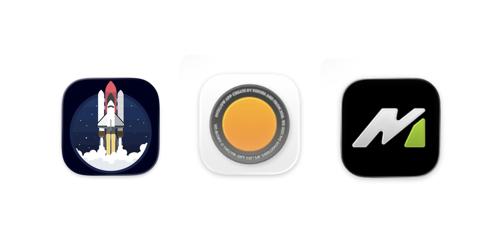
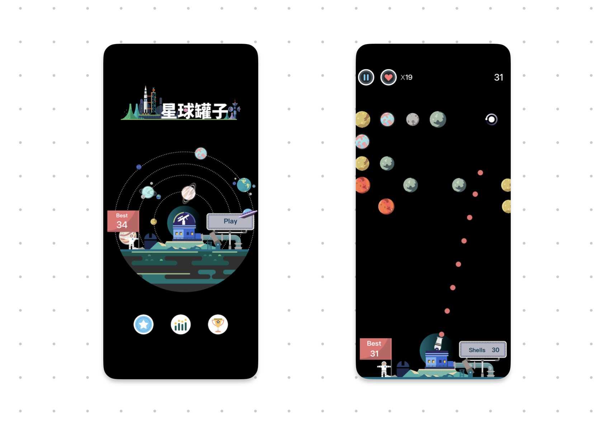
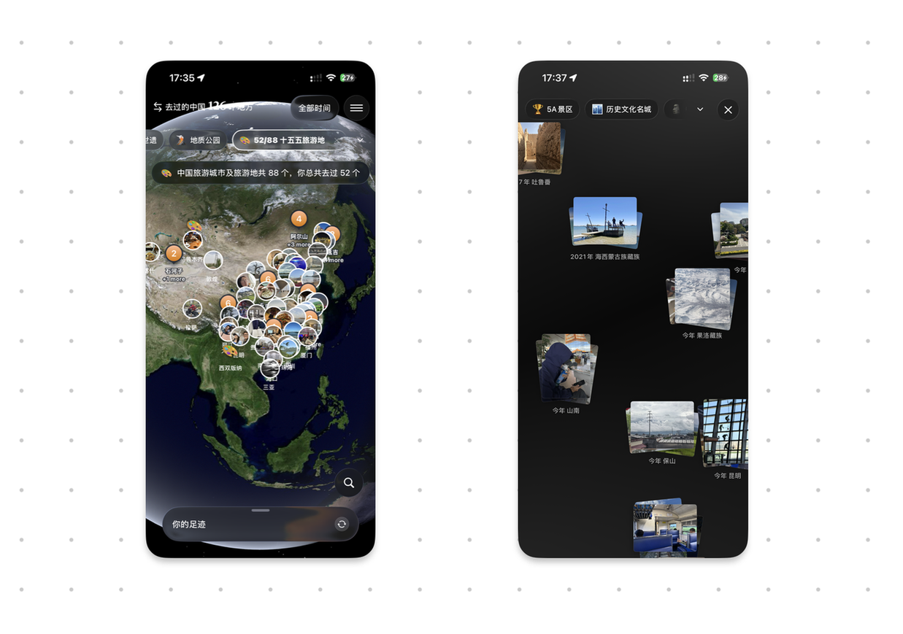
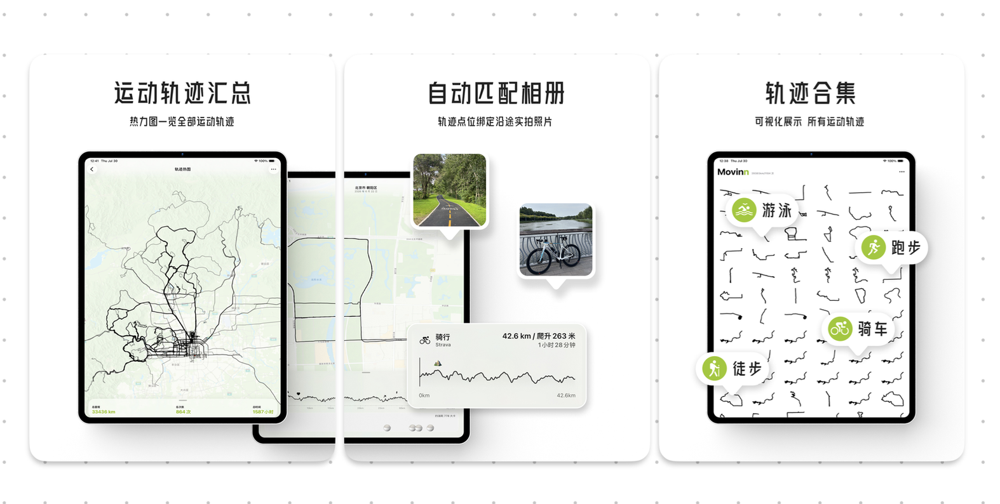

星球罐子是一个将近 10 年的产品，2017 年的暑假就已经做完，主体框架和逻辑也停留在那一年，最近的一次更新还是两年前做了一次简单的适配，直到现在。抽空给 Movinn 做了 iPadOS 的兼容，基于 SwiftUI 各种标准化实现后从 iOS 适配到 iPadOS 省了很多事。PFollow 增加了实验室功能，把做得还不够完善和初步想法的新功能都丢了进去。

## 星球罐子
星球罐子源自于 2017 年夏天，和几个小伙伴像素级复刻另外一款类似打砖块的游戏，他们说这个打砖块的游戏经常让他们抱着手机玩到深夜，第二天打着哈欠来上班。本身做着是睡眠健康类产品，帮助用户检测和提高睡眠质量的，但他们发现在产品里的社区模块里大量活跃着深夜睡不着的群体，想着换个思路做些东西服务这群人。当时的我得知可以这么转变思路时非常意外，相当于他们其实没有被常规和已有思路束缚，通过观察到的数据结果来顺势而为，挺有意思的。 

但很可惜，当时的产品提审后被 apple 告知涉嫌抄袭，虽然我们本质上就是抄袭。但几个人仔细琢磨了一番，不甘心让过去的一个月付出的汗水白白浪费，并且我们也都已经摸透了这个游戏的本质，果断决定保持核心玩法换个皮继续推进。再经过一个月的密集协作，星球罐子也就诞生了。整整过去了好几年，因为人心四散这个游戏一直被雪藏，大概是六年前我才从铺满灰尘的 github 仓库列表中记起了它，重新解决编译问题，上架。

我能做的也仅仅是重新上架罢了，加上当时刚毕业进入字节，既要做到职业打工人也要过好自己的生活，再往后的继续维护没人参与我一个人根本做不来。最近又想起了它，现在开发成本对比前几年已经大幅降低了不少，但游戏美术和玩法策略才是每一款游戏的本质。星球罐子算是超休闲小游戏那一类，严格意义上它走的思路要上微信小游戏，做广告，做增长才能获得可能的收益，但这方面的事情比较复杂，一个人的精力很难照顾得很好。

换了个思路，星球罐子还是要继续做，并且依旧是专注在 2D 平面 + 超休闲小游戏方式，载体是一个收集星球的打击类游戏。这个游戏之前都只是初版，很多东西都只做了第一步，我构思了很多增加趣味性的玩法，甚至去年还在思考如何把它迁移到 visionOS 上，做成全 3D 的可交互游戏，但这一步需要改变的不仅仅是开发模式，还要转变产品形态，从原本的纯平面设计转变为空间设计，我一直没有找到比较好的思路，还需要继续探索。

最新的版本把星球罐子从 10 年前的 Cocos-2dx 引擎换为了 SpriteKit 原生引擎，更好的处理速度，更快的计算框架，最重要的是基于 Swift 语言。用 C++ 开发业务逻辑 2017 年的时候我就感受到痛苦，根本不适合做业务逻辑，没想到后来在剪映三年的工作时间里需要大量的依赖 C++ 继续做业务逻辑，更是痛苦满满，不光是需要写大量的 C++ 模板和宏去节省重复代码，就连排查问题都无法精准的根据捕获到的异常堆栈快速的反推出异常点。

但最难的部分并不是 Swift 语法，毕竟现在有 Coding Agent 加持下，基本上很难有写不出来的逻辑。最终的难点在不同引擎在坐标、锚点、屏幕适配、动作方向、物理碰撞时序和生命周期上的语义差异。但就算如此时隔快 10 年的时间再看这些逻辑头还是很大，很难想象当初的自己居然可以在一个 .cpp 文件里写下两三千行代码（虽然后来见到了更长的）。最终还是新建了一个 Xcode 工程，复用一个 bundle id，图片、音效等所有资源都平易过去，最终从零开始引导 agent 拆分原工程，再到新工程里一步步搭建完。最终，运行着全新血液的星球罐子终于诞生了。

并且也适配了真正的全面屏！2017 年秋季推出 iPhone X 全面屏后，当时我们几个人都懵了，根本没想到果子会推出这种形态的设备。如果默认不适配的话，app 显示画面就会被局限在中心一块矩形范围里，上下都是大量的黑色区域。我们没有很好的解决方案，就连行业内成熟的产品在相当长的一段时间里顶部导航栏和底部菜单栏都 UI 错位了。在保证游戏可以运行的情况下，我们只是简单的把原本黑色区域改为了和游戏背景一样的深蓝色，也就作罢。

现在星球罐子最新的版本完美适配了全面屏，更大的游戏显示范围供你尽情玩耍！对了，还加上了一波仔细调整的打击感，打星体验更好了。请期待星球罐子接下来的迭代，我已经迫不及待要给你更好玩的体验了！

## PFollow
不知道大家是否有关注到最近有一份文件的发布，名为《旅游强国建设“十五五”规划》，这份规划文件把「旅游业」定调为了「新兴的战略性支柱产业和具有显著时代特征的民生产业、幸福产业」。除此之外还有几个关键性指标，比如国内居民出游人次达到83亿、国内出游总花费达到7.7万亿元、入境旅游人次达到1.9亿、总花费超过1500亿美元，再结合规划文件里「专栏1：旅游城市和特色旅游地布局」的城市列表，可以发现在这些数据指标的大盘里有哪些城市可以分到一些资源，对我们后续的择业和安居有很大帮助。

旅游业是个专注体验和感受的方向，始终都是以人为本的核心，意思就是不管怎么做都要回到人本位。我通过 PFollow 这个产品切入这个行业本质上也是做体验和感受。PFollow 通过重组照片组织形式，尝试唤起我们在旅行过程中的细节，重返旅行当下。做这方面的事情有很多类似的产品，去年是 Vision Pro 上的 Sceno app，通过全景地图匹配相册照片的方式拉回旅行当时的场景。初次使用还挺震撼人心的，但每次到想要咬咬牙付费时总是下不去手，最本质的原因我觉得体验还是不够沉浸。

另外一款产品是「魂旅」，今年在上海 let‘s vision 大会上见到了开发者，他们做的就是虚拟旅行，实时根据到达的地点播放当地的电台，本质上还是个番茄钟。但他们已经往前进了一步，把路过和到达的地点场景进行了 AI 生成，用户可以在其中进行一些简单的交互。魂旅的想法非常厉害，甚至比「专注飞机」做得还要早，本身他们的 slogan 就是「身在工位，魂游万里」。魂旅和专注飞机专注的是声音媒介，让用户通过声音的方式回顾或者进行一场虚拟旅行，套上番茄钟的概念，让人易于接受一些。那我没有付费的原因也很简单，干活的时候我连歌都不听，更别说需要开着一个类似番茄钟的东西营造一个专注氛围了。

另外一个产品是前段时间任天堂推出的「Pictonico」，可以把用户手机里的相册照片给盘活，把你朋友、家人甚至是宠物的照片变为一个个小游戏互通的载体。主打的也是把每个人手机里的相册，这个巨大的资产库给盘活，本身给的也是体验。不得不说任天堂确实游戏之王，我从未想过可以把用户的相册照片作为载体融合到游戏里，这里面的技术不算复杂，本身也是有很多前置分类器找到最符合内置十几个游戏模板的照片才能激活这些小游戏，但本质在于玩法的定义，值得学习。

回到 PFollow 本身，我到底要提供什么样体验？从去年 12 月开始推出商业化版本开始，PFollow 一直专注在数据集上，持续不断的给用户提供高价值的数据集，比如「国家历史文化名城」、「一级博物馆」等等，可以一键帮你找到去过的地方。延续上文说到的规划文件，最新版本中给 PFollow 加上了「十五五旅游城市」的数据集，方便用户一键找出十五五规划中的这些特色旅游城市是否去过。至于为什么要知道是否去过这件事，我就不做过多理解了，工具在不同人的手里必然有它的使用场景，重点是如何找到合适的人群，这对我来说是一件更难的事。

此外，我把之前没有想好的功能以及新的照片组织形式都统一放在了 PFollow 的「实验室」模块里，以后再有类似的暂不完善的新功能可以让大家提前体验到，不至于等到彻底完善好后再接触到大家。

## Movinn

Movinn 是我 6 月初的想法，具体的产品思考和总结之前已经分享过一次了，最近一次的更新主要是支持了 iPadOS，可以在 iPad 上回看自己的运动轨迹。Movinn 这款产品整体比较完善，暂时没有可以继续投入的地方，第一阶段的事情已经结束了，我准备先放一段时间去完善别的产品。在运动这个方向上自己想做的事情依旧是有好多，总之期待吧！

## 总结
目前个人精力实在是有限，只能按周维度切换上下文。可能这两周做 A 产品，下两周做 B 产品，甚至还会出现在做 B 的空闲时间里，因为看到了书里的一段话，或者一个视频里引发了另外的一个新想法，会把 B 停掉开始做 C。我不是最近才这样而是一直都是这样，脑子里的想法非常多，有些想法冒出来后经过自己仔细的推演后能行，马上就开干。Movinn 就是这个思维模式下的产物，我觉得很好的捕获到了并快速的拿到了结果，很满意。

当然也有一些声音说老开新坑不好，但每个人的阶段不同需要处理的问题也不同，以后有机会可以再来讨论这个主题。但就目前的情况来说，我的主要目的是把自己的想法变成可落地、可实现和可商业化的产品，之前的环境下可没这个机会让自己去思考这些东西，要抓住这个时间窗口多做几个产品去训练品味和思维模式。