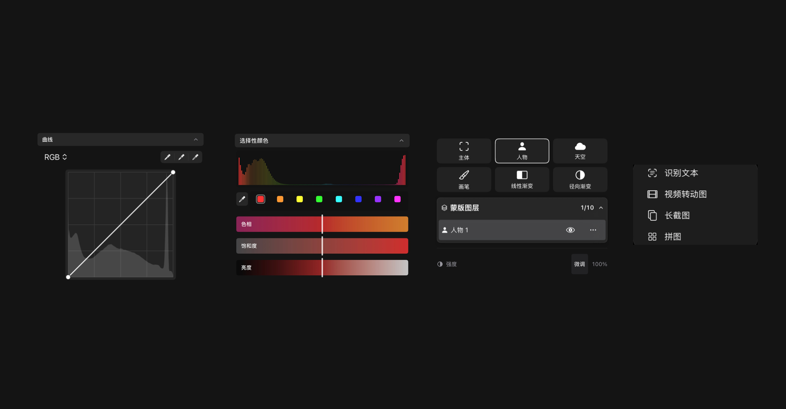

最近从东南亚旅行回来，给 PhotoP 补齐了一大波基础功能。前段时间原来用的 Lr 授权方式失效，就换到了 Photomator。试用下来发现 apple 原生技术栈开发的产品体验确实不错，于是买断支持了一波，也开始认真把自己的修图流程往 PhotoP 里搬。[上一篇](https://pjhubs.com/2026/08/12/product_1/)说要继续完善基础调色，这次终于把曲线、选择性颜色和局部调整都做上了！顺手还补了几个日常会用到的小工具。

## 序

从东南亚回国的第二天，表弟就来问 PhotoP 怎么单独调一种颜色，是不是只能先调成黑白再选择红黄绿？继续聊了下才知道他正在修暑假去日本旅行的照片，学到了一种通过调整互补色让照片更通透的方式，想拿 PhotoP 试试。他把「黑白」功能理解成了另外一回事，不过当时的 PhotoP 也确实做不了他想要的调整。

其实八月初就想过要不要补这些功能，只是一直没想清楚是否要继续往专业修图工具的方向做。这个市场已经有这么多前辈产品了，凭什么还需要一个 PhotoP？最后让我下定决心的是旅行途中收到的几笔周订阅和买断费用。既然已经有人愿意付费，至少说明它满足了一部分需求，那就先把自己的修图流程跑通，再接着补其他用户遇到的问题。上周差不多每天都在发新版本，接下来给各位投资人汇报下进度，也把这次学到的东西展开说说。

## 曲线

之前 PhotoP 已经有曝光、亮度、阴影和高光，单看功能列表好像够用了。但拿下面这张正镶白旗的照片来说，天空还亮着的时候地面已经暗了下来。修的时候想多看清一点草地和牛身上的细节，同时保留最深的黑色和天空原来的层次。毕竟拍的就是傍晚，总不能为了看清牛就把照片修成中午吧。

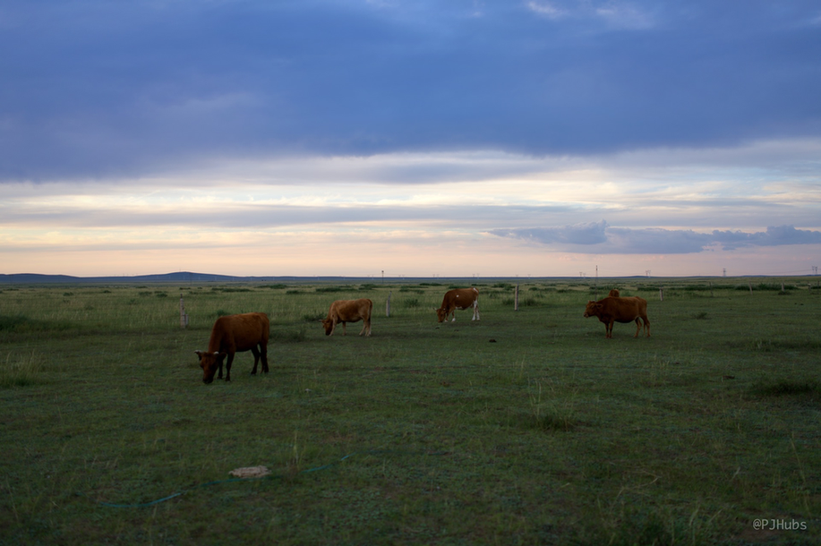

几个滑杆配合着也能调，只是每个滑杆影响多大范围、边缘怎么过渡都已经由工具预先安排好了，用户主要是在改强度。想自己决定哪一段多提一点、哪一段尽量不动，就需要曲线了。之前知道它能做到这些，真要自己做一遍才发现还得先弄明白面板上的一条线到底怎么改变照片。

我们先把照片放大来看。软件里的照片由一行行、一列列的小格子组成，每个格子叫「像素」。拿常见的 8 位 RGB 图像举例，每个像素用红、绿、蓝三个数记录颜色，数值从 0 到 255，越大就表示对应的颜色分量越强。下面这个偏蓝的像素记作（52，68，160），三个数依次对应红、绿、蓝。

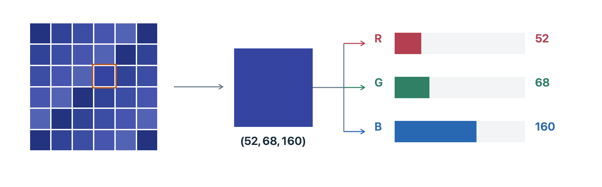

三个数全是 0 就是黑色，全是 255 就是白色。如果它们相等又落在中间，得到的就是深浅不同的灰。比如（52，52，52）是深灰，把三个数都改成 78 就会亮一些。用灰色来理解会容易一点，毕竟三个数相同，只看其中一个就够了。

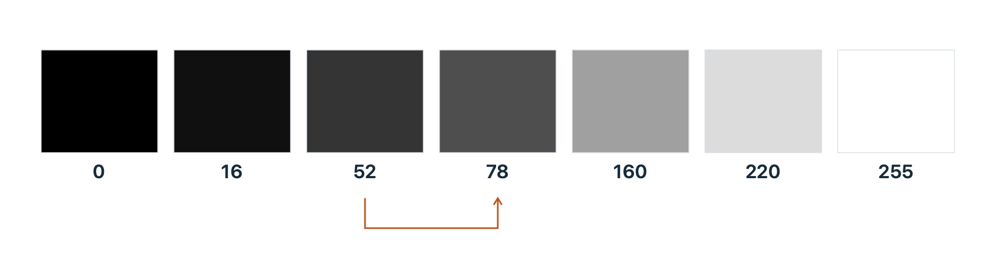

要让 52 变成 78，直接加 26 就能做到。但所有数都这么加的话，16 会变成 42、220 会变成 246，最深的颜色和亮处也会一起变亮。如果想保留 16、把 52 提到 78，再把 160 和 220 这两处稍微收回来，就得给不同的数分别安排变化了。

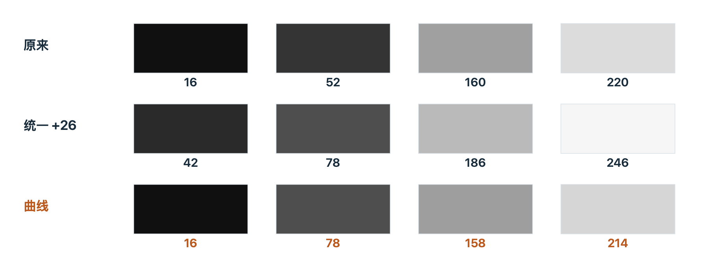

把这些调整前后的数值关系画出来就得到了曲线，横轴表示原来的数，纵轴表示调整后的数。从横轴的 52 往上找到曲线，再往左读到 78，意思就是把 52 改成 78。默认那条斜直线的输入和输出相同，所以照片没有变化。将其中一段拉到斜线上方会让输出变大，灰色随之变亮；拉到下方则变暗。面板上能拖动的点叫「控制点」，把它放在（52，78）就指定了这一组关系。

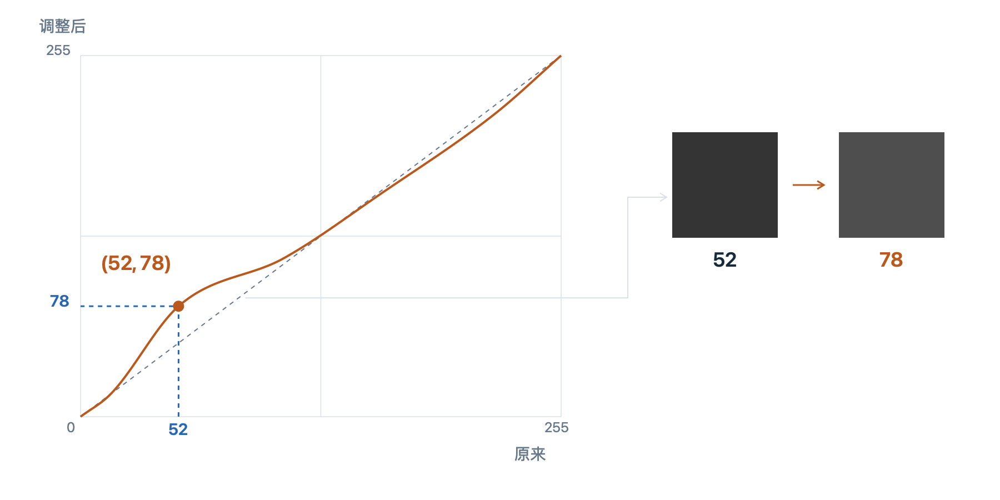

不过用户通常只放几个控制点，照片里那些没有被指定的 53、54、68 该怎么办？得根据前后的控制点补出中间的结果，这件事叫「插值」。直接连成折线也能算，只是接头处会有折角。换成平滑的线之后还得限制它别在两点之间多鼓出一个包，否则本来只想逐渐提亮，中间却突然冒出一段更亮的范围。最后让控制点之间平滑连接，同时限制多余的弯折，面板画线和调整照片都使用这份关系。

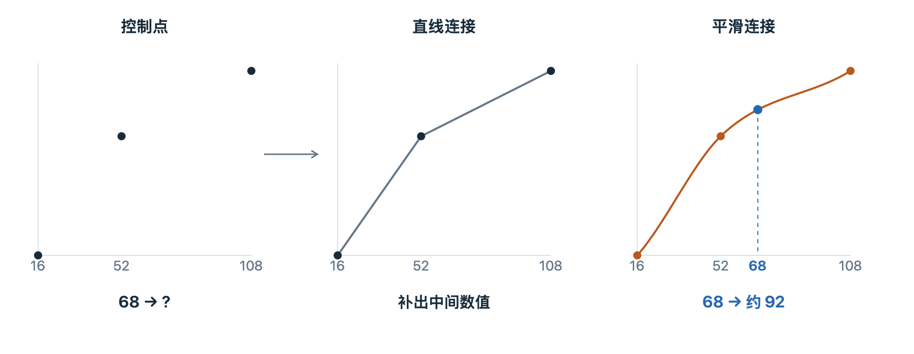

一张照片可能有几千万个像素，同一个数会反复出现，没必要每遇到一个 52 就重新算一次。提前把各个输入对应的结果排成一张「查找表」，用的时候直接查就行了。比如表里记着 52 对应 78、68 对应约 92，处理像素时按原来的数查一下就能得到新值。只要控制点没动就可以一直用这张表，拖到新位置后再更新表和照片预览。

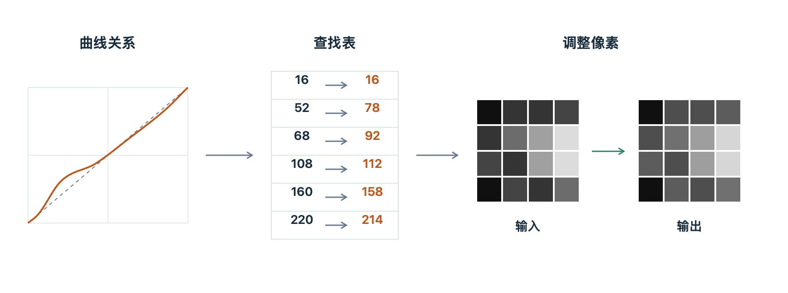

彩色像素同样这么处理，只是红、绿、蓝要分别查一次。前面的（52，68，160）经过示例里的曲线后变成（78，92，158），三个分量的变化幅度不同，颜色也会跟着变。所以拿 RGB 曲线调明暗时也要留意色彩的变化。PhotoP 另外提供单独的红、绿、蓝曲线，方便只调整其中一个颜色分量。

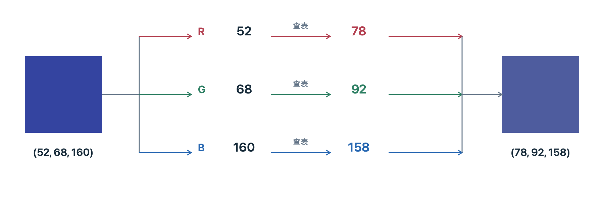

手指拖动控制点期间预览会更新很多次，但用户做的其实是一次操作，撤销也应该一步退回去。拖动期间就持续更新照片，等松手后再把最终位置记为一次调整。要是每刷新一次都记一步，最后光是撤销这一拖就得点半天。

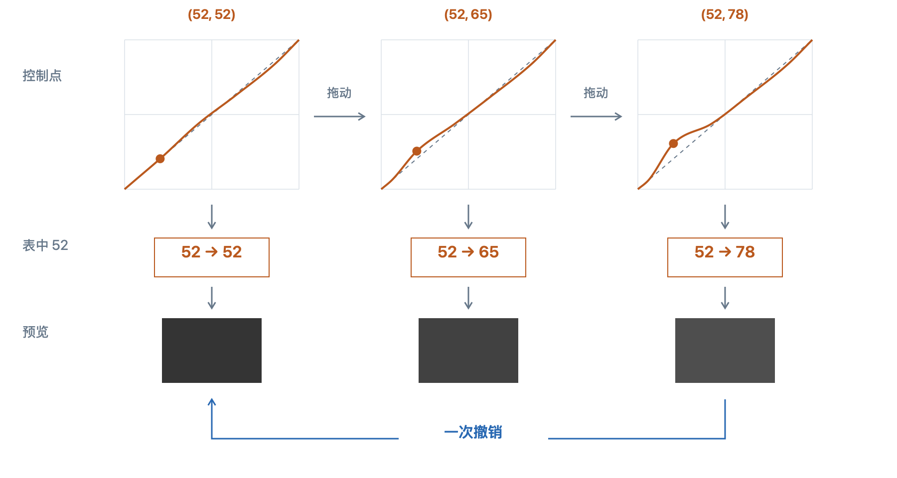

导出处理的是完整尺寸原图，屏幕预览则使用适合显示的图像。两边要按同样的顺序使用曲线关系，才能把屏幕上修好的效果带到最终照片里。工程中保存的是控制点，重新打开后再生成查找表就能继续调整。即便某个点还在默认斜线上也应该留下来，用户可能只是先放好位置准备下一次再拖，不能因为它暂时没改变照片就给删了。

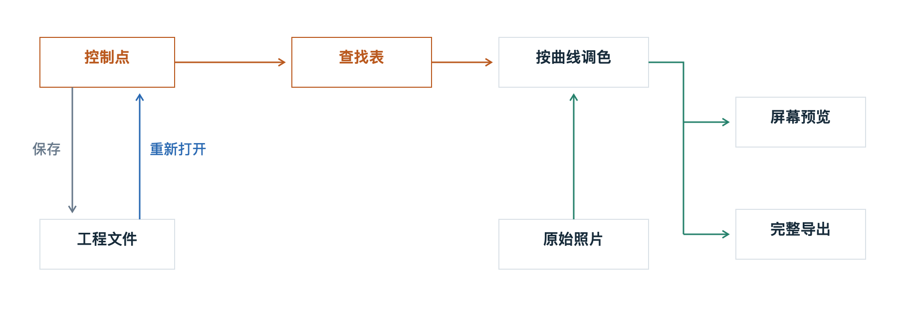

## 选择性颜色

曲线做完了，表弟提到的需求却还差一步。比如想把偏黄的树叶调绿一点，拉绿色曲线确实能往画面里加绿，但「绿色分量」和「绿色的东西」不是一个概念。前面那个偏蓝的像素里也有绿色分量，同样可能跟着变化。只是想调一下树叶的颜色就得反复琢磨三个通道怎么配合，用起来还是绕。

所以接着做了选择性颜色。现在可以直接选黄色让它往绿色走一点，或者选蓝色降低这部分的鲜艳程度。实现时先把颜色换成「色相、饱和度、明度」三个维度，也就是 HSL。拿绿色方块来说，色相决定它往黄还是往青偏，饱和度决定它接近鲜艳的绿还是灰，明度则控制明暗。调完以后再换回 RGB 就得到了新的颜色。

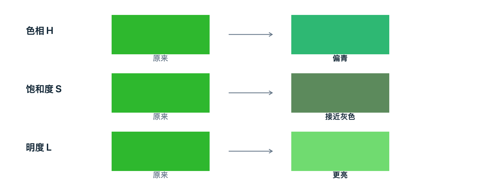

PhotoP 提供红、橙、黄、绿、青、蓝、紫、品红八组，照片里却有大量介于两组之间的颜色。如果硬划一条边界让左边全归黄色、右边全归绿色，一片原本渐变的叶子就可能被调出断层。这里让相邻两组共同影响中间的颜色，越接近绿色就越多地使用绿色组的调整，处在黄色和绿色正中间时各占一半。这样两组的影响就能平滑交接。

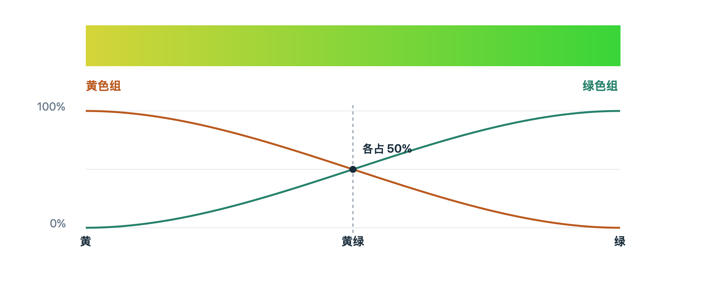

这个比例得按调整前的颜色确定。要是黄色刚被推向绿色又拿新颜色重新归组，相当于同一个像素调了两遍，多组一起用时结果就不好判断了。取色器也沿用调整前的颜色，点一下叶子只是帮用户找到对应组，具体怎么改还是由用户决定。这样再点同一片叶子时就不会突然跳到另一组。黑、灰、白几乎没有明确的色相，这几组就单独提供明暗调整。

不过选择性颜色依然是按颜色选的，同样的绿色出现在衣服和树叶上时两处都可能变化。想把范围限定在照片里的某个位置，还得用到后面的蒙版。

## 橡皮擦、画笔和马赛克

还有一种情况是颜色和构图都调得差不多了，画面里却留着一个灰尘点或者一小块杂物。为了这一下再换工具实在麻烦，橡皮擦也就补上了。这里的「擦掉」还得把空出来的地方补好，让天空接上天空、砖墙接上砖缝。

这里用了一个在设备上运行的修复模型，需要先准备待处理位置附近的照片和一张标明修复范围的黑白遮罩。用户涂过的地方在遮罩里画成白色，其余都是黑色。模型会参考周围内容填好白色区域，最后只把需要的局部放回照片。多取周围这一圈是为了让它知道砖缝往哪延续，光看那块要擦掉的杂物可判断不出来。

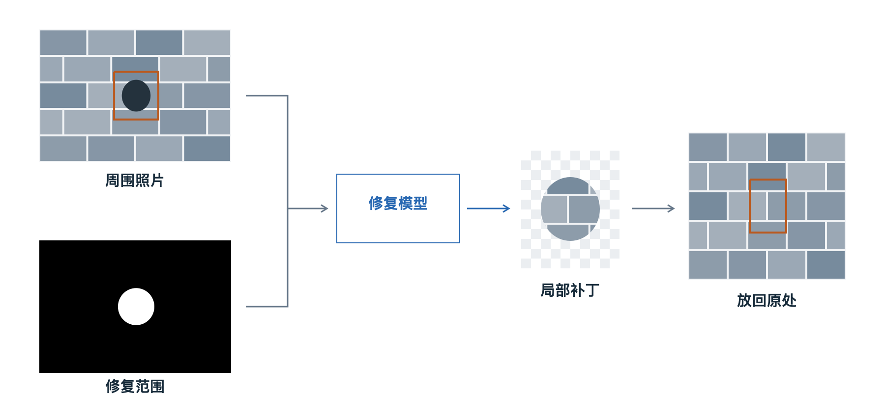

真正费事的是把用户涂的范围弄准确。画一个圈应该连里面一起选中，开口的 U 形却只能处理笔迹经过的地方。照片如果已经裁切或旋转过，手指的位置还得对应回原图；放大时也要跟着缩小笔刷覆盖的原图范围，才能修得更细。这些事情都得在送去修复之前处理好，先确定手势选中了哪些位置，后面才能交给模型补内容。

修好的局部会作为一块带透明区域的「补丁」保存，同时记下它在原图中的位置。撤销时移走、重做时放回就行，不用重新生成。补丁要先与原图合在一起再做后续调色，否则从已经调暖的画面里取一块修复结果，放回去又调暖一次，很容易露馅。大面积遮挡、重复纹理和复杂透视目前仍可能接得不好，毕竟模型只能补出看起来合理的内容，无法知道被遮住的地方原本是什么。

移动端还得控制体积和处理负担。上篇文章刚花了不少精力缩小 PhotoP，这次又加回来一个模型，当然还想尽量省一点。但尝试进一步压缩后发现砖墙出现了青蓝偏色，只能退回更稳妥的方案。包大小当然重要，但照片颜色都不对了，再小也没什么意义。

画笔和马赛克沿用了涂抹、定位、保存补丁的流程。画笔往选区里填指定颜色，马赛克把原来的细节变成较大的色块，两者都不需要经过修复模型。马赛克的格子还要对齐整张照片，不能每画一笔就重新起一套格子，否则两笔重叠的位置会错开。

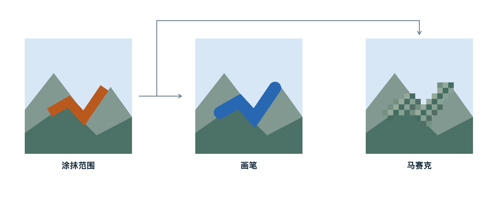

手机上的笔迹还得跟得住手指，所以先显示轻量的临时笔迹，松手后再生成最终结果。等新画面显示出来才移走临时笔迹，早了会闪一下，晚了又像重叠了两层。

## 蒙版

前面调色时一直留下了一个问题：只想调这片草地，怎么才能不碰天空？两处颜色和明暗都很接近时很难靠曲线与选择性颜色分开，得另外告诉工具在哪些位置使用这份调整，这就是蒙版要做的事。

做法是在照片之外准备一张位置对应的灰度图，白色表示完整使用调整后的颜色，黑色表示保留原来的颜色，灰色则按比例混合。比如一个灰色像素原来是 60，提亮后变成 120。如果蒙版在这里的覆盖率是 50%，最后就各取一半得到 90。负责提亮的仍然是调色功能，蒙版只决定这份效果能进来多少。

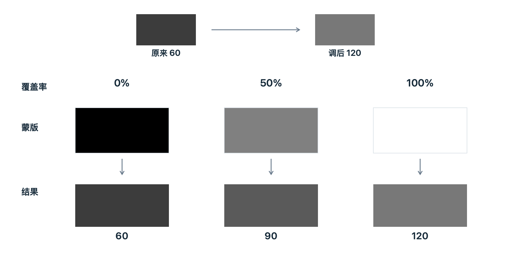

让边缘从白色慢慢变黑，调整效果也会逐渐减弱，这个过程就是羽化。线性渐变沿一个方向过渡，可以让地面的调整向上慢慢减弱；径向渐变从圆形或椭圆形区域向外过渡；画笔就直接涂出需要的范围。虽然画法不同，最后记录下来的都是每个位置接受多少调整。

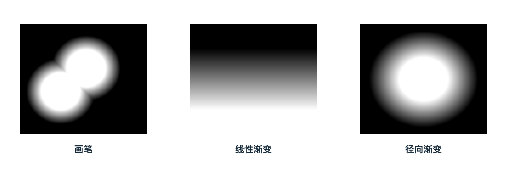

主体、人物、天空这些自动选区也会先生成一张灰度图，省去从头手画的过程。天空优先利用照片自带的选区信息，没有的话再进行设备内识别，漏选的地方还可以补涂。树枝与天空交接处要结合原图边缘留下过渡，简单切成黑白两块会让调色后的轮廓很不自然。目前人物选区会合并识别到的人物，暂时还不能逐个人挑选。

做天空时就碰到了一个挺有意思的问题，边缘的调整比预想中更重。开始很容易怀疑是识别结果不准，实际却是读取灰度图时发生了颜色转换。普通照片转换颜色是为了正常显示，但这张图里的灰色记录的是比例，50% 就得一直是 50%，不能跟着变亮。把原来的覆盖比例保留下来，再按照片方向对齐，边缘才按预期混合。看起来都是一张图，用来显示颜色和用来记录选区还真是两回事啊。

一张照片可以有多层蒙版，比如一层提亮草地、另一层压低天空。每层保存自己的范围和调色参数，再从下往上依次处理。上面一层接着下面的结果继续调，所以重叠区域会受到图层顺序的影响。蒙版里也能用曲线和选择性颜色，只是这些参数归当前图层所有，不会改掉全局面板里的设置。

功能组合起来后，PhotoP 的处理流程也跟着变长了。原图先叠加修复和涂画，再经过蒙版局部调整、风格滤镜、裁切和全局调色。预览与导出虽然使用不同尺寸的照片，也得按同样的顺序处理。保存工程时则把调整参数、蒙版和补丁一起留下，重新打开才能接着修。

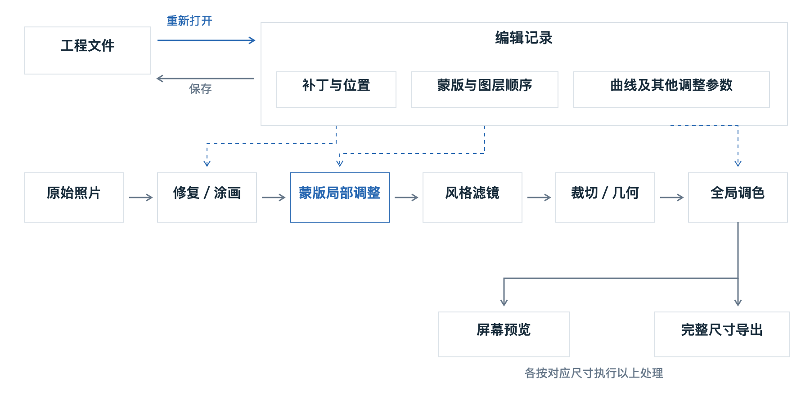

拖滑杆时如果每次都从头重算会很费劲，没变过的中间结果就可以先留着。比如正在调第三层时原图和下面两层都没变，直接从它们处理好的结果接着往下做就行，等选区或图层顺序改变后再更新相关部分。切走照片时还要丢弃旧照片没算完的修复和识别结果，不能因为它晚回来一步就盖到新照片上。功能多了以后，光是反复核对这些衔接就花了不少精力。

## 工具箱

工具箱放的是识别文字、视频转动图和拼长截图这类临时需求，拿到结果就结束了。如果还得先建工程再进编辑页找入口，光准备工作就够绕一圈，所以这些功能就单独放在首页。选完素材做一点调整就能保存，尽量少几步。

### 识别文本

识别文本相对简单，用的是系统提供的设备内识别能力。拍摄或选入照片后先摆正方向，再由用户框出需要的区域，必要时可以旋转。点击确认后才真正裁出这块内容送去识别，这样旁边一页、页码或者桌上的其他文字就不会混进来。整个过程都在本机完成，照片不用上传。

系统支持文档结构识别时就优先保留识别出的段落、列表和表格文字，没拿到结果再退回逐行识别。阅读顺序也直接沿用系统的结果，自己按文字行的高低重新排一遍反而可能把双栏内容左右穿插起来。最后将文字、日期和预览图存成一条本地记录就能查看和复制。没有识别出文字时则保留照片与选区，调整后再试一遍就行，全程不用进入修图工程。

### 视频转动图

这里提供 GIF 和 Live Photo 两种输出。做 GIF 时从选中的视频片段里依次取出画面，记下每帧停留多久后合成循环播放的文件，主要需要平衡尺寸、帧数和体积。Live Photo 还要多处理一套封装关系。

相册里看着是一张会动的照片，实际需要准备静止时显示的照片和播放时使用的短视频。PhotoP 会输出一张 JPEG 和一段 MOV，再写入配对信息告诉系统这两份内容属于同一个 Live Photo。把媒体和这些说明组织到一起就是这里说的「封装」，光把两个文件改成同名可不行。

用户先选好视频片段和封面帧，比如截取原视频的第 5～8 秒，封面选在第 6.2 秒。接着取出这一帧生成 JPEG，并将选中的 3 秒画面重新生成一段 MOV。如果原片有声音，对应区间的声音也要一起带上。新视频从 0 秒开始计时，封面在里面的位置就变成了第 1.2 秒，不能继续沿用原来的第 6.2 秒。

接着生成一个配对编号并分别写进照片和视频的附加信息里，系统就能通过这个不显示在画面上的编号找到彼此。视频中还要在第 1.2 秒写入封面时间标记，指出静态照片对应的时刻。编号管「谁和谁是一对」，时间标记管「封面在什么时候」，这两份信息都得写好。

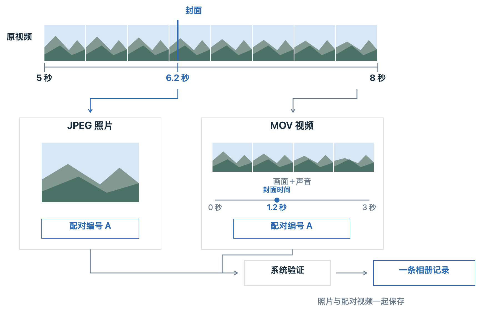

两份文件生成后先交给系统尝试读成 Live Photo，确认可以配对再作为同一条相册记录保存。于是相册里最终只显示一个项目，静止时看照片，播放时看视频。封面的方向、裁切和所选时间也要一路保持一致，否则用户明明选好了表情，保存下来却变成另一张脸，那这功能可就帮倒忙了。

### 长截图

长截图这个东西还挺有意思。连续滚动截屏后我们一眼就能看出哪些内容重复了，交给程序却得先把判断依据说清楚。假设上图是 A、B、C、D、E，下图是 D、E、F、G、H，找到共同的 D、E 就能拼出完整内容。但页面里的导航栏也可能完全相同，再混进大片空白、重复卡片和悬浮按钮，光凭「长得像」可就不好办了。

处理时先按用户选择的顺序摆正照片方向，再将图片等比例缩到统一宽度，避免同一段文字在两张图里大小不同。接着另外准备一份用于比对的灰度副本，只压窄横向并保留纵向的每一行。宽截图就这样变成了一条记录明暗分布的窄图，比较起来省了很多计算量，还能把每一行的位置对应回去。最后拼接仍然使用彩色图片。

找重叠时先把每一行分成几段并记下各段的明暗分布，再让两张窄图沿上下方向错开比较。比如上图第 800 行与下图第 300 行很像，相差的 500 行就是一个可能的滚动位移。如果前后连续一段也能对应，就值得进一步逐行核对。先用简化的信息找到候选区域，再花力气仔细检查这一段，能省去大量没有意义的比较。

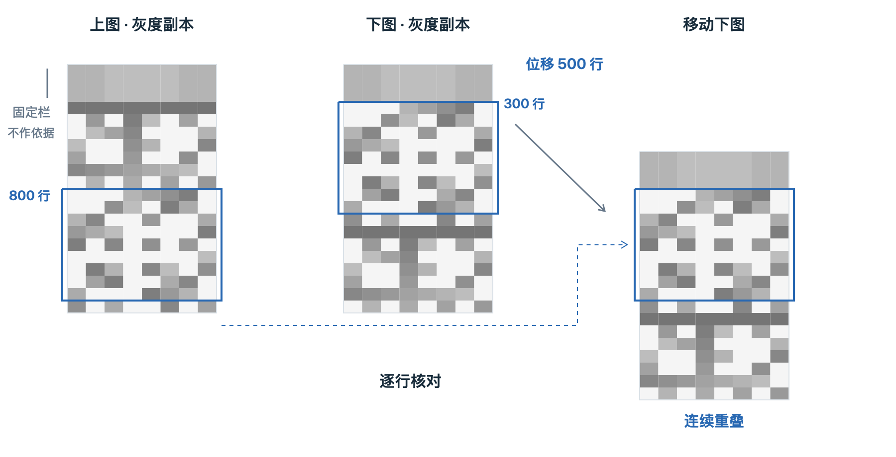

找到了相似区域也不能马上裁图。在两张图的相同位置一直不动的内容很可能是固定导航栏，不能用来证明正文发生了重叠。大片白色虽然行行都相同，却没法判断具体对应哪一段；重复卡片更麻烦，可能换几个位移都对得上。这种时候随便挑一个位置就可能让中间少掉整张卡片，所以这些看似匹配的结果都得排除。少量压缩差异和文字边缘变化可以留一点容差，但仍然要找到一段有内容、连续对应的区域。

确认重复范围后才能在里面选接缝。沿用前面的例子，让上图保留到 D、下图从 E 接上，D 和 E 就都只出现一次。这样既能裁掉上下两边多余的重复内容，也能去掉夹在中间的固定栏。第一张图的顶部和最后一张图的底部则完整保留，整个过程不用假设所有 app 的导航栏都一样高，也不要求两次截图里的时钟完全相同。

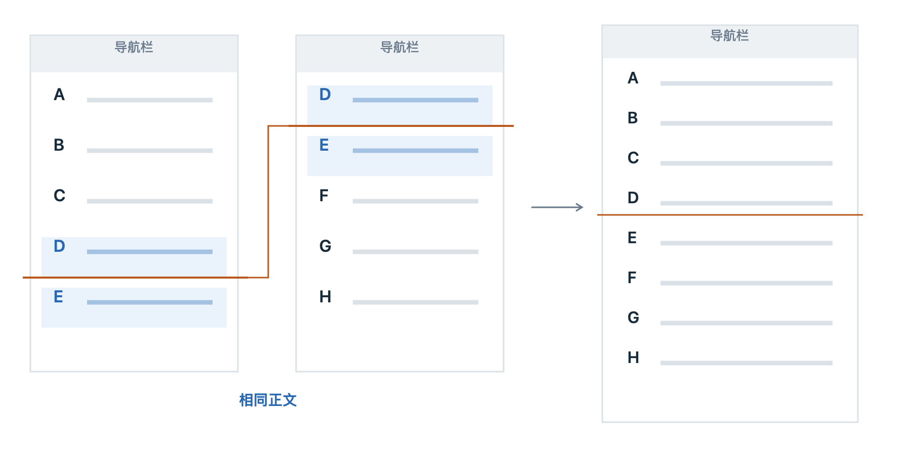

多张截图按相邻两张依次处理，但中间那张会同时受前后两条接缝影响。上边裁到哪里、下边裁到哪里得一起检查，两条边界不能越过彼此。如果没有可靠重叠或者裁完已经不剩有效内容，就保留完整图片并把接缝留给用户确认。宁愿多留一段也不能让自动拼接悄悄删掉正文。

手动调整时固定黄线，让用户分别拖动上下两张图，被藏起来的部分也能重新拉回来。确认后记下两边各自的裁切位置，导出时按这些位置逐张拼到长画布上就得到了 PNG。图片副本放在磁盘里，匹配时一次处理相邻两张，生成前再检查整张长图的像素数量，避免导入几十张截图后把所有大图一口气塞进内存。

### 拼图

这次的拼图主要想做 Live Photo。静态照片排成几格只需要合成一张画面，换成多张 Live Photo 后每个格子都在动，时长、尺寸和声音还各不相同。最后要把这些内容重新变成一份能存进相册的 Live Photo，实际做的就是多路视频合成。这次终于碰到老本行了。

这部分用上了我之前在剪映工作期间积累的方案，后来做 [Movinn 的多动图分享](https://pjhubs.com/2026/07/12/movinn_0/)时已经用过一次，可以把多张动图叠加运动数据后合并导出。所以这次做 PhotoP 拼图时就继续沿用共同时间轴、逐帧合成和统一导出的思路，把原来的运动数据画面换成可调整的拼图布局。

导入时要同时保留每张 Live Photo 的静态照片和配对视频，光拿到相册显示的封面可没东西能播。等用户选好模板并调整每格的位置和裁切后，先用各自的静态照片合成封面，再用同一套布局处理视频。圆角、间距、背景颜色和照片缩放都要两边共用，不能静止时排得好好的，动起来却换了样子。

视频合成从一条共同的时间轴开始。假设 A 有 3 秒、B 有 1 秒、C 是普通照片，输出走到第 0.5 秒时就分别取出 A、B 在第 0.5 秒附近的画面，与 C 一起画进各自的格子，得到一张完整画面。下一个时刻继续这么处理，再把这些画面连成新视频。这样输出的每一帧都已经是拼好的整张图，相册只需要播放这一份视频。

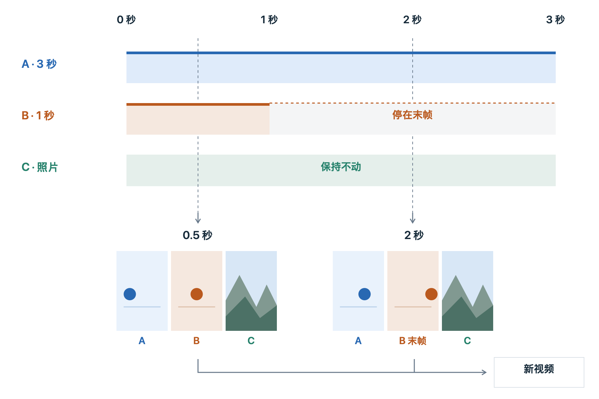

走到第 2 秒时 B 已经播完了，A 却还在继续。这里沿用 Movinn 里短素材停末帧的处理，让 B 保持最后一帧、C 始终不动。直接循环 B 会突然跳回开头，强行拉长 B 又会改变动作速度，停在末帧更合适。编辑页预览也要等各路视频准备好后按同一时钟启动，不能谁先加载好谁先播，否则预览和最终合成的节奏就对不上了。

多条声音同样按这条时间轴对齐，只在各自有效的时间里参与混合，并降低每条的音量以免叠起来太响。B 的画面停在末帧后声音也就结束了，不会接着循环。合成视频完成后再与刚才拼好的静态封面配对，沿用前面讲过的编号、时间标记和系统校验流程，就能得到一份可以保存到相册的新 Live Photo。

最多九张素材一起处理时还得管好解码负担。一张照片只占画布的一小格，就按这一格实际显示和缩放所需的尺寸准备画面，没必要一直拿着九份原尺寸图。导出也按时间逐帧处理，播完的短素材复用末帧，普通照片则一直用同一张图，别把整段视频的所有帧都堆在内存里。

几个工具的保存体验也顺手统一了一遍。相册真正保存完成后才提示成功，失败则保留当前编辑内容。目前都可以先预览，复制识别文字和导出图片、动图需要 Pro。关闭付费页面后还能接着刚才的编辑，不用从头再来一遍。

## 跋

薄桑问为什么要做这么个修图产品，我也顺着回忆了一波。22 年开始做 PhotoP 时只是想试试 SwiftUI 能不能做出一个 macOS 生产力工具，后来买了 Vision Pro 又想让照片编辑能在空间里进行，再到现在真的拿它接自己的修图流程，需求才一点点长成了今天这样。如果一开始就要想好所有专业工具怎么做，大概率四年后我还在想。

之前一直在想 PhotoP 到底该不该往专业化走，现在反而觉得可以先把眼前的事情做好。表弟修旅行照片时想单独调一种颜色，这就是一个已经摆在面前的需求，旅途中收到的订阅也说明现有功能有人愿意付费。至少先让自己的修图流程跑通，不用为了调个颜色、擦块杂物就切到另一个 app，后面再根据实际使用往下做。

平时用曲线和蒙版修图，知道怎么调能得到想要的效果就够了，这次自己做才得把每一步为什么这么处理弄清楚。一个控制点怎么改变整张照片、蒙版边缘为什么会调重，这些问题不解决就没法往下做。挺喜欢这种边做边学的过程，学完马上就能用到照片上，哪里理解错了也藏不住。接下来就继续拿 PhotoP 修照片吧，还会遇到什么问题，用起来就知道了。
