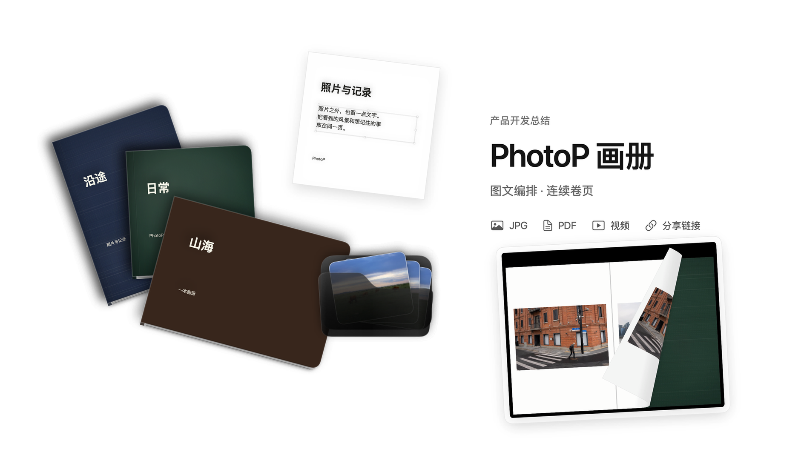

八月的[产品总结](https://pjhubs.com/2026/08/12/product_1/)里提过，想给 PhotoP 做画册。现在这块终于做出来了，照片可以编排，文字可以独立编辑，首页书架上也能摆上了一本本画册。编辑完以后，可以导出图片、PDF 和翻页视频，或者发布成一个网页链接，让朋友直接打开浏览。

书本的外观沿用了八年前开源项目 Peek 里的小册设计，里面装的东西从课本知识换成了照片。但一本摄影画册还有另一套问题：照片怎样放在一起，文字怎样留在书页里，屏幕上的书怎样变成文件，发布到公网上维护成本是多少等等问题，这次就顺着做画册的过程展开讲讲。

## 序

我看了很多摄影书和画册，也一直想把从里面吸收到的东西放进 PhotoP。看多了以后，开始留意照片前后怎么接，左右两页同时出现时会不会抢，哪里留白，哪一页应该停下来读一段话。一张照片修好了，放进一组照片里又得重新看，这件事其实还没有结束。

之前做照片评分时也说过，有些照片单独拿出来可能不够吸引人，放进一组照片里却有了用处。比如整理一次散步拍的照片，街景先交代环境，再接一家路边的小店，后面是店门口的人。三张未必都能单独发出去，按照这个顺序放在一起，却能让人跟着走一小段路。顺序换一下，或者把其中一张缩小一点，读起来又会有变化。

我想把这些编排上的体会放进工具里：书页能重排，照片能调整大小和位置，文字能独立放置，方便反复试一组照片的关系。这轮先做自己选、自己排。哪一张该留下，哪两张值得放在一起，还是得翻着看，不能只拿单张照片的分数决定。画册和图像编辑是首页上并列的两个业务入口，小工具继续保留各自的任务。画册管理书页、书本阅读和作品输出，照片渲染、局部处理和自动增强接已有能力；这次做出的文字绘制又反过来接进了普通照片导出。共用的是底下的处理能力，修图工程、画册文档和编辑历史仍然分别管理。

不得不说在果子的六大 OS 中，SwiftUI 真的能省好多事，首先解决的是上下文理解的心智成本，作为一名开发者你只需要学习一次就可以处处开发。我并不认为「只写一次，处处运行」这种效果更好，因为每一个 OS 的独特性都不同，妄想用一套代码适配所有 OS 这是程序员的浪漫。其次还能帮你统一设计模式，只要设计好一套数据流转方式，所有平台都可以复用基座 Model，基本上做到了数据层跨平台。

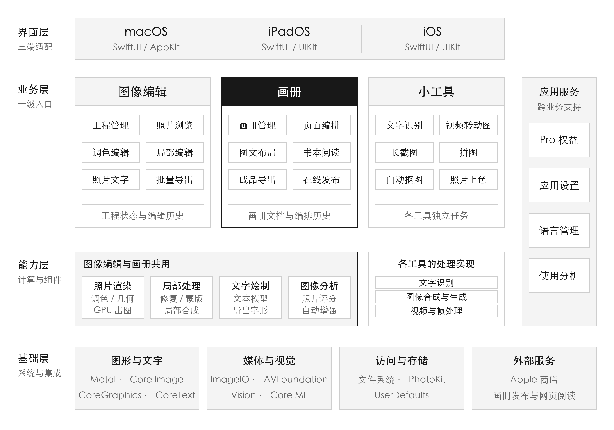

## 画册编排

### 照片编排与编辑

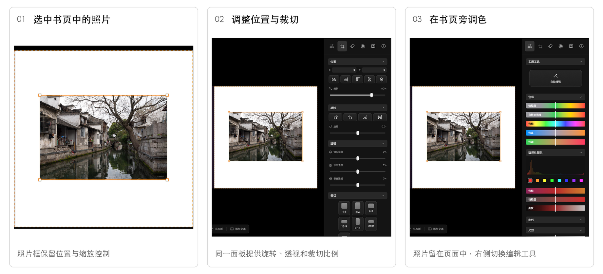

选好纸张后，导入默认一张照片生成一页，Mac 的文件夹导入按文件名自然排序，页序可以在左侧拖动，页面里选中照片，再摆放、裁切或直接打开旁边的编辑工具。照片框控制它在纸上占哪一块，裁切控制照片内部保留哪一块。调色、修复和蒙版留在书页旁边，可以看着左右两页一起改；原片信息与拍摄地点也能就近查阅。

素材复制到画册自己的资料库，调整记录属于页面里的照片对象。同一张素材放到两页，可以各自裁切和调色。局部修复与蒙版、几何变化、调色仍沿用单张修图的处理顺序，预览、翻页和导出共用，书页只负责最后的位置与大小。

### 文字编辑

只有照片还不够。封面需要名字，中间可能有一段序言，有时只是想在角落写一个日期，也有些页需要把照片和一段话放在一起。照片下面的一行说明能解决一部分，整本画册的文字却不能都挤在这里。

文字做成独立文本框，内容、字体、字号、颜色、对齐和位置分别保存。它可以压在照片上，也可以待在空白处，关闭画册以后还能继续改。编辑时先留下文字和样式，到输出页面时再合成，改一句话不用连照片一起重新做。「居中」有两种。文字可以在框里居中，整个框也可以放到页面中间，四字标题在框里居中了，框本身却可能还偏在左侧。文字提供水平和垂直对齐，文本框另有贴边及水平、垂直居中的位置操作，框放在哪和字怎样排各管各的。
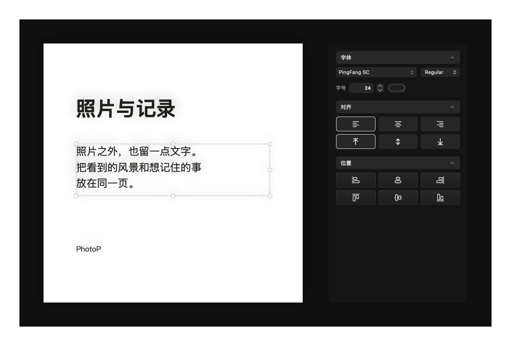

字体也没有只保存一个家族名。一个字体家族可能同时提供常规、粗体、斜体或不同字重，真正决定这些字长什么样的是具体字型。面板先选家族，再选它实际提供的字型，Mac 把鼠标停在选项上时，书页里也能直接看变化，用过剪映的小伙伴都很熟悉这套操作了，咱也就对齐下国际大厂。

当前一个框共用一种样式，标题和正文可以放两个框。同一段里单独加粗几个字、文字太长后自动流到下一页，这两件事还没有做。摄影画册要把标题、短句和段落放稳，已经会遇到不少细节，先把这一层做好，再决定是不是继续往完整的文字排版软件走。输入文字时用了系统原生的控件，光标、选词、复制粘贴和中文输入法还是平时那套习惯。但控件本身不能反过来决定画册怎样保存，因为编辑结束后，书页还要自己画一次文字，导出时又没有这个正在输入的控件。

拼音还没选定汉字时，输入法正在维护一段临时文字。页面这时重新设置整段内容，就会把输入打断。原生控件更新内容要避开组字阶段，样式没有变化也不重新设置，外面刷新了一次，正在写的中文还得接着写。新框固定得太小也不方便，没写几个字就被裁住，得停下来拉框，再回来接着写。现在按文字需要的大小生成框，继续输入时往右扩，到内容区右边缘后换行增高，快碰到页面底边时往上让一点。内容和新尺寸一起更新，导出读到的也是扩展后的高度。

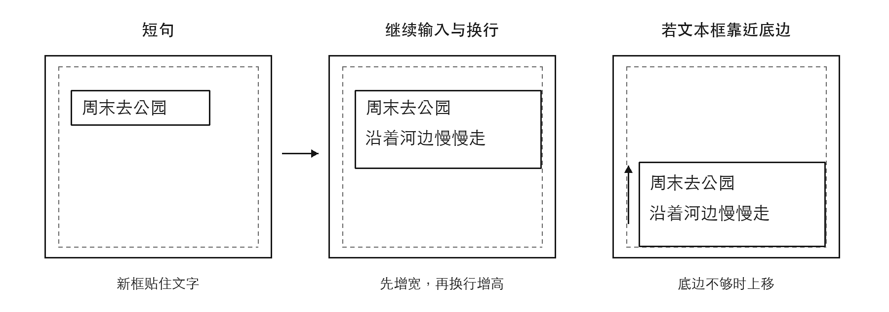

末尾回车没有多出可见的字，光标却已经需要下一行。只测量有字的范围，光标就会待在框外。测量时补一个不显示的零宽占位，让这条空行也参与高度计算，下一行的位置先准备好。另一个问题更隐蔽，本来放得下的文字，连续输入时位置也在偷偷变。原先用旧高度和新高度重新算纵坐标，哪怕高度没变，也经过一次浮点运算，保存的位置可能多出一点偏差。后来改成高度不变就保留原坐标，确实需要增高、而且接近底边时才上移。扩框可以，已经摆好的位置别跟着跑。

删字则保留已经安排好的范围。写一段、删几个字，框宽和换行跟着收缩，照片与段落的关系会反复改变。手动拉框按手动尺寸走，继续输入放不下了仍然可以扩，删除时不再自动缩回去。

不过一直显示完整排版范围，短标题又会被一大片空白框包住，拖起来不直观。所以选中的边框贴近实际字迹，文字真正用来换行和对齐的范围另外保留。开始拉手柄时，先根据现有行宽、排版高度和对齐位置确定调整的起点，不能拿紧贴字迹的选择框直接替换过去，否则刚碰一下，行宽和对齐位置先跳了。接住以后，用户继续改变宽度，再正常重新换行。

### 文字排版与图文合成

同一段话结束编辑后要显示在书页里，缩成首页图标要显示一次，翻页时要贴在纸上，导出高分辨率图片或 PDF 又要显示一次。各自排一遍，看起来都有字，位置却未必一样。

照片和文本框的位置按页面内容区的比例记录，文字框的纵坐标从底边开始。比如宽度占 80%、高度占 50%，离左边 10%、底边 35%，显示在屏幕上时，距顶就是 `1−35%−50%=15%`。换窗口或者导出倍率，仍然用这四个比例还原位置。内页照片有页边，封面照片可以铺到封面板的边缘，文字仍然保留内容区。主动把方版改成横版，内容区本身变了，版式也需要再看一遍，比例并不能替人重新选一套布局。

拿 A4 走完一次换算。当前 300 DPI 的页面是 2480 × 3508 像素，转成印刷磅值就是 `像素 ÷ 300 × 72`，约 595.2 × 841.92 磅。默认内容区左右各留 5.5%，上留 5.5%、下留 7%。前面这个文本框落到纸上，距左约 85.71 磅、距顶 156.81 磅，宽 423.78 磅、高 368.34 磅。PDF 的画布从左下角向上数，框的底起点要算成 `841.92−156.81−368.34=316.77` 磅。只把距顶翻过去，忘记减框高，整段文字就会落错地方。选中、拖动、输入和绘制都用这份换算，标题的字迹和真正能点中的区域才能待在一起。

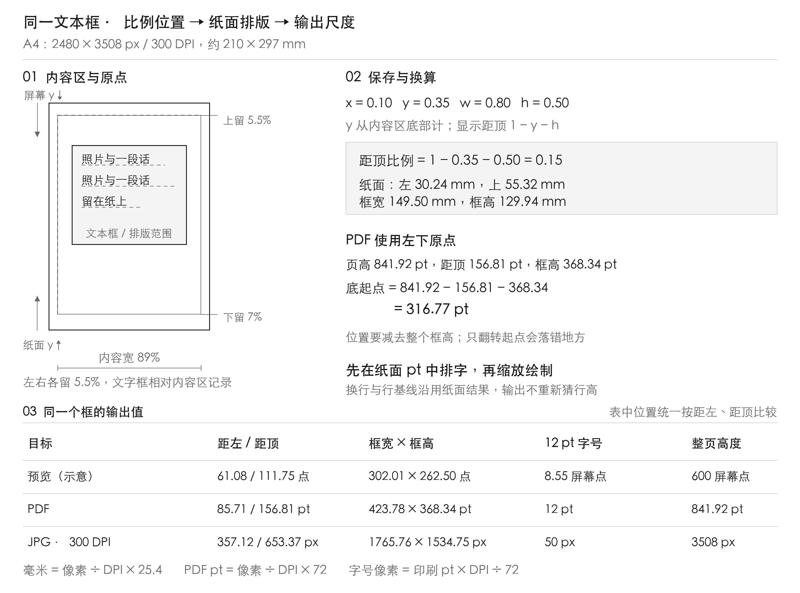

字号也用印刷磅值保存。72 磅是一英寸，DPI 是一英寸安排多少个像素，12 磅在 144 DPI 下对应 24 像素，在 288 DPI 下对应 48 像素。上面这张 A4 输出 300 DPI JPG 时，字号对应 50 像素；预览整页只有 600 个屏幕点高，就按 `600÷841.92` 缩放，显示字号约 8.55 个屏幕点。文件和屏幕上的数值不同，回到纸面都是同一份 12 磅字号。

只把字号乘大还真不够。这次遇到过屏幕里已经对齐，换成高 DPI 文件，文字的基线又偏开的问题。预览用屏幕点、图片用像素、PDF 用印刷点各排一次，每一行各自算行高、各自取整。小差异累积到后面几行，原来的对齐就变了。

后来把排版固定在纸张自己的尺寸上。按印刷磅值确定字形、换行、每行起点和对齐，再整体缩放到预览或图片。系统的 CoreText 负责把字符串变成绘制用的字形，计算每个字的位置；画册的静态预览、缩略图、翻页和文件输出沿用这套纸面排版，选中文字的范围也从真正画出来的字迹里取。原生输入控件保留输入法和光标，结束编辑后再交回这套绘制。

垂直对齐还得看完整文字。手动把框拉小以后，一段话可能装不下，应该先知道整段有多高，再决定它贴顶、居中还是贴底，最后沿文本框边缘裁掉超出的部分。比如完整排版路径高 180 磅，文本框只有 120 磅，居中的偏移就是 `(120−180)÷2=−30` 磅，排版范围上下各超出 30 磅，再按框裁剪。如果先拿 120 磅限制排版，末尾几行根本没排出来，「整段居中」就变成「前面几行居中」，导出和屏幕会再次分开。

字体跨设备也会出现类似问题。Mac 上有的具体字型，另一台设备未必安装，系统有时还会悄悄返回一个替代字体。读取时要核对真正拿到的字型，找不到就让输入、静态绘制和导出共同退回系统字体。替代后版式仍然需要检查，但不能一边用替代字体，另一边继续按原字体计算，连这一页到底怎样换行都说不清。

照片和文字到绘制整页时才合在一起。先铺背景，封面准备底色与材质，随后按顺序处理照片、放进各自的框，每张照片之后画它的说明，最后叠独立文本框。只有序言、放满照片、文字压在照片上方，差别都留在页面内容里。JPG 把整页合成像素，PDF 把照片作为图像嵌入、文字继续按字形绘制，位置和换行共用前面的纸面计算。

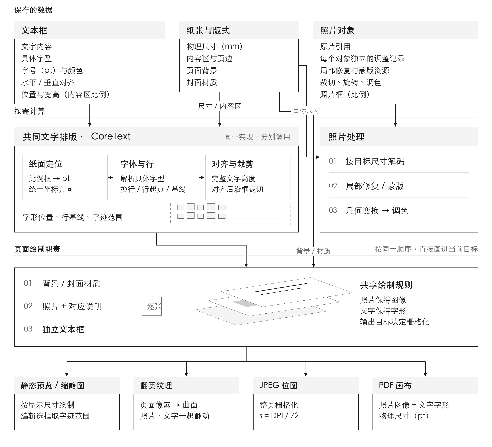

## 书架与装帧

### Peek 的小册设计

2018 年开源的 [Peek](https://github.com/windstormeye/Peek)，当时产品叫 PLook，做的是拍下课本里用荧光笔标出的内容，识别后整理成卡片，再归档到自己的小册里。首页就把这些小册做成了一本本书的样子，当时还冲到了 GitHub 的 Objective-C 语言榜第四。PhotoP 沿用的就是那套小册的感觉。当年整理课本知识，现在整理照片；摄影画册给了内容和编排上的参考，Peek 留下了首页那几本书怎样摆出来的想法。两部分到现在接在一起。

[README](https://github.com/windstormeye/Peek/blob/master/README.md) 里还保留着当年的界面。左边是「我的小册」首页，自定义封面之外，还画了书脊、纸边和投影；右边是把识别后的照片卡片拖进小册归档。那时已经在用一本书承接一组内容，现在 PhotoP 接着把照片放进去。

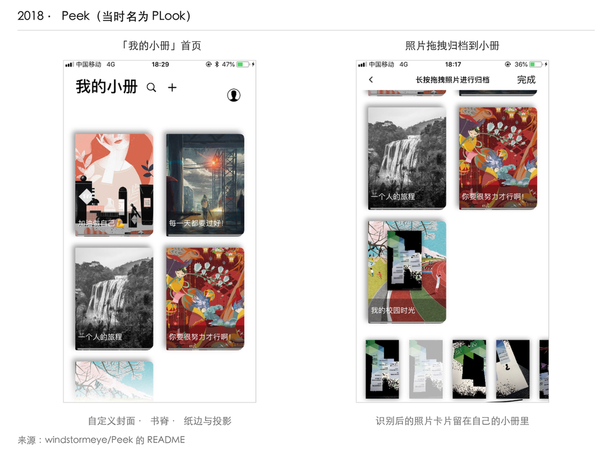

2018 年的开发总结里还记着这件事。当时为了首页的书本效果，参考过不少文艺风格的 App，最后「平行世界」里那几本书比较接近想要的样子，尤其是可以自定义封面，做出来仍然像一本真正的书。自己反复改了几版，第一版已经有封面和轮廓，横看竖看还是觉得不对。后来还拿了几本实体书摆在桌上对照，那篇文章里甚至记着关灯睡觉、醒来继续看的过程。台灯打在书上以后，才发现少的是阴影带出来的层次。封面画出来了，书却还没有真正站在这个空间里。八年后继续做这些细节，工具和屏幕都换了，封面、纸边和光怎样接起来，仍然得重新看。

首页原来主要是工程文件夹，画册进来以后，入口也要跟着变。封面排列和书脊排列都保留，横版、方版、竖版按自己的纸张比例摆，不把所有封面拉成同一个长方形。几本书放在一起时，至少还能看出它们是不同尺寸、不同厚度的作品。工程文件夹也顺着改了一遍。文件夹里露出工程的前几张照片，最多三张，鼠标移过去稍微散开，看一眼就知道里面大概是什么。图标使用提前生成、最长边不超过 480 像素的小图，不为了首页这几张叠在一起的照片去解码相机原片。没有照片就保留文件夹本身，某一张缩略图没准备好也不能把入口变成空白。

大概是从两个月前发布「照片评分」后开始做的 PhotoP 画册，那会断断续续的做着，越来越多的人都在做模板书本风格的产品，甚至还看到了两个产品做的就是摄影画册功能，当时我心确实有点慌，但更多的是开心。慌的是其他人做的咋这么快，开心的是看到他们帖子下的评论区好多人求下载，也算是找到了一个相对蓝海的地方。

### 书本结构与封面材质

给封面贴一张图，再加一个投影，很容易先做出一张好看的卡片。但侧过来以后，只有最上面那张图跟着转，底下几条纸边还留在原地，马上就不像书了。现在先把封面板、封底、书脊和纸页边缘分开，再放回同一个书本坐标里。整册厚度是 T，前后封面放在 `z=±T/2`，书脊位于左侧 `x=0`，连起前后的两个面。纸页夹在中间，比封面向里收一点，顶边和右边才会露出封面板伸出的部分。

转动一本书时，各个顶点经过同一组旋转、前后位移和透视投影。书脊与封面共有的那个角，输入坐标相同，最后的屏幕坐标也必须相同；分别给几个平面加看着差不多的倾斜，正面可能还行，一抽出来，接缝就分开了。纸页边缘也跟着整册转，侧过来仍然夹在两块板之间。

页数参与的是书架上的视觉厚度，不是印刷厂的纸张克重。每两个内容页先按一张纸估算，当前每张给厚度增加 0.16 个 Mac 屏幕点，加上基础厚度，再限制到 26 点以内。三个内页约 12.32 点，48 页约 15.84 点。两块封面板厚度各约 1.2 点，纸页在厚度方向两侧各留约 1.8 点，沿页宽左右各内收 3 点。各个面都读取同一份 T，增加页面以后，书脊和纸边一起变厚。

形状搭起来以后才轮到材质。绒面用细颗粒和短笔触，织物安排交错的经纬线，布面保留疏密、粗细不均的纤维，硬壳加颗粒和压进去的边框，光滑面主要靠表面的反光。下面三张同样是暗红底色，换成布纹、绒面和硬壳以后，差别就来自纹理与压线本身。

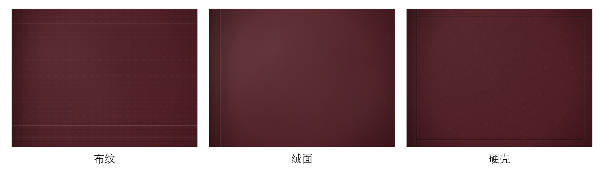

封面既能换颜色，还会从首页小图标变成一张高分辨率的整页。如果用预制布纹位图，就得处理颜色变体、图片自身的尺度和放大后的细节。这次按规则生成纤维和颗粒，材料的笔触要自己组织，但能直接按纸面尺寸绘制，也不用给每种颜色准备一整套图片。

织物可以看得具体一点。经线和纬线都按 1.1 印刷磅的间距排列，线宽 0.5 磅，每根线由 1.1 磅的短段和同样长的空隙组成。相邻竖线的起点错开 1.1 磅，横线再用相反的错位，交点附近就会轮流出现一根在上、另一根在下的观感。只画连续的横竖线，得到的更像网格纸。

同一个间距在 144 DPI 下是 2.2 像素，288 DPI 下是 4.4 像素。经纬先在印刷磅里排好，再一起缩放，分辨率翻倍，布纹在纸上的疏密并没有改变。首页小图上看不见的细节就不继续画，否则一个两百来像素的封面也安排几十万根纤维，生成时忙了半天，缩小以后全部混成一个颜色。

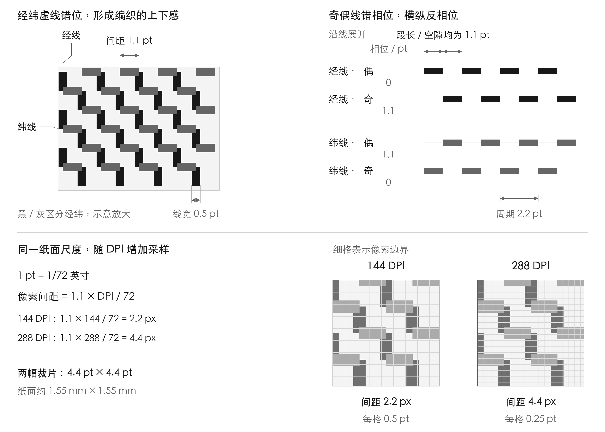

随机性同样不能每次重新来。颗粒和纤维需要一点不规则才像材料，但如果打开画册、翻一次页或者刷新首页，颗粒就换一组位置，看起来会像封面一直在闪。随机结果由材质与颜色固定下来，默认的材质选择也和这本画册固定关联，关闭再打开还是同一本的样子。前封面靠左侧书脊有一道装订槽，附近的阴影向外渐淡，上切边略亮，下切边略暗；封底把装订方向换到另一边。材质、照片和文字依次绘制，装订与受光留在封面材料上，照片自己的颜色继续保留。

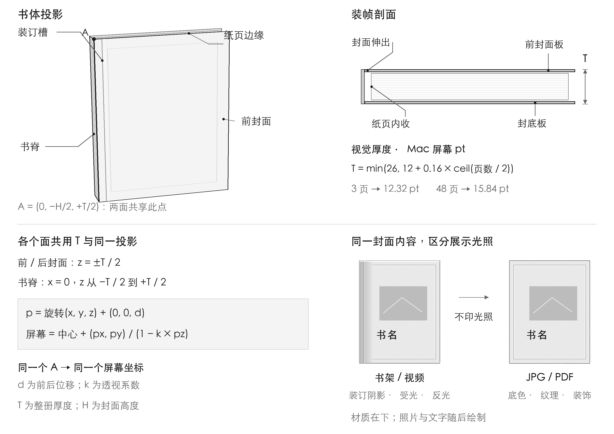

纹理缓存也不能只按张数控制。首页一个小封面和编辑器里一张整页封面，都是「一张」，实际像素数可能差很多。现在按像素预算保留最近使用的结果，尺寸相近的请求先归到同一档，避免窗口拉宽一点就重新生成一张几乎一样的纹理。普通预算大约相当于 64MB 的四通道像素，单张超大结果仍可能暂时留下，这只是缓存选择，不能当成整个 App 的内存上限。

不过有缓存以后，翻页结束还是出现过一两帧纯底色。原因不在重新生成得慢，而是翻完以后，封面在书里的角色变了，对应视图重新建立，本地还没有纹理。异步任务随后拿到缓存已经很快，但在它回来之前，屏幕仍然先画了空的底色。后来先同步读取缓存，命中就直接拿来画，确实没有才异步生成。同步命中也得更新最近使用顺序，否则纹理一直显示在屏幕上，缓存却以为它最久没用，滚一会儿书架又先把它清掉。

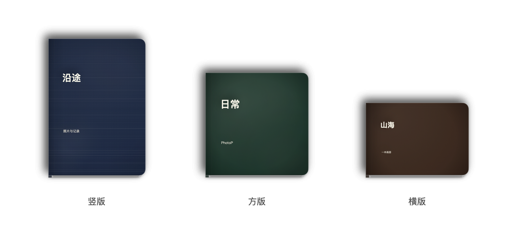

Mac 鼠标移过去时，书从原来的位置抽出来一点，露出封面，封面、书脊和纸页一起移动、转动。原来的排列位置和点击区域仍然留着，旁边的书不用重新排队，不然人已经把鼠标放到这本书上，动画一动，入口又滑到别处了。首页封面也从真正保存的照片、文字和材质生成，改了封面以后，书架上的这一册跟着更新。书脊的书名取封面里字号最大的非空文字，资料库里的名字另外保存。重命名文件是整理工程，修改封面标题是编排内容，两件事分开，才不会为了找文件把已经排好的标题顺手改掉。

### 页序与连续卷页

打开这本书之前，要先确定封面和内页的关系。动画每一帧用哪几面，得从装订后的页序里取。打开封面以后，左边应该是封面的内侧，第一内页在右边。再翻过去，第二页和第三页才同时出现。如果只有三个内页，装订上还需要补一面空白，随后才能到封底。只把内容页每次加一，左右位置很快就会错，最后也不知道封底该接在哪里。

阅读顺序包含封面、内封、内页、必要的补白、内封底和封底，整本外侧也留出闭合时的位置。每次展开左右是什么、哪一面在下面、哪一面正在翻，都由这份页序确定。下面用三个内页来看，阅读里会出现内封和补白，JPG、PDF 则只导出封面、三个内容页和封底，装订用的补白不额外生成文件。

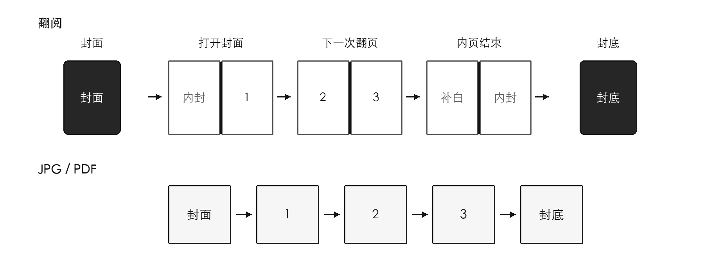

页序确定以后，就要让纸张跟着手势连续翻过去，这部分在 Mac 上又麻烦一些。iOS 和 iPadOS 的 UIKit 有现成的 [UIPageViewController](https://developer.apple.com/documentation/uikit/uipageviewcontroller/transitionstyle-swift.enum/pagecurl)，选用 `pageCurl` 就能提供纸张卷起的效果，滑动时动画也会跟着手指走。PhotoP 的 macOS 版走的是原生 Mac 界面，[AppKit 的页面控制器](https://developer.apple.com/documentation/appkit/nspagecontroller/transitionstyle-swift.enum)没有对应的纸张卷页效果，最后这部分还是自己写了。

要补的也不只是一段自动播放的动画。按下以后，纸张要跟着滑动连续变化，松手时要决定继续翻完还是回弹，过程中还得安排正面、背面和底下露出的页，翻完才能切换阅读位置。纸张弯曲、光照、阴影和这些交互都得自己接起来，比调用一个现成的翻页控制器费事得多。先把这一张纸有哪些面、每个阶段该画什么理清楚，后面的动画才有东西可以接。

真正翻一张纸时，同时参与的不止两张图。原来的左页不动，当前右页卷起来，下面露出下一张右页，卷起纸张的背面最后落到左边。需要准备的是固定左页、正在翻的正面、同一张纸的背面和底下的新右页，背面从实际页序里取，不能把正面镜像一下就用上。读者刚才还在看一张照片，翻到一半背面又出现反着的同一张，正反面的关系就露馅了。

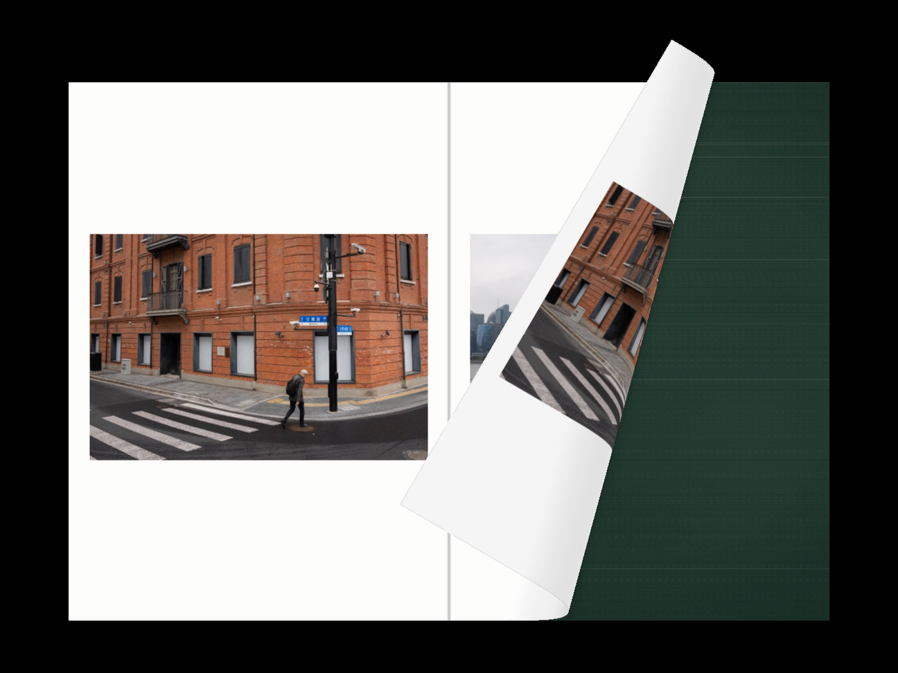

上面是实际导出视频中的一帧。卷起的背面有它自己的照片，底下开始露出布面封底内侧，左边仍然保留原来的页面。继续翻过去，背面逐渐展开到左侧，底下那一面会露得更多。Mac 的连续卷页使用 Metal，在 GPU 上逐个计算输出像素应该取哪一页、哪一个位置的颜色。先由翻页进度求纸角位置：纸角沿固定轨迹向左走，中间抬起一点，起始纸角与当前轨迹点确定卷起方向，卷起半径再受页宽、位移和书脊余量限制。拖动只改变进度，点击自动翻页和视频也能走同一条轨迹。

纸弯起来的部分可以看成一段圆柱。对输出像素 X，沿卷起起始线的法线方向量出距离 d；落在卷起范围 `0≤d≤r` 时，`d/r` 就是圆柱截面的正弦值。正面候选的角度为 `asin(d/r)`，背面候选为 `π−asin(d/r)`。同一个画面位置会对应两个纸面位置，得先知道是哪一面盖在上方。

图里用一张 500 × 700 屏幕点的纸，翻到一半，半径 r 为 72.5 点。取 `d=r/2=36.25` 点，正面与背面候选分别是 30°、150°。角度换成弧度，再乘半径，得到展平纸面上的距离约 37.96 点和 189.80 点。画面已经走了 36.25 点，回查原页时，沿法线补上两者的差：正面移约 1.71 点，背面移约 153.55 点，折线切向的位置不变。

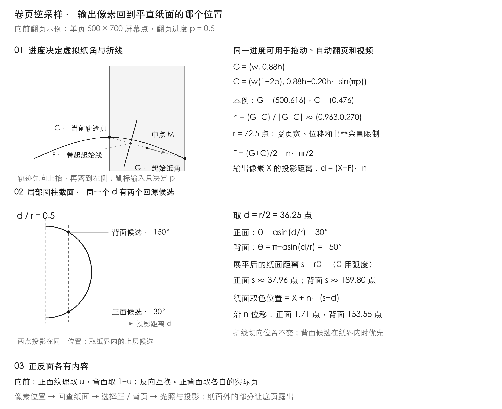

背面候选在纸界内时先取背面，超出纸界再检查正面，都不属于这张纸就让底页露出来。向前翻页时，背面的横向位置要翻转，反向时则交换正背面的横向映射。显示的内容始终来自页序里这张纸实际背面的独立纹理，位置翻转和内容来源是两回事，不能把正在看的正面照片反过来冒充背面。

角度也提供了曲面朝向，卷起的正背面各自参与光照，下方页面接到投影。快翻完时半径收小，高光和阴影跟着淡掉，否则纸已经平下来了，接缝还残留一条亮线，下一帧才突然消失。翻页手势还会和编排争同一次按下。点击翻页、按住连续翻、拖动翻页，要根据按下位置和当前选中对象判断，选照片、移文字、拉手柄时仍交给对应工具。放大页面时，内容和命中区域一起变换，否则画面放大了，点击还按原尺寸算，文字拖到一半又会变成翻书。

大窗口又把这套动画里的问题放大了。Mac 全屏后，页序已经切到下一页，卷页却不显示。实测日志里，SwiftUI 申请的一张中间纹理宽到 18440 像素，分配失败。页序和绘制进度都在变，承接图像的纹理却没建起来。

这个宽度来自两部分。旧布局在正背面前面留了一整幅透明对页，又允许向左右各采样两幅对页。对页宽 W 为 1844 屏幕点，Retina 倍率为 2，横向范围就是 `(W+2×2W)×2=18440` 像素。把正背面紧密放在一幅对页里、源图横向原点归零，再把采样余量收成左右各 W，新范围算成 `3×1844×2=11064` 像素，同一全屏窗口的画面才恢复更新。纸张曲面没换，少申请的是空白和过大的回源范围。

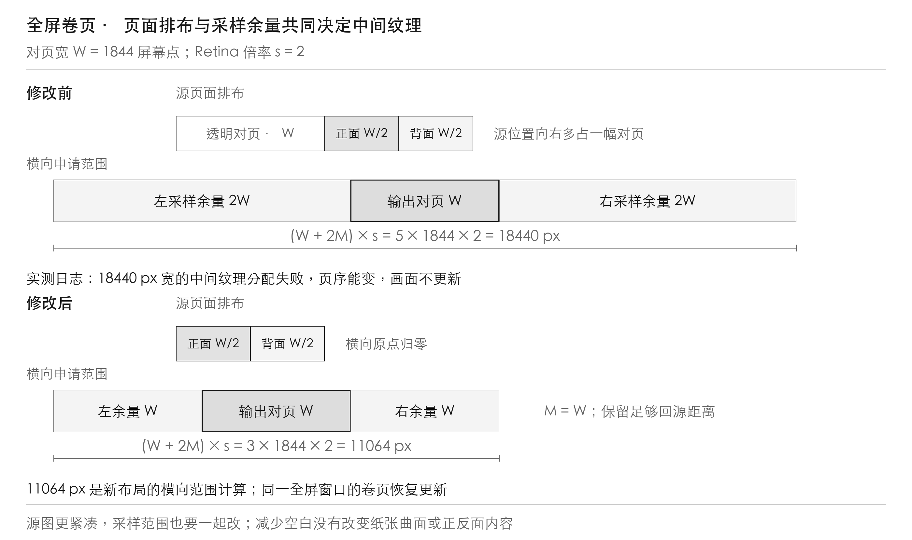

触控板横滑还有另一个问题。窗口越大，同样一段横滑得到的进度越小，本来能翻完的一笔到了全屏就回弹。从纸张外缘开始翻，进度按 `横滑距离×0.9÷(2×参考页宽)` 计算。横滑 240 个屏幕点，参考页宽 845 点时约 13%，限制到 480 点后约 23%。参考页宽还要在手势开始时固定，中途拉大窗口也不再改变这一笔的尺度。鼠标拖动仍按实际纸面坐标计算。

现在 iPhone 和 iPad 的双页交互也复用了这套自写曲面，移动端的系统控制器继续负责页面承载，并保留原生卷页的回退路径。iPad 空间够时把工具留在右侧，紧凑布局用页面设置和编辑表单，输入方式可以不同，页序仍然共用。换到手机上继续翻，不能因为布局变窄，就把装订里的某一面漏掉。

## 画册导出

### JPG 导出与内存预算

JPG 按封面、内页、封底的顺序逐页输出。每页把调整后的照片、背景和文字合成一张 8 位 sRGB 位图，再交给 ImageIO 编码，默认质量 0.95，并写入纸张的 DPI。页序、编辑记录和素材引用在任务开始时固定，导出期间继续编辑，也不会混进这次的文件。

真正吃内存的是编码前的像素，磁盘里的 JPG 大小不能拿来估算这部分占用。A4 在 300 DPI 下约 2480 × 3508 像素，每个像素按四字节算，一张画布约 35MB。如果把一百页一起画好留在内存里，光画布就接近 3.5GB，还没算照片处理。现在一次只画一页，编码后写进暂存目录，释放临时图像，再画下一页。整册完成后才交付目录。页内的照片也逐张解码、处理、画进页面，画完释放，不同时展开本页的全部原片。

照片的解码尺寸按它在成品页上需要多少像素来算，还得补上裁切带来的损失。比如一张 4:3 照片要填进 1000 × 750 像素的照片框，裁切只保留宽、高各一半；没有旋转和透视时，整图就需要解码到约 2000 × 1500，裁完才够用。旋转、透视和铺满照片框也参与尺寸计算，不能直接把整张原片缩到照片框大小。

35MB 只是页画布，解码、裁切、滤镜和局部修复的临时空间也要算进预算。请求解码前先选能放下的尺寸，拿到结果再检查真实占用。超预算，或大尺寸读取失败，就把请求边长减半重试，直到能处理或达到重试上限。降低的是照片的解码分辨率，细节会少一些；纸张尺寸、文字字号和排版保持不变。仍然无法处理时才报错。

### PDF 绘制与封面合成

PDF 按纸张实际尺寸建立画布，照片作为图像嵌入，文字用 CoreText 按纸面排版结果直接绘制，保留可选取、可搜索的字形。A4 的 2480 × 3508 像素在 300 DPI 下换成约 595.2 × 841.92 磅，字号与位置沿用前面的纸面计算。整页先做成 JPG 再塞进 PDF，文字也会变成像素，所以没有走这条路。

初轮直接把封面的半透明渐变画进 PDF，出现了黑底。后来只把封面底色与材质合成一张背景位图，照片和文字仍在上面独立绘制。印刷版保留纤维、颗粒与装饰边框，去掉书架展示用的装订阴影、受光和反光，材料与内容分开处理。

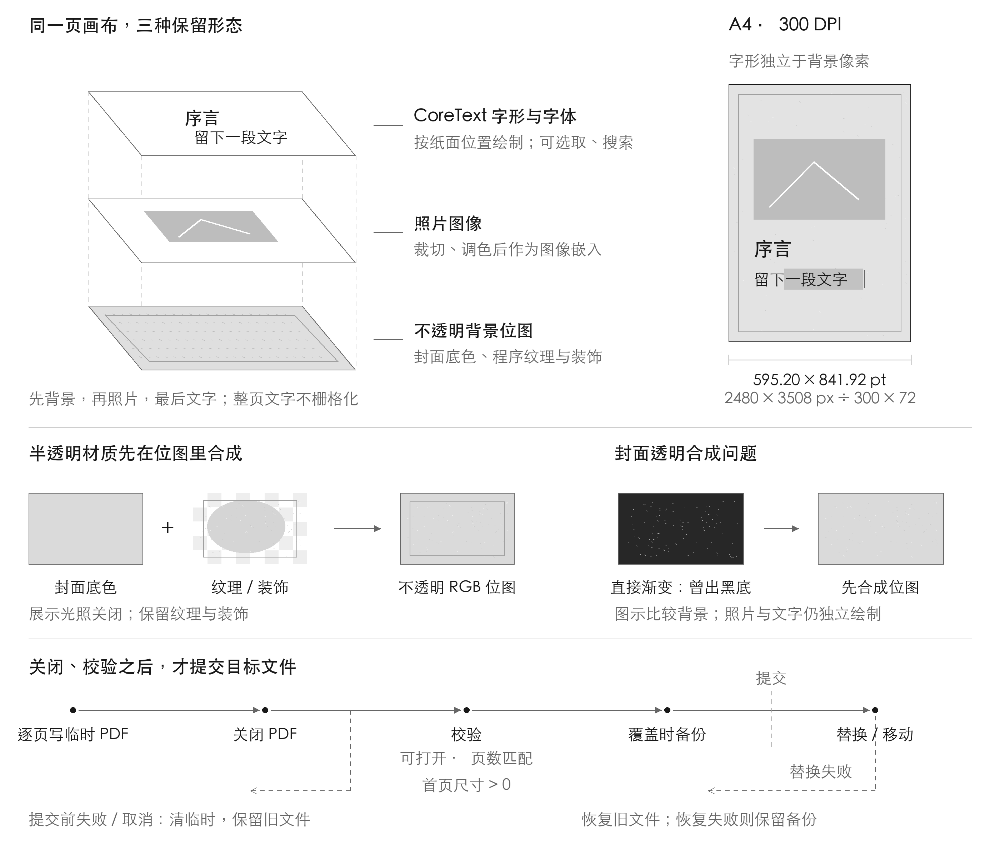

每页写完释放临时图像，再进入下一页。整册先写临时 PDF，关闭后检查能否重新打开、页数是否符合预期、首页画布尺寸是否有效，再替换目标。覆盖旧文件时先保留备份，替换失败就尝试恢复；恢复仍失败，备份也要留下并告知位置。取消或绘制失败则清理临时输出。

### 视频编码与任务管理

视频由画册直接逐帧生成：1440 × 1080、30 帧每秒，H.264 编码为无音轨的 MP4。每次最多准备固定左页、翻页正面、背面和底页四张纹理，复用交互翻页的 Metal 渲染，翻完再换下一组。每张纸安排 90 帧：前 66 帧静止阅读，后 24 帧翻页，第 66 帧进度为 0，第 89 帧到 1，封底再停留 90 帧。三个内页对应四次翻动，合计 `4×90+90=450` 帧，成片 15 秒。每帧时间按全局帧号除以 30，机器算得慢只会延长导出等待，不改变视频节奏。

像素缓冲直接包成 Metal 绘制目标，GPU 在里面画完，等绘制完成再交给编码器，省掉下载图像后重新复制的步骤。缓冲池最多四个缓冲；编码器没准备好或空闲缓冲还没回来，就等，不继续堆帧。编码器接收后才推进帧号和界面进度，末帧结束后还要完成 MP4 封装，成功才交付文件。

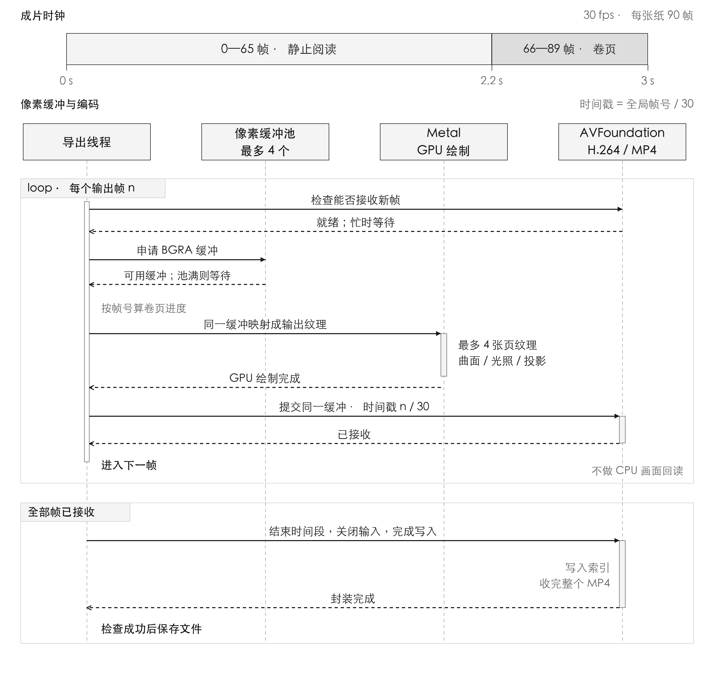

暂停在安全检查点停住，继续接原来的帧；取消唤醒等待并清理临时文件，进入最终提交阶段后不再接受取消。JPG、PDF 也共用这套任务控制。

移动端的视频任务需要 GPU，只有设备支持后台 GPU、系统也接受本次持续任务时，切到后台才能继续。条件不满足就暂停，回前台续上；用户主动暂停的任务保持暂停。已获准的持续任务被系统结束时，本次导出取消。目前已检查 Mac 和 iPhone、iPad 模拟器的文件与相册输出，真机锁屏、后台中断和长画册连续导出仍在验收。

## 在线分享

### 页面压缩与存储成本

本地文件解决的是把作品带走，一个链接解决的是别人打开以后怎样看。发几十张图片会把画册重新拆开，PDF 要下载后再用对应的阅读方式打开，视频又已经决定了每页停多久。链接里保留一本书，读者自己往前、往后翻，也能停在某一页上。

我之前也纠结过存储价格。一本画册放上去，和很多人反复打开它，花的钱不在同一个地方。云端保存什么、每次阅读取什么，要先定下来。发布前在设备上把每页的照片、文字、背景合成 JPG，云端保存最终页面，原片、蒙版、修复结果和编辑工程留在本地。源文件的 EXIF、GPS 等信息也不进入重新编码的页面。自己写在书页上的日期、地点，或者拍进照片的地址仍然可见，去掉元数据不会把页面内容也抹掉。

把合成留在设备上，也省掉了服务端的一套工作。若接收原片和编辑工程，云端还得复现照片处理、字体和材质，再安排整册的渲染任务。现在只校验和提供成品页。代价是发布者要先在自己的设备上完成合成，网页也只能阅读，不能接着编辑这份工程。

最长边从不超过 2048 像素开始，颜色转为 8 位 sRGB，完整 JPG 文件控制在 300,000 字节以内。包含封面、封底在内共 50 张图片，就算每页都顶到上限，一册也约 15MB。这个预算只用于网页阅读，本地印刷 JPG、PDF 和原片保留自己的质量。

不过最开始只有 2048 像素限制和固定的 JPEG 质量，并没有把容量真正限制住。同样大小的画布，一页大部分是留白，另一页铺满照片或细密的封面纹理，编码出来的体积可以差很多。用一张 8000 × 6000 的合成压力图做六页画册时，内页约 262～264KB，两张带材质的封面却到了 674～676KB，光限制像素，封面已经比预想大了一倍多。

后来改为测量真正生成的文件。先按 0.84 的质量编码，超过预算就试 0.55。最低质量能放下，就在两者之间取中间值再试，超出预算就降低上限，放得下就抬高下限，反复七轮，尽量留下符合容量的较高质量。每页单独决定，留白多的页没必要跟着复杂封面一起降质量。

最低质量仍然超过，就得降低分辨率。根据当前体积估计下一轮缩小幅度，保持比例，从原来的页面画布重新取图，再编码、测量，直到完整文件落进预算。不能拿上一轮已经压过的 JPG 继续压，否则丢掉的细节又当成新输入，经过几轮以后，容量是小了，文字和照片也跟着反复损失。

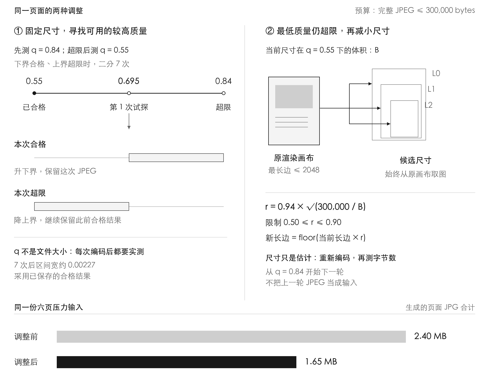

同一份六页压力输入，总量从约 2.4MB 降到 1.65MB，每页都落在预算以内。高噪声压力页走到了缩尺寸这一步，最后缩到 659 × 878，仍然接近 300KB。2048 是最长边的上限，细密噪声和纹理太多时，还得用分辨率换体积。

图片放在 Cloudflare R2，画册、版本和页面引用关系放在 D1，Workers 负责登录、发布、读取和删除，网页通过 Pages 的入口接到这些服务。图片桶保持私有，每次读取经过画册服务，才能在后面继续处理版本切换与删除。

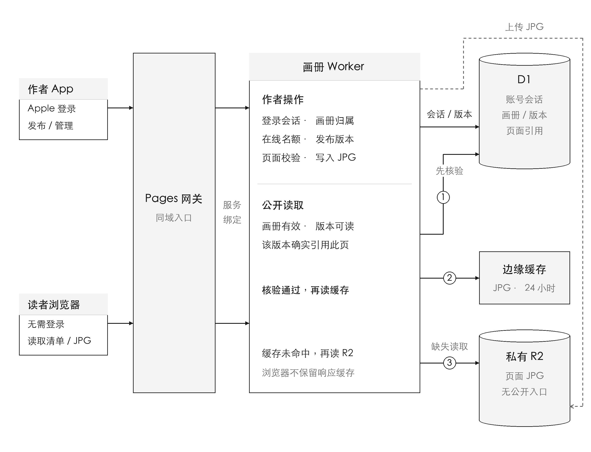

按 R2 Standard 最新的价格，存储每 GB 每月 0.015 美元，账户每月有 10GB 免费额度，出口流量不收费。一千本这样的 50 页画册，不算复用，当前版本约 15GB；假设完整保存一个月，10GB 免费额度也都还能用，超出的 5GB 对应约 0.075 美元。这里只算存储这一项，草稿、旧版本和同账户其他产品还要占空间。

请求 pv 次数也有费用。拿 50 页举例，假设每页只请求一次，只计入口、页面清单和图片，一次完整阅读约 52 次请求。一个月十万次完整阅读就是约 520 万次，百万次阅读则是约 5200 万次；假设套餐额度都还能用，后者仅 Workers 基础费加这部分请求费就约 17.60 美元。等到 PhotoP 真能搞到存量一千本画册，那估计已经成了hhhhh。

### 页面复用与版本提交

一本 50 页的画册发布了，后来改掉第三页的一句话，原来的链接最好还能继续用，其他 49 页也没必要全部重传。 最终 JPG 用 SHA-256 计算内容摘要，相当于从完整文件字节算出的指纹。第三页那句话改了，新图就有新指纹，另外 49 页的字节相同，指纹也相同。客户端先提交页面顺序、角色、尺寸、字节数和指纹组成的清单，服务端对照同一个作者已有的页面，只要求上传缺少的部分。

页序也要参与整本内容的判断。50 张 JPG 全都没变，只把第三页挪到第五页，仍然是一本不同顺序的作品，不能看图片集合相同就认为无需更新。整本摘要包含阅读方向和有序的页面清单，本地复制生成的新身份、仅用于整理的工程名字则不作为图片内容差异。内容相同的副本可以继续指向同一个分享链接，不再额外占一个在线名额。复用限制在同一个作者的内容里，没有把全站所有人的图片汇成一个可查询的公共库。这样复制自己的画册、调整几页再发布，能节省重复上传和重复存储，也不用为了找一张相同图片去暴露其他人的作品。

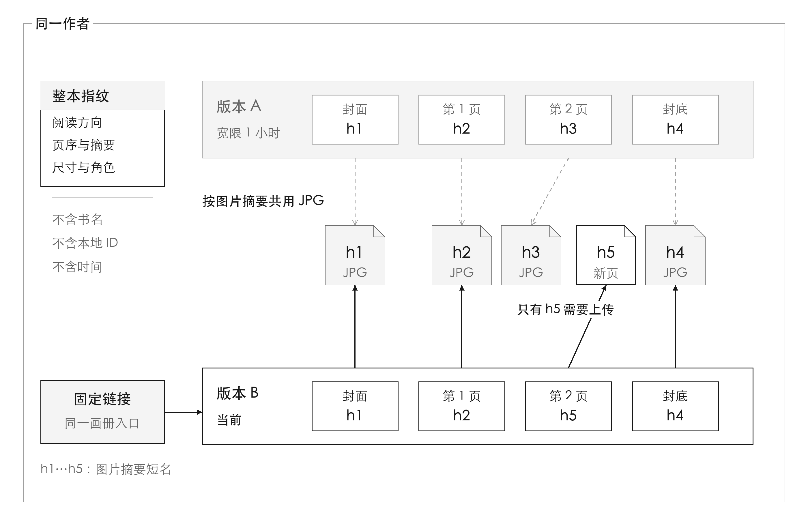

上传时还要重新检查真实文件，客户端说这页 299KB，服务端不能只信请求头。实际收到的流里有多少字节，是不是 JPEG，图像尺寸与摘要对不对，都在入库前核对。前面的容量约束要在这里继续成立，否则改一个客户端，300KB 的预算就成了界面上写给自己看的数字。更麻烦的是更新到一半断网。第三页传完就替换第三页，第五页传完就替换第五页，读者可能正好翻到中间，拿到一本新旧混在一起的书。每一页单独上传成功，并不等于这本画册已经发布成功。

现在先建立待发布版本，上传阶段不改变正在阅读的版本。全部页面齐了，尺寸、字节数和摘要也通过检查，才一次性提交，让原链接从旧版本切到完整的新版本。中途失败，原链接仍然读上一版，已经传到一半的草稿不会被误当成整本作品。

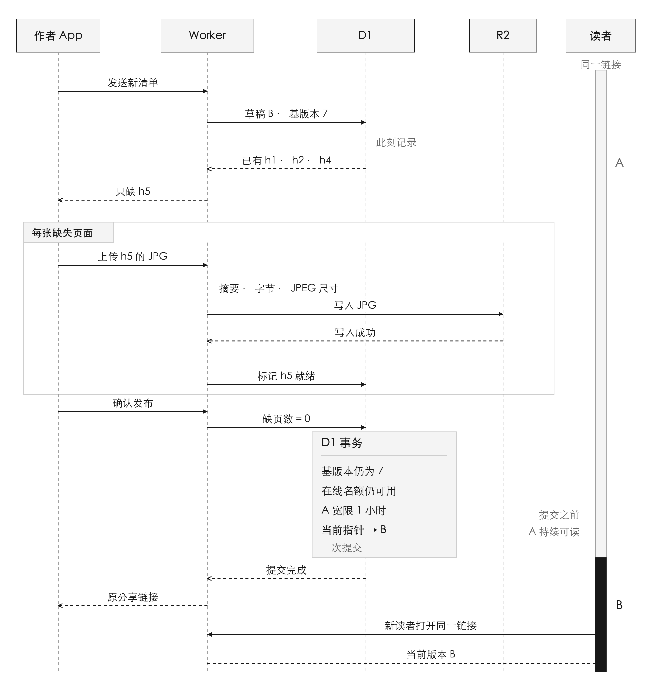

两台设备同时发布各自的修改，也不能只按谁最后上传完来决定。比如两个发布任务都从同一在线版本开始，其中一份先提交，另一份因为网慢后到，如果直接覆盖，前面刚发布的内容就被换掉了。提交时核对这次上传草稿建立时的在线版本。版本已经被另一个任务改变，就明确报告冲突，不因为这份晚到就默认它应该覆盖。

在线名额也放在最后这次提交里检查。目前普通账户可以保留一本在线画册，Pro 最多五本，删除后释放名额。本地自己编排和云端长期占一个位置是两件事，链接需要持续保存和提供访问，先对同时在线的数量设边界。两台设备同时去发布最后一个名额，不能各自开始上传时都说有位置，最后两本又都占进去。版本条件、在线数量和新版本切换放在同一次数据库事务里，要么一起成功，要么一起撤回。上传可以分开准备，决定「现在网上是哪一本」时，这几项得一起成立。

### 阅读缓存与网页卷页

一次更新切换的是整本版本。新打开链接的人读当前版本，已经拿到旧页序的读者还能继续取旧页，旧版本保留一小时，再按引用回收，避免读到中间突然缺页。网页先拿页序和尺寸，只给当前一面及前后各五面设置图片加载地址。阅读窗口移动时补进附近页、移除远处地址，回到很远的页面可能再次请求。Worker 收到图片请求后，先查画册与版本是否仍然有效，再查节点缓存；缓存保留一天，未命中才去私有 R2 读取。作品已经下线，就算缓存有图也不能返回。

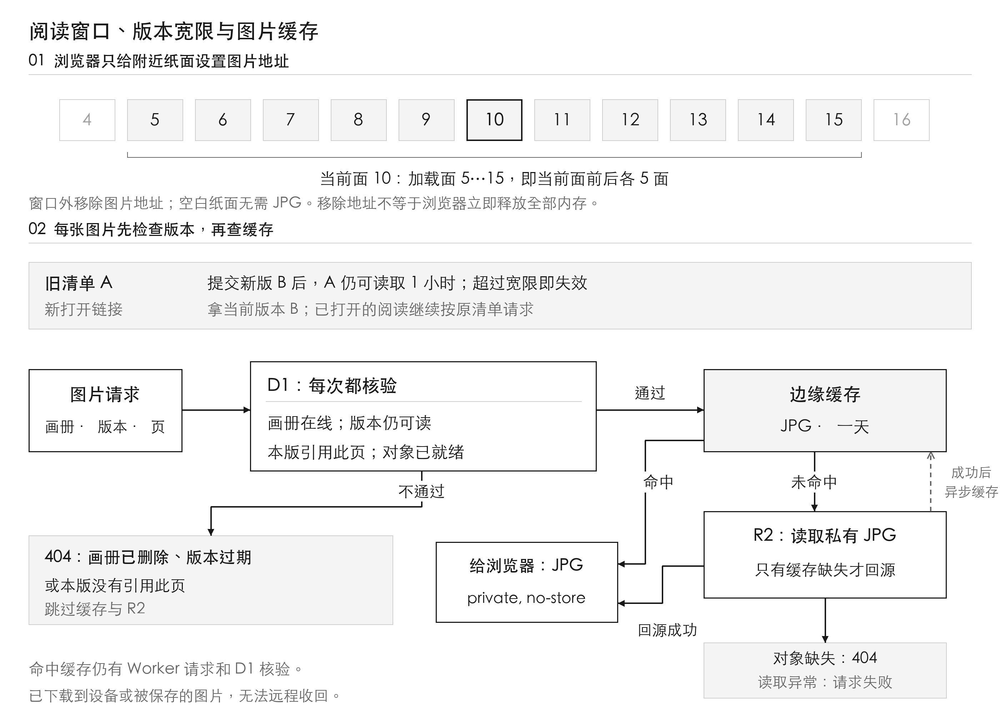

节点缓存省的是 R2 回源，Worker 请求和状态查询仍然存在。浏览器响应使用不长期保存的缓存策略，服务能停止后续提供，已经下载或保存的页面收不回来。链接就是阅读入口，作者的发布、修改和删除另外验证登录身份，异常请求在数据库和存储访问前限制。

网页按钮自动翻页采用整页绕书脊旋转，手势拖动显示软纸卷曲。初轮拖动开始时独立底板隐藏、结束又恢复，底边和投影会闪；到封底还露出一整块内封空白。翻页库留着原页的完整矩形，中间几页被下一页遮住，到了最后才暴露。现在去掉独立底板，阴影跟随纸张轮廓；同一帧的掀起区域记为 H，静态页 A 只保留 A−H，再叠卷页纸。软纸前翻、后翻和回弹都沿用这份裁切，结束后恢复完整静态页。

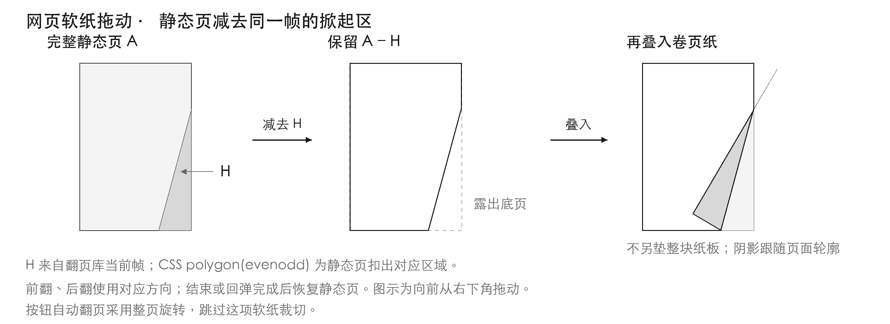

本机浏览器已经检查反复开合和完整翻阅，移动设备的流畅度还要继续看。

### 对象引用与资源回收

复用同一张 JPG 的可能是两册书，也可能是同一册的新旧版本。删除画册时不能直接清空图片，要先分出哪些对象仍被其他版本引用，哪些只属于这次删除的画册。引用判断、给独占对象写入持久回收队列、移除画册与版本映射，都放在同一笔数据库事务里。提交后链接失效、在线名额释放，回收任务也已经留下；不能数据库删完了，准备入队时才遇到故障。仍有其他引用的 JPG 继续保留。

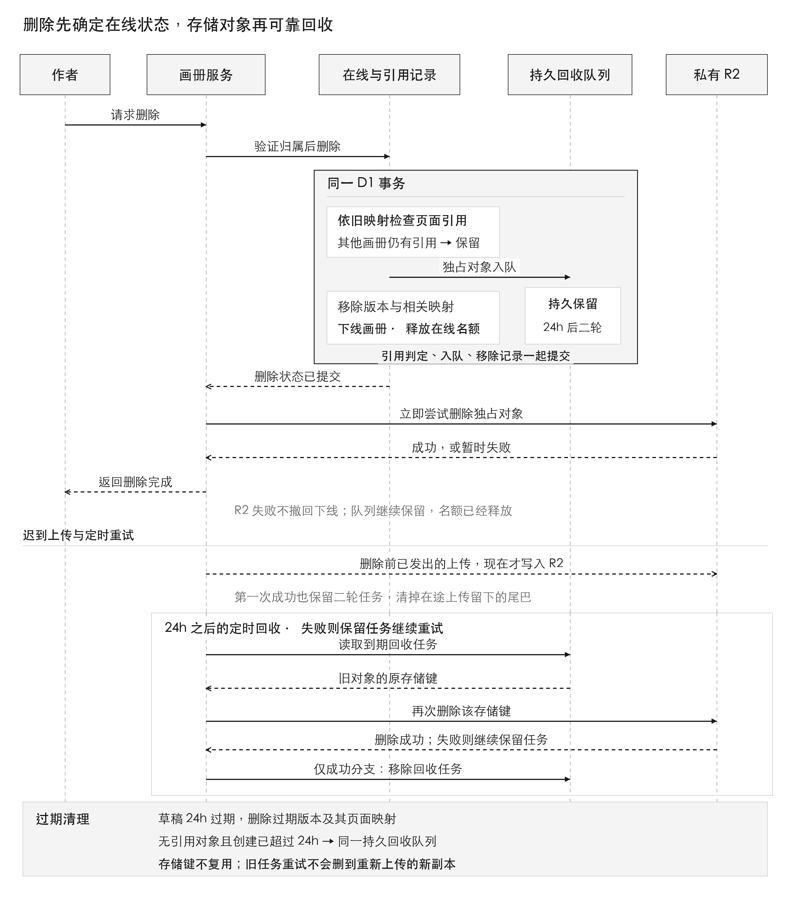

事务提交后会立即尝试删除 R2 对象，失败也不撤销已经完成的下线，队列留着继续重试。数据库和 R2 没有共同事务，先确定作品退出在线状态，再回收文件；反过来先删图片，数据库一旦失败，就会留下能打开却缺页的书。

删除时还可能有上传请求在路上，第一轮清理完才写入 R2，所以首次删除成功也保留队列任务，24 小时之后再检查一轮。对象路径不复用，旧任务重试不会误删后来重新发布的图。草稿 24 小时后过期，旧版本一小时后到期；无引用对象创建已超过 24 小时，才由定时任务送进回收队列。客户端取消只结束本地发布任务，云端仍由版本状态和引用决定能删什么。

## 跋
PhotoP 的画册模块最耗时间的其实并不是处理发布、分享和各种存储方面的事情，而是如何在端上设计一套完备的画册编辑流程，越做越复杂，越做需要考虑的地方越多，这也是为什么拖了两个月才最终搞定。不过这也是工具产品的魅力所在吧，总是在定义新的工作流新的交互方式，如何更快更好的提升效率，是一个值得长期探索的方向。

还有一个有趣的观察，图像编辑、视频编辑和相机工具这「三驾马车」跟随移动互联网迭代了快 20 年，但每年都会出来新的产品新的玩法，永不过时。机会还是有的，目前基本上把 PhotoP 要做的大头事情都做完了，接下来就根据用户反馈持续修复持续迭代了，把更多的事情留给运营和宣发上。至于视频编辑和相机工具这两个方向我还没想好，没有摸索到一套行之有效的解决方案，先埋个伏笔吧。
