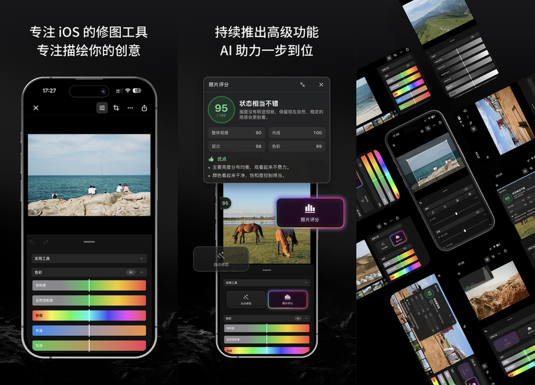
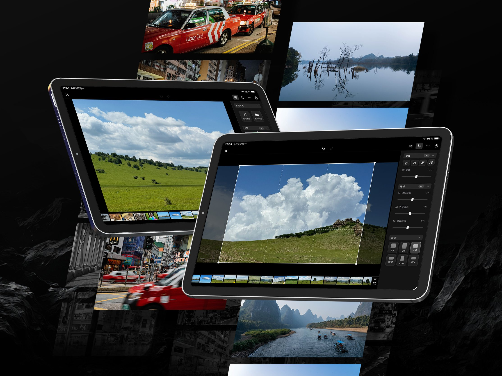

PhotoP 近期更新了三大功能点。自动修图引擎的升级，更快速和更准确的协助用户完善照片，推出了全新的「照片评分」组件，告诉你的照片好在哪，可以往那方面调整，以及最重要的更新，终于支持 iOS 和 iPadOS 了！没想到时隔了整整四年，才终于让 PhotoP 跑在了 iOS 和 iPadOS 上。

## 自动修图引擎升级
PhotoP 的「自动修图」第一个版本来自薄桑一年前的工作成果，但直到今年年初才正式问世。第一个版本的技术方案在之前的文章中已经大致阐述过，具体细节就不展开了，本质上是基于一份图片集和调色策略，针对性的训练了一个修图模型。效果还挺好，可以节省前期照片粗修环节的很多工作量，但缺点也是有的，一下子把 PhotoP 原本 8MB 的包大小膨胀到了 100+MB，翻了一个数量级。涨包大小这件事在 macOS 上没啥问题，而且也才 100+MB，与头部竞品动辄快 1GB 的包大小还是天壤之别。

但这件事最大的影响是本文最后要说的迁移到移动端，包括 iOS、iPadOS 和 visionOS，尤其是 iOS。虽然果子已经在 iOS13 开始解除超过 200MB 的 app 包大小无法通过蜂窝流量下载的限制，严格意义上说除非你的 app 要兼容 iOS13 以下版本，否则再做包大小限制已经没啥意义了，但这件事恶心就恶心在 iOS13 及以上版本超过 200MB 的 app 包大小改为了弹窗提示，用户主动点击确认后才能继续下载。这样弄的话，对于头部 app 影响不大，甚至某些数据指标还会更好看，但对于一些中尾部 app 没有彻底根治，病因依旧未除。

所以我们能看到都 2026 年了居然还有大量的 app 在反反复复的做包大小限制，每个业务线按月按季度划分包大小增量，能下发的资源全下发，能 H5 化的全 H5。厂子越大这些事情就越敏感，一言不合就要 +1、+2 甚至上升到部门一级负责人发邮件审批告知为何包大小超过了基线限制，一来二去，工作的复杂度直线上升，导致大部分精力都不在实现不在代码本身。其实这些事情要强行理解，倒也能理解，毕竟多一个弹窗的拦截就多流失一层用户，如果从下载源头就拦截了，后面的事也不用说了。

对于 PhotoP 这类型的 app 来说更是如此，本身目前这个背景下获客成本非常高，用户好不容易在某个渠道看到了你的产品宣传，当下有兴趣点开了 app store 搜了你的产品，点击了下载，突然被 app store 告知包大小超 200MB，是否继续下载，这样很容易拦住一些本就不多的用户。因此，升级自动修图引擎就成为重中之重的事，如何把自动修图这件事做得又准又快又小。

看似不可能的三角其实一切奥秘都藏在 apple 的 live photo 实现方案里，如果你感兴趣的话可以去琢磨琢磨 live photo 是如何做到把最好的那一帧画面选为封面的，这个「最好的一帧」里面藏了很多有趣的细节。这里主要分享的其实是我重新整理了一遍到底什么是好照片的思路，我从 23 年初开始严肃摄影，前面那些断断续续的时间就不计算在内了，到现在有三年多的时间，在长达三年多的时间里我读了大量的摄影书，看了大量的画册和视频，满满摸索到了一些关于什么是好照片的定义。如果你有心的话，可以在我的博客「摄影」分类下或者同名小红书看到过去三年多来的变化。

过去也有很多朋友在看了我拍的一些照片后觉得确实不太一样，我也在一步步引导大家觉得别人拍的一张照片不错时不要先问是用什么相机拍的，而是先问为什么这么拍。一张好照片的诞生器材永远不是第一位，如何去构思画面去调整色彩去引导观众才是第一要义，不过这些东西就有些形而上了，以后有机会我们再细细道来。

在 PhotoP 自动修图的第二个版本里，完全剔除了原本专门训练一个内置模型的思路，转而使用 live photo 的类似方案降低了包大小，并重新调整了修图策略。我把自己看过的这么多画册、摄影书和视频抽象封装出了一套修图策略，浓缩了我喜欢的几个摄影大师照片风格。这套策略会指导引擎看到的像素点在什么情况下应该改为什么样的新颜色，什么样的黑是好的黑等等。通过这套组合拳，成功的把 PhotoP 的包大小拉回到了 10MB，比用索尼 RX1r3 拍摄的一张照片还要小。

## 照片评分
照片评分是近期 PhotoP 更新的大功能。可以告诉你当前这张照片的分数如何，优点是什么还可以更好的地方在哪，但不会强调说缺点或者差的地方。在严肃摄影后慢慢修正了自己很多老旧的摄影观念，迈过「出片」这个阶段后，也有了初步的摄影体系观念后，再加上自己的「摄影眼」，越发的觉得不存在一张所谓「差」照片。只要我们在某个场景某个画面前按下了快门，那这个地方一定是有某些东西触动了内心，驱使我们拍了这张照片。虽然这张照片当下甚至是事后来看可能并不是常规的好照片，无法发朋友圈，但它可能可以发小红书组图，做画册做展览，去满足我们的某些叙事。

大家可以去看森山大道的照片，他基本只拍黑白，照片里充斥着大量的高对比黑白和粗颗粒，任何一张照片单独拿出来我觉得绝大部分人都不会觉得是好照片。但这些照片如何按照某种故事线按照某些叙事进行排列组合，营造出某些氛围引导观众，那每一张照片都是不可或缺的，我想要表达的也是这个意思。

PhotoP 的照片评分功能要做的并不是告诉你 100 分的照片是怎样的，而是告诉你一张照片应该如何调整才能成为好照片的基础，做的是基础的事情，一张照片之所以能够成为好照片是有最基本的硬性条件的，只有满足这个条件后再往上去做去寻找，才能创造出好照片。所以你不会看到类似一定、必须等之类的强硬字眼，而是如果、尽量这类型的推荐词语。说到底，拍照这件事就是很私人的，每个人喜欢的风格都不一样，但就是是风格再怎么不一样，一张照片最终可能成为好照片也有最基本的条件需要达成。

照片评分的底层实现和自动修图第二个版本异曲同工，可以说没有自动修图第二个版本就没有照片评分，底层驱动依赖的就是上文所说的自动修图所依赖的策略。举个例子，引擎需要知道用户当前画面的暗部和亮部到底差在哪里，结合整个画面内容来看可以往哪方面调整，我们人是怎么判断一个画面的构成是否平衡等等，叠加自己看过的这些摄影书、画册和视频内容，把这些品味的事情用一套框架告诉引擎。引擎得先知道啥是好的，才能知道啥是不好的。

我并不喜欢上来就给出一个结论「反正都是 AI 做的」或者「用什么模型做的」，这非常不负责，并且也非常偷懒。大家可以仔细观察身边的人，如果你们在探讨一个问题时，当你要尝试说明一个问题的复杂度或者细节时，对方如果听完你的解决方案，最终给出了类似「反正都是 AI 做的」，我觉得下次可以不用再找 ta 聊了，因为认知已经偏差了。

这里还想跟大家分享一个观点，并不是所有的照片都需要被修。在做完 PhotoP 照片评分功能后，我很担心有用户会被其他的修图软件形成的固有思维来使用 PhotoP，比如必须把所有照片都修到 95 分以上之类的操作。这个照片评分功能我希望做到的是服务刚开始拍照或者暂未形成各自摄影风格的群体，需要有一个框架告诉 ta 一张好照片的基础是什么，最基本的曝光和色温是否准确，画面是否过暗等等，这些指标都是有标准的。

刚开始拍照时我们大多数人很容易因为某个滤镜很喜欢反复套用，有些滤镜为了达到某种氛围感亮部死白，都过曝了以至于显示出了一种蜜汁所谓的「氛围感」。这种新鲜感也就刚开始拍照时可能会喜欢，拍了一段时间后我没见过还有人长期依赖或者使用的，都逐渐演化出了自己的风格。最重要的是就算是各种风格，拍出来的照片也是准的，拿 PhotoP 的直方图来看，红蓝绿、暗部和亮部都没有异常的地方，这就是我说的标准，想要 PhotoP 的照片评分和自动修图做到的事情，但先寄希望后续持续观察，等待反馈吧。

## iOS 和 iPadOS 支持

PhotoP 从 22 年开始一直到 24 年底一直都只有 macOS 版本，24 年底购入 Vision Pro 后一直想写个 visionOS app。当时的自己没有空间设计能力，但又想试一试在 visionOS 上做些什么，想了一圈还得是落到生产力工具上，就把 PhotoP 先支持了 visionOS。在支持 visionOS 版本的过程中，对更底层的 Metal 部分已经做好了迁移和适配，严格意义上说只需要打开支持 iOS 和 iPadOS Target 即可，但当时的我并没有思考清楚 PhotoP 的核心区别和其他的产品到底是什么。macOS 上我想得很清楚，我就是想玩一玩 SwiftUI 能不能做出来生产力工具，但 iOS 和 iPadOS 实在是想不出来到底有什么区别。

就在前段时间从榆林玩耍回来后，碰上 Lr 授权方式发生了变更，我从淘宝上买的账号加组织的统一授权方式失效了，本想激一发店家，如果解决不了就退钱，不要让我下盗版兼容过渡，我就要正版。没想到店家居然同意了退款，我只能另辟蹊径，最终找到了 Photomator。Photomator 开启了 7 天免费试用，试用的过程发现确实比 Lr 能力项少了好多，但就算少了这么多功能的 Photomator 居然还能卖一年 298 元，终身 798 元的价格。在前两周去北海附近钻了一次胡同，从灵境胡同到北新桥走了一趟后，回家整理照片，发现我完全可以就照着 Photomator 的思路来完善 PhotoP，站在巨人的肩膀上始终好做事，尝试进一步的迁移自己的照片编辑流程到 PhotoP。

最重要的是 Photomator 也有 iOS、iPadOS 和 visionOS 版本，这和我的想法不谋而合！马上开始研究起了 Photomator 在非 macOS 版本上的特色和兼容方案。之前没有很大动力去兼容 iOS 版本的主要原因是我不清楚如何把 PhotoP 的右边工具栏进行融合，而 Photomator 在 iPadOS 上巧妙的做了抽屉面板和侧边栏方案的切换，醍醐灌顶！马上开始着手研究 PhotoP 也用这套方案的可行性。

做 PFollow 时的策略是先做 iOS，然后再做 iPadOS，最后通过 Catalyst 的方案兼容 macOS。Movinn 也是先做 iOS，然后再兼容 iPadOS。到了 PhotoP 这里不一样了，先是有的 macOS 版本，然后才有的 visionOS，这二者最核心的底层逻辑都是一样的，但业务功能已经分道扬镳了，基于谁作为底座继续推荐就很值得思考。如果是 visionOS 版本的 PhotoP Studio，基本上不需要做移动端样式兼容，但缺点是需要补齐很多功能点。如果是 macOS 版本的 PhotoP，整体是 macOS 形态，无法一步到位直接搞定 iOS，中间有大量的 UI 层工作，想想就头大。

后来我猛的反应过来，PhotoP 的 macOS 版本也是基于 SwiftUI 做的啊！果子的宣传 SwiftUI 就是构建 appleOS 多平台的最佳框架啊！我马上添加上了 iPadOS 版本的兼容，因为在不做任何大修改的前提下，去除一些 AppKit 本身的依赖，比如通过 PPImage 封装 NSImage 和 UIImage，使得外界调用不感知具体类型等之类的事情后，剩下的代码都是全平台统一的 Metal 和 SwiftUI 逻辑。

做好 Spec 和 Plan，Coding Agent 干起来很快，差不多半小时后我就得到了一个运行在 iPadOS 上 PhotoP，当我在 iPad 上看到 PhotoP 这迷人的 icon 时，内心泛起了一阵酸楚，没想到居然成了！四年前的我因为各种原因迟迟不敢动手去做的事情，在现在居然真的做出来了，成就感巨大。

iPadOS 版本搞定后，花了几天的时间针对性的调整 PhotoP 在 iPad 上的显示效果，包括各种弹窗、滑杆、文案甚至是付费墙的 UI 兼容统统走了一遍。做到 stage manager 动态窗口的兼容时，我发现了一个有意思的东西，iPadOS 上的最小窗口尺寸就是 iOS 的 UI 样式。可以使用 iPadOS 的最小窗口尺寸来做 iOS 的兼容，不用必须连接一台 iPhone 测试机。其实这个变化在 iPadOS 16 就已经发现了，但那会儿没有往折叠屏的思路去想那么多，只是觉得果子想拓展 iOS 的 app 到 iPadOS 和 macOS 罢了，但经过 WWDC26 上推出的 Device Hub 全新的设备测试 app，里面大量透露出了折叠屏的潜台词，很期待即将到来的 9 月份！

我是先在 iPadOS 上通过最小窗口尺寸调整好后，再给 Xcode 打开支持 iOS target，最后 build 到 iPhone 上时非常丝滑，一种独属于程序员的浪漫感就出来了，很难形容这种感觉。更有意思的是，其实 iOS 的横屏就是 iPadOS 上正常尺寸的缩小版。我们在 iPadOS 上把一个 app 窗口宽度拉伸成 iPhone 横屏的样子时，这个样子就是 iPhone 上的样子，这一刻太美妙了。

## 总结
PhotoP 下一步会继续补齐基础调色功能，并且引入「画册」制作模块，让你使用 PhotoP 不仅仅只是修图，我一样会把自己看过的这些摄影书和画册吸收到的内容封装成一个产品功能，让每个人都可以学习大师前辈们的画册编排思路，做出属于自己的画册！再往下一步就是做风格化了，做图像编辑和相机产品都绕不开滤镜本身，但我又是一个不爱使用滤镜的人，总觉得这个东西也是为了偷懒而存在的产物，还在想如何不仅仅只是做个滤镜。

目前 PhotoP 因为上线了三端正在做促销，大概会持续两周的时间，可以先入手一波。等到后面画册系统和滤镜上线后，价格还会上涨，我的最终预期买断价格是 Photomator 的一年订阅费。到了那个时候，PhotoP 已经具备和 Photomator 掰手腕的地步了，很期待那一天的到来。
