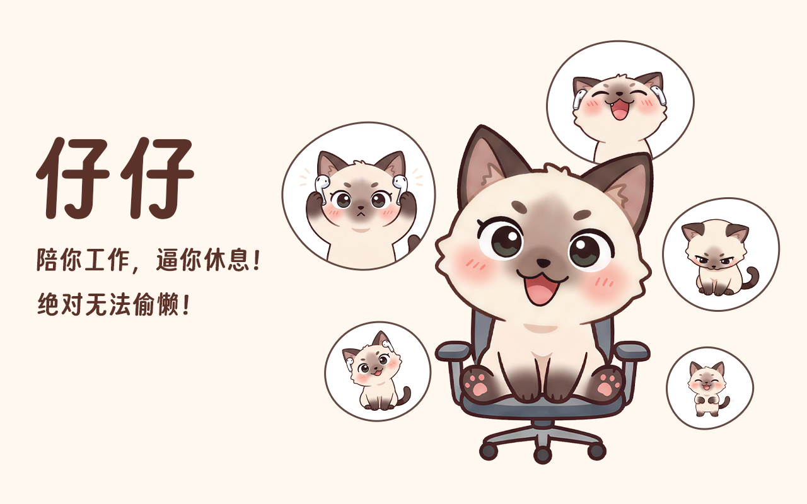
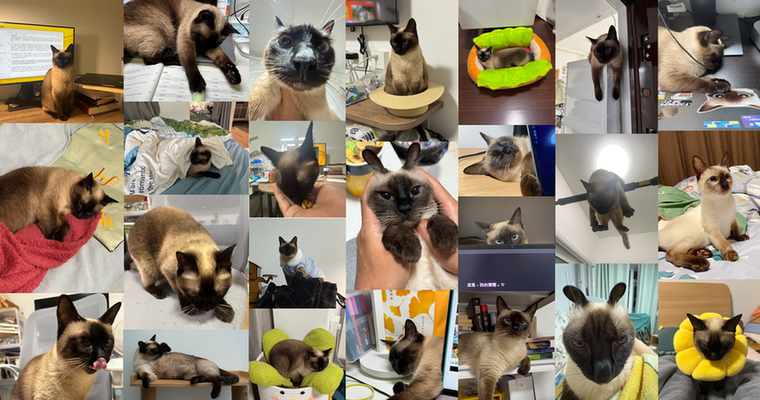
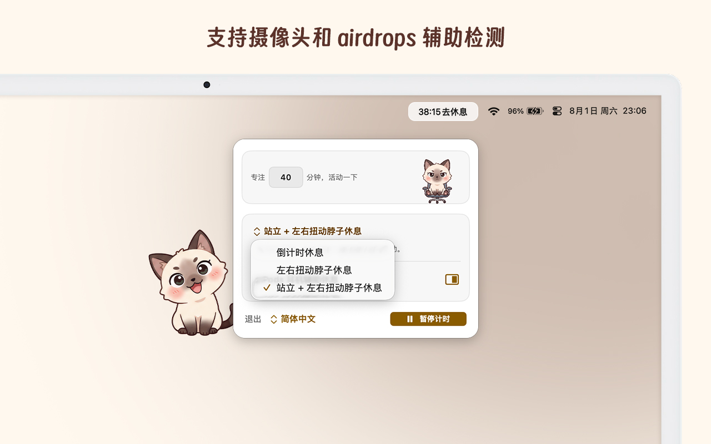
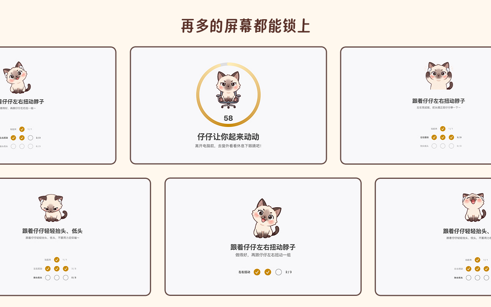

我有两只猫，一只叫仔仔，一只叫娟娟，仔仔是只母暹罗猫，娟娟是只公金渐层，仔仔无所不能并且上窜下跳，娟娟 peace & love，生人勿近。仔仔经常在我们伏案工作时进行一些骚扰工作，执行游击战策略，我们经常要从地上捡起她推掉的物品，骚扰我们结束后开始追赶原本睡得好好的娟娟。作为一只小猫咪，仔仔透露出了「狗」的所有特征，包括无时无刻不在想着下楼遛弯。

## 仔仔
仔仔出生于 2020 年的秋天，接到家中时只有三个月大，从小小的一只到现在狗狗的一只，已经过去了整整六年了，她是我养的第一只猫。之所以要养一只猫一只暹罗猫主要原因是我女票一直记得她小时候睡觉时，床边围了一群暹罗猫，每天伴随着猫咪们睡觉，她觉得很舒服。这种感觉挥之不去，一直很怀念，也就有了想要一只真正属于我们的暹罗猫。

在决定要一只自己的猫咪之前，在 20 年 12 月 24 日平安夜当天早上，正在准备洗漱出门上班的我被女票喊醒，说门外有猫叫，我仔细一听，猫叫的声音确实很大。我开门一看，一只白色的小猫咪瞬间就冲进了房间里，我们两个不知所措的愣在原地。进入房间后才发现小猫身上有很多黄色的斑点，我们以为是有皮肤病，想着先去距离家不远处的宠物医院看一看。在去往宠物医院的途中，我在飞书上请了半天假，备注里写着「家里闯进小野猫，带去宠物医院看看」，女票直接干脆请了一整天假。

在等待医生体检的过程中，我和女票还在为这突如其来的变化弄得面面相觑，虽然之前一直想着养一只猫咪，但也仅仅是嘴上说说而已，拖了很久都没有付诸行动。在平安夜的这一天突然来了一只小猫，我们不知道如何是好。

大概半小时后，体检结果出来了。医生说这只小白猫身上的黄色斑点是上了药，本身确实有一些皮肤病，但有人在给它上药。我们一听到「有人在给它上药」这句话后悬着的心终于死了，它应该只是偷偷跑出来的。我们重新抱着装在纸箱里的小猫回到了家，我去上班，女票在家看着猫，那时的我曾经闪过一次黑暗的想法，想着要不然就把这只小白猫占为己有吧？

这个想法一直在我们当天聊天里，虽然我对从自己家里偷跑出来的小猫进了自己家，然后花了钱带它去做检查，最后萌生出自己就顺势而为养着算了的这种现在看起来并不好的想法，在当时的我看来毫无关系。因为那时的我认为原主人已经不看重它了，而且它在我们门外叫了这么久，最后我们开了门，它闯进来，主动选择了我们，我一直觉得这件事就这么养了算了。

但事情的转机就发生在到了晚上，门外一直有个老爷爷在楼道里上上下下的喊着「小白～小白」，女票在家中听着实在是难受，一直找了快半小时。我们想了想做了番挣扎，要不然还是给老爷爷送回去吧，并且跟他好好沟通一波不要再让小猫咪乱跑了。最重要的是，我们也想以后自己的小猫咪跑出门时，可以被好心人找到后还给我们。最后，我们把这只和我们待了 12 个小时的小白猫开门还给了还在一声声喊着「小白～小白」的老爷爷。

从这时起，养一只自己的小猫彻底在我们心中埋下了种子，正好当时在宠物医院做检查时遇见了一位宠物美容师，也加了微信。这么一来一回的聊着，发现他自家暹罗猫正好下崽了，可以卖我们一只。后面的事就不展开了，总之我们花了一笔钱，从这位宠物美容师手里在北京的冬天里接到了仔仔。刚开始每顿饭都要做湿粮给她吃，用羊奶粉泡着幼猫粮泡软了吃，就这么一顿顿饭给亲手喂大了。第一天晚上还爬到了我们身边，真的就像人一样畅着肚子垫着手臂，睡了一晚上。晚上下床上了个厕所后又爬回来接着枕着我的手继续睡到了天亮。

中间还发生了很多有趣的事，逐渐体现出了仔仔「狗」的那一面。大概是过了一周多，仔仔已经对家里的环境熟悉了，开始上蹿下跳的各种在家里飞奔。有一次下班回家，我女票打开卧室门一看，满地狼藉，仔仔把我女票挂满衣服的衣架踹倒在地，满地的衣服。但仔仔貌似想恶人先告状，一直在「嗷嗷啊～」的说着话，仿佛是在说「它都撞到我了，你不问问我疼不疼！」

仔仔这种狗的属性让我们在过去的几年时间里赔了一个电视机、两把椅子、一个沙发套以及无数个杯子，最要命的赔了字节一台 16 寸的 Macbook Pro。当时我正在居家办公，仔仔直接一脚把我还没喝完的可乐踹向键盘，我就这么眼睁睁的看着可乐大步向前的迈进了键盘里。最后肯定是没救回来，虽然用了各种办法祛湿，勉强能用，但发烫厉害。和 IT 同学沟通了一波后，要么交 8k 买了这台进了可乐的电脑，要么交 4k 公司去换主板维修，最后只能选择价格最便宜的方案，交了 4k，并且换了台工作设备。

除此之外，仔仔会在我和女票在电脑前伏案工作甚至看书时，随机刷新它自己的位置和正在干的事。比如冬天的时候仔仔怕冷，只要你的电脑开着，她就一定会往你的电脑后面钻，占据能够享受到 mac 出风口的位置，去烤她的肚子。夏天的时候开着空调，仔仔还是怕冷，她会自己找我是的被子把自己卷自己盖好，然后睡大觉。

等她睡醒之后，开始琢磨能在家里玩些啥，比如咬一咬耳机线，推一推桌子上的各种小零碎，从这个柜子跳到另外一个柜子上，扒拉一下鞋柜的门把手，想办法钻进去。甚至是趁你不注意时，钻进沙发套或者床套里，疯狂挠床垫和沙发，最后这一套下来都玩腻了，开始寻找娟娟的位置，和娟娟来一场酣畅淋漓的「大逃杀」游戏。娟娟经常被仔仔疯狂「追杀」，又是咬脖子又是被迫舔毛，经常还会被过肩摔打闹，追得娟娟发出「嗷嗷嗷」的叫声。

之所以娟娟叫娟娟本质原因是我们刚把他接到家里时，发现他叫不出声，并不是哑了纯粹是因为娟娟的叫声频率太高，人类耳朵接收不到。我们参考甄嬛传里的「宝娟」这个声带也哑了的角色，把这只金渐层小公猫命名为了「宝娟」。所以其实日常娟娟是不怎么发出声音的，就算发出也是很轻微的高频叫声，我们听起来就是很轻微的「啊」一下。但每次被仔仔「追杀」时，都会经常发出更大声的「啊！」，听着我们两个实在是难受，这个时候就会抓住仔仔，给她一顿喝止和胖揍。

一些朋友来家里做客时，仔仔都是「头牌服务生」，精准的服务好每一位客人，提供充足的情绪价值。据我的观察统计，就是因为仔仔的这种好客之道，已经成功的让两位朋友养了暹罗猫，甚至还有不少许久未见的朋友相约到家中做客时，都会说上一句「又可以撸仔仔了」。

与仔仔共同生活的这六年时间里，有太多的美好时光，尤其是上文说到的，她就好像是个随机数发生器，固定时间间隔在某个地方刷新位置。又或者是突然间闯入你的书桌，强制让你转移注意力，从工作中抽离出来，很像一个番茄钟到点了。特别是这段时间，我在家干活的时间比以往更多，仔仔就疯狂的想要和我互动，时不时的跳到你的腿上，让我撸她陪她玩。时间久了居然还挺有意思，观察到这样的情况发生好多次后，其实是让我有了一段休息时间，放松脑子的机会，我想着要不然就把仔仔做到每个人的电脑里吧。

## 虚拟化仔仔
顺着这个思路，我开始想如何做出 demo。

首先我不想做单纯的番茄钟，设定好一个工作时间，结束后休息一段时间然后再继续下一段番茄钟。我不清楚大家对番茄钟这种工作法怎么看，我一直觉得很打扰，无法沉浸进入工作氛围，效率实际上并不高。而且我们在两段番茄工作时间范围的休息时间里很可能就是切换设备，玩手机去了，不管是脑子、脖子还是身子都无法得到休息，更别说充分的休息了。

我就在想能不能利用上一些基础的设备协同，完成一些动作来达到休息放松的目的。就好像我在工作时，仔仔老是往我的书桌上跑，每次我从书桌上抱她下桌时，实际上并不是直接丢地上，而是直接抱起来走了两圈，我确实得到了放松。如何把这套行为叙事给转化成一套规则呢？我想了很多有意思的场景和动作，可以虚拟化一个仔仔的行为，强迫用户进行休息。但选择什么场景和动作，如何虚拟化仔仔的行为才能让用户进行休息等等，这些事里的每一个小点都非常重要非常细节。如果做得太多就很烦，做得太少用户就会只是简单的拿起手机，等待休息倒计时结束后再继续。

因此，我划分了几个阶段。首先是要让用户做到起身休息，只要想办法让用户离开当下环境，大脑就可以快速的进行一个切换，再叠加一些动作序列，给大脑反应时间，重复的次数多了大家也就明白确实该休息了。其次是如果用户一直在偷懒，反复执行休息跳过，这个时候仔仔随机数行为就要启动了，可能是扰乱你的桌面，让你桌面整洁性下降，就像仔仔总是在想办法从我的书桌上推到地上一些东西那样。如果用户老不休息，你喜欢仔仔就会做出一些「蜜汁操作」，让你难受。最后一个阶段，就是往桌宠的思路去发展了，但这个思路我还没想好，虽然初想起来能做的能玩的东西有很多，但这些想法都是昙花一现，需要时间去沉淀，等我想得清楚一些了再和大家分享。

经过一段时间的打磨，我做了一款名为「休息菜单/Relax Menu」的 macOS 菜单栏 app。通过常驻在你的菜单栏上提醒你还有多久去休息，而不是告诉你还要工作多久。提供三种休息模式，除了最传统的「倒计时」休息，还有独创的「左右扭动脖子」和「站立 + 左右扭动脖子」休息。经过一番打磨，我个人最喜欢的是「站立 + 左右扭动脖子」休息，这一套下来，差不多需要 30s 的时间，如果你真的很忙，30s 足够短暂的舒展下脖子和身体了。

唯一需要注意的是，除了传统的倒计时休息不需要其他媒介参与外，左右扭动脖子和站立都需要其他媒介的参与。比如左右扭动脖子最低需要 mac 的摄像头参与，但不会录制，只是通过摄像头捕获到的用户头的左右扭动位移来统计是否达到扭动。站立的话需要借助 AirPods 检测站立这个行为本身，如果你的工作环境或者设备不足以满足这些最低要求，会在开始休息时自动降级为倒计时休息。后面会再思考一些好玩的轻交互，让大家在每一次休息过程中都能好好放松，迎接下一段工作时间。

这个想法不是我独创的，前几年 Dandy 大哥做了一款「Eyeye」产品，通过 iPhone 的刘海屏下的面部追踪模块检查眼球的运动，进行了简单的眼保健操，强行扭转了用手机本来是损失眼睛的事。当时我用了一次后马上就解锁了高级功能，惊为天人，主要是。以及「YaoYao」这款产品通过 Apple Watch 来做的无绳跳绳，甚至后面还接入 AirPods，使用 AirPods 来进行跳绳。类似的产品还有很多，当初知道这些产品时，极大的打开了我的思路和眼界，从未想过可以这么做多设备协同，独立开发者们的创意和想法太牛逼了，永远值得学习。

## 总结
「休息菜单/Relax Menu」是我切入多设备协同方向的第一个产品，之前我觉得这个方向好难，难点在于如何找到用户不反感的思路去做。比如 YaoYao，他的产品思路很清晰，当你想跳绳但你当下没有绳，你有 apple watch 有 AirPods，甚至用手拿着手机都能跳，重点在于服务跳绳这个动作本身，服务的是当下用户想做的事，如果找到让用户以最低成本或已有设备来做这个事，并且利用的这些设备还是用户之前做别的事的设备，会让用户觉得物超所值。包括 Eyeye 在内，他们玩的都是一种「反差」，思路确实非常棒。

下一步我还有很多有趣的想法想要融入其中，期待吧！仔仔又来我的书桌上玩耍了，我先去休息了，你也快去吧。