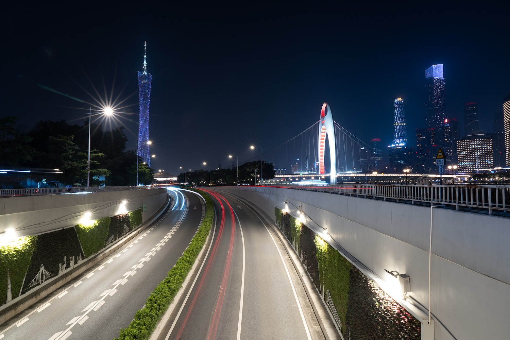

今天刚好是 520，去年也是这个时间我来到了新的部门，做了新的产品，遇见了新的同事，新的技术栈，新的环境，让自己更加沉了下去。有人说 PC 是“坟墓行业”，有人说“这样以后你跳哪家公司？”，还有人说“我们是国区第一”，“我们要行业第一”。

## 前言
这是当初第一次换组满一年时写的[总结](http://pjhubs.com/2021/10/30/talk07/)，当初我庆幸自己可以选择尝试去做工具业务，庆幸自己可以不用每天去纠结那换一套 icon 换一套文案换一套 UI 就要开好几个 AB 实验，纠结那一点点的所谓浮动收益。那是我第一次接触到商业化工具业务，但唯一比较可惜的是这个工具业务并不纯粹，它是一个成长在平台业务下的附属品，必须全方位的为所属平台服务，说白了就是你不能脱离这个平台去做任何事情。

做了一年半后我心生厌倦，厌倦的是那规划不明确厌倦的是那不明所以的所谓技术优化需求，产品需求都停滞了三个月你技术优化又谈何而来。团队分工也不明确，从第一个月起到我离开的那个月，OKR 里都少不了一条“明确北京杭州团队分工”，我实在是不理解到底是需求太多需要分摊，还是需求太少需要抢活。击溃我防线的那件事也只跟一部分玩得比较好的小伙伴说过，我不理解为什么一个做了两个月的需求到在合码前期会说砍就砍，折腾了包括 PM、QA、SDK 和业务研发在内整整两个月的精力，说没就没，更可笑的是，“他们”居然真的一点歉意都没有，只在所谓的“会”上给了一句总结：“考虑到维护成本，这个需求先不上了”，我对这个团队，包括我自己，彻底的失望，并且直到我离开的最后一刻，没有人再说起过这件事，仿佛没有发生过。

关于换部门还有另外一篇非常有意思的文章，如果你感兴趣可以[到此阅读](http://pjhubs.com/2022/04/11/talk17/)。

## 体验
来到新部门后，经过新人光环期（熟悉工程，一个月左右）后直接驻扎到广州团队两个月，那是我第一次来到广州，一来就是两个月。现在让我画一份广州市的地图，我的精确度可以达到 60%，那是一个燥热的夏天，从 6 月到 8 月，我已经很久没有体验过与家如此相似的夏天了。

### 同事
身边的同事确实正如外界对 PC 的印象那般相对老态，但说实话，我现在特别喜欢跟大哥们共事，人狠话不多，可能之前身边接触的都是比较年轻的同事，没有让我感受到太多的所谓“工程师”印象，而在这里，我每天几乎都在感受到上一代工程师们的成熟稳重，完全改变了我对符合职场老油条年龄区间的人的印象。

大哥们见过太多太多的问题，也解决过太多太多的难题，很多东西我们这些后辈没有经历过 PC 增长时代的阶段，完全不知道这里面发生过什么，每一位大哥就好像一本历史书，在他们的手上、脸上甚至思想上，都无不在散发着“工程师”的素养。我从未见过能够聚集起几乎人人都是精英的团队，完完全全的消除了我的年龄焦虑，完完全全的给我树立起了所谓大龄工程师应该要具备什么能力的榜样。

去年来广州主要还是需求缠身，而且还被封闭了，很难接触到大范围的同事。今年胆子放开了，把深圳和广州都去了，目的就是为了见见更多的同事们。这一见收获太大了，而且大家在线上和线下基本上就是两个人，我现在越来越觉得文本是个糟糕表达方式，很容易带上非常多的读者主观臆断，从而带上了错误的情绪去解读文本。所以你会发现写得好的文学作品，甚至是使人沉迷网络小说，都参杂着大量的环境描写，带读者进入作者营造的环境中，在那个环境里进行文本阅读。更进一步说，这也是为什么我十分喜欢使用 emoji 和表情包的原因，我需要带读者进入我所营造的环境中来。

我确实遇到了极个别同事在线上日常沟通中把别人带入了错误的文本阅读环境中，导致我或者其他人理解错误了他的表达，大白话说就是给人看着他的情商很低，不会说话。但回过头来讲，大家都没真正见过面，你也不知道他到底是怎样个人，绝对不能凭三言两语就断定这人如何。所以咧，刚结束的这两周广深之行，从“人”的角度出发，收获很大，整个团队氛围真的极佳。

我曾经在某些非正规场合下与一些小伙伴说过，在之前的部门时我还经常的与 PM 掰扯需求一些点上的正确性，掰扯到后面我居然都已经冒出了想要自己撸需求文档，自己写给自己做了。但来到这里后，虽然平常也几乎每一个需求 PM 都有无法完全说服我的点，但人家终究是极其专业，他们会给你尽一切办法的解释你的困惑，最重要的是还真说服我了。慢慢的发展到现在我已经不会与之前那般质疑 PM 的需求正确性，而是想要去做一个又一个专业且有趣的需求。

### 工作
在这里就不讨论到底是 iOS 还是 PC 的前景更好了吧，放眼望去，有这种想法的人都沦为时代的尘埃了，深刻认识到在职场自己是个工具人，能解决别人解决不了的问题就是极佳的工具人（褒义词）。

作为一名从 iOS 转到 PC 上的人来说，一开始我是真的觉得难度挺大的，虽然从技术栈上看差距不大，没有新增全新的语言，没有新增全新的框架，没有新增全新的理念，但却新增了全新的平台。看着这一切好像都不是新接触到的，但好在组织上去年给了我整整一个月的时间做缓冲，这一点我现在回想起来觉得是真的勇敢。其他有过相关经验的新人就只给两周的时间熟悉，两周后就要开始接需求。

在过去的一年里确实有不少之前小伙伴问过我转到 PC 后感觉如何，但我每次都说“还可以诶！”，这绝对不是敷衍，我是感觉真的还可以！之所以有这种感觉我个人觉得大概率是因为我之前就是在做剪辑工具，从业务角度来看我属于无缝衔接，不需要熟悉业务，相当于我仅仅需要做的就是熟悉工程。更有意思的是，除了业务代码上需要熟悉外，剩下的所有相关的 SDK 我都不需要做任何的熟悉，因为跟之前都说一模一样的，但严格的意义上的区别可能就是之前 SDK 提供的是 OC 接口，现在只有 C/C++ 接口了。

但好在所有的 GUI 框架也都是一个设计思维，必须接受用户的输入才能触发输出，不管是跟踪一个用户反馈的问题还是熟悉一条链路上的逻辑，都非常快的可以上手。要说到现在我还欠缺什么，那必然还是对语言的沉淀不足，真正意义上的开始写 C++ 我也只有来到剪映的一年经验，刚开始很难写出漂亮且规范的逻辑，但现在稍微摸到了门道，知道什么样的 C++ 代码是好的。一年后跳出来看，拿 C++ 写业务还是太傻了，它就不适合写业务逻辑。

私底下我们也吐槽过团队所选的 Qt 作为 GUI 实现的弊端，几乎无法调试，对开发过程极其不友好，极大的拖长了开发进度，也多次畅想如果不用这个框架会有多么舒服。但事后继续仔细思考，不选 Qt 也没有什么好的框架可以承载剪映的重客户端操作性了，毕竟还是需要一个类似“卡贴”的东西去桥接系统 API，而这一点 Qt 这种只在系统之上薄薄一层的 framework 就十分适合，至于其他的框架，除了让写 UI 过程变得舒适外，带来的额外负担只会更多。

关于版本节奏这块，原本是一周一个版本的上车机制，就算是 delay 到了下个版本也就损失一周看数据的时间，但现在是一个月一个版本，我原本以为这样应该不会再像之前那般火急火燎的赶工然后遗留大量 bug 灰度期间再修复了吧。没想到的正是因为这一个月一个版本的机制，所以你的代码质量要更好，你的 bug 修复率要更高，每个版本基本上人力都在吃紧，大家每天看着都非常忙，每个人都焦头烂额，然热我头上现在还挂着七八个月的 bug 没有解决，真不是不想解，这不是我的风格，而是但凡你有点时间就会被下一个需求吃满，你永远只会处在写需求和准备写下一个需求的循环中，不存在给你两天去修复遗留问题，更不存在“有时间的话”这种前提。

说实话，我觉得整个团队（RD 和 QA）的工程素养很高，但业务领域知识过于匮乏，也缺少了解的兴趣。我已经很少很少有机会去跟大家聊视频创作过程中遇到的问题或者好玩的事情了，但好在 PM 们是懂的，每次他们都能够给到我不一样的视角。但这样好像又回到了之前的状态，研发团队对自己研发产品所在的业务领域不了解不感兴趣，PM 说啥做啥没有好的反馈。在去年半年绩效沟通过程中我还纠结过这个问题，问了 +1，“感觉好像最近我们团队没有什么视频创作上的活动和分享了也，我当初就是看上了这点才来的呀”，+1 很委婉的说出了我们的角色定位变了，而且最近需求压力比较大，大家没有什么额外的精力去做这些事情。

我只能说“好吧”，但我内心是十分拒绝的，我个人非常非常喜欢剪映这个产品，所以才在去年心态发生变化时依旧选择了留下来，要不然我真的可能和这家公司说再见了。当初我所想象的场景是，大家都非常喜欢做视频，每天都在讨论如何做好视频，不管是部门还是小组，大家都在讨论视频创作本身，经常会组织一些小活动小比赛，周末也会经常组织拍摄活动。

但是！我几乎从未在群里看到过有任何人在讨论任何关于视频创作的任何内容，目前唯一残存的与视频创作相关的东西就是每位新人入职后的那一份产品体验报告。今年来到广深，很多同事都是第一次见到真人，做自我介绍时大家都对我去年转岗做的新人分享《视频创作》里的高价自行车感兴趣从而记住了我，并不是对分享本身而记住了我。也就是说，如果我没有在视频结尾回答“你的自行车多少钱”这个问题，绝大部分人都记不住我也不知道我是谁。“分享的那堆剪视频的东西我们又不懂，最后的那个价格这么高的自行车记住你了”，听到这句话后我其实一点都高兴不起来，我想得到的和接受的是大家在视频创作过程中的思考和分享，而不是我的自行车多少钱。

## 总结
我原本对剪映真的是充满了期待，我有机会选择了一个工具属性如此之高、离创造者如此之近的团队，但实际上来了以后，虽然工作过程是满足了我对做一个自己平常会用的 app 的想法，但远不能满足我的追求。就从大家平常所聊所思所考的内容中来看，好想是故意绕开了这些，我真的没有从大家身上感受到对剪映这个产品的喜欢，甚至对视频创作、工具产品的喜欢，大家好像就把这个东西当成一份工作，只是刚好这份工作是在剪映而已。

这点无可厚非，可能也只是我个人的追求不同，我不怕压力不怕难写不怕加班不怕动荡不怕解散，但很怕大家对自己做的事情不感兴趣，很怕大家对自己的产品没有思考。奔波在每一个需求中来来往往，追求一些所谓好看的指标，我们完成了多少多少需求，做了多少多少功能，协助 PM 做了多少多少事情，解决了多少多少的 bug 等等，这些东西我个人觉得都不足以上得了台面，这就是我们研发团队应该做的最基本。我看着大家每天都好累，一个需求接一个需求，没有人带来什么新的输入和思考，不过也会有人说这不是作为一名研发应该去思考的问题，你应该去思考如何保证自己的需求保质保量的完成，没有 bug。

要这么说肯定没错，但这在哪家公司哪个团队都一样啊，没有任何区别。可能还会有人说内部资料这么多你咋不去都看看，首先内部资料我基本上都过了一遍，这就跟每座城市基本上都有图书馆，为什么你还有这么多的为什么是一个道理，很多东西就是需要去营造氛围。

如果不是因为这个团队是剪映，它真的很平庸，但也正是因为它是剪映，所以才独树一格，令我当初魂牵梦萦。