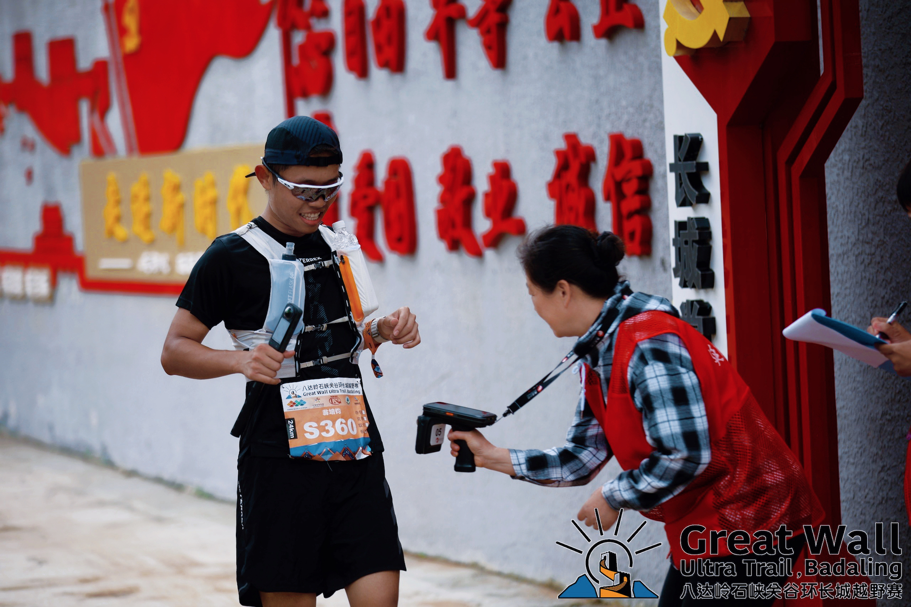
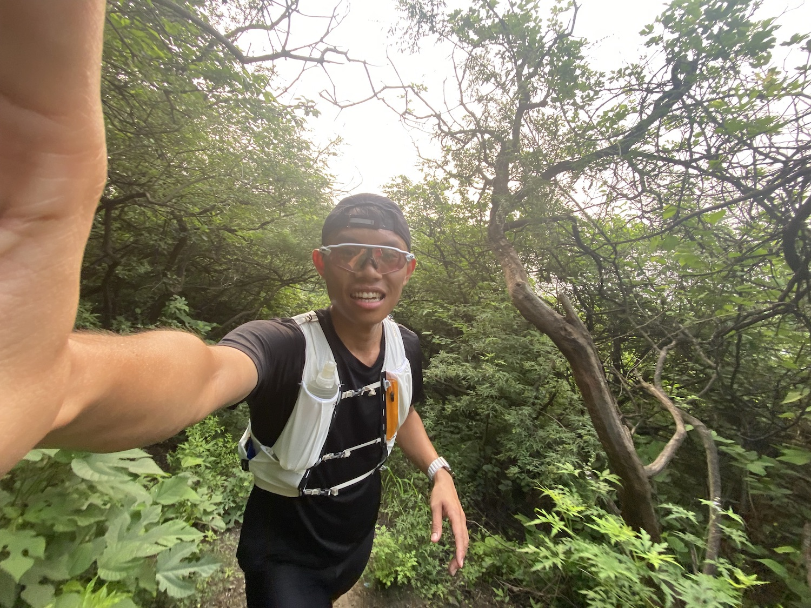
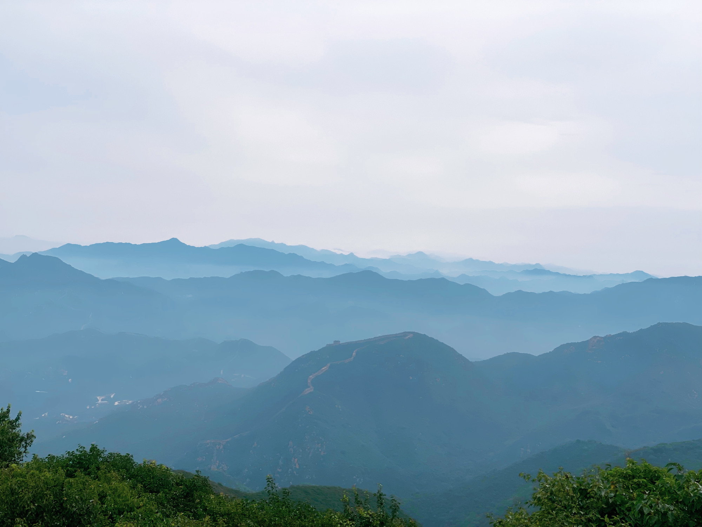
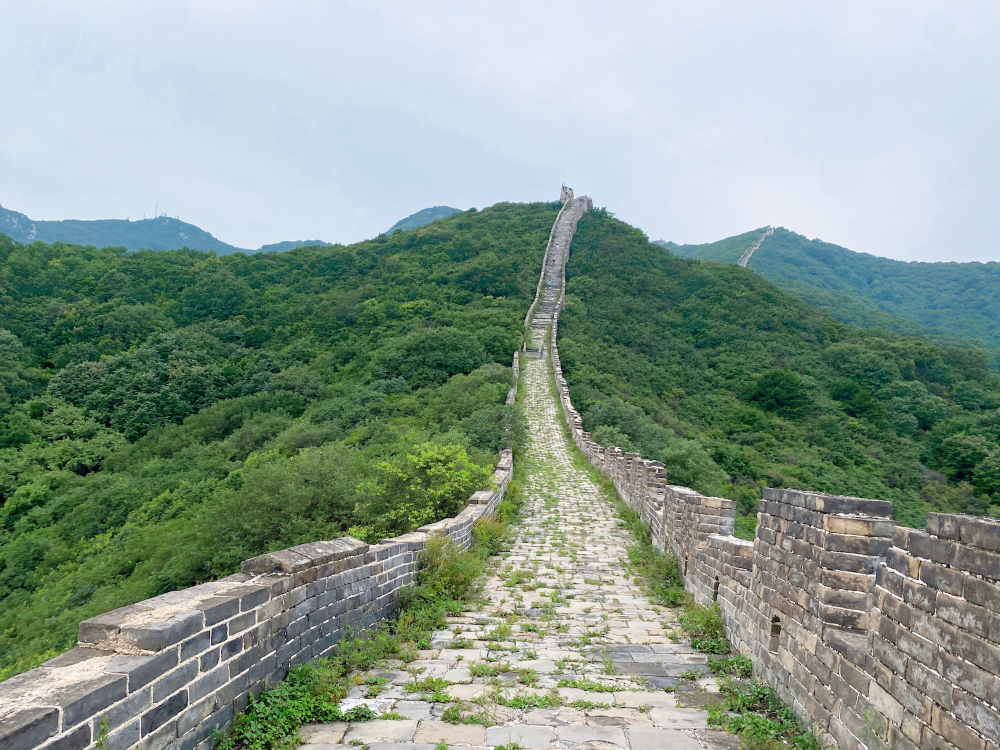
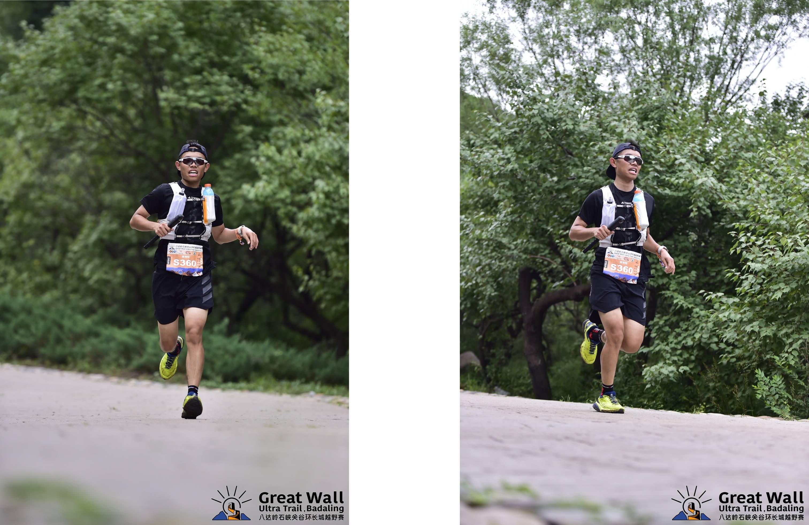

没想到我的第一次越野跑比赛会来得如此快乐，如果不是因为上半年和小伙伴一起约好了 9.9 去威海参加越野跑比赛，可能我对越野跑还只能停留在“香山”和“三峰”上。但就因为这第一次越野跑比赛，没想到捡了个 24km 男子组第四，石峡关谷是我去过的第四个长城，每一个长城都有其绝美景色之处，我可太爱了！

## 回顾
之所以我会去越野跑，完全是因为去年秋天有人组局提议去爬山徒步，而我经历过之前雪后爬香山好汉坡的痛苦，当时啥也不知道穿的一双篮球鞋就去爬山了，一路上给我滑的......十分痛苦。故借此机会，我找了渠道买了双凯乐石的越野跑鞋，价格十分优惠。去年秋天进了十几次山，不管是徒步还是越野跑，虽然都比较初级，但完全给我打开了一个除了骑车去户外，接触大自然的另一种方式，我很喜欢。

到了今年，上半年因为要干旅行大事，因此也没有继续再进山，直到跑完了第一个半马后，发现和小伙伴们一起出去做点啥还是非常有意思的，大家提议不如下半年再报一个越野跑，此时，威海越野跑比赛出现了，遂成行。

越野跑首先是越野，其次才是跑。所以很多人都说越野跑是马拉松的终点，并且实际上也有非常多的马拉松运动员在职业生涯的后期或者中间穿插参加越野跑赛事。对我自己而言，越野跑一开始就是一个冬季运动，我是一个非常怕冷也怕热的人，特别是之前冬天去山里骑车，每次我都极其痛苦，因为自己比较瘦，体重仅有 61kg 左右，而体脂率也常年在 14% 左右，本身就无法存储太多的脂肪，冬天骑在车子上，冷风呼呼一刮，大量的热量就这么白白的散失掉了。

好巧不巧，北京真的是太适合做这些运动了！打车从我家（大钟寺附近）半小时即可到达香山，马上就可以开跑，跑完后马上就可以继续打车或者地铁回家，并且香山附近有大量的商铺，完全不用为补给担心。一圈下来距离大概 12km 左右，有上坡有下坡，有土路有碎石路有防火道，重点是风景也还非常不错，附近就是几大公园，山里四通八达，如果发生意外随时可下撤，我个人觉得没有比香山更适合日常越野跑训练的地方了。

## 比赛
我的人生中第一场越野跑比赛的全名是《八达岭石峡关谷环长城越野赛》，地点就是在八达岭长城附近的石峡关谷野长城景区，交通非常方便，从清河站直接 20 元动车 22 分钟到达八达岭长城站，那附近几个村子里有大量的民宿，吃喝拉撒完全不愁。要我说唯一的缺点就是比赛日期还处在暑假时间内（8.27），去哪人都多。幸亏赛场是在野长城景区，虽然本身也是长城，但名气远不及八达岭长城那般，再加上比赛开始的时间较早（7:00），整个景区直接包场。

当初只所以选择这个比赛作为人生首野而不是威海，完全是因为我想找个距离的越野跑比赛先行测试一下自己的状态，毕竟威海得在山里奔跑 30km 并爬 1600m，最长跑步距离只有半马的我看到如此长度和高度瑟瑟发抖。石峡关谷比赛的报名费两百左右，个人觉得符合预期，我报名了 24km 组别，只有两个 CP 点，估摸着如果不冲成绩，而是一路嘻嘻哈哈玩耍过去，补给就可以吃掉 100，两件马孔多的定制赛事服，再怎么便宜也得合计 50 吧，剩下的奖牌和毛毯再合计几十，还有比赛结束后的额外吃喝，整场比赛的指路和医疗保障服务，两百多确实符合预期。

对于这场比赛我的预期非常低非常简单，完赛就好，根本没有任何的名次要求。毕竟还是第一次，主要是去把握赛事节奏，适应状态。但好巧不巧，周日的比赛跟同一周的海坨山越野撞期了，稍微对成绩有些要求或者眼光更高的大佬们基本上都去了海坨山，就导致石峡关谷的这个比赛本身就没有多少竞争力，再加上我自己报名的是 24km，后来才知道但凡我中途抓紧一些，不要拍照，不要玩耍，完全有站台的机会。就我摆成这样了，最后都能拿到第四。

因此呢，经过这场比赛下来我得出了一个经验，一定要赛前看好路线，如果能够看到参赛名单就要多看两眼，仔细分析自己是否可以拿到好名次，但凡可以有可以拿到好名次的机会，就要调整好状态，争取拿下，因为越野跑是个耐力 + 技巧的运动，不像马拉松一样单靠一身蛮力就可以大杀四方。这点跟自行车运动很类似，骑车的时候最担心的就是状态下滑，而状态下滑的时候并不完全是因为补给不到位，很有可能就是策略问题，明明这个坡你可以 70% ftp 骑完，但因为刚出发正在兴头上，可能 120% ftp 顶满心率骑完了，导致放坡或者后面的路段状态下滑，吃再多补给都没用。

回到这场比赛中来。刚开始出发时，我没有刻意的把自己顶爆去追赶第一集团，因为我深知前面就要开爬长城了，我自己的优势并不在平路或者起伏路段，我可以在爬长城或者上坡中追一追人，因此也就在刚出发时稳住心率，快速的调整进入比赛的状态。接下里进入爬长城路段后，幸亏自己之前爬过长城，知道长城的台阶多么吓人，刚开始爬长城时也没有完全把自己顶爆一路跑上去，而是继续稳住心率，一步一个台阶的慢慢上去，与好几个大哥一起肩并肩走了好长的一段距离，甚至因为看到石峡关谷如此美景心情大好和大哥们聊了几句。

后来开始爬到了本次赛事的最高点 1200m 左右的清水顶，开始下坡。土路下坡我一直觉得是自己最大的劣势，但经过之前几次去香山的训练后发现，自己的下坡还算 ok，没有特别拖后腿，我觉得最主要的原因就是“敢踩敢跑”。一部分人有较好的下坡水平，但因为心理原因无法放下大胆的下坡。但还是那句话，赛前的训练和模拟真的非常重要，经历过香山的路况训练，石峡关谷的这些土路、碎石路、石板路等等都不是问题，速度完全可以拉得起来，也确实往前追了好多时间。

但现在回想起来比较遗憾的就是赛前没有认真对待路线图，没有把看路线这件事放得很重，如果能够对路线更加在意一些，中途可以省下非常多的时间继续往前追赶。不过这都是后话了，如果不是因为 14km 处大爷的一句“你们前面没几个人了，你们现在是第五第六”的话，我可能真的就是继续一路休闲看风景了。

从清水顶走十八盘放坡来到石峡村，这是第一个 CP 点，吃喝非常丰富，完全超乎我的想象，但当时我自己完全不饿，原本想继续多待一些时间多吃一些水果，可惜小伙伴敏锐的发现了机会，让我速速前进，匆匆拿了瓶佳得乐就往前离开了。继续往前后脑子里一直在想，“要是我自己一个人肯定吃几块西瓜和火勺再走，太浪费了”。

从石峡村离开往前继续跑了两公里水泥路后继续开爬长城，此时遇见了女子 24km 组别的第二第三名，我是没想到当时遇见的这两个姐姐就是第二第三，只是知道她俩非常强，完全具备冲击 40km 站台的实力，跑 24km 完全是屈才了。不得不说从石峡村出来继续爬的这个长城比刚开始从景区进去爬的那段长城陡太多了，如果不是比赛而是平时过来玩耍，我觉得就这一段我能爬半小时。

也是从这段长城开始，我慢慢的调整起了状态，毕竟要结束了嘛，再加上大爷的那番我们前面没有几个人的一番话，彻底的激发了我对名次的欲望，如果能够在第一场越野跑比赛中就拿下好名次，这对我未来的越野跑运动上将会是巨大的激励。想到这我立马就丢下小伙伴独自一人开路前进，看着手表上逐渐缩短的距离，心里对终点前的冲刺就越发的期待。

经过一番追赶，终于来到了最后一段土路。这段土路的路况真的是差到了极点，雨后拦路就算了，路上还混杂着 6km 组别的小朋友和家长，我一路上都在喊着“不好意思，接过一下，谢谢”，跑跑停停。如果没有这些小朋友和家长的阻碍，我估计时间上还能继续快个几分钟。到了后面我越跑越兴奋，越跑越期待，没想到最后居然冒出了“我不会真的可以站台吧？”的大胆想法。

后来看了赛事给的成绩单，虽然我是 24km 男子第四，但实际上离第三名差了半小时，才猛的发现就算我前面再怎么扣时间，再怎么扣细节，都无法省出这半小时，差距还是非常大的。

## 总结
整体而言我对自己跑的这第一场越野跑比赛非常的满意，远超预期。从未想过自己可以在骑车之外的户外运动上有如此大成就，虽然只是个没什么名气的小比赛，虽然只是个越野跑非常基础的组别，虽然并没有站台，但这毕竟是我的第一次啊，每每想到这里都觉得自己充满了无限的潜力，可以借助这次的红利期继续探一探自己的上限到哪。

除了下一周的威海 30km 越野跑完，还有 10 月 15 号的金山岭长城 50km。对，还是跑长城，在赛场上我边爬长城的陡坡和台阶脑子里边在想，这一定是我最后一次来跑长城，反手到了第二天看到了“金山岭长城 100”的报名信息后，二话不说直接报上了，可能这真的是爱吧。

希望自己今年能够在越野跑的赛场上找到新的自洽点！
