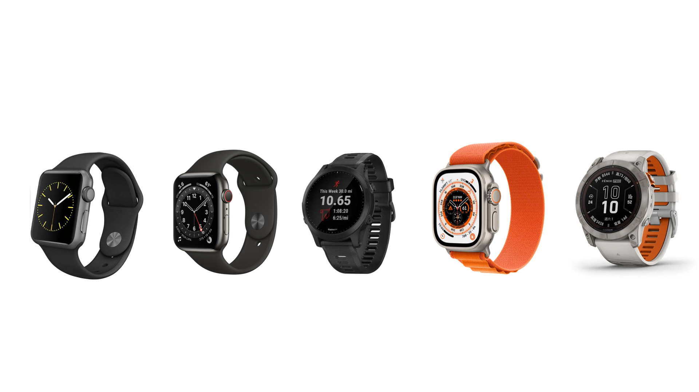

在非传统表体系下，从 2020 年开始我总共使用过三块 apple watch，两块 Garmin。在过去的这三年时间里，换了这么多块表，我的内心做过非常多的纠结和选择，有过多层面的思考。不管是 aw 还是 Garmin 在我的不同使用场景下都有不尽人意的地方，这篇文章就来好好的说一说这些事。

## 背景
### 从第一块表开始
在开始之前我们先确定一个概念，传统表指的是：**不具备任何与手机连接的能力，并且其内部通过机械机芯驱动计时。**当然，这只是我的定义，只要符合这个定义的表我都认为是传统表。除此之外，类似 G-Shock 小黑块这种陪伴了我大学期间的电子表，它也不是传统表。在这篇文章中，我们会跳过对传统表的内容，而直接进入到非传统表中。

我的第一块非传统表就是 G-Shock 小黑块，入手它的时间是大二刚开学，需要一块表的原因也很简单。原先高中时父亲赠予我的那块传统石英表是皮表带，价格虽然对当时高中的我来说非常昂贵，但因为皮质表带并不适用海南本地天气而佩戴的机会极少，只有在考试时才作为计时工具而带上它。最致命的一次创伤是，我在学生宿舍里睡的是上铺，一次不经意间我从床上拿东西，顺带把这块父亲赠予我的表，就这么“pia ji”一下，摔落到地上。

很明显，这块表受到了重创，背壳和表壳分离了。我重新按好后，指针居然都不转了，心里疯狂责备自己，怎么会如此的不小心。后来的事情更简单了，去西单花了 680 元换了机芯。这块表修好后，我就彻底封藏了它，但我自己目前还处在一个学生阶段，对手表的需求是非常迫切的，却实在是难以向家里人继续开口要钱买表。

遂开逛淘宝，发现了 G-Shock 小黑块这个电子表，也才了解到原来 G-Shock 的防护性这么强，再也不用担心从上铺把表摔到地上后会四分五裂了！但就算是基础版的小黑块官方渠道也需要六七百元，这个钱我也是肯定拿不出来的，只能退而求其次选择了水货，仅需不到四百就搞定了，就这样这个小黑块一直陪伴了我后续的整个大学生活，有了它的陪伴在无法通过手机得知当前时间的情况下，确实给到了我非常多的帮助，尤其是它完美的防水、防撞、长续航的优势，甚至去澡堂洗澡我也从来不脱。

一直到毕业后，来到 2020 年。开始工作后，手里富裕的资金多了起来，总想去做一些自己之前非常想做但因为资金限制而无法去做的事情，比如 apple watch。第一次对 aw 产生想法是大一新生阶段参加 ifLab 社团招新会时，看到台上的学长左手戴着一块蓝色表带银色的 apple watch，好酷啊！！！当时就下定决心，以后有钱了自己也要买一块。

### 第一块 apple watch
所以工作后有钱了就买了一块 apple watch。当时买的是 S5 深空灰铝合金版，第一次用 aw 非常新鲜，因为当时买 aw 的目的就是为了运动，每天的运动圆环必须全部填满，每一个特殊日期徽章必须拿下，除了充电和洗澡也完全不会脱掉它，这是 aw 给我的第一个改变。表带也买了很多。基本上可以认为因为有了这一块 aw，我看手机的时间确实减少了非常多，因为我可以明确的知道，如果手机上有任何的消息都会同步到 aw 上，完全没有必要反复的去手机上查看，这是 aw 给我的第二个改变。

第三个改变，我觉得应该就是纯粹的工程师思维，我想要在 aw 上去做一些东西。但这个平台真的好难也，如果大家有用过 YAOYAO 这个在 aw 上的跳绳应用的话，我真的觉得 YAOYAO 的开发者真是神一般的产品思维，首先是开发者能够想到可以在 aw 这个平台上搞跳绳这种传统运动，相当于是创新。其次是可以把 aw 的硬件能力调试得如此逼真和准确，这相当于是勇气。最后是开发者完整的做出来了这个 app，并没有变为一个 demo 流产掉了，而是非常成体系的上架、维护并迭代了，这相当于是坚持。

你看，我目前还只是具备工程师思维，但没有工程师精神，这还不能算是我的缺点吧，我个人觉得应该还是眼界和层次没达到。后来等到 S6 发布的时候，完全就是冲着血氧监测器和全天候高度计去的，因为当时自己还会去到一些高原旅行，就是需要血氧检测，在骑车的过程中就是需要看当前海拔。事实上当年的国庆节我确实就是去了一趟川西小环线，并且还真的就是第一天高反了，当天晚上就发低烧了。在车上我反复通过 aw 查看我自己的血氧指标，虽然不是特别准确，但非常明显的感受到自己血氧指标在往下掉，临近傍晚时分血氧指标已经来到了 86%，与酒店前台用的血氧仪测出来的 89% 虽有一定差距，但还是让我心里有了一丝慰藉。

从那以后我就成为了 aw 的拥趸。

### 关于佳明
说完了以上两个故事，按道理此时应该没有佳明什么事了，但事情的转机就发生在了 21 年端午我去上海玩耍时，突然萌生了一个早期 citywalk 想法，当时完全不知道有 citywalk 这个概念，更不知道当时自己所做的那个行为就是 citywalk，并且一直到今年上半年周末旅行时，也完全不知道当时的自己所做就是 citywalk，直到现在我也没有去深究到底什么是 citywalk，以及它是怎么出现的。

那对于 citywalk 来说，刚好当时我也是第一次来到上海，必然要把上海远近闻名的一些地方都给去，但我又想记录下这一天所达之处的轨迹，必然需要持续不断的记录 GPS 信息。但非常可惜的是，别说当时了，就算是现在 apple watch 也依旧无法做到允许用户自行切换 GPS 精度、调整 GPS 频率甚至是 GPS 卫星类型等这些细粒度的操作，全凭 watchOS 系统本身的所谓“自适应”自动的进行这些操作，换句话说就是，宁愿让你的设备消耗过载（发热），也不是很情愿的降低各种采集精度，可问题是我明明都要没电了你还这么做，实在是搞不懂为什么。

因此我为了保证自己能够在接下来的时间里不对所记录的轨迹产生中断，在上海买了一块佳明 Forerunner 945，刚好这个系列主打的三项运动游泳、跑步和骑车自己平常都会去接触，当时是花了 4600 左右。用了 945 整整一年，这个过程非常好非常完美，没有发生过任何让我感到不爽的地方，甚至在某些体验上还让我感到远超 aw 的感受。

但一切的转机就发生在了 22 年也就是去年的 apple 秋季发布会，在发布会上 apple 发布了全新了 apple watch ultra 系列，让我感受到了 apple 在户外运动甚至是极限运动上的热情和颠覆，再次燃起了我对 apple watch 欲望，我要买一块 ultra！因此在发布当天我就去三里屯排队买了首发 ultra，一直佩戴到写这篇文章时，因为写完这篇文章后，我的 ultra 就要卖给学弟了，以后只有佳明陪伴我了。

## 对比
以上就是我使用 aw 和佳明的一些背景故事，写这么多完全就是为了让大家先有一个初步的印象，大致清楚我对这两个牌子的感受是啥样的，我个人还是觉得自己对于细分领域的使用场景还是有很多想法的。接下里我将分几大环节再仔仔细细的对比 aw 和佳明的区别，帮助自己回顾并总结过去三年来的手表使用情况，顺便如果能够协助大家进行购买判断是最好不过了！

### 系统与生态
apple watch 上所运行的系统为 watchOS，最新版本的 watchOS 10 已经具备在系统自带的“运动” app 里通过蓝牙协议连接外设，如骑行运动时所用的功率计、踏频计等。佳明所有全系手表运行的都是佳明专属系统，这两个系统本身就是智能系统，而不是功能系统。智能系统的意思是，运行开发者通过厂商外露的 API 文档自行开发应用程序，而不是功能系统那样全权交由一方或二方开发者进行开发应用程序，说得再简单一些就是，不管你买的 aw 还是佳明，都可以通过自身配套的应用程序市场自行随意的下载你所需的 app，而不用等待厂商发布。

只是对于我来说，我更喜欢 watchOS 的开发方式，它更现代化，我也更熟悉。我开发一个 watchOS app 不需要熟悉语言语法、API 接口，缺的只是一个想法，而佳明是我完全没有接触过的平台，我需要近乎全部推倒重来，因为佳明采用的是自定义的拓展类 Java 语法（[Monkey C](https://developer.garmin.com/connect-iq/monkey-c/)），虽然也是 MVC 设计模式开发流程，但所使用的 IDE 和配套的插件环境都很迷，包括真机调试方式都太老土了，导致我一直没有任何想法想要在佳明这个平台去实现。反观 watchOS，我几乎每年都会冒出很多的想法想要去实现，就是因为 watchOS 做的体验非常好，好到可以让你去为它思考。

但佳明就是通过其在运动领域非常牛逼的 anti+ 协议吊打蓝牙，anti+ 并不是拥有什么神奇魔力的银弹协议，因为它完全就是佳明自己开发的私有协议，不是类似蓝牙这种公开通用协议，那必然不需要做到所有设备都需要兼容，只有设备来兼容 anti+，它自己不需要去为了兼容其他设备而做出妥协，那必然会做到极致的省电。

但佳明就是有这种能力做到让设备厂商来支持它的协议，并且还能从中赚协议的钱。从系统和生态上来看，aw 通过优质的系统体验来让用户和开发者全心全意的投入其中，但佳明却通过私有协议和导航军工背景死死的抓住了真正的户外玩家导致这块蛋糕完全无法被其他人分掉。双方平手。

### 外观与功能
aw 大家都比较熟悉就不多拓展了，而佳明的细分方向太多了，有专门用于铁人三项运动的 forerunner 系列，还有用户徒步登山户外的 Fenix 系列，也有专著极限长距离徒步、越野跑系列的 enduro 系列，甚至还有专门服务特别军事行动的跳伞、侦查等系列，佳明就算是转型 toC 也不忘自己原先的军工背景。

我自己是拥有过 forerunner 和 fenix 系列，forerunner 我自己本身就非常喜欢，非常轻续航也非常顶，综合下来生活和运动搭配得最好。fenix 是这两天才购入，我是专门用来越野跑和徒步的，因为经过自己之前十几次的越野跑经历，外露的设备需要非常耐刮，我自己的 iPhone 屏幕就被岩石划擦了两道划痕，并且我的 forerunner 也因为摔车而被划擦。因此我这一次再购入佳明直接选择了 fenix 7 pro 旗舰款，不但可以太阳能补电还具备和 aw ultra 一样的钛合金外壳，注意我这里说的外壳，而不是 ultra 那般钛合金机身。论质感 ultra 还是非常给力的。

至于各个运动小项上，我觉得都很一般，除了极个别专门定制过的运动项目外，比如骑车、跑步、游泳外，省下的所有运动项目两家几乎都是一水的只记录心率和卡路里就算了。但就算如此，aw 也没有像佳明那般，通过这种模式开发了一百多项运动项目，这让我觉得佳明很搞笑，明明就是都一样的东西，篮球和羽毛球都只能记录心率和卡路里，多一个运动项目本质上没有区别，但通过这种 copy 的方式可以让不明所以的用户觉得佳明更牛逼。

在外观和功能上，二者我觉得 ultra 完胜，ultra 就是一个艺术品，花了一样的价钱，佳明就是很像玩具，完全达不到自己的心理预期，总感觉价格和实物“德不配位”。

### 续航
在 ultra 未发布之前，续航一直就是 aw 的笑话，都到了第九代了，还保持着 18 个小时的常规续航，我觉得这并不是当下科技水平发展停滞不前了，完全就是 aw 整个产品策略的严重错误，更离谱的是居然这个习惯还保持到了 ultra 上！ultra 一代发布的时候，apple 给了他常规 36 小时，开启省电模式后 60 个小时的续航，上周发布 ultra 二代后，居然常规续航还是 36 小时，开启省电模式后来到了 70 个小时，这完全就是搞错了 ultra 用户的定位啊！

我是一个有产品情怀的人，我可以接受你一代的不完美，并且支持你的想法，但你当时给我们用户 ultra 的预期是主打户外甚至是极限运动领域，在这个领域下流畅的系统动画、智能的语音助手、细腻的屏幕效果、能够容纳更多内容的表盘完全就不是这个用户群所关注的内容啊，我们只关注定位、续航和耐用度。因为在户外这三点就是救命的三要素，ultra 一代解决了定位和耐用度，甚至还具备良好的急救方案，续航也确实比标准版 aw 长了一倍，理应在 ultra 二代继续保持这个优势。

但经过上周的发布会后，我再次对 aw 产生了遗憾。我很不理解都芯片都换制程了，为什么常规续航还不长，虽然给长了省电模式的续航，但省电模式下续航增长那是必然的啊，在省电模式下 GPS、心率、表盘等各种传感器都变成了 1 分钟刷新一次，本身就应该增长更长的续航。但为什么到了二代只是多了一个能够容纳更多内容的表盘而不去专精下续航呢？我原本对上周的发布会不发布 ultra 2 代是有预期的，因为才发布一年的时间，按照 apple 去年对 ultra 的定位，他们可能需要更长的时间去判断下一代 ultra 的更新重点，迭代周期肯定不能像标准版那样每年都常规更新。

没想到现实给我狠狠的上了一课，apple 一点都不酷，它真的只是一家商业性驱动比其它家更强的公司，推出 apple silicon 也并不是他们有多么大的能耐多么大的梦想去推动整个计算机体系结构的更迭，完全就是因为 mac 卖不动了。apple 做那么多年的教育也不完全是真的就是为教育付出，更大的可能是为了培养下一代忠实的用户，并以此给予先入为主的印象。因此我对 ultra 2 代非常非常失望，完全看不懂 apple 在过去的一年中到底在干嘛，我已经无法说服自己去接受 apple 是一家很酷的公司了，因为他们并没有在做很酷的事情。

反观佳明，虽然股价在过去一段时间遭遇了拦腰式下降，但最近几个月的时间整整慢慢的恢复到最高峰时的一半，并且从最近一些发布的新品来看，佳明确实在听用户的反馈，确实在快速的响应市场变化，尤其是 forerunner 系列，原本是两三年才一更新的款式，愣是被市场逼得一年一更。虽然我打心底里认为专业产品就不应该一年一更，但佳明的这种市场策略调整还是让我非常意外，让我感觉可能老态龙钟的企业正在焕发第二春。

再补充一下我为什么觉得专业产品不应该一年一更。首先是专业产品面向的人群就是专业用户，他们对产品本身就是非常苛刻，这些专业用户一买就会直接买最好的产品，因为他们正在做最好最专业的事情。其次专业产品的更迭一定是比标准产品更加的困难，因为他们要等待更多的专业用户反馈，去做更多的专业场景专业市场的调研，针对性的解决专业条件的问题，而不是当下什么火做什么。最后，专业产品需要投入非常多的研发成本，极有可能多花费了 20% 的金钱只为解决那 5% 甚至 1% 的使用场景，虽然看上去很违反商业直觉，但这就是做专业产品所要付出的成本。因此我反而更加期待佳明未来在原本就已经非常强大的专业运动产品上，针对国产厂商和 apple 等企业的围堵会做出什么样的改变，这是一件非常有趣的事情。

回到续航这件事上来，如果你购买一块表的目的不是为了运动，而是为了有一块续航稍长、质感超棒的智能手表，那 ultra 非常适合你，本身就是三天一充，再加上果子强大的系统体验优化，日常使用 ultra 就是在用一块艺术品，再搭配上一些时长控制在六七个小时以内的中长耗时运动，ultra 的使用体验上是第一。

但如果你本身就是一个非常喜欢户外的人，喜欢一天都扎到户外去跑到山里去，甚至一到假期就玩各种长距离长耗时运动，别说 ultra 了，电宝可能都要带两三个。那么这个时候手表的智能性高低就不是我们考虑的第一要义了，而是选择一个能够支撑自己做完这些事情的设备才是需要考虑的事情，因此就回到了佳明，可以通过牺牲一些系统层面上的体验来提升续航上的优势。

### 使用场景
之所以让我再次放弃 aw 而再次拥抱佳明，原因就是我逐渐发现自己在周末在假期接触户外运动的时间越来越多了，甚至以后还想玩自己的一个百公里越野跑（可能就在明年），那这种情况下动辄十几个小时的 GPS 记录，ultra 是完全不可能的。但我又不能让自己去适应设备，因为这明明就是让设备适应自己的事情，哪有人花了几千块买了个设备，还天天供着它呢对吧？

因此我再次选择卖掉了 ultra 而选择了佳明，一想到我可以不用纠结自己手上设备还剩多少电量，而是仅需专注自己当下的身体状态、还剩多少距离没跑等就十分开心，我甚至还未雨绸缪的想到万一在长距离比赛中 ultra 没电了，在补给点休息时可以给 ultra 充个电而花了将近 600 元的价格买了贝尔金可供 ultra 快充的电宝，现在想起来自己真是个小可爱。

再加上我完全不认为在日常的使用场景下，aw 有什么场景是佳明做不到的。如果拿跑步来说，我现在跑步之所以不带手机完全是因为刚好 ultra 自带蜂窝网络连接，但我又舍不得浪费 ultra 的蜂窝网络连接功能而被迫在跑步场景下不带手机，但实际上我跑步的时候是需要带手机的，早起跑步结束后我原先的习惯是跑完后在楼下买早餐买水，上楼回家直接就吃早餐休息了，但不知道为什么店家扫了我的 ultra 上微信支付二维码后发现不支持这种方式付款，导致我现在就得跑完步后先上楼再下楼。如果是觉得带手机跑步比较重，可以通过买一条跑步专用裤子，把手机放在腰上就可以解决，无感。

拿坐功能交通来说，我觉得手表作为支付工具就非常的蠢。你都出门在外了，怎么可能会出现只带手表不带手机的情况呢？因此通过手表进行公共交通付款的意义也就不存在了。至于听音乐听播客，这点确实没办法，我是一个跑步中喜欢听点东西的人，佳明目前只能支持三个音乐平台的提前缓存而做到只带手表的情况下听音乐，无法听播客或者自定义播放源，但这里有个大前提，一定是你户外运动时不喜欢带手机才会出现这种尴尬的场景。

但千言万语，不管我再怎么去分析这两个牌子的设备在日常生活中的使用场景，就从我个人角度出发，aw 都是独一无二的存在，佳明就算是再追赶几年都不一定能追得上，我也非常建议如果你的使用场景中完全就没有爬一天的山、徒好几天的步、跑长距离比赛情况，ultra 甚至标准版的 aw 都已经完全足够了，甚至还会收获极致效率，摆脱手机依赖症。但如果你有这些情况，那请完全放弃对 aw 的幻想，我这属于是二进宫，都给了 apple 两次机会了，它都不能很好的解决我的问题，那为什么我们还要花费自己这么多的钱去支持一个解决不了自己问题的产品上呢？

## 总结
我对 apple 很有感情，apple 给了我很多非常特立独行的体验，我也一直觉得 apple 是一家酷炫的公司，不管是他们的企业文化还是产品策略，我之前都是很相信的。但唯独到了我非常有话语权的户外运动场景，我一开始的状态是惊讶于 apple 居然能够看得上如此小众的场景，原因花费这么多的成本去满足这一部分人群的诉求，到现在才恍然大悟，apple 其实并不是看上了这部分小众人群，而是完全没看上，只是想借助这部分人群的特质和人群场景来刺激普通用户深层次的消费欲望，让普通用户感觉到我买了 ultra 就可以具备这些人群特质，但实际上这仅仅只是一个商业化手段，我很失望，算是一次比较完整的认识到了 apple 的产品策略。

佳明没得办法，无奈对手太拉垮，自己还没发力对手就先躺下了。在去年 ultra 1 代推出时，佳明的风评很不好，老是不被市场看好，总觉得 apple 入场专业运动领域后佳明要倒闭，因为论做系统佳明真的不是 apple 的对手，我反而觉得 apple 可以就针对 ultra 来一个更细粒度的传感器控制策略，就抄佳明的策略，或者多提供几个模式，让用户自行控制各种传感器的调用频率，这才是 ultra 的本意啊，反而不知道为啥都过去快 10 年了，aw 每年都还一直在玩换表盘这种非常无聊的更新，毫无意义。

因此，我对 aw 彻彻底底的失望了，我原本以为 ultra 会是 aw 发展到 10 年之期的再次雄起之作，然而却泛起一点涟漪后，黯然退下，很是唏嘘啊！那主动权现在就来到了佳明这边，持续优化自己的优势，好好的教一下 apple 怎么做表吧。