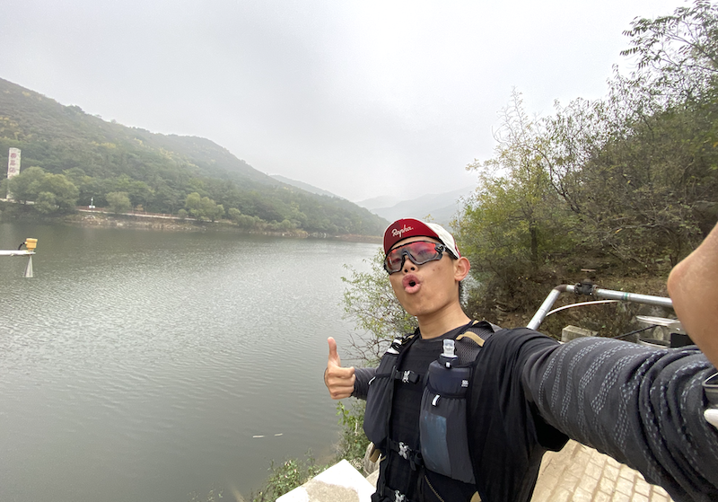
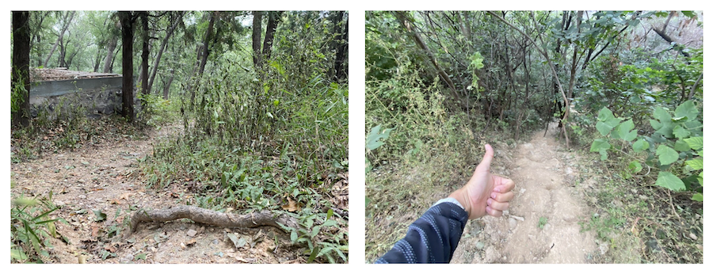
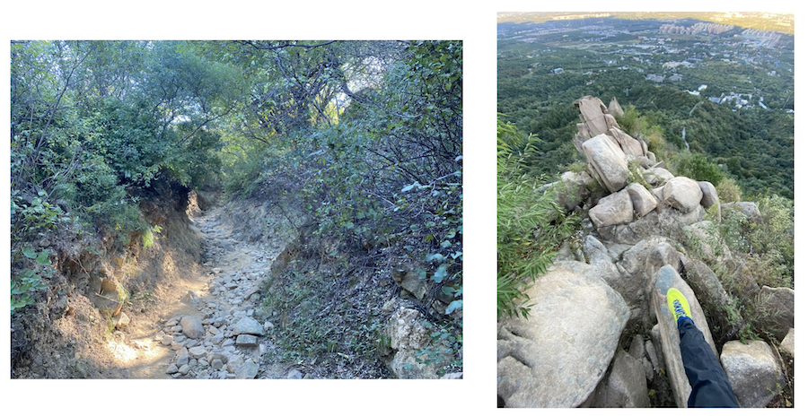
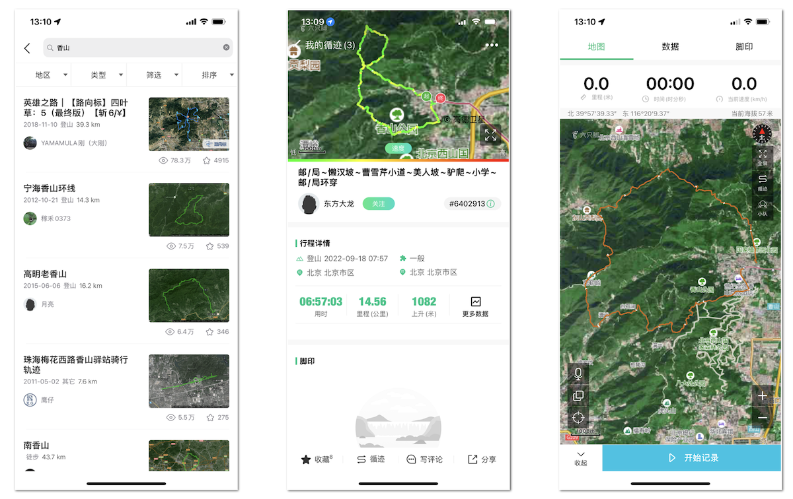
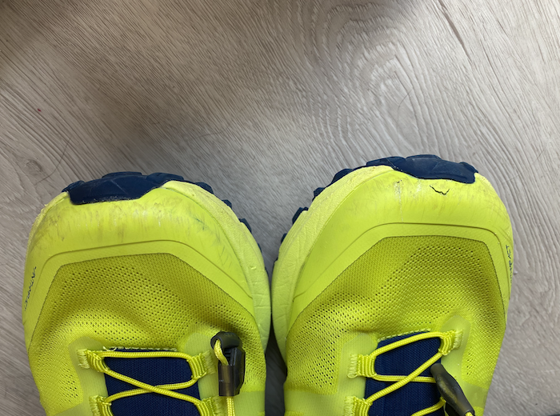

最近很久没有骑车了，回想起来全是因为一个月前的“潭王路被捅”事件引起的，让我对骑车这件事产生了深深的恐惧甚至对这个社会本身也产生了莫大的深渊感。但我却是一个热爱运动的人，重新穿回跑鞋开始跑步，最近的一次成绩已经把 10km 跑进 50 分以内了，这对我当初来说是个非常困难的事情，而国庆的 10 天假期里，我尝试并爱上了越野跑。

## 前言
可能这个冬天都不会再深入户外骑车了，一个月前的那件事对我影响非常大，如果正在看此文的你有我微信且对此事感兴趣可以看下今年 9 月 10 日所发内容，我真的从未见过如此场景也从未感受到如此无助过。一个月过去了，现在再回想起来依旧恐怖如斯，就感觉当时骑在车上的我就是后面追我那辆车的靶子，随时要撞上我，随时要拿着那把黑色刀柄银色刀片的水果刀捅向我......

还没到做噩梦的地步，但我每次骑上车每次用力踩踏都会或多或少的浮现出逃命的几个场景片段，所以决定换个运动，车......找兔爷做了次大保健后放着了，来年开春再战。

进行了两周的路跑，身体素质还算不错，至少不会像当初在广州开始认真跑步时的那一次 5km，跑到 3km 时开始岔气，跑完后腿疼了两天，国庆前的那一周最新成绩 10k 已经跑进 50 分了，跑完停表的那一瞬间，大喊了一声，心里默念“成功了成功了！”，10km 跑进 50 分对我来说是一件非常困难非常难受的一件事。

我一直非常抵触跑步，秉承“非必要不跑步”的心态一直到了初一，跟随父母自驾去了一趟广东，目的是为了调研家里生意的合作工厂，第一天就从海海南口开到了广东增城（当年还是个独立市），从白天开到晚上，我从没见识过如此丰富立体的服务区，大陆的服务区是真的“服务区”啊，在小岛上服务区就一个加油站，搭配一个便利店或者咖啡厅就五星服务区了，在大陆的服务区里居然还有肯德基！！！这对当时的我来说是一个莫大的惊喜，所以我一路吃喝过去。悲哀的是，我因此水土不服导致了消化不良，整整一个星期茶饭不思也无法排便，喝了好几倍协助消化的“广东凉茶”也无济于事。

从广东回来后，我深刻感受到了身体素质差劲的后果因此开始锻炼之旅，遂跑步。当初那段时间基本上一有空就会去跑上两三公里，甚至还练出了一丢丢成绩，延续到高中校运动会时还仗着自己有些跑步基础，参加了 24x200 接力赛并且居然跑过了当初“全校最快男人”——道长，暗暗自喜了许久。

后来一直到大学毕业时，运动都不再是我的首选项，因为舟车劳顿对我来已不再是个问题，去过的地方多了身体也已自然而然的适应，再往后毕业的故事想必大家也都清楚很多了没必要再展开。

## 路线
我对越野跑这个运动也刚开始接触，并且深刻明白自己在这项运动中就是一个完完全全的小白，对其充满了虔诚的敬畏之心。所以每一次选择进山的路线都非常谨慎，但凡稍微远离点人烟的地方都思索很久，且最近大半年应该都不会参加任何相关比赛也不会拍摄和制作任何视频。尤其是拍视频这件事，越野跑不像骑车，车头车尾各挂一个 GoPro 想拍了就按一下完事，越野跑的路线都是在又窄又小又乱的山间小路里，一不小心踩空或者踩歪了就很容易摔下山。

### 大方向
如果你也想玩越野跑，先明确一个大方向：你现在的目标是什么？比如我现在路跑的目标是今年拿下半马和全马，不管成绩，跑完就行。越野跑的目标是拿下三峰，不管成绩，跑完就行。

因此在选择后续训练的路线中我会一点一点的加难度。一开始拿到鞋子后，因为我从来没有穿过越野跑鞋，要先适应一下鞋子，所以先在家周边的公园里跑了 5 公里的土路和小坡，测试并熟悉下感觉。第二次重新去了一趟香山“好汉坡”，自从年初雪后跟小伙伴们一起爬了一遍，看到了著名的燕京八景之一的“西山晴雪”外再也没去过，入口都差点没找对。这里有个小经验，如果你发现所前进的道路上很多蜘蛛网，基本上这条路就是错的，因为经常走人的路线是不可能存在蜘蛛网在你前进方向上的。

这一次去好汉坡因为装备齐全了很多，仅用一个半小时的时间就重新回到了香山站，整体下来非常舒服，不累腿脚也没有任何不适，所以第三次就直接跟小伙伴去走了大觉寺小环线，与我最终目的的三峰路线有重合，也算是探路之旅吧。没想到这回一走直接淦了 21km 1500 多米的爬山，拿下两峰。虽然这一次是休闲徒步局，从头走到尾，但时间和路线复杂度上自己有了非常明确的认识，有种预感，完整的三峰离我不远了！

第四和第五次都去了香山，经过这两次的环线越野跑穿越才发现原来香山如此之大，原本的香山公园只是非常非常小的一块，简简单单的“香山”二字却是无数北京越野跑人心中无可替代的路线。这两次香山之行基本上都在 15km 爬山 900 米左右，下一次都比上一次多那么些，目前我的计划里香山那一片还差两趟环线就可以结束前期的熟悉期了，分别是 18km 和 24km，爬山都在 1100 米以上。

### app
Strava 在搜索路线这一点上还不够完善，大部分都是路段，只能找到你 Follow 的小伙伴跑过的路线保存下来再循迹。可惜我在 Strava 上关注的都是大佬，没啥人跑 10km～20km 左右的短途，有个小姐姐还跑了香山 50km 越野，给我都看傻了。

目前而言，户外最佳的还是“六只脚”。一开始听说这个 app 还是况露在他的频道中说的，但这个 app 做的非常粗糙，但就算如此粗糙目前六只脚基本上也拿下了户外圈，就我所接触的身边人全都在使用。这个 app 本身还有很多问题没有解决得很好，我自己也有很多想法，尤其是自己在越野跑过程中好几次想骂娘，所以后面我可能有一些额外的动作，敬请期待吧！

我基本上在六只脚 app 中只使用以上三个页面的功能，分别是“搜索”、“路线详情”和“循迹”。你看，就是如此简单的 app 就拿下了如此多的份额，虽然做的不够精美但我基本上这几次进山它都没有失误过，令人惊喜。

## 装备
### 运动手表
原本我一直是没有进军越野跑的想法，首要原因实在是折腾，交通非常不方便，基本上玩越野跑的不是自己有车就是小伙伴有车，但我自己没车身边玩得近的小伙伴一全是骑车的，二对跑步都不感兴趣就别说越野跑了，三是身边那几个玩越野跑的小伙伴跟我都不是一个级别的，路线和进度很难统一，说白了就是没法带我。

后来是因为从 Garmin 945 换到了 Apple Watch Ultra 才动了尝试进山越野跑的想法，想着不能浪费了 Ultra 这块主打户外的好表。从首发当天拿到表开始一直都是在路跑，Ultra 在路跑上对于我来说真的很完美，双频 GPS 带来更强的路线精准度描绘把 945 完完全全的按在地上摩擦，watchOS 9 在 Ultra 上同步引入了“跑步功率”、“踏频”、“步幅”、“离地时间”和“垂直/水平振幅”众多专业数据，这在 Garmin 的跑表中都属于额外付费开启功能，只有额外购入新的设备才能开启这些数据指标，然而最近的一次固件更新，Garmin 全系跑表居然都可以自动开启“跑步功率”指标了，看来只有果子才能引起这些沉睡的巨头啊....题外话，昨天的 Garmin 股价已经跌破 70 刀了，嗅到一丝丝诺基亚的味道。

我对 Apple Watch 确实有很多想说的，后面再来一篇文章细细说明吧，在这里先给个结论。Apple Watch 在 watchOS 9 下应对非专业运动员进行跑步相关运动，如路跑、马拉松、越野跑和徒步等等运动，已经完全没有任何问题，Apple Watch Ultra 在我看来只解决了一个问题，续航。如果你对续航有焦虑或者需要进行一些长时间的运动，比如长达 8 个小时左右一直在山里徒步或者越野跑，那就可以上 Ultra，其他至于什么材质耐刮耐磨等等都不是问题，我一直很喜欢自己用一个设备到退休时它满目疮痍的样子，这才是我的印记啊！

但如果要进行非常长距离的穿越运动，如果长距离越野跑，沙漠穿越等等极限运动，需要自补给非常多的东西，强制装备也很多的运动，在这一点上 Ultra 依旧不行，经过我的测试 Ultra 可以满足至少整整 12 个小时包括 GPS 记录在内的持续性运动，不需要关闭任何功能。之前彻底退坑 Apple Watch 之前也说过，果子什么时候解决需要一天一充的问题就回归，现在彻底解决了最困惑我的问题，并且非常期待明年的 9 月 Apple 又会给 Apple Watch Ultra 系列带来什么牛逼的新功能，真的是爱死它了。

### 越野跑鞋
越野跑鞋是越野跑的精华，你可以什么都没有但跑鞋至少得有，而且一定要好。如果说你的预算有限其他的装备暂时负担不起，那请一定要把目前的最大预算都怼进跑鞋里，一双好的跑鞋可以救命。已经记不得有多少次在土路上发生侧滑被跑鞋优秀的防滑性给刹住车了，当你踩到了松动的石头脚踝发生了侧歪时，一双好跑鞋的优秀侧向支撑力可以让你的脚踝不至于发生扭伤危险，我基本上每次跑山脚踝都侧歪三四次以上。

这次吸取教训，不再自己瞎买而是找了身边深度越野跑的小伙伴“杰哥”，杰哥推荐了一双在今年越野跑鞋圈里被誉为“坡王”的鞋子，我已经穿着它进行了 5 次大大小小的越野跑，整体性能非常令人感到震惊，之前我从未穿过越野跑鞋，这种鞋子居然可以在近乎二三十坡度的土路上站立得稳如泰山，身边入坑的小伙伴全都买了这双鞋。正在看这篇文章的你如果对此也感兴趣我也非常推荐！不过这鞋子耐用性不太高，不知道是我太造了还是鞋头处的设计问题，才跑了 5 次就已经开始破皮了，并且划痕非常多，已经做好准备如果这双鞋跑费了再入一双同框不同色。

### 其它
是的，“轻度越野跑”仅需以上两件装备即可，其它的都不重要。跑过一次或者两次后发现自己还真的挺喜欢这项运动，可以尝试购入以下装备，增加运动过程中的舒适度和便捷性。

* **越野背包。**有多余的预算满足以上两点后先考虑购入越狱背包，非常方便。新手首推迪卡侬，便宜又耐造。
* **软水壶。**一般价格比较高的越野背包都会搭配两个 500ml 的软水壶，方便喝水，插在越野背包的两边想喝时用嘴咬住水壶头即可喝水。
* **帽子。**防止树枝戳你头、方便排汗、遮阳，有些人说还未了装饰，你决定自己戴帽子好看就带上，不是很必须。
* **登山杖。**非必需勿购入，如果你的路线有较多的泥泞路段，可以买两只协助自己上山下山，除此之外非常不推荐，增加额外重量且很多人并不会使用，还容易误伤自己或他人。
* **衣物。**主要是裤子，不要穿棉质裤子上山，如果需要穿越一些枝繁叶茂、低矮树丛较多的路段还是穿一条硬质一些裤子吧，我自己是买了一条相对牛皮的登山裤，裤子相对比较硬，这样就不会被酸枣树上的刺戳你大腿了（太疼了）。

## 总结和计划
之前因为沉迷骑车，不管去哪总是会纠结怎么带车，尤其是之前准备了很久但却无法把打包好的车子带去广州一事让我稍微缓过来一些，生活中不是仅仅只有骑车这一项运动，还有很多有趣好玩的事情等着我。

所以后面的计划我会想要去爬北京更多的山，去跑出自己更多的快乐。玩越野跑的前辈们都说“三峰破三”是一件非常厉害的事情，我也想试试，不过保守估计这件事至少得明年夏天才可行了，现在连一次完整的三峰路线都没走过。之前骑车总是认为最美的风景在路上，这点确实没错，但是那些惊奇怪异的景色却只有深入山中才能亲眼开启。不过也有可能是骑车骑疲了吧，从去年冬天就萌生想玩山地车的想法，但苦于没有小伙伴一同玩耍而放弃，这回玩越野跑，不管我什么时候去山里总是有人在一步一个脚印的前进着，看你跑得比较快还会主动让路，跟你唠唠路线，偶尔赞美几句，这种感觉真的太棒了！

目前的计划如下：

* 三峰走完。
* 三峰破三。
* 灵山。
* 香山 50km。