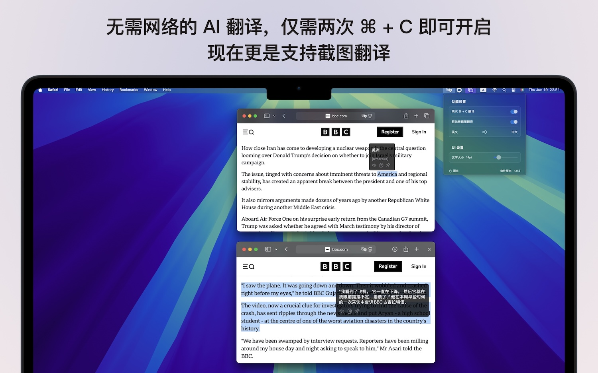

在半年前做了一个小小的翻译 app，当初正是 Coding Copilot 逐渐步入寻常百姓家时，那也是我第一次对这类工具付费之日。回想这半年时间里这个行业的变化真的太快了，毛公说得好啊！“为有牺牲多壮志，敢叫日月换新天”，现在终于有时间重新完善它了，把这最后一块拼图给补上了。

## 做了什么
当初做第一版 TranslateP 的原因是因为欧路词典在我的 Mac 上快捷键翻译老是不好使，具体细节可见[这篇文章](https://pjhubs.com/2024/11/03/translatep-init/)。中间过去了半年的时间我都没有管它，自己用的非常开心，算是解决了“使用快捷键翻译英文”的核心诉求。直到在看今年 WWDC25 的一些 session 时，视频中的有些英文单词我看不懂想翻译，要么继续保持古老方法记住这个不认识单词的拼写，输入到任何一个翻译软件中进行翻译。或者直接使用例如微信等全家桶 app，使用它自带的截图翻译，又或者得专门下载一个翻译 app。

这些方案都没问题，过去的半年时间里我都是这么过来的，这个需求确实也是真实存在的，但已经被很多类似的翻译 app 或者办公软件解决完了。但我嘛～还是得折腾，天生反骨，既不想在公司设备上装微信，自己的设备上也没有装，尤其是现在依旧存留的一些翻译 app 体验巨差，可能是因为这个场景太小，不值得投入太多的资源。这些问题都能理解，如果想将就的话，确实现在是有非常多将就的方案，除非我没有需求，如果自己也有需求，想了下也能做的话，那么一定会自己做一个。

因此，截图翻译这件事作为 TranslateP 这个小小的翻译软件最后一步也就提上日程了！

### Liquid Glass
除了 TranslateP 外还有好几个 app 在等着我去适配今年新出的皮肤，如果不是出了这套新皮肤，估计还在一直忍着。整体来说适配还算简单，如果一开始就是用了系统标准实现的组件基本上不用做任何改动，重新拿 Xcode 26 编译一遍即可。但如果涉及到`background`这种背景修饰符要改为液体玻璃效果，需要反复调试确认。这里在几个 app 中都遇到了层级问题，得改好几处，而且改完后效果并不好，如果不是深色背景桌面图片，整体视觉效果非常糟糕，不如不加。

还要再提的一点是，新出的这套皮肤并不想以往那般适合所有的 app 都是适配，比如 TranslateP 这个翻译 app 就非常适合，但 PhotoP 这个修图软件就非常不适合，甚至一点 Liquid Glass 内容都不能加，否则要么重构 UI 组织，要么放弃这个效果。

### 原文朗读
在小初高的应试教育阶段中，我的听力约等于没有，非常困难。后来来到了北京上大学，逐步有了一些英文环境，再加上自己的专业背景，强行给了一个极好的英文听说读写“小环境”。原文朗读这个功能同样来自真实诉求，有些单词太难读，不会发音也就听不懂，更别说能够和具体含义联系起来了。因此，自己给自己做一个小 app 去解决自己的问题，完美的正反馈循环又来了！在 macOS 中实现一个文本朗读功能非常简单，仅需下面几行代码：

```swift
func speakText(_ text: String, language: String = "en-US") {
    let utterance = AVSpeechUtterance(string: text)
    utterance.voice = AVSpeechSynthesisVoice(language: language)
    let synthesizer = AVSpeechSynthesizer()        
    synthesizer.speak(utterance)
}
```

文本朗读在 macOS 10.14 时代就添加进`AVFoundation`库中，经过这么多年的迭代，可行和可信度完全没有任何问题，速度更快，也无需经过音频合成和下载，断网依旧可行。

### 音标展示
紧接着下一个问题就来了，能够朗读是能“听”了，但看不到音标的话怎么拼读呢？一些场景下不一定能够外放朗读，因此在拿到翻译结果时把音标也一同展示出来才是更好的。如何利用 macOS 自身能力去完成这点确实不清楚，好在 Cursor 给了几个方案，综合对比测试下来后发现直接调用 macOS 的词典服务是最好的，但这个方案也不是完美无暇，具体的可参阅 Mattt 的[这篇文章](https://nshipster.com/dictionary-services/)。

对于自己的需求来说，只要能够看着音标听着朗读几遍也就 OK 了，至于有几种音标几种读法完全不重要。通过系统的`CoreService`调用的词典服务返回的是纯文本字符串结果，使用了`|`字符进行分割，音标有时候还会返回多个，后面的单词来源、英英释义等我都不需要。需要写一个便捷工具方法，给到一个英文单词，去除所有无意义字符内容后返回一个音标字符串。

```swift
static func getWordPhonetics(for word: String) -> String? {
    let range = CFRangeMake(0, word.count)
    
    guard let unmanagedDefinition = DCSCopyTextDefinition(nil, word as CFString, range) else {
        return nil
    }
    
    let definition = unmanagedDefinition.takeRetainedValue() as String
    
    // 按 | 分割字符串
    let components = definition.components(separatedBy: "|")
    
    // 音标在第一个 | 之后，第二个 | 之前（索引为1）
    guard components.count >= 2 else {
        return nil
    }
    
    let phonetics = components[1].trimmingCharacters(in: .whitespacesAndNewlines)
    return phonetics.isEmpty ? nil : "[" + phonetics + "]"
}
```

经过上述工具方法的“过滤”，传入一个`Hello`就可以拿到一个`[hə-lō]`。

### 窗口固定和移动
把朗读和音标展示功能处理完后，已经开始用了一两天，在使用这一两天的过程中整体还算满意，不但能读还能看到音标，已经比之前好太多了。正因如此，我在翻译一个词的整个过程中等待的时间变得更长了，经常会听好几遍，小声默读几遍。此时如果光标移动到别的页面上点击后，整个翻译窗口就会消失，这是之前做的一个 feature，目的在于翻译完毕后便捷消失，但在此时这个 feature 已经不适用，需要加上窗口固定的改动。

针对在翻译窗口外部的点击行为发生时自动隐藏是通过监听鼠标左右键事件做到的，改为窗口固定比较简单，只要在监听的回调事件中额外多一步判断当前是否被 pin 即可。

在 macOS 平台上每一个`Window`都可以通过按住顶部状态栏进行拖拽移动位置，但 TranslateP 状态栏 app，虽然外面确实是包了一层`Window`，但因为没有状态栏而无法“天生”支持这个功能，但 macOS 依旧提供了点击窗口背景移动的属性，直接设置`isMovableByWindowBackground`为`true`即可开启。

### 剪贴板截图翻译
处理完了以上所有事情后就要正襟危坐的来处理我最喜欢同时也是 TranslateP 最后一块拼图了！截图翻译这件事在十年前大概是我大一那会儿非常流行，大家会着迷于寻找真正好用、便捷的翻译软件，而我当年对翻译的诉求还远没有今天高，在加上对 macOS 平台的熟悉度、敏感度也远不如今天的我，因此完全错过了可能把 TranslateP 更上一层楼的机会。

前面的工作已经完全实现了翻译功能，从剪贴板中读取数据这件事也做好了，想要做到从剪贴板中读取截图进行翻译，只需要更改下`type`即可。稍微复杂一些的事情在如何从图片中 OCR 出文本内容。这一点在学校里做 [PLook](https://github.com/windstormeye/Peek) 这个 app 时有过接触，当时行业里对 OCR 的方案并没有形成统一，还是各自为战，并且每年还在推陈出新。时过今日，apple 已经内置了相当完美的 OCR 识别模型，我们通过`Vision`框架即可免费获得识别准确度极高的 OCR 能力，开箱即用。

```swift
static func recognizeText(from image: NSImage, completion: @escaping (String?) -> Void) {
    guard let cgImage = image.cgImage(forProposedRect: nil, context: nil, hints: nil) else {
        completion(nil)
        return
    }
    
    let request = VNRecognizeTextRequest { request, error in
        DispatchQueue.main.async {
            if let error = error {
                print("OCR识别错误: \(error.localizedDescription)")
                completion(nil)
                return
            }
            
            guard let observations = request.results as? [VNRecognizedTextObservation] else {
                completion(nil)
                return
            }
            
            let recognizedStrings = observations.compactMap { observation in
                return observation.topCandidates(1).first?.string
            }
            
            let finalText = recognizedStrings.joined(separator: "\n")
            completion(finalText.isEmpty ? nil : finalText)
        }
    }
    
    // 设置识别级别为准确（accurate）以获得更好的识别效果
    request.recognitionLevel = .accurate
    
    // 支持多种语言识别
    request.recognitionLanguages = ["en-US", "zh-Hans", "zh-Hant"]
    
    // 自动语言识别
    request.automaticallyDetectsLanguage = true
    
    let handler = VNImageRequestHandler(cgImage: cgImage, options: [:])
    
    DispatchQueue.global(qos: .userInitiated).async {
        do {
            try handler.perform([request])
        } catch {
            DispatchQueue.main.async {
                print("OCR处理错误: \(error.localizedDescription)")
                completion(nil)
            }
        }
    }
}
```

经过我的实际测试，在 M4 Mac mini 上，从截完图到翻译结果出现，整个过程在短短的几百毫秒内完成，完全秒杀上文提到的所有工具。

之前我们会觉得 apple 的设备很贵，之前我也是这么想的，但随着在 apple 生态圈里搞的事情越多越觉得果子的设备很值，除了某些极个别非常离谱的配件价格过高外，主打的常规设备我一点都不觉得贵，因为仅需一台设备你就可以开启进入对开发者最友好的平台，不管是开发体验还是上架过程，抑或是售后服务，都是需要极大魄力和毅力积累出来的。

## 下一步
TranslateP 可以做的事情还有非常多，可以算是我的一个小小练兵场，也可以算是我的业余时间突破工作定势的缺口，很受不了做一个需求从提交代码到用户可使用过程最短也需要两周的时间。保持这个状态下人会变得麻木，我不想让自己麻木，因此每年我都会推出至少一款新的产品。不管这个产品是否能够达到所谓“成功”或者“完美”，它至少是在真正的解决问题，而不是绩效产物。

上文也说过，加上了截图翻译后这个 app 才算是真正的做完，整体体验下来也达到了当初的设想。下一步想做一些商业化的事情，尽可能的去挖一些商业化可行的点，但我觉得大概率是挖不到的，毕竟这个场景早被做烂了。可以透露的是，大概率会往“单词本”这个方向走，前面服务好了“即时”诉求，后面就要服务“非即时”诉求了。翻译完成后自己判断如果这个单词很重要，可以一键加入单词本，甚至把某句话某段话都可以直接加入单词本中，无缝同步到 macOS 的桌面小组件、iOS 和 watchOS 上。但这个单词本场景我还没想明白，目前脑子里设想的场景会遇到一些系统限制，比如 macOS 上能快捷键翻译，iOS 上系统没有开放文本的多选菜单入口定制，只能谁的 app 谁自己加。

推上倒是有大佬通过 iOS 画中画的方式达到了类似的效果，但我总觉得整个产品体验上来说不够优雅不够极致，虽然从技术层面上看很爽。在现在的技术发展背景下，All in One 的 AI Agent 工具抢占桌面入口早已不是新鲜事。这里不得不提一嘴豆包做的是真好，但我也坚信不是所有人都需要跟李老板认为的一样“很多情况下中国人愿意用隐私交换便利性”。

我确实不是很喜欢等待，尤其是突然的想法冒出后，对这个想法就是很激动很上头，我就想马上去做。最近一段时间刚好不忙，也碰上了 WWDC25，脑子里空出来了好多空间，工作日坐在工位上几乎每时每刻都在冒出新想法，这种久违的感觉又回来了。但工作的这几年把的这个状态熄灭了不少，因为在工作中大家都是要讲排期讲流程的，不是你今天冒出一个想法，今天就要去做就能够去做，有一套完备的流程去兜底去判断是否值得。

但直到此时此刻，这个状态依旧还是有，我在等待某个合适的时机。