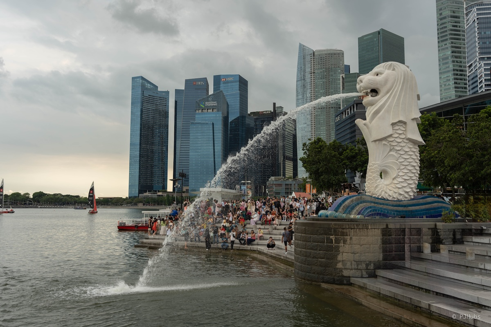

“新加坡不能没有海南鸡饭，正如纽约不能没有披萨”，虽然这句话着实是打趣，但正如其所言，前几代华人在新加坡这片从东至西也就 30 公里的小岛上创造出了一个又一个近乎神话的经济发展故事，确实值得我们去思考去钻研。再次趁着南下团结出差的机会，带上女票终于来到了“亚洲四小龙”之一的新加坡。

## 准备
大概是在去年暑假期间对新加坡开始上心，总觉得这个国家自己一定会在不远的将来踏足，开始找一些相关的资料阅读，特意看了《新加坡——不可思议的崛起》这本书，虽然这本书写的有不妥之处但我自己看的是十分畅快，尤其是说到了新加坡借助马六甲海峡牢牢把控住了通往太平洋咽喉的内容时，我一直在脑海里畅想，马六甲海峡到底能有多繁忙，繁忙到可以让一个全新的国家在短短六十年的时间里来了一次彻底的改头换面。

还听了《壮游者》关于新加坡这一期的播客节目，其中找的嘉宾刚好是在新加坡做房产生意的华人，因为我反复的听了好几遍，嘉宾大姐特色的国语口音余音绕梁在我的脑子里。可能是工作后这几年时间里一直在租房搬家折腾，逐渐对房子这件事开始有了一些短暂的关注过，嘉宾大姐针对新加坡政府提供给新加坡公民的“组屋”做了特别说明，我也是第一次较为完整的梳理清楚了这个制度诞生的原因，可以说新加坡的政府是一个更加为人民着想，更加原因去解决实在问题的政府。但反过来说，才区区几百万人口，是不是可以认为仅需稍微强硬点的态度和手段就可以推进很多事情呢？虽然这个话题不适合深聊，我自己也聊不出什么来，但就住房问题这一点，新加坡公民确实可以有更少的忧虑。

但真正推动我去往新加坡的核心原因却不是这些，而是其比港澳地区更加包容的社会环境，虽然也存在不少人反感新加坡政府管得太多管得太严，但纠其本质绝大多数新加坡公民对其政府的满意程度是超出预期的高，因此生活在这座小岛上的各色人种和种族都得到了非常好且平等的生活水平和工作机会，最让我觉得不可思议的是新加坡并没有唯一官方语言，英语、华语、马来语、泰米尔语都是官方语言，你需要根据自己所属的种族学习除英语之外的第二语言，比如华人就是一定要学习华语，印度人就一定要学习泰米尔语，虽然国语是马来语，全国通用语言为华语，但这些都是强制写进法律进行保障的，背后的意义完全不同。

当然了，此次新加坡旅行之所以能够彻底成行最主要的原因是对国人免签，我女票可以拿着护照就出国，再加上新加坡的华人背景和语言优势，作为第一次出国的目的地非常好，有着非常不错的缓冲区，虽然有些人可能觉得“异乡感”来得不会太足，但不得不承认这次旅行我看到了超多的印度人，之前老想着能不能去到印度浪一下子，这回在大街上和“小印度”来了个小小的震撼。

从深圳出发到新加坡最近的机票价格非常便宜，便宜到我差点马上就下单了，但被从新加坡返程北京的机票价格吓了一跳，虽然价格也不算贵，但整体下来一个人来回这么一趟也得六千多，再加上新加坡的酒店价格更是让人倒吸一口凉气，仔细想了几天还是咬咬牙给都定下来了。换了大概等值人民币四千多的新币，主要是为了想防止出现一些无法刷卡或者二维码支付的地方，后来才发现换太多了，多到后面要强制花现金，其实像我们这次三四天、四五天左右的行程，四百新币就完全足够了，visa 和支付宝的便捷性和体验远超预期，就连公交车都可以直接 visa 支付，但为了纪念我们在机场买的两张交通卡最后也没退掉，权当纪念了。

## 第一天
虽然咱也是工作几年，兜里有点东西的人了，但主打一个能省绝不多花的态度几次纠结后选了早班飞机和在天上跨年的航班，天还没凉就赶到了深圳宝安机场，我原本以为这么早能有多少人没想到还没看到航站楼就卡死堵车了，那可是凌晨五点半啊，尤其是进入到值机大厅后更是被乌泱泱的人流惊讶，只能在心里不停的赞叹“不愧是深圳”。

到达新加坡后刚好时中午过后，折腾好交通卡坐地铁达到市区拖着行李左拐右绕终于到达酒店后刚好是下午 14 点过一些，恰好可以直接办理入住。我们住的是克拉码头附近的假日酒店，在曼谷住过一次后体验海算不错，综合对比下来一晚 1300 元已经是中等左右的三星酒店，再加上这地理位置，实乃性价比之选了。但就从克拉码头地铁站到酒店大厅这短短的几百米居然能够走出一身汗，赤道国家的天气虽然已是全球北方地区的冬季，但对其而言完全就没有冬天的说法，有的只是每天下午雷打不动的一场场雷阵雨。

原本打算在新加坡的三晚都住同一家酒店，但后来仔细想到可能和女票一起只来这么一次就打算疯狂一把，第三晚订了家拥有 2.9 米深水区泳池的酒店，价格也是假日酒店将近两倍，酒店和房间整体环境确实更好一些，但我们的本意是为了泳池，想着最后一天早上爽游一上午，没想到假日酒店本身楼顶也有一个 25 米长的泳池，虽然不宽但至少有啊！这么一想性价比已经很高了，但我们是办理入住后的第二天早上才发现有泳池，否则也不会这么疯狂一把了，虽然假日酒店的房间确实小一些，但个人认为性价比超高，推荐给大家。

办理好入住后因为楼下就克拉码头，遂先逛了下午后无人的码头区，但说实话大白天的克拉码头真的是啥也没有，又热又晒，河水也不干净，街道两旁的商铺都没有营业，一整个就是死气沉沉，观感非常不好。但等到晚上我们再回到这片区域时大为震感，一下就把松弛感拉满了。好多坐在河边阶梯上互相依偎的情侣，还有街头卖唱的艺人，更有三五成群的游客熙熙攘攘的穿梭在热闹的码头边，夜晚的灯光倒映到河面上反射出了这个国家活力的一面，给人一种白天和晚上完全不同的反差感。我自己是已经很久没有感受到这么放松这么舒服的氛围了。

五颜六色的“旧禧街警察局”就坐落在克拉码头前不远的十字路口上，搭配着面前的车水马龙，站在这十字路口拍下以警察局为背景的照片，确实非常漂亮非常美好，值得算上是自己的一张人生照片。至于到新加坡的第一顿饭那必须是听了非常多遍的“泰国新加坡印度尼西亚，咖喱肉骨茶印尼九层塔”的肉骨茶啦！刚好克拉码头这十字路口刚好也有一家松发肉骨茶，不得不说这家店之所以能够蝉联多年的米其林一定是有它原因在的。晚上我们吃了另外一家店的药味肉骨茶，虽然这两家店的肉骨茶汤底不一样，松发是白胡椒，但我个人对二者都很喜欢，只是松发家的排骨质感会更好，非常要较劲吃起来感觉非常新鲜，以至于第二天我们再次去到了同一家店，饿了一天爽吃三碗肉骨茶。

随后我们往前走到了“圣安德烈教堂”，教堂本身不大，如果你本身没有去看过什么教堂可以专门来一趟感受下，但我自己还是觉得没有国内的一些教堂来得大气，不过这也是仁者见仁智者见智的事情了。教堂外面有一大片草地，连着新加坡美术馆，不得不说这附近确实非常拍照非常适合 city walk，漫步在这周边附近看着遮天的大树，阳光充足的大蓝天，什么都不用想，就安安静静地走着就已经很好了。我们在美术馆正门前的大草地上拍了几张照片，听着旁边几位国人大妈边摆着 pose 边齐声对着镜头喊着“看看我们的大长腿美不美！”，咋说呢，就有种明明已经身在国外但精神世界依旧停留在国内的错觉。

美术馆再往前走一段，过了“安德逊桥”这座神似上海的外白渡桥后就来到了新加坡著名景点“鱼尾狮”了，本来我们这一路上看的几个点都没啥人，以为新加坡也就这样了，没想到这鱼尾狮广场全是人，有一种感觉人全都到这广场上挤着来了。但比较有意思的一点是没想到印度人出奇的多，去过周边的这几个国家没想到新加坡的印度人居然是最多的，而印度人中我觉得印度小孩是最有特色的，不确定是饮食习惯还是别的什么原因，总觉得印度小孩长得很精致，给人一种五官极致的精致，就感觉小小的瘦瘦的，但骨架撑得也恰好，很像某些中土神话电影中的“精灵”。

因为人太多，我们只在鱼尾狮广场随意拍了几张照片就结束，走过“金禧桥”来到了摩天轮附近，本想是上摩天轮看夜景的，但此时天空阴了起来，而且过了桥后到“莱佛士道”这附近路况不好，人行道很窄再加上附近在施工，整体的感受确实不佳，也就跳过了坐摩天轮，打算直接去“滨海湾花园”。但就这么走着走着估计是困意上来了，毕竟早班飞机休息也不太好，走到金沙湾购物中心附近渐渐也就没有了去看天空树夜景的期待。反而发现了悬立于海面之上的新加坡 Apple Store！巨大的一个球体，太酷了！

我赶紧走到球里仔细观摩了一番，对比外面来说 apple store 球体里的凉爽程度硬控了几条大型犬，全都被他们的主人带进去趴在地上的空调出风口边上了。我看了下 iPhone 的价格，对比国内几乎没有价格优势，除了可以用同等价格买到满血设备外没有任何必要专门来买，就算是退税也只是便宜了几百块罢了，我手上的这台 iPhone 15 还远不到换机的时候，遂出门。

此时天色渐晚，两人的精力都即将见底，水也喝完了，本想打算是就近找家 711 买瓶矿泉水解暑，没想到就为了找这家 711 把我们彻底搞累了，再也没有精力再继续玩耍。谁能想到我们看着地图找的 711 不在路边居然在地铁站里，仔细翻了评论才知道要下到地铁站里，差点又绕回金沙湾商场里继续找了。给大家的建议是，在新加坡玩耍出门前记得把水都带足了，因为这里并不像国内或者泰国那般便利店满地都是。

## 第二天
第二天的主要任务是看博物馆和去圣淘沙岛上玩巨型秋千和天际滑车。博物馆我觉得非常一般，虽然新加坡确实没有什么历史，整个博物馆也在休整中能看的东西其实并不多，布展的思路我觉得和澳门博物馆很像（甚至还不如），我原本以为澳门博物馆的布展思路是我去过最差劲的，没想到新加坡才是最差的。稍微救回来一些的是位于地下一层萨尔加多的《亚马逊热带雨林》摄影展，来的之前我完全不知道有这个展，搜的这么多新加坡资料也没有人说过有这么个摄影展，可以说凭着这个展彻底就活了我对新加坡博物馆极差的印象，就冲这一个摄影展完全值得来新加坡中转一天。

萨尔加多是我在 22 年看 B 站小师傅摄影课上知道的摄影师，那会被他拍摄的巴西淘金热的矿工系列照片所震撼，如如果你也感兴趣可以通过[这个链接](https://www.bilibili.com/video/BV1zY411w7yD/?spm_id_from=333.337.search-card.all.click&vd_source=beeffc73c4661fe63439d618b05342c6)去瞅瞅这个伟大的摄影师。据说是拍完这个系列后人整个就不好了，患上了严重的心理疾病，后来是因为他妻子买了一座山，经过很长一段时间把这座荒山栽满了树，开满了花，让萨尔加多感受到了大自然的美好的力量后才慢慢走出来，从拍摄人类的痛苦转变拍摄大自然的美好，表达这个星球上的奇妙之景中去。我当时看完这部纪录片后整体的感受跟萨尔加多是一样的，虽然远不到他那般感受深刻，但就纪录片观后感而言感触良多，很推荐你有时间也去看一看。直到去年萨尔加多的影集都一直放在我的购物车中，但因为大开本影集价格之昂贵我一直迟迟无法下单，后来还是去到了大栅栏附近的“暗房咖啡”中才偶然发现了这本实体影集，爽看一下午，今年得想个办法匀出点预算买下这本拍摄大自然美好的影集了，真的非常不错，值得买一本来收藏。

我们两个人一进入展厅后就分开了，因为各自重点都不太一样，我喜欢从头到尾每一张照片仔仔细细的看很久，如果不是为了赶下一个景点去看美术馆我可以一直看一天，慢慢的、仔仔细细的研究每一幅照片，每个专题，看完每一部纪录片。这个《亚马逊雨林》展览的所有照片都是黑白风格，不管是人还是景都是黑白，我从未在一个时空下如此密集的感受过如此立体的黑白风格照片的冲击，再搭配上展厅里恰到好处的背景音乐，真的有一种我就在雨林中的感觉。我原本还在找有没有同名画册售卖，后来仔细绕了几圈才确定这就是个展不卖任何画册，只有博物馆文创区零星的明信片和布袋之流，有点失望，原本都做好了拎着影集上飞机的准备了hhhhh。

随后我们再次来到了美术馆，后来我才知道美术馆如果你不看特展或者常规展览的话，是不需要买票的，推门就可以随意逛了，但为了满足门票收集癖，还是花了基本展览费用买了两张票。来美术馆的主要目的就是为了拍那张走在两栋楼之间的连廊的，虽然这个短短的连廊也是小红书带起来的，但说实话确实挺好看的，而且知道这个地方和正在拍照的也全是国人，还有甚者都拿上了对讲机进行双向通话，因为连廊在 3 楼，最佳拍照点在 4 楼，连廊所在位置是两栋楼间的空旷处，除非没有素质的超大声呼喊否则双方都听不清对方在说什么。

因为同一时间拍照的人实在是太多，连廊本身就是为了方便两栋楼之间的游客走动而设，如今变为拍照点后如果你也想拍就要一直等或者脸皮需要很厚赖着不走，才能拍下那么一张看着还算不错的照片，我们匆匆走了几个来回拍了几段视频和照片后也就罢了。

天公不做美，从美术馆出来后就开始下雨了，只是断断续续的在下，我预判这天气可能下一会就停了，没想到我们坐公交到达 vivo city 商场转成圣淘沙捷运小火车到达终点站后，这雨瞬间就下大了，而且是越下越大，就好像前两天没来得及下雨似的，统统在这短短的一两个小时内全下完了。我们在一家冰激凌店内边吃边等，就这样过去了大半个小时这雨完全没有停的意思，眼看距离我们预约大秋千的时间一家过去了半个小时，再拖下去感觉要被取消，而且订票网站上说大秋千除非打雷天气否则不予退款，我们只要迎着大雨，在雨中进行了一次超级刺激的，感受了将近 2s 左右完全失重感的大秋千，我觉得非常有意思的地方在于可以和女票两人一起从几十米的空中抛下，这种紧紧拉住对方的感觉一起感受失重的感觉很好，虽然下来后我们两个的衣服都湿透了，再加上大雨天确实容易感冒，就算是 711 里暴利的三十多人民币的一次性雨衣也不得不买，但这趟回忆非常棒！

从大秋千下来，我们原本打算再赶回去玩天际滑车，毕竟雨衣都买了衣服也湿了，再玩几趟滑车也不是问题，但到了检票口才发现因为持续性下雨今天提前关闭了，我们只好改到明天再来一趟。坐在回程的公交车上，幸亏有这雨衣，要不然全身湿透再加上冷气全开的公交车，高低得干趴一个人。晚饭我们还是选择了跟昨天一样位于克拉码头附近的那家松发肉骨茶，因为暖暖的白胡椒再加上排骨，就很适合淋了一下午雨的我们，果断爽吃。

## 第三天
今天是“转场日”，早上起床后先去享受了一波假日酒店的泳池，然后再去吃了新加坡国民早餐“亚坤早餐”。我个人觉得这个亚坤早餐味道还是不错的，偏甜口，如果你让我每天都吃肯定是受不了，那还不如每天都吃海南粉、后安粉和抱罗粉呢，我觉得这些是我心中真正的享受和海南人民的国民早餐。可能主要还是新鲜感吧，这种吐司面包蘸温泉蛋的口感确实挺奇特的，搭配上一杯加了不少糖的咖啡，味道也确实还算不错，我吃的确实挺爽，但我女票认为算不上出彩也就是正常，毕竟人家看到了豆浆油条四个字的套餐后眼睛都亮了，到也能理解。

在新加坡最后一晚的酒店我们选择了“滨海宾乐雅酒店”。价格前面也说了确实是假日酒店的将近两倍的价格，换来的是更好的房间环境和 2.9 米深的游泳池，我从未进入过深水区，因为深水区是需要游泳证的，我虽然会游泳但因为是野路子出生，我不会踩水，再加上游泳这件事本身对我来说兴趣也不大，因此拥有一份游泳证也就无足轻重了，更别说去深水区感受一下了。所以呢当我看到这家酒店的泳池是 2.9 米深时瞬间就想要了。到达酒店后因为还没有到入住时间，寄存完行李后就再次奔往圣淘沙岛，就为了补上昨天因为大雨取消的天际滑车。

大家以后如果也要来圣淘沙岛玩耍的话，可以不用排队买票，直接用同一张在机场地铁站买的交通卡就可以刷卡进站了，我是后来才注意到刷卡闸机上有标识可以用交通卡刷进展，稍微浪费了一些排队购票时间。到达岛上后我们直奔天际滑车，就怕天气突变再次下雨，但包里也装好了昨天买的雨衣，就算是真的下雨了也要头铁穿好雨衣冲进雨中。

我们是在 Klook 上买的三次票，每人 180 元人民币，整体感受下来我觉得还好，不算贵，而且非常推荐来玩耍，这星球上总共也没几个地方可以玩到滑车，尤其是还可以坐着缆车看着不远处的马六甲海峡，望着繁忙的海面上巨大的货轮来来往往，而这边却欢声笑语很是魔幻。我们总共玩了红蓝绿三条线，其中最刺激的是蓝线，跑道比较陡车速可以稍微快一点，但整体而言四条跑道都不算长，都只有六百多米，如果能够再长一倍体验会更好，很期待这个滑车项目可以引入国内，开发风景更好更长的路线。比较遗憾的一点是我们还头盔的时间太快了，应该玩耍结束后先拿着头盔去机器上扫照片再换头盔，否则这一路上好几个拍照点的照片都看不到了。

滑车结束后，今天的主要任务也就结束了，我们慢慢悠悠的沿着圣淘沙的西海岸北部和南部走着，虽然海滩没有什么特色确实也都是人造的，但对比整个新加坡的国家或者城市建设来说，圣淘沙确实是一个相对有度假氛围的地方了，但不管是岛上的消费还是酒店价格都相对市区更高，如果我是新加坡人周末大概率是不会往圣淘沙岛上跑，而是跨国跑到马来西亚去享受低物价的世界。我们看到了那颗长得十分奇怪的椰子树，奇怪到我都开始怀疑是不是人为影响导致，要不然怎么可能会有椰子树长得如此奇怪，如此直线呢？更神奇的是还在海滩上看到了孔雀！虽然大概率不是野生孔雀，但在这种地方还能够看到在海滩上随意晃荡的孔雀也确实是太魔幻了。

基本上把圣淘沙岛西部都逛了一圈后，喝了两杯 coconut 椰子水就准备打道回府去玩耍酒店泳池，刚准备坐上公交就下起了雨，到达酒店房间后就开始下大了，主打一个来都来了我们就换上原本还是湿的泳衣冒着大雨继续在泳池里玩耍拍照，搞到旁边的老外还好奇我们用的是不是 iPhone，用的什么型号，真有意思。到了晚上，我们洗漱了一波来到了酒店马路对面的亚拉街，看到了苏丹回教堂，也看到了超有特色的酒吧街，晚上开灯后整个街区非常漂亮非常有氛围，一边是清真寺礼拜的神秘的广播声，一边是世俗的酒吧劲爆的摇滚乐，在这种强烈的对比下我们吃了一顿晚饭。看着眼前走过去的一个个西方的面孔，这种在异乡的感觉确实是满世界旅行跑的乐趣所在。

## 第四天
到了第四天也是我们在新加坡待的最后一天了，从一开始落地后疯狂吐槽的闷热天气，再到现在即将离开竟然还有些许不舍，我们再一次享受了酒店的深水泳池和早餐后整理好行李寄存到前台，重新去逛了白天下的亚拉街。幸亏前一天晚上我们逛了一次夜晚的亚拉街，白天的亚拉街原不及夜晚风格来得印象深刻，强烈推荐大家来感受一下夜晚的亚拉街。

从亚拉街往前走不远处就是“小印度”，经过昨天下午的一阵暴雨，今天早上的天气尤其的好，蓝天大白云搭配上草地，不管怎么拍都好看都舒服，但就是因为这过于通透的天气和热烈的阳光以及这几日来日均两万多步的路程，女票的精力值在此刻达到了极限，摆摆手让我自己一个人去逛小印度，找了个小公园坐了下来享受习习凉风。

小印度整体而言和新加坡的中国城“牛车水”差不多，如果不是因为“斯里尼瓦沙柏鲁马庙”我觉得完全没必要专门来一趟，但如果你就是冲着这个印度教庙宇来的话，那一定会感受的非常彻底，我觉得此行非常幸运，刚好赶上他们貌似在进行某种闭门仪式前的祈福，较为完整的拍下了一段祈福演奏，非常有脑海中对印度的感觉。虽然说这个世界上印度人跟华人一样基本上无处不在了，但至少这一次在这里我才算得上是真正意义上的感受到了印度教的氛围。

我们坐上前往滨海湾花园的地铁，去往此行新加坡之旅的最后一个目的地——“云雾林”。专门去看云雾林的人很多，光是排队买票就等了快 20 分钟，如果你是南方人或者之前有去过类似的国内各种温室的话，可以不必买两个场馆的联票，仅需购买云雾林门票即可，慢慢感受这全球室内最大瀑布，整个云雾林场馆非常凉快非常舒服，如果你正好还是大夏天来到新加坡，云雾林这里就是一个非常适合消暑的好去处。在云雾林里我看到了之前从未见过的猪笼草和捕蝇草，没想到猪笼草可以这么大，捕蝇草可以这么小，还有很多非常奇特的热带植物和花卉，如果我下次再去的话，一定会安安静静的就坐在瀑布下面，就这么呆着看着，好好的感受着一片清凉。

滨海湾花园其实有好几个去处，其中同样非常著名的“天空树”景点我们因为时间关系没来得及去，还有金沙大酒店的顶层无边泳池和酒吧，这些都是东西都是小时候就老听大人和电视上宣传，现如今近在咫尺却未能如愿，只能把这个遗憾留给下次了！

随后我们就重新坐公交车来到酒店拿上行李，但此时又下起了大雨，而且也是越下越大，为了少折腾一些节省精力准备应对横跨整个晚上的超级红眼航班，果断打车去往樟宜机场，刚好用富裕的时间去看樟宜机场的大瀑布，去感受疯狂动物城同款穿越室内热带雨林。但好巧不巧，在乘车前往机场的路上居然遇到了这段时间来最大的一次短时急性降雨，雨大到雨刮器都来不及扫，刚扫过去能看见一点路马上就又看不清了，路上的车开的很慢，平均只有不到 50 迈，偶尔遇到超车的司机，我们的车子会因为被激起的水花拍打得摇晃车身，就连司机师傅都惊叹这雨下得是真大，就宛如老天爷在挽留今晚的即将回国离开新加坡的我们。

到达樟宜机场后，我们很迅速的找到了提前值机的柜台，不得不说这提前值机的服务真好，非常适合提前四五个小时来机场慢慢逛看看瀑布吃吃喝喝拍拍照的玩法，不用着急去值机去安检，因为樟宜机场确实挺不一样的，值机完成后离境就无法返回，想要再次返回就算是再次入境，如果没有新加坡签证而是用免签政策入境的话是不符合入境要求的，所以一旦刷了护照出境就无法去看大瀑布了，而且一旦出镜就只能逛免税店在机场内部里晃荡，而安检是到了最后即将要登机了才放开，安检完毕后直接就可以上飞机，这一点跟我之前的经验都完全不一样，安检完毕后的区域是没有厕所的，官方也立了牌子提示乘客等到需要上飞机的时候再安检。

对于樟宜机场对面的 Jewel 宝石商场来说可逛可买程度体验更好，居然都塞得下一家 apple store，而且还有超级多好吃的美食，但我们踩了雷吃了一家以海南鸡饭出名的“海南宝”饭店，我们原本是不打算吃海南鸡饭的，除了自己就是海南人这一最主要的因素外，我还非常深刻的理解到海南鸡饭只有海南本地鸡才好吃的真谛，其他地方的鸡肉口感都非常的柴非常的难吃，但这次完全是因为送我们去机场的华人司机特意推荐，说海南鸡饭一定要去试试，海南鸡饭的特点不是用海南的鸡，而是因为海南人做的。那好吧，既然都得到了司机师傅的强烈推荐那我们也就给了它一次机会试了一次海南鸡饭，没想到再一次验证了我的看法，不在海南本地吃的海南鸡饭是真的无敌超级难吃。

吃饱喝足后，我们继续在大瀑布下坐了大半个小时，也玩了滑梯坐了 t2 和 t3 往返的小火车，晚上的大瀑布确实不如白天好看，主要是这灯光红绿蓝黄的真的是太丑，还是推荐大家有空的时候早点来机场看下白天的大瀑布，很值得很漂亮！随后我们就去往登机口了，这一趟从 23:55 起飞到早上 05:40 落地的红眼航班坐得我真的是欲哭无泪，真的是折磨，睡不踏实坐得腰疼，位置还很挤，总之就是哪哪都难受，真不知道 19 年那会自己是怎么受得了 12 个小时的跨太平洋航班的，感觉腰得断了。

## 总结
这一趟新加坡之行总而言之我非常满意，“亚洲四小龙”只剩下台湾这一个地方没去看过了，很期待今年是否能有这个机会踏上这个与自己关系更近一步的地方。综合对比来看，去过的这几个小龙还是香港待得最舒服，不光是好吃，更好拍，空间立体感更强，文化差异性虽然看着更近但实际上却很远，反而新加坡是比较无感的，可能是因为过于现代化，与自己之前生活了十八年的小岛天气和城市建设风格更像导致冲击力来得不强。

论这一趟收获的话，除了断掉了我不会再产生去新加坡工作的想法外，也顺带拍了第一期我们的旅行婚纱照，虽然远算不上婚纱照，但这种在旅行的过程中留下这么几张照片的感觉我觉得会比花费几万块去影楼里或者请专业婚摄来得畅快，我个人是比较喜欢这种啥都自己插一脚的感觉，尤其是这种人生大事我觉得有必要自己参与其中，这不仅仅是金钱的原因，我觉得最主要的是回忆。

新加坡我可能未来都不会再去了，主要是文化不到位，很多东西都是当地政府刻意包装出来的，这一点无可厚非，但旅行嘛，也就是自己待腻的地方去到别人待腻的地方罢了，求的就是一个猎奇感，只是这两年我的旅行风格或者状态变为了想去拍拍照，总想去记录下什么，尤其是对柬埔寨、印度、中亚等这些与自己习以为常的文化环境完全不同的地方有了更多的兴趣，反而是那些什么雪山草地之类的兴趣在逐步降低，甚至是刻意避开，以至于在去年总是在冒出一个不如倔强一把去纽约这个街拍圣地去朝圣，在纽约的街头爽拍几天。

可能吧，看下今年有没有更多更好玩更疯狂的想法！