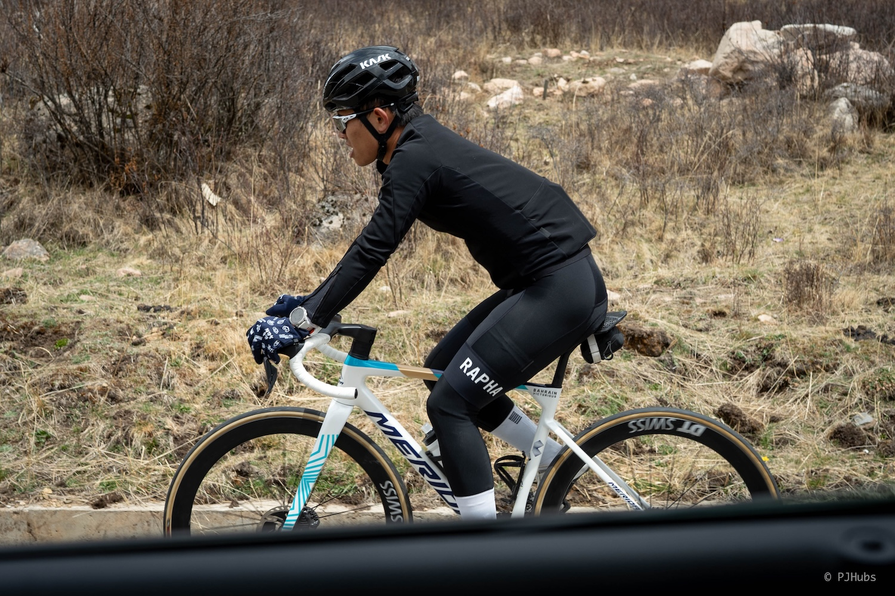

再次来到了川渝地区，去到了之前完全没有踏足的地方，基本上这两次算是把四川都玩了个遍，只剩下极个别地方日后有机会再说。这次旅行最大的不同是带上了车子，不光是感受了重庆骑友日常钻隧道的惊吓，还感受了高原 4000 米海拔骑车时的心肺爆炸，在莲宝叶则爬最后一个大坡时，自己胸腔传来的阵阵刺痛才作罢，刺激极了。

## 重庆
这次五一假期连续休了 11 天，加上表弟还在重庆，所以五一假期的第一站先去重庆找表弟骑车。车子已经提前四天寄到重庆，并且表弟收到车子后连夜帮我装好，并打了扭力，我可以到达他学校后换身衣服马上开骑。不得不说重庆永远是国内所有法定节假日的王牌目的地之一，重庆政府花了大手笔连续几晚在朝天门码头附近进行了大型无人机表演，花费了极大的人力物力每晚都在滨江路上维护交通和治安。虽然在重庆的这几天时间里游客人数确实不少，但井然有序的管理以及敞开怀抱欢迎四方游客的政府态度，实在是值得一个大大的点赞！

据表弟所说，他已经把他们学校骑得最快功率最高的几个大佬全拉出来了，两天骑下来确实觉得自己对这种高温高湿环境的切换不适应。第一天因为歇了两脚没有跟上就掉队了，硬是全力输出了几公里嗓子都骑冒烟还是没追上，最后追得人都恍惚了没注意看到路上的坑，颠掉了一个水壶才彻底放弃追赶。其次年轻人是真有劲啊，长距离连轴转都不带歇的，重庆的骑车路线确实没有北京这种长达十几公里的山路，基本上都是丘陵起伏路，稍微“起”的没有跟上，“伏”的时候就要死命追了。我觉得自己非常不适合也不喜欢骑这种路线，因为只要车头不歇脚，后面的人也别想歇。

重庆的骑行路线在没出城之前是一定会穿至少一个隧道起，并且没有非机动车道，再加上重庆城区的道路设计因为地势原因设计得比较窄，见到的都是双向两车道最多，自行车骑在这种路上就非常刺激了，稍不注意就会和机动车亲密接触。尤其是远离城区后的山区隧道里，来往的大货车数量明显上升，动辄两三公里的隧道还贴着大货车边上过，每次穿隧道都是心惊胆战的。

经历了连续两天在重庆市区里高温骑车后我就缴械投降了，再骑第三天我就要中暑暴毙了，因此第三天我和表弟去到了这两年比较火的“半山崖线”。本来以为这是条比较休闲的看景徒步路线，后来才发现居然要上上下下这么多台阶，如果想全程走完先不说大大十几公里，光是几千级台阶就很头疼。最后我们只走了精华的一小段，看看重庆最高楼，看看开往春天的小火车也就作罢，赶紧下山找地方去按摩了。反而是这次按摩给了我们一个巨大的惊喜，确实出了北京哪里都是天堂，仅需 169 元一人就可以足疗加爽吃美食，按摩店里的鸡汤抄手味道很不错，我连吃了两碗。

总体来看重庆确实不适合骑公路车，主要原因是公路车骑起来速度没边，越骑越快，越骑越上头，再加上重庆市区道路狭窄，非常容易和机动车发生剐蹭，甚至生命危险。但如果你是折叠车小布这种休闲骑，速度不快的前提下滨江路非常推荐来骑车，甚至可以专门来一趟只骑滨江路，风景好到国内独一无二，甚至放眼望去全球都是为数不多的景色。

## 成都市区
成都市区的骑行路线我一天就搞完了，主要是盛名远扬的龙泉山 AB 面和天府绿道。原本是想龙泉山和天府绿道分开两天骑的，但骑完龙泉山 AB 面后觉得风景单调路况一般，再也没心情去刷完龙泉山上额外的爬坡路线了，就想着一天搞完天府绿道。确实当天也把天府绿道给顺带骑完了，总共大概 160km 爬升 1500m 左右，天府绿道上的七十多座桥全部干完了，简而言之也可以认为骑完了龙泉山后，还骑了 100km 的起伏路。本身当天天气闷热，阳光刺眼，我骑车又不喜欢涂防晒，骑完后就喜提晒伤，直到今天时隔整整 15 天后才开始胳膊掉皮，也不知道这个皮肤是耐晒还是不耐晒。

龙泉山这次骑完是彻底去除了其神秘性，完全没有网上骑友们传的那么好，更是没有专门来骑的必要。之前对龙泉山之于成都，就如妙峰山之于北京。当你来了北京骑车妙峰山确实有必要专门来一次，但来了成都骑车龙泉山可以忽略不计了，不如直接去骑天府绿道。天府绿道首先是路况极佳，虽然存在极个别路段在微微的修路，但本身修路的地段也骑不快，本质上没有太大影响。其次天府绿道是优先骑行，所以大家都有墨守成规，尤其是早晨或者夜晚，完全可以专门来刷速度练车。

但比较神奇的地方在于居然装上了限速，每过一辆自行车基本上都在喊“您已超速”，不确定如果真的在天府绿道上骑车出了事故，市政或者绿道管理处是否会因为超速而拒绝赔偿，我个人觉得这有点难评，交由时间去验证吧。绿道两旁种植了非常多的小麦，估计当初绿道建设时就是直穿小麦田，但这就是绿道的特色之一，在此之前我从未见过如此大面积的小麦田，正直小麦收割季附近，望过去黄油油的一片非常养眼，推荐来玩。

这次在成都骑车没有真正进入市区中心，一来是游客真的多，怕是再遇到重庆那般盛况自行车挤都挤不动，二是对成都市区中心路况不熟悉，骑几百米停车看一会儿地图的状态没啥意思，三是本次在成都最想骑的就是龙泉山和天府绿道，也都已完成，欲望也就没这么大了。

## 四姑娘山
在成都的第三天一大早我们就去取车，租了辆 GL8，后排座放倒后叠叠乐可以放最多四辆自行车，加上驾驶员可以坐四个人，还有余地可以放行李，唯一的缺点就是车身稍微有点长，我们三个人都几乎都没开过这么长的车。

正式开启川西之行的第一站是当天赶往四姑娘山镇。其实我们一开始并没有 4+2 的出行计划，而是用四天的时间全程骑完川西小环线。第一站和 4+2 模式一样，都是到达四姑娘山镇住宿，第二天可能会在山里玩一天，第三天翻小金山，第四天回成都。看似很完美，原本还打算三天就搞完。后来经过表弟的推荐，我们可以趁此机会人多去一趟莲宝叶则，否则以后不一定有这么多能开车的人在一起，仔细想了想才放弃了骑川西小环线的想法。

然而实际等我们真的开车前往四姑娘山镇的路上，来到了第一天的最高点巴郎山隧道口附近时，才后知后觉就不应该骑车来这个鬼地方。首先是大货车真的非常多，狭窄的两车道山路，大货车开的就慢，小车总是想要借道超车，每次要超大货车时心就提到了嗓子眼。其次是路况真的糟糕，国道和高速还好，一旦出了国道走到乡道或者县道上，非常容易就和牦牛群羊群搅和在一起。我们此行就差点撞上了一头受了刺激的牦牛，就差那么 2 米的距离幸亏它加速了一下从车头位置跑掉了，否则真的就要出血八万八了。最后是这川西的高原天气真的是忽冷忽热，紫外线巨强，现在敲打着键盘双手的小臂上还在掉皮呢，一旦开始爬长坡就热得不行，一旦开始放坡就冻得瑟瑟发抖。

我们在到达四姑娘山镇后本来是打算第二天开车去往巴郎山隧道口，骑一个反爬巴郎山。但当天傍晚到达四姑娘山镇后，高原的寒冷扑面而来，再加上有人开始出现高反症状，入住酒店后都盖被睡觉了，一觉睡到 23 点起来才抹黑去镇上找夜宵吃。所以我们一致决定第二天还要骑，但不是全程反爬骑完，而是四姑娘山景区门口到巴郎山隧道口为止，这样的话海拔是从 3200 开始到 4000 结束。否则我们将从海拔 4000 开始骑，一直到 4800 米结束，全在雪线之上骑车，刺激是绝对刺激的，但那会正值抓私自上山，一位就罚 5000。

整体而言骑车反爬到巴郎山隧道口我觉得还可以，虽然全程心率没有到过 170，基本上都是 162 上下，也在控制体感不敢太累。但还是那句话，在高原骑车尤其还是在晴朗的天气下，不管穿多少都是热，而放坡时不管穿多少都是冷，可能背上一条压缩羽绒服整体会舒服很多。正是因为当天晴朗的天气，我们在观景台上看到了没有任何遮挡的幺妹峰，再一次裸眼看雪山，依旧是非常震撼非常感动。

放完坡后距离退房还有一段时间，我们几人洗漱完毕再次回到镇上吃了顿川菜，确实川西这边发展起来了，只要是个镇子甚至是个村子就一定会有吃和住的地方，而且吃的地方大概率是川菜，基本上味道不会差，就是不能吃辣的人比较难受了。

## 阿坝
从四姑娘山镇出来就开始了漫漫开车路，一路上经过了高速、国道、乡道，甚至还有大堵车，原定于晚上 20 点即可到达，愣是拖了整整一个多小时。到达阿坝县城时三个人已是又困又饿，边吃饭边打瞌睡，但今天的酒店环境特别好，三床房再带一个小客厅，仅需 240 元！之所以开这么远的路来到阿坝县城入住，完全是为了隔天能够节省去往莲宝叶则的时间，从阿坝县城到莲宝叶则还要开一个小时半小时左右的路程，就是为了看属于东方的魔幻世界。

从莲宝叶则景区大门处到最高点观景台需要开车 27km 左右，门票一个人 120 元，可以自驾进景区，路况非常好，摩托、自行车都可以骑，我们这次的目的就是在莲宝叶则里骑车。检票通过后，就在大门附近停车，开始穿衣服装车子，一切准备妥当后就开始了本次整个五一行程最为期待的路线。

前面大概有 12km 左右都是高山草甸的地理样貌，与从阿坝县城到莲宝叶则景区一路上的风景是一样的，如果没有从头骑到尾的赛段情节确实可以放弃，但我们仔细看了下这个赛段，第十名居然骑了 4 个多小时，轻轻松松就可以拿下至少前五。过了大概 12km 后，抬头一望就可以看到莲宝叶则标志性的冰川侵蚀样貌，经过数年的冰雪消融对山体雕刻出了凌厉的外表，矗立在一望无际的高原之上，真的就像《冰与火之歌》电影画面一样，龙妈就要从山谷里飞出来了。

我骑着自行车路过了牦牛群，看到了高山海子，也停车拍了照，每一座山景色都非常漂亮，脚下的这条路居然叫“童话公路”，确实眼前的这一切太像童话中描述的世界了。大概是骑到了 21km 的地方，已经开始了最后 6km 的陡坡路段，我越骑心脏越疼，本想咬咬牙再骑一段，没想到直接下雪了，此时心脏的疼痛已经越发强烈，天时地利人和，我直接就上车了。但我们一个小伙伴还在骑着，我收拾好东西后赶紧给他发信息，让他找个相对暖和的地方，我们现在就过去。然而碰上面了后，这小子休息了一会儿状态恢复了，居然还想骑...其实我当时是有点生气的，毕竟开始下雪了，还是高原，又冷风又大，稍微一不注意，有氧运动超标出什么事真不好说，再加上这地方医疗条件这么差。

但结果是他还真把整个路线 27km 全部骑完后，最后即将到达最高点观景台的 2km 部分时风景非常漂亮，不管是拍照还是拍视频都非常出片，简直就是自己的第 25 号底片。小伙伴坚持骑完后我确实是有些嫉妒的成分在，我也想感受一波面朝雪山，被虐得体无完肤，痛哭流涕后登顶的畅快呀，奈何自己的身体素质还是不行，只能寄希望于下次了。

刚刚到达观景台后几分钟之内，瞬间开始狂风大作，风雪袭来，雪粒拍打脸上十分疼痛，我们赶紧进入到观景台里，想着赶紧买一份泡面就着烤肠爽一把。然而没有泡面只有咖啡，咖啡看着居然还挺好，有时候也挺难理解景区的做法，这么高海拔大冷天，唯一一个室内观景台，还是上下两层，只提供咖啡和烤肠。要是说缺热水吧，咖啡倒不限量，随便点都有。我们三个人就只能就着一根烤肠和即将发霉的半熟芝士填了肚子。

稍作休息后，我们花了 15 元每人的电瓶车钱去到了莲宝叶则景区的最高点，最高点可以俯瞰整个莲宝叶则景区，尤其是望向对面扎尕尔措时那一刻的画面实在是太美了！环顾四周，你对中土世界里的所有想象在此时此刻都化为了具象，到家已经差不多半个月的我，每每回忆起这个画面依旧觉得令人赞叹不已。接着我们开车下山 2km 左右，继续买电瓶车的票前往扎尕尔措，依旧是 15 元一人。达到目的地后瞬间被眼前这一幕巨大的铜墙铁壁庇护下的扎尕尔措景色所震惊，刚好太阳出来了，阳光直射在对面的宛如城墙般的山体上，反射出银光闪闪的亮光，仿佛身穿铁甲的手拿银枪的战士。

我们在湖边玩了好久，坐了好久，吹了好久的风，盯着湖面上逐渐褪去的冰面，就好像轻轻拨开了生活的迷雾，与从繁忙城市生活中而来的我们诉说着她的孤寂。更神奇的是这湖水里居然还有小鱼！我就这么坐在岸边的石头上，望着水里游动的小鱼，就这么看着它游啊游啊，可能它这一生游过的地方还没我没坐电瓶车来时的路这么长，但也不妨碍它畅爽的游在这别有洞天的湖水里。

我们在湖边待了一会，准备往后走时发现了另外一片距离湖边不远的地方堆满了玛尼堆，我们当中有人也想堆一个，等以后自己的孩子再来时找到今天我们堆的玛尼堆，本来都要这么干了，但突然想到我们本身不是信徒，贸然搭建不太好，也不清楚堆玛尼堆有没有什么流程，担心搞错了也就作罢，争取下次遇到当地人时请教请教。

玩到了大概中午过后，我们驱车返回阿坝县城，赶往下一个目的地——红军走过的草原。

## 红原
这个名字就是这么直白，红军走过的草原取前后各一个字组成“红原”就是这个地方的名字，还是周总理亲自命名的。可能我对草原畅想还是内蒙的那种印象，所以在四川这篇土地上高原的草原并没有让我感到旷野的广阔，反而看上去非常湿，怪不得当年红军长征过草地时说会吃人是这么个意思。

红原有几个有意思的地方，首先是“九曲黄河第一弯”，不确定是不是就是我之前知道的那个第一弯，如果是的话其实还挺期待的。其次是若尔盖草原，去年举办了一场若尔盖草原自行车比赛，非常刺激。最后是才了解到红原还有世界最大的白塔！完全值得在红原附近待上一晚。在订当天晚上住宿时，仔细看了下红原县城的地图，发现不知道为何县城里几乎每一条马路都被打上了禁行标志，刚开始我以为是在举行某种活动或者仪式，有些小期待。后来驱车赶到实地后才发现整个县城都在修路，只留出了非常破烂的一条路线供来往车辆行驶，路面湿滑，两旁的商铺风尘仆仆，幸亏没有住在这里要不然太遭罪了。

我们往前继续开了 30km 左右来到了瓦切镇，虽然瓦切镇的商业化水平远不如红原县城来得立体，但主打一个清静。我们选择住在路边一家名为“红原星辰”的小酒店，店主是个 00 后，三人间给我们安排地下室去了。对比价格其实我当时不是特别满意，而且到了晚上好冷，没有地暖，只能开着暖气开着电热毯，第二天早上睁眼看了下天气，外面居然有零下 8 度...

如果你的行程与我们类似，也需要到达瓦切镇将就一晚，推荐你去吃瓦切镇“佳慧超市”左手边的面馆，这是我有史以来吃得最香的面条，一碗面条牦牛肉给的量几乎算得上一碟菜了，满满当当的一碗面最后价格居然只要 15 元，味道极佳，非常推荐！好吃到第二天早上我们退房后又继续过来吃了早餐，两顿饭三个人吃了七碗面，牦牛肉吃到爽。

酒店老板人很好，给我们推荐一个可以直接摸到黄河水的观景台，这也确实是我这辈子以来第一次和黄河亲密接触，还装了两瓶黄河水。九曲黄河第一弯的门票是一人 60，如果想坐电梯上到最高点观景台还需要再给 60 元的电梯票钱，否则就只能全程走路了。我们没有进景区，毕竟还是想摸一摸黄河水，这样一来一回我们就把房钱给省出来了，虽然这点门票钱不算什么，但类似这种实际上是小赚的感觉给生活增加了不少乐趣。

从观景台走到黄河边，打了水漂玩了一会，突然发现身后有动静，没想到来了一大群牦牛正准备下来喝水，我们连忙撤到铁丝网圈里，留出空地让牦牛群喝水。看牦牛群喝水挺好玩的，有些牦牛会喝着喝着直接就进去洗澡了，有些牦牛会嫌自己的小牦牛走得太慢，拿头顶飞小牦牛，场面一度让我们捧腹大笑。

老板还推荐我们去看了麦洼寺里世界上最大的白塔，原本我们只是想逛逛瓦切塔林就算了，但老板说麦洼寺里的白塔是塔林的十倍大，瞬间让我们来了极大的兴趣。瓦切塔林是十世班禅讲经说道之处，也拥有整个川西地区最大经幡阵，有机会最好实地看看，特别是如果有无人机的话，飞起来从空中鸟瞰全貌，非常震撼。塔林里面还有很多藏民在小房子里转经，看到我们还招招手让我们进去一起转。

麦洼寺距离瓦切镇有一段距离，而且从国道离开进入村道后路况极差，怀疑我的自行车车漆掉了几块就是在这条路上给摩擦掉的。麦洼寺的另外一个名字叫做“万象大慈法轮洲”，看这个名字就知道它应该不小，实际上我们现场看到这规模后都被惊呆了，延绵将近一公里长的转经筒墙，站在白塔平台从上往下望去，目之所及的山体之下全是麦洼寺的范围，红墙绿地，十分舒服。

麦洼寺是跟随麦洼部落一起迁徙到此处的，原本是个帐篷寺院，时常需要搬迁，到了 2025 年的今天，大家也都只是居住在活动板房里，砖瓦结构的房子除了几座寺庙大殿都寻不见踪迹，还是挺有特色。在走向大白塔的途中经常会见到生活在其中的喇嘛，一眼看过去都披着红布，仔细一看好像和之前认知到的喇嘛们不太一样，头上戴的帽子形状比较奇怪从未见过，搜了下才发现麦洼寺是宁玛派寺院，藏传佛教五大派系之一。我们在大白塔里还看了正在搬运仪式物品的僧人和藏民，不管男女老少都在帮忙，拿着一条哈达就往背上这么一绕，捆住大纸箱就这么背走了，我们绕着大白塔里走了一圈，里面的东西是真的多，甚至还有一台疑似路巡的 SUV 装在透明壳子里展览，这还只是第一层，上面还有七八层。

从麦洼寺出来后就前往本次旅行的最后一个目的地——九寨沟，去看看这个被誉为 6A 景区的顶级景区。

## 九寨沟
现在去一趟九寨沟确实太方便了，不但可以直飞九寨沟机场，甚至还能高铁直达，出站直接打车去川主寺或者九寨沟口。但我个人并不推荐直接去九寨沟口住，吃住都很贵，性价比极低，纯被宰。反而如果真的是预算足够，在距离九寨沟口 10km 的地方有好几家世界级连锁五星酒店，只要不是节假日我觉得价格还是能接受的，适合带父母带孩子来玩耍放松。

但我们选择的住在了川主寺镇，因为当天晚上还要去高铁站接另外一个小伙伴，避开了五一长假酒店确实太便宜了，仅需 200 元就可以住上堪比全季品质的酒店。当然了，最主要的原因还是因为川西这几年发展得好，要不然像七八年前那会，居然还要去住木板搭建的临时房，被子重得抬都抬不动，那会确实是比较恶劣的。

川主寺镇上吃的也不错，这是我们第一顿烤羊排，虽然烤得有点油，我吃了两块后就腻了，但味道还是不错。再次吃到了牦牛酸奶，一如既往的酸到牙，需要加很多白糖才能入嘴，但不失为解腻的好方法。我们从高铁站接到的小伙伴居然是穿着拖鞋来的九寨沟，虽然是从成都市区来的，那几天成都市区简直就是小火炉，但三千多米的地方拖鞋还是不可取，连夜找到了卖棉鞋的地方才得以放心。

第二天一大早我们就出发去九寨沟了，毕竟出来玩嘛也不是五一假期，以为 8 点半 9 点从川主寺镇出发轻轻松松的没啥负担就还行，没想到就普通周末还是有大巴车拉着老年团六点半就出发了，赶开园第一趟车，中午左右就出去了，这波操作确实把自己看懵了。实际上非假期的九寨沟人也不少，但绝对到不了需要排队的地步，作为国内顶级 5A 景区，普通周末九寨沟这人流量太对得起这个价格和地位了，门票 280 元一张玩一天，路线和景点非常多，虽然都有些大同小异，看到后面也确实审美疲劳了，但要问我再次还来不来，那我肯定双手举过头顶，下次一定再来。

九寨沟的主要问题是景区内不能住宿，就算你想充值也不行，不像新疆喀纳斯住景区小木屋里天气好的时候晚上可以看星星，很浪漫。最让我意外的是，在九寨沟景区的山沟沟里居然拥有一条巨大的小吃街，全是正经牌子，价格肯定会比镇上略贵一些，但也仅仅只是略贵，甚至茶百道和镇上的价格一摸一样，只能说顶呱呱。如果你也准备去九寨沟的话，我推荐想办法先去长海，因为长海位于整个景区的最高点，确实非常漂亮，人也少，找个台阶坐下来发呆就好了，看着雪山和湖水，天上的白云飘舞，什么都不用想，也不用拍照，就这么待着。

景区里的其他海子我兴趣反而不算特别浓厚，主要原因是基本上也看过不少，也明白一些形成原因，但就算如此，九寨沟的海子还是给了自己不少惊艳的地方，尤其是镜海，天气晴朗加无风的时候，真的就是像一片巨大的镜子，反射出了山体和松树，很是漂亮。但最让我崩溃的是五色海，我记得五色海是九寨沟的照片之作，之前但凡说到九寨沟就一定会带上五色海，因此就给了我非常高的期待。到了现场实地一看，正值枯水期，五色海只有浅浅的一点点，和旁边裸露出来的滩石搭配着看，实在是太丑了，还是争取丰水期再来一次吧。

我们一直玩到了即将闭园才出来，买了块此行唯一的冰箱贴，而且九寨沟景区没有纸质票，如果你也像我一样有收集票据的癖好，可以去文创店里花 3 元钱买一张纪念纸质门票曲线救国。从九寨沟出来后，我们继续往前来到了九寨沟县住宿，又是仅需两百元出头即可住到品质极佳的酒店，再一次感叹不在节假日出行的美好。后来我们就当天返回了成都，大概在下午 15 点左右把我送到了机场，小伙伴们还车后就各自回家，我的五一十一天乐也就到此为止了。

## 总结
总体看下来这一趟玩得非常刺激，直到现在我都还在时不时的回忆起在旅途中的点点滴滴，不知道下一次如此刺激的旅行还要多久才能二次到来。对比七年前来到川西和七年后来到川西，对比真的非常大，不光是路况变得更好了，作为一名游客切身感受到的最重要的一点是住宿酒店的选择变多了，不光是便宜，品质也都上去了，来川西玩耍越来越舒心。更别说吃喝这件在川西旅行最不需要担心的事情了，遍地都是四川饭馆，除了青菜价格有点贵，我们只好点了三四次番茄炒蛋，想实惠一些的旅行方式完全没问题。

在去往黄河的路上，我发现了这么一块广告牌：“站在草原望北京，心中感恩共产党”。整个旅行中都在想起这句话，我们不讨论政治本身，就做出来的事情而言，确实很多事情只有共产党才能搞定，慢慢也能理解老一辈人说的话，希望能够把这个国家带领得更好，穿越历史周期。