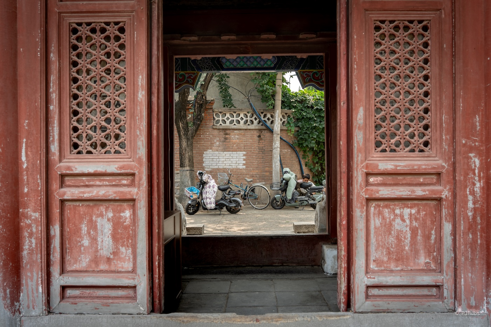
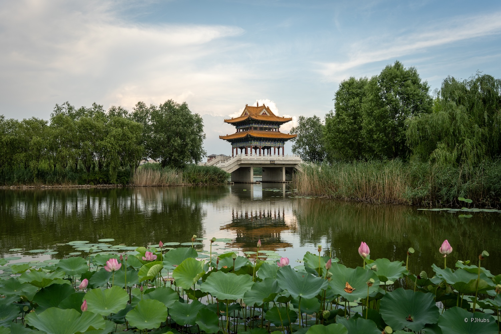

距离上次外出游乐已经整整过去一个多月，心里十分痒痒，一直在计划着在如此炎热的夏季三伏来临之前再骑着车玩点什么。拥有八大辽构之二的独乐寺从去年开始就进入了我的脑海中，趁此机会骑车拿下。

## 前言
大概是在去年听《博物志》时听到“独乐寺”这一名称，主播嘉宾们对其赞赏不已。辽代留存下来的古建筑本身就很少，只看木质简直的话那就更少了，精华有八处，遂称“八大辽构”。而位于天津蓟州区独乐寺就独占两处，山门一处，大殿观音阁一处。独乐寺的建筑本身历经多年战争、地震等多重外界干扰而屹立千年不倒本身就十分难得，但更为可贵的是包括山门在内的五尊辽代泥塑也都安安稳稳的待在那里，似乎早有准备等着大家的到来。

实际上差点就选择了骑车前往西北方向的张家口去了，因为那里有同为燕云十六州之一的“武州”，以及九边重镇之一的宣府镇，也就是今天的张家口宣化区，甚至还会路过我心心念塞外著名的孤山——鸡鸣山。从北京出发不管是骑到蓟县还是鸡鸣山下总距离都差不多 150km 左右，但最终选择了奔东而不是西去，完全是因为我还从未踏足过距离金海湖更远的地方。不像去崇礼时都会经过的下花园、张家口，包括蓟县在内的周边几个县城，如果不是专门挑时间去是很难凑巧的。就连董存瑞老家怀来看着都会不经意因为要去官厅水库玩耍或者要骑幽州峡谷而不得不住上一晚。

最终让我下定决心去蓟县还是独乐寺，因为千万年山水该怎么样它还是怎么样，但就跟巴黎圣母院一样，谁也没想到还能烧了。在大自然面前人类在尽自己所能，虽已让独乐寺跨越了千年来到现在，但无法保证明年、五年甚至二十年后它是否还会继续存在。我当时正准备从独乐寺正对面的白塔寺参观浏览完毕出门，正好来了一组游客，听了一番讲解后，导游给大家说了个大案，听得我津津有味，大家感兴趣的话可以[去瞅瞅](https://news.sina.cn/sa/2006-07-06/detail-ikknscsk0486080.d.html)，不过快 20 年前的消息了，除了主犯之外，出狱的那几个人在现在的国家文化背景下，不知道对自己当初的所作所为是不是真的发自内心的懊悔了。

## 去程
我还是喜欢叫蓟县，蓟州区总觉得哪里怪怪的，甚至渔阳都更顺口一些。从北京去蓟县主要有两种交通方式，要么选择做 14.5 元的绿皮火车到达，要么选择去四惠汽车站花 30 元坐大巴。我原本都差点买了绿皮火车，因为我只在很小的时候奶奶带过我坐绿皮火车回老家，再长大一些后火车站废弃，在环岛高铁启动前的这段时间都只能选择大巴或者私家车。

但对于一个公路车爱好者来说骑车去旅行当然才是最佳选择啊！我画了一条经顺义走白马路到平谷北上四座楼，爬完坡后东去绕行金海湖最后南下到达蓟县，共计 160km 总爬升 1500m 左右的路线。这个路线如果是平常没有这好几斤重的行李且天气凉爽的情况下，轻轻松松就可以边骑边玩到达，可好巧不巧当天阳光虽然算不上暴晒，但闷热的天气让我越骑越崩溃。

出门时间确实搞得比较晚，临近 8 点才出发，此时外面的阳光就如同我的心情一样似火。原本以为出了望京就不堵车了就没这么多电驴了，没想到出了望京才是痛苦。前几年去往顺义走京密路都是一路凉爽的代表，但这两年在加速搞京密高速，而我却完全忘记了这一点，还特意选了路过完整修路段的线路，吃了一路的土堵了一路的车。刚起步就给我一个下马威，注定今天的骑行之路艰难险阻。

好在右拐上白马路后路况好了很多，又是熟悉的一马平川。想起前几年时俱乐部总是会举办夏季金海湖一日游，每年都是大大一百多公里的大平路来回，中午到了就在金海湖边上农家乐吃鱼，甚至还能下湖戏水。最近这两年疫情结束了，反而没有疫情时人的连接更近了，放开后大家的心也走远了，老朋友们在这座硕大的北京城里，想要再次相见也是难上加难呀。

刚在白马路上没骑多久就收到了携程抢票成功的通知，抢到了两周之后北上去往哈尔滨的卧铺。我还从未在火车上睡过夜，虽然确实睡一觉过去能够省下一晚的住宿费，但从我个人出发新奇的体验感是远大于金钱的。毕竟是晚上，本身也没啥风景，为了避免他人干扰还特意选的来回均为上铺，希望能给自己一个好的体验。

天气此时已经变得很热了，驮着好几斤重行李的我也来到了积极开爬四座楼前的最后一个补给点。灌满了水吃了点东西后就继续往前，准备对四座楼大干一场。这次是特意选择了从熊儿寨方向上，之前都是从前面不远处的北寨村方向，这次换个口味。不得不说，从熊儿寨方向上山确实凉爽不少，虽不能算全程阴凉，但绝对比北寨村方向来得舒服，风景比上不足比下有余，最重要的是车流量锐减，值得二刷。

但因为我不再使用码表，只是拿手表记个轨迹和一些数据，想要看距离山顶还有多远就得停车下来掏出手机仔细对比。第一次从熊儿寨方向上山距离确实比北寨村方向更长一些，行李过重导致我状态也在持续走低，不得不多次停车查看剩余距离。以后可能还得继续精简行李，这次反映这么强烈主要是尾包里还塞下了相机和电池，甚至还有一双鞋，莫名其妙的加重了好几斤。而想要带上相机出门如果不是独想要好好的看下独乐寺，记录下些什么，完全没必要带上相机。以后可能我都不会再买标准版 iPhone 了吧，相机也不再更新换代了，不管多小毕竟都还得驮着，再怎么严肃摄影只要调整好心态，也就严肃了吧。

到达山顶驴友广场后，猫咪们就出来了。驴友广场的一大特色就是小猫咪特别多，如果你也想来爬四座楼，最好是带上一些冻干之类的便于携带的猫咪零食，小猫们可是一直在等着我们呐！放坡后我喜提本次旅程的第一次扎胎，又是前轮！心想着这次行程结束回家后一定把外胎都给换了，没想到这前轮外胎在回程路上又给我埋下了伏笔。

放坡后就到达北寨村，此时阳光已是愈发剧烈，我连忙在村里小卖部停下。在店里喝冰水吃火腿，坐了十几分钟才慢慢缓了过来。此时已到达午后 14 点，是一天中最热的时间，但我担心后面的行程拖得太长，到达蓟县的时间过晚在山路上不安全。没想到开启了我这最后五十公里的痛苦。

从北寨村出来后往东一些就到达了金海湖。在金海湖我的心态就被时不时身边经过的大挂卡车搞崩了，之前的我确实也不怎么害怕担心这些奔波在山路里的大货车。但去年开春不久我独自骑车京西高崖口，从流村环岛大直路回阳坊，没想到直接被一辆大货车从背后肩部顶飞了几米，被车头撞上后我预感不对，看到路基边上是泥路和大树，心想就算撞树也好过卷到大货车轮底下啊！赶紧把车头偏向右边并赶紧捏住刹车，快速解锁，最终安全停在了树前。一开始都给我撞懵了，心想这是没看见我还是看见我了故意撞的，等我恍惚过来时，这辆大货车都要开走了，看他没有停下的意思，我连忙追上去想要拿拍下一张照片。此时前面终于等来了红灯，我骑到车前，对着它拍了一张照，司机就这么看着我，对刚才发生的事情毫不知情。

我推着自行走到了旁边的草地上坐着，坐了好久才缓过来。越想越害怕，脑子里闪过了无数个画面，如果刚才我不能顺势的、快速的摆向右边，而是摆向了左边，连人带车就会被彻底卷入到我肩高的车轮下。最后，我叫了一辆货拉拉回家了。自此那条路线我到今天都不再踏足过，甚至多次怀疑过那个地方是不是克我，因为每次去到那个方向走那条路线，不是扎胎就摔车，再严重点就是被车撞。感觉老天爷已经在多次提醒我了，而且提醒的力度越来愈大。这件事给我造成的影响除了那个方位的路线废弃了外，我开始对奔驰在各种国道、省道甚至乡道上的大货车十分害怕，害怕到如果身后有大货车，马上就减速让它超车。这种体验当然不好，但为了自己的安全，甚至停下车来让大货车通过也不是不行。

所以从金海湖到蓟县的那一大段山路，几乎就没有大货车的时候，双向单车道，还都是挂卡，真的很害怕拐弯时没注意到路边的我，车厢盲区又给我创了。所以整个不到 30 公里的路程骑得非常煎熬，再加上车重和爬坡，以及酷热的天气，每骑几公里我就得停下休息，焦灼得看着导航到底还剩多少距离才能到达蓟县市区。

就这样骑骑停停，我终于在下午 16 点前到达了独乐寺，喝着蜜雪冰城的柠檬茶，坐在店里歇了一会儿，缓过来后才继续骑往酒店。当晚在酒店就没出来，原本是想洗个澡后逛逛渔阳古街，没想到洗完澡后整个人都松懈下来了，躺在床上越来越困，最后随便点了个外卖果腹。

此时手机上的时间是晚上的 20：30，盖被，睡觉。

## 一日游
原本我还想着早起趁着天气略微凉爽时登上盘山，和乾隆帝共赏同一片山河。但没想到这一觉睡得不踏实，大腿隐隐作痛，虽然我骑车结束后从来不拉伸，但昨晚洗漱完毕后应该做些恢复动作，甚至直接打车去按摩才对。再次睁眼时就到了早上八点多，拉开窗帘一看外面万里无云，定睛一看又是艳阳天，瞬间打消了我去爬盘山的如意算盘。

慢吞吞的洗漱完毕后去吃酒店早餐，我甚至都没动过出门尝试下蓟县早餐的想法，去短暂的做一回当地人，一看到这么大太阳啥都放弃了。人类这种动物确实很难办呀，太冷太热都不行，就这样都能作为这个星球的霸主。

第一站当然就是想了很久的独乐寺啦！我还幻想着可以坐蓟县公交去独乐寺，刚出酒店大门的阴凉处感受了几秒热情的阳光后果断选择打车。意外的是，居然仅需 1.9 元就可以到达，公交车还得 2 元，共享电动车还得 3 元呢。果断开启了我在蓟县出行全程滴滴的模式，不知道最近是有活动还是蓟县赞助，十分舒服！在前一天晚上我简单搜了下，独乐寺这么火爆的地方居然没有讲解，反而大家都是组团报名旅行团来的。

独乐寺的动线设置的非常奇怪，但我猜可能是因为占地面积太小的原因吧。一般情况下进入一座寺庙都是从山门开始逐级浏览。但独乐寺是从侧门开了口子，买了票后从侧殿进入，相当于是从中间部分开始浏览，出口刚好也在山门处。我也没管太多，直接从侧面就进入了观音阁内部，抬头看着 16 米高的十一面观音像，久久不愿离去。观音阁内部的斗拱很大，随便怎么扫几眼看过去整体都非常舒服，在北京市区的古建里看过了清代花花绿绿的风格后，唐宋辽风格建筑确实更为典雅，多了一份雅致，少了一份喧闹。

其两傍侍立菩萨的面部造像与我在华严寺看到被誉为“东方维纳斯”合掌露齿协侍菩萨面部造像颇为相似，仔细一想才后知后觉，这二者均为辽代遗构，菩萨制作工艺和造像上类似也不足为奇。大殿内很热，我绕着走了几圈一方面是想避开不断涌入的游客，另一方面是想要仔细查看已是斑驳不清的壁画。看到这些壁画后感觉还是挺可惜的，虽然在明代有重描过，但我觉得就目前作为国宝甚至正在申请世界文化遗产来说，对壁画的保护措施太差劲了。绕到观音像后面就会看到更具特色、明代所塑的“海岛观音”，导游们都叫她“倒坐观音”。她脚踩蛟龙，左悬立关于，右竖立韦驮。倒坐观音面相宁静和蔼，盯着看久了有种莫名的、说不上来的感觉，平静、大度。

如果后续真能成功申请下世界文化遗产，就观音阁本身的保护等级个人认为完全值得再上两个台阶，甚至完全值得把盘山的门票和缆车钱移一部分过来。从观音阁出来后，往前走几步就到了山门。对比观音阁的话，山门的保护措施就更是低人三等。山门两旁的哼哈二将虽也是同观音阁内塑像同一时间构造，但就风化程度来说更是令人痛心，手部的彩漆已全部翻皮，一整大风袭来都担心会被吹跑。但不得不说这两位跨越千年的哼哈二将的面部表情远比现在翻新的一些寺庙山门二将生动不少，挺多人都说远观能隐约听到二将发出的“哼哈”气势。

独乐寺剩下的建筑里除了乾隆行宫外其他没什么特色，可以把时间都花在观音阁和山门两处，可以仔仔细细的看着这些千百年前古人的语言，他们用这些当年相对留存久远的方式与我们隔空对话。

从独乐寺出来后，我并没有急着去往白塔寺，而是先简单逛了逛“渔阳古街”，找到了“幸福咖啡馆”，喝了一杯特色“冰柿茶”和“核桃拿铁”。渔阳古街虽说与绝大部分的古街古城并无二意，但管理部门并没有拒绝让市民沿街摆摊，在一些阴凉处可以见到不少推车卖麻将鸡蛋、碗托的村民。我是一个出来游玩对吃喝没有念想的人，不会因为到了某个地方就要执念吃当地特色，更不会为了排队买某个特色食物而排起大队，所以路过这些小吃我也只是走进看看具体长什么样子而作罢。

下一站我绕到鼓楼和鼓楼广场，整个鼓楼广场和东西两条渔阳古街范围政府弄得十分红火，可以猜想到了晚上这一大片地方必定也是人声鼎沸，其乐融融。鼓楼北上快走几步就来到了文庙和鲁班庙，从历史底蕴来说没问题，尤其是鲁班庙，居然还有不少台湾友人拜祭鲁班庙的纪念。但文庙和鲁班庙都很小，而且相关配套设施很一般。文庙的检票人员甚至因为天气过于炎热，直接在休息室里隔空喊话检票。虽然能理解，但服务意识过差，这两个地方属于是套票赠送，主打一个来都来了。

顶着炎炎烈日，冒着一身热汗从文庙和鲁班庙出来后，我左躲右闪的走进树荫里，顺着鼓楼大街往白塔寺走去。白塔寺藏在一众民居范围里，景区大门更是小得不行，稍不注意如果不少游客的进进出出，完全可能忽略。观音阁的十一面观音目之所及之处就是白塔寺塔尖，这这二者的范围原本都是独乐寺范围，但随着历史漫漫长河的演变，现在独乐寺和白塔之间不光隔着鼓楼广场还有众多的小区和民房，菩萨也算是看尽世间人生百态了。

站在白塔对面屋檐的阴影里，不敢坐下，因为烫屁股。偶尔一阵凉爽的微风袭来，惊起白塔上的风铃阵阵骚动，似乎在像底下熙熙攘攘、来来往往的游客们演奏着一场来自千年前的辽音宋乐。我还是跟着大家一起，快速的绕塔一周，随即重新进入阴影处，也是静静地看着白塔，就这么一直看着。

那么说回到盘山，天气炎热是阻碍我前往的一大原因，但还有一部分原因是最初只打算走上去坐缆车下来，但就算如此半程缆车也得 100 元，并且还不是全程缆车，而又是小半程，最后小半程上面包车下山。不是很理解不能全程缆车下山为什么依旧要收如此昂贵的价格，想了下还是下次有机会再登高吧。

至此，半天的蓟县古建之旅就彻底结束了。我身上的汗已经湿了干干了湿不知道几回了，不可不饿，只想赶紧找个凉爽的地方歇歇脚。在大众点评上随意找了家看着还可以的按摩店，畅想边足疗边爽吹空调的畅快了。整套按摩下来发觉论服务业还得是川渝地区来得舒服，不过也可能是因为我选的地方不对，全程只有一瓶百事可乐，无果盘无小吃，价格还远超川渝，居然要 178 元。好在选择了拔火罐，也算是全新体验了。

按摩结束后的时间临近午后 14 点，此时肚子微微饿，看到了附近有坛子烤肉，冒着大太阳走过去后才发现午休了，原本以为午休这种事只有南方才会出现没想到远在蓟县也会如此，只好重新打车前往万达广场。原本我以为万达广场是一个上流的地方，但自从我家的十八线县城也开家万达，每年过年回家逛万达总是会发现上一年吃过的饭馆倒闭了，要么就是贴了旺铺招租，与开业时的万人空巷反差过大。但不得不说就蓟县的万达确实县城中心，聚集了大量的人流和饭馆，虽然只有地上三层，但可逛度远超市区，甚至这三层商场里开了四家游乐场，还刚好赶上正在做开业活动的现场，仅需 10 元就可换 50 枚游戏币，场面火爆。

在万达解决完午饭后完改道前往人民公园，远远就听到了湖畔对面传来的阵阵歌声，想必定是大爷大妈的快乐现场。蓟县人民公园实在是太寒颤了，有个游乐园已经歇业关门了，里面摩天轮上还挂着“蓟州之眼”的大字，水上乐园的设施在午后微风中摇摇晃晃，旁边的大滑梯再也没了孩童的欢笑，静止摇摆的海盗船也无法给出乘风破浪的快感。眼前的这一切就这么静静地躺在人民公园的怀抱里，在臂弯里沉睡。我绕了一圈，走到几位大爷下棋的地方看着他们你来我往的杀棋，伴随着旁边大娘的歌声，午后燥热的蝉鸣，天空中几处稀稀拉拉的风筝，完美刻画出了一座北方小县城的周末时光。

时间来到了下午 18 点左右，我重新买了瓶冰绿茶，边喝边走向公交站台，坐着等 516 路公交车，再次去往独乐寺边上的渔阳古街，准备逛一逛夜市。但等了十几分钟，一直没能等到公交车，周边也没有共享电动车，甚至共享单车都没有，只好重新打开滴滴，再次叫了一辆花费 1.9 元的一口价特惠快车。

重新到达独乐寺后，我蹲在独乐寺灰白色围墙对面的台阶上，想给熙熙攘攘来往的人群拍个剪影。此时一对夫妻来到我身边，男士（下文称“大哥”）也和我一样蹲在了地上，看着我拍照。看了一会，说让我给他俩也拍一张手牵手走在围墙下的照片。其实我从心底里是不愿意的，首先是我不喜欢也不会拍人，其次是当我选择一个人拍照时状态已经调整好了不希望被打扰，最后是本身拍照就是一件有成本的事情，为什么我要免费给你拍呢？虽然最后给我买了瓶冰矿泉水，但这样显得这个行为更廉价了。在当时的氛围下也就勉为其难的、假模假样的拍了几张照片。

等这对夫妻走后，我继续拍了一会儿，拍到满意的画面后开始继续往鼓楼方向走去，逛了另外一边的渔阳古街。鼓楼大街和东西两侧的渔阳古街构成蓟县夜晚最繁华的十字路口，天微微黑就从四面八方聚集了大量的人流，遛娃的、散步的、拖家带口出来摆摊儿卖东西的，都来了，甚至还有我最爱吃的炒冰！但此时天公不作美，开始掉点儿了，我赶忙站在树底下叫车回酒店，刚上车雨就下大了。

## 返程
因为来时驼了好几斤重的行李，加上返程时看了天气预报将会更加炎热，遂决定把相机、便衣和一双鞋都塞进了车尾包里快递回家。意外的是前段时间充电宝自燃的事情居然也落到了我头上，正是因为这件事导致顺丰不接收充电宝快递服务，并且还想顺带让我把相机电池给拿出来，当时正冒着大太阳骑着车的我气不打一处来，“这是相机电池，不是充电宝！”。就这样，我丢弃了一块明确有 3C 标识的小米一万毫安充电宝，虽然也就一百多块钱，但不得不说这他妈真是个操蛋的世界。

从蓟县返回北京家中都是大平路，需要经过邦均、三河和燕郊这几个关键乡镇，总路程只有一百公里出头，我决定给自己加量！早上酒店退房后先去骑津围二线，把两个观景台都拿下再返程。但就是这个决定让我后来只能坚持到通州，完美赶上了一天中最热的时候，不得不放弃骑完全程的打算。

第一个观景台是于桥水库观景台，上面有家 233 咖啡馆，这段路也被称为“天津最美山路”。风景确实不错，蓟县的于桥水库在上个世界五十年代就存在了，从 233 咖啡馆放坡下去一眼望不到头非常美丽，值得专门来一趟。但后面的三道岭观景台纯坑爹，不光啥风景都看不到，顶上连个卖水的铺子都没有，但卖山货的倒有五六家，十分不推荐，又热又晒，一路上没有任何阴凉，山里根本不凉快呀！

从山上放坡回到市区后，我就骑向了本次旅行的最后一个观景点“邦均石人造像”。这个石人就在路边，稍不注意就略过了，但现在已经被护栏给围起来了，旁边还有个天津市文物保护单位的石碑，这两位就这么孤零零的站在忙碌的、全是大货车的 102 国道边上。和石人拍了合影后就开启了一路狂奔模式，此时心中的目标只有回家吹空调喝柠檬茶。

但老天爷不想让我这趟旅程结束得如此顺利，刚从邦均骑了没多久就扎胎了，明明来时已经在四座楼扎了一次，没想到还是没躲过路旁全是小石子的国道。快速换上我的最后一条内胎后，心里一直在想后面还剩下的几十公里可别再给我扎了，要不然从京外一路货拉拉回家可花不少钱。但生活就是这么爱和你开玩笑，在马上进入三河城区前 2.3km 处我再次扎胎了，还是前轮！心态马上就崩了，都做好准备叫货拉拉了。但还是留了个心眼，打开了大众点评，发现前面 2km 处就有一个美利达自行车店，果断打电话和老板沟通维修情况，慢悠悠的踩着前轮完全没气的自行车往前嘎油。

在店里休息了差不多半个小时左右，老板给我换了全新的前后内外胎，并嘱咐我以后如果再骑这么多小石子的国道，可以换条厚一点的外胎，防止被轻易硌破。再次骑上完美状态的自行车时已是中午 11 点，此时距离进入通州还有将近二十多公里，心态已经从骑回家变为了到通州就上货拉拉吧。

其实自己也是想去燕郊看一看，这个神奇的地方聚集了大量每日通勤去国贸 CBD 和望京的上班族，甚至有不少人把家安在了这里。最著名的一张对比图，就是潮白河两岸的燕郊高楼和通州荒地的对比，我也想去拍这么一张照片。不得不说从三河到燕郊的这一路确实比从蓟县到三河的这一路凉快不少，至少有了稀稀拉拉的树荫，勉强可以避一避阳光。好不容易过了燕郊检查站进入了北京地界，都准备掏出手机叫货拉拉了，才猛的发现这个地方距离通州城区还有好几公里，这里是宋庄...

我咬着牙赶紧继续憋着一口气继续往前骑，此时阳光已经越来越猛烈，也拿着水壶往自己的头和身体上浇了好几次水，深感着如果全程骑回家真的就要倒下了。此时路边发现了一座商厦，定睛一看居然有麦当劳！马上停车拐入，迅速进入麦当劳，点了买一送一冰沙，足足又坐了半小时才缓了过来。

终于，坐上了回家的货拉拉。

## 总结
这一趟蓟县骑行之旅总结来看就是“自找苦吃”，明明已经看好了大交通，坐火车过去仅需 14.5，不知道怎么的就是想骑过去，导致虽不至于中暑但连受了两天苦。要说乐趣确实也还是有的，至少车是骑爽了，爽到刚过去一天就谋划起了下一次骑行之旅去哪里。蓟县最适合的玩耍方式就是自驾，周边把盘山和几个山区里的经典景点都逛一逛看一看，住个山间民宿，晚上去山里观景台在好天气下看看星星，多好。

学到的教训是自行车旅行确实还得精简行李，相机是万万不能带的，鞋子和便衣一定要速干轻便的，并且一天的行程不要超过 130km，并且尽量选择早点出发，天气凉快也车流量也少。再往后拓展一下，如果未来要开始一段完整的自行车旅行，带的行李一定会更多，我大概率还是选择公路车，并且把行李分段打包邮寄，每隔一段距离就先把用不到的行李提前寄走，降低负担。但如果选择不骑车旅行，而是就普通的背包客，我也十分喜欢，并且可能后面选择背包客的概率会更大。主要原因就是可以多带些东西，一个背包可以把包括相机在内的很多物品都装好，到处流浪时背着个包就走，十分惬意。

近期可能还会有几次类似蓟县这种近郊的骑车旅行，主要是这些地方专门花时间去一趟不值得，但在骑车的同时顺带去了就很合适，期待我的下一次旅行吧！