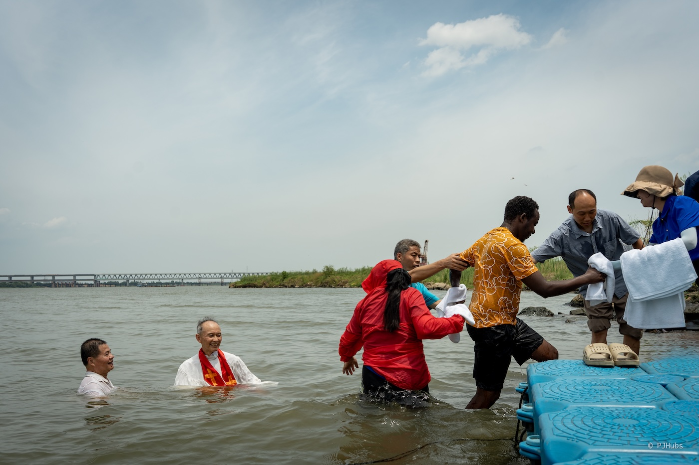
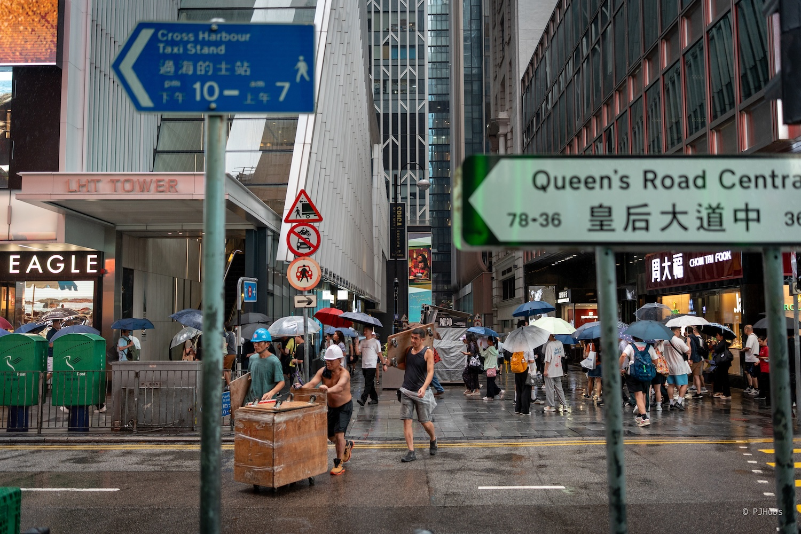
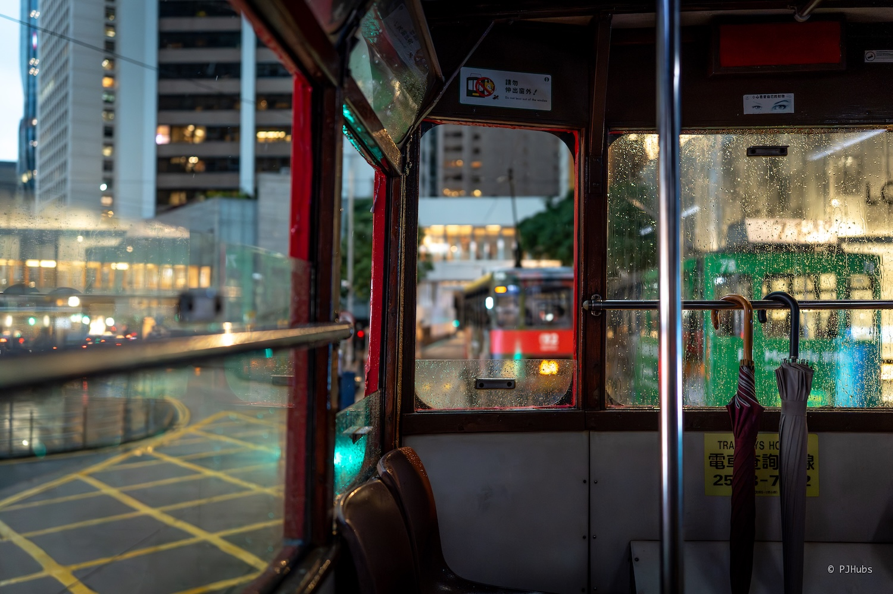
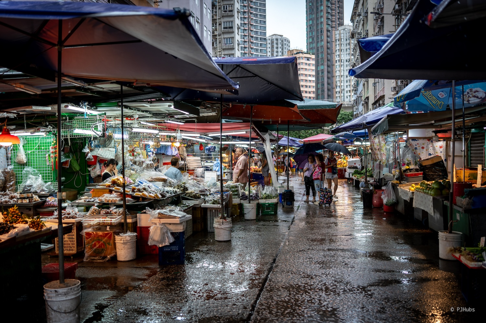
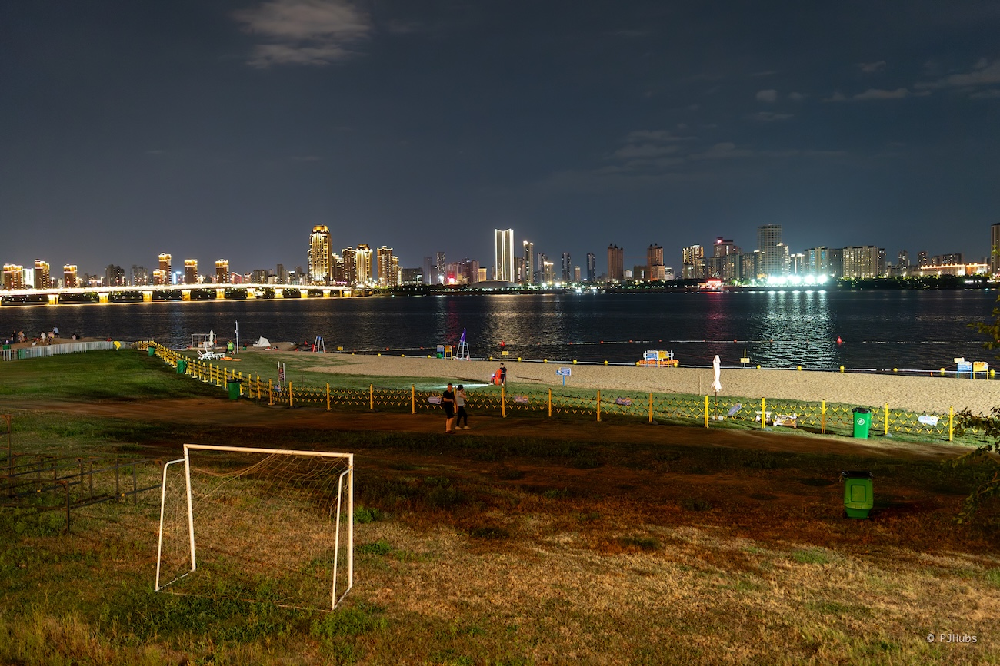
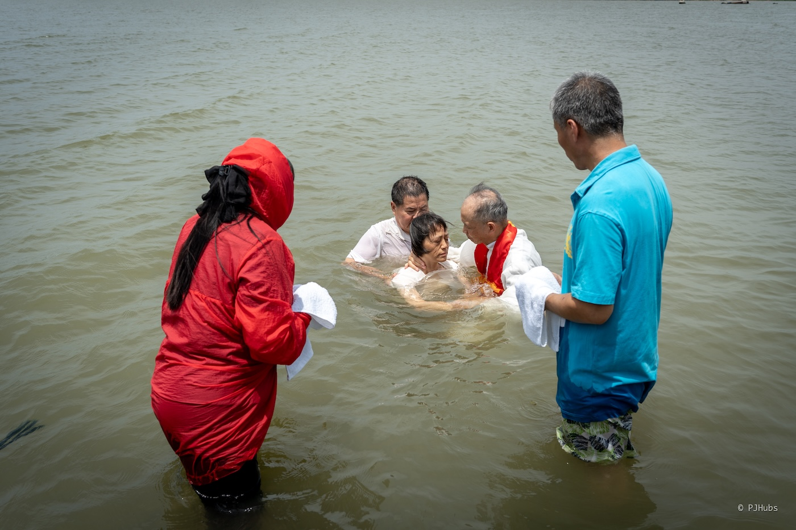
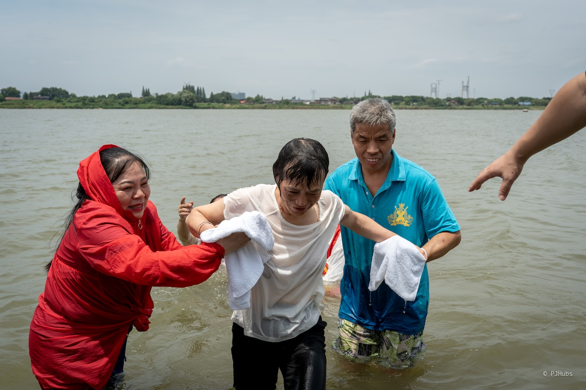
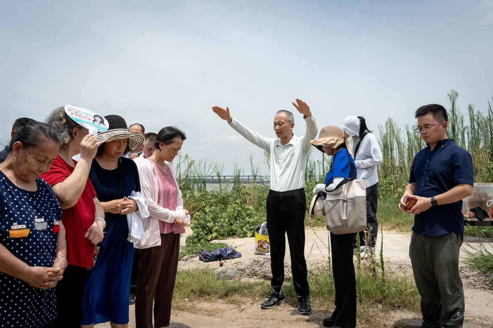
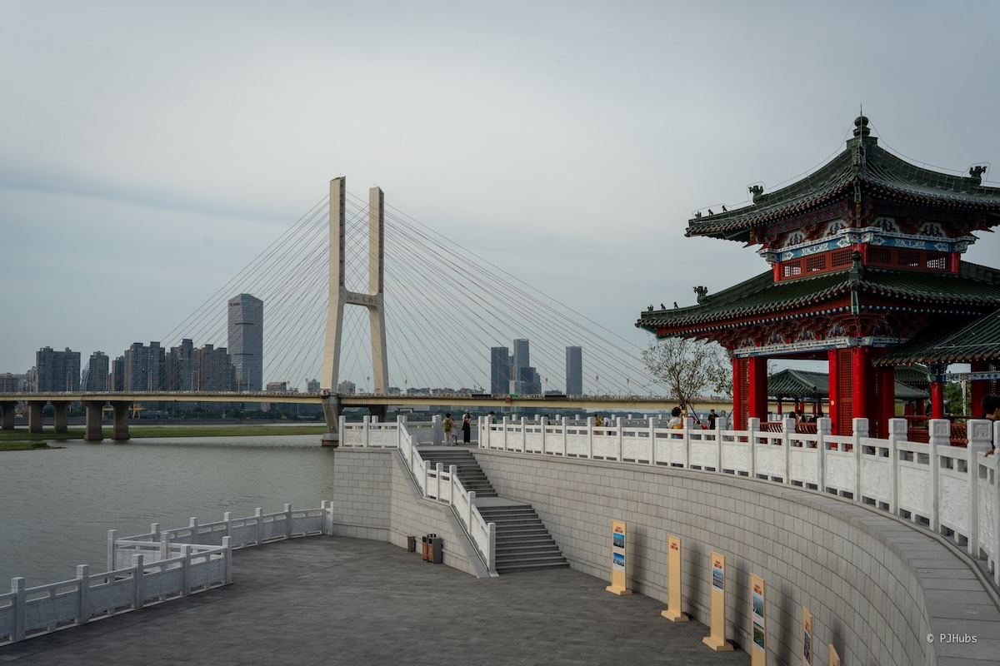
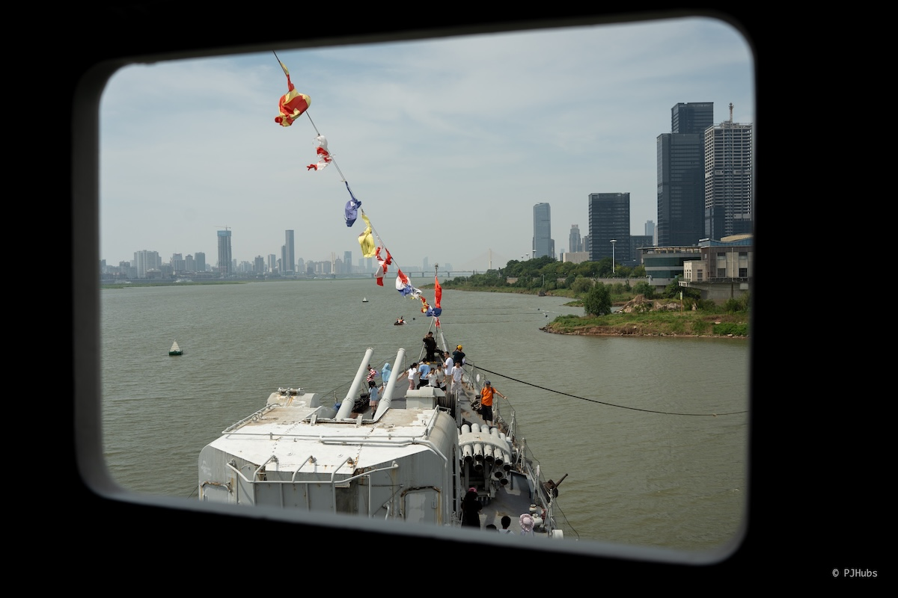

在亭子里坐着吹风，遥望间看到了对岸的十字架。走进一看居然是一家历史厚重的基督教堂。执事看到了我在门口摇摆不定，微笑着张开双手迎接我，安排了一个座位。并告诉我很巧，今天是一年一度的受洗，邀请我一同前往赣江边观礼，我惊喜的立马答应。礼毕后回到教堂，吃了圣餐，兄弟姊妹们怕我中暑，还分给了我西瓜吃。

## 雨下得真大
是的，我又南下出差了！距离上一次只有两个月有余，主要原因还是因为团队业务上有变化，国内和海外业务要进一步拆分，和老伙计们吃了顿开开心心的散伙饭，和新伙计们也剧了词红红火火的餐，总而言之我们都有大好的前程！几乎是从我从北京出发去深圳的当天这雨就下个不停，每天都在下，更有甚者连下一整天，凌晨四五点还伴随着轰隆隆的雷暴，深圳市政府的恶劣天气预警是一个接一个的发呀。

但我偏偏不信邪，在香港雨中漫步更是我长久以来的念想，通过散落在地面上的小水坑，整体拍摄出来的画面更为立体。只是没想到一大早到达香港后，从尖沙咀站出来后也没停过，越下越大，大到我等来了港府发来的“黑水预警”，赶紧找了家最近的早餐店吃了顿热乎的早餐才缓了过来。

只是没想到早餐都吃好了，维多利亚港对面的港岛却依旧是白茫茫的一片啥也看不见，开始担心天星小轮是否还能正常营业。我一步一个脚印、边跳边选择浅水洼处终于来到了香港艺术馆的平台附近，这短短的两三百米居然让我全身湿透，原本以为打着伞、穿着 core-tex 的鞋肯定没问题，只是没想到这瓢泼大雨会把我拍得这么遗世独立，无人过问。就这样，我慢慢的走在平台底部，敬待着维港大雾散去、雨势渐小，此时发现对面驶来了一辆天星小轮，悬着的心总算是放了下里，大步向前去往中环的闸口。

到达港岛后，我以最快的速度坐上一辆“叮叮车”，没有什么比在大雨中坐上叮叮车，看着过往的行人和车流更为惬意了！庆幸的是前排没有人，我赶紧擦干净座椅上的雨水，一屁股扎扎实实的坐下，生怕错过即将到来的港岛街景。

我从中环开始，自西向东一直做到了筲箕灣站，来了这么多次港岛，这块地方是我从未踏足的。不得不说人确实少了非常多，终点站筲箕灣就是一个菜市场，虽然香港是一个“过发达地区”，但这种露天街市曾经也是我小时候的记忆在现如今也只能在这里找到了。我很期待并惊喜每次来香港都能够看到一处或两处这种随街而摆的摊位，这是烟火气最朴实的表达，超市里规整、琳琅满目的商品在某些时候给人的安稳和满足并不一定比街市多。

此行来香港的最大一个目的是为了走从海洋公园开始到浅水湾沙滩的海边路线，据说风景非常不错，怪石嶙峋。这次的天气虽然不好，但我依旧是打着来都来了的期待依旧转移到了海洋公园，准备来一场雨中沙滩漫步。此刻我脚下的鞋子已完全湿透，每踩下一步都是打心底里的难受，想返回深圳的心也提到了嗓子眼，不过一想到每一次来香港都可能是最后一次，还是硬着头皮走了一小段，来到了深水湾沙滩。

风景说实话也就那么回事，没有什么特别的地方，主要是还被天气和心情影响到了，比较一般。看到公交站牌后，果断结束此次香港之行，返回香港西九龙站，改签高铁，回到深圳。

## 纠结
回到深圳后的几天时间里我的心情和状态依旧受到了天气的影响，这个时候的虽然才刚刚到达深圳一周的时间，但已经想返京了。只是窗外的雨下得就如我内心的纠结一般，连绵不断，愁意满满。我内心还是想走完祖国的所有省份，这是我当初 25 岁结束前一个小小的梦想。可惜当初遇上了三年疫情，很多东西都停滞不前了，我转而去骑车，至少先让自己在路上。疫情结束后我确实也引来了“爆发式旅行”，几乎每个周末都会出行。23 年初执行这个疯狂的周末旅行计划时还没有“特种兵旅行”和“city walk”的概念，后来我才知道自己的这种旅行风格和方式和这两个概念如出一辙。

很快，这种旅行方式极大耗费了我的精力和状态，突然间我变得不那么喜欢旅行，不那么喜欢到处去看一看，似乎一切被自己从一个极端推向到另一个极端后，变得更加遥远了。后来，我让自己停下来大半年，不再通过这种旅行方式去探索，而时就这样静静地呆着，呆着。果然离家久了想家，在家呆久了想离开。就这样起起伏伏目前为止包括台湾在内，还剩下七个省市和地区未曾踏足。在相当长的一段时间里我都要忘记这个曾经的梦想了，但每次南下出差，一有机会这个小小的梦想总是会不经意的在深夜中进入我的梦乡里，那要不然还是继续完成它吧！

我开始查找距离深圳比较近且是自己未曾去过的省份，备选的有贵州、江西和西藏。首先，西藏是肯定不能选的了，虽然从深圳飞往拉萨的价格确实比北京出发便宜一些，但只有周末两天专门花费大几千元跑这么一趟实在是不值。其次，贵州我想去看的黄果树瀑谷并不在省城贵阳，路上的交通时间过长，但更令人难受的是就算我也只想去贵阳看看，周五下午从深圳出发的高铁票已完全没有，看来确实是火爆啊！最后，只能落在了江西省，南昌这个英雄之城确实也值得看看，但除了滕王阁、海昏侯墓和拌粉外我对南昌的其他印象全无，一直在纠结，纠结了好几天了。

决定真的去往南昌是因为彻底放弃周中返京，前面说到的雨一直连续下到了周四才有所缓和，才终于在深圳见到了一次久违的蓝天白云。被压抑的雷暴雨天气围绕了一个多星期，自己的状态当然也有所低落，在返程迎接下一周的工作前，周末一定要去个阳光灿烂、万里无云的地方了！也就彻底决定了要去南昌，利用中午午休的时间定好了所有行程。

## 赣江的夜
从深圳到南昌看地图不算特别远，但还是要坐四个小时的高铁，到达南昌西站已错过夕阳。下榻在学府东路的全季酒店，不得不说暑期的南昌酒店价格水涨船高，虽然南昌确实也是个历史文化名城，但这酒店价格与我在大街上看到的招工启示所开出的薪资完全不合，很是诧异。也看了民宿和青旅，都因为卫生问题而劝退，不清楚是因为年龄的原因还是确实想花钱了，每次看到民宿那令人堪忧的卫生环境，以及青旅那盲盒式的睡眠质量，就想着钱也是赚来花的，可能这地方也就来这么一次，咬咬牙，也就加了钱。这里的全季酒店后面还有事情发生，先留个伏笔，让我日后出门对华住会的品牌信赖更上一层楼。

办理入住完毕后，我随意选择了最近的一家江西菜馆，味道比较糟糕，没有口感只有咸感。原本是要找拌粉的，但可能是太饿了，匆忙选择了一家只有 3.8 分的菜馆，有时候大众点评上的评分不一定准确，但低于 4 分的可能大概率真有问题。后来我几乎每顿饭都选择了吃拌粉加瓦罐汤，任何一家店这两样做的都非常好，便宜又实惠，甚至外卖点这两样味道也没有任何偏差。可能是拌粉和瓦罐汤制作流程固定，配料清晰，再怎么特立独行的商家应该也不会做得与他人差异太大。

吃饱喝足后，散步来到赣江边，此时正值 20 点左右，正是大家饭后消食散步的好时机。来到了南昌之星摩天轮下，举头望着这硕大无比的摩天轮，决定自己也要上去看看！径直走到摩天轮入口，发现已经有大量游客在弯弯绕绕的排队的，顺着队伍往后看，想找到队尾排队。没想到我一直走啊走啊走，都要离开摩天轮的小广场范围了，队伍还是一眼望不到了，马上放弃乘坐这世界第三大的摩天轮，缘分未到，下次一定。

不得不说赣江边的风景确实不错，大家做什么的都有，拿个野餐垫席地而坐，带着孩子来挖沙，甚至就坐在草地上看政府免费放映的电影，很是惬意。但耳边很嘈杂，“烤肠、玉米、矿泉水”的喇叭声此起彼伏，巴不得贴在你的耳朵上告诉你。如果有办法可以限制下公共空间的喇叭叫卖声，我觉得国内任意一个景点的舒适度可以上一个大台阶，真的是太烦躁了。

南昌之星摩天轮下天的江滩是个政府规范的露天泳场，可以看出花费了非常多的人力物力来维护，每天下午 15:30 到晚上 19：30，配备了很多安全员，服务民众。原本以为就露天泳场这附近的一段江滩有安保人员巡视，没想到我一直往北走向秋水广场的这几公里江滩边都有安保人员巡视，我甚至怀疑会不会是 24 小时巡视。面对这种事情我直接就联想到了“大家长”，可能这个词在绝大多数语境下都是偏向贬义的，但在这里是褒义。我们先不去揣测如果因为有市民下江游泳而溺亡，相关街道办、区政府是否会受到牵连才出此下策花费大量人力来巡逻，只讨论所见所闻的花，我认为这个世界上应该没有多少个国家，或者这可能是唯一一个把人民群众生命真真实实放到第一位的国家政府了。

边走边想一些有的没的事情，就来到了秋水广场。这里周五和周末晚上都会有两场喷泉表演，被传是亚洲最大的音乐喷泉群，很值得一来。第二天临近傍晚再次来到秋水广场时确是想看看，但小小的广场上挤了密密麻麻的围观群众，再加上本不富裕的广场区域上还有大量的烤肠、冰粉和套娃小摊贩，非常拥挤。

我在秋水广场随意逛了逛，隔赣江遥望了腾王阁夜景，很漂亮。

## 耶稣爱你

第二天一大早，我直接地铁到达阳明公园，打算先在老城区走走看看，早餐当然也是拌粉和瓦罐汤了！但南昌的市貌和其他地方大差不差，没有太多区别，甚至在西湖边上的老楼群里隐约能看到一些家乡的感觉。我走到杏花楼，坐在亭子上吹风，外面的阳光确实很烈，但在湖面中心的亭子里微风拂面，凉意渐盛。带上耳机，听着音乐，思绪开始随风而去，慢慢带领我的视线来到了对岸的一个十字架上。打开地图一看，原来是颇有年代感的教堂——志道堂。最近一次修缮是 2006 年 8 月，按照历史原貌进行了完善。

起身前往志道堂的路上先看到了佑民寺，明黄色的山门颇有岭南寺庙风格，一看寺庙介绍又是一座名刹，历史上甚至还有韩国僧人专门到访。只是文革时期损坏严重，目前的寺庙主体建筑也是文革之后重新修缮的，还是唏嘘啊！我以此穿过山门、接引殿和大雄宝殿，佛像很壮观威严，佛祖们依旧用那出世的眼神凝视着我们每一位凡人。每次从下往上仰望佛祖，我感受到的并不是平静和放松，反而有种自己做错了什么事，走路要慢的，说话要轻的，说不是奇怪，但很是奇妙。从佑民寺出来后，我注意到了大门旁的烧香初贴着的二维码，这种奇妙的感觉更是涌上了心头。

志道堂就在佑明寺马路对面，一条马路隔着释迦摩尼和耶稣，神界都如此开明包容，不知道我们身为凡人还要为何如此的打打杀杀。教堂的大门半开着，里面坐着不少人，执事先我一步张开双手欢迎我的到来，引导我在长椅坐下。等了一会后，执事也坐到了我的身边，刚开始我对这种自来熟的交流方式还挺警觉的，一开始确实没怎么回执事的话。

后来聊得多了，执事说今天刚好是教堂一年一度的受洗日，如果感兴趣的话可以坐他的车一同前往观礼，我惊喜的连忙答应了下来，受宠若惊，怎么就短短的十几分钟就可以让一个陌生人坐上他的车，并且还表现出了如此的热情，我对执事的戒备之心也就慢慢的放了下来。

更有意思的是，旁边的长椅上还坐着三位非洲友人，执事跟我说其中一位穿着蓝色衬衫的黑人小哥是位“旅行僧人”，旅行家我理解，僧人我也理解，但这两个概念合并在一起形成的旅行僧人我确实不理解。后来查了下资料才发现，原来这种类型的僧人离开寺庙，游历各地，通过亲身体验生活、与不同的人交流，并在旅途中进行自我修行和体悟，也是一种修行方式。这种概念换到古时候那就是行脚僧或云游僧。

我和这三位黑人小哥都坐上了执事的车，去往赣江边观礼。在车上我和执事继续聊天，稍微聊了一些各自对宗教的看法和理解，而我正好前两天刚看完《教宗的继承》这部纪录片，对今天这个意外的见面与纪录片中的主人公十分类似。简而言之这部纪录片讲的是方济各教皇和前任教皇的故事，其中方济各在即将成为牧师之前也有过一次艰难的抉择，如果我没记错的话，这里他的纠结是到底是选择向爱人求婚还是成为一名牧师，他还没有收到耶稣的感召，不确定自己是否应该成为一名牧师。

然而就在他当晚准备出手想心爱的女人求婚时，他一边纠结一边前往现场，途中经过了一家教堂，他在教堂前反复思索，最终决定推门而入。却发现教堂内昏暗一片，正准备离开，此时一位牧师叫住了他，并直接要求他进行忏悔。方济各来到了忏悔室前很纳闷，我没有说过我需要忏悔，您是怎么知道需要忏悔呢？这位牧师也很神奇的回复到，因为他在昨天的睡梦中被告知今天会有人来找他忏悔，他今天来到教堂后就一直在等，但一直也没能等到人，知道刚才方济各的到来。至此，方济各感受到了耶稣对他的感召，决定成为一名牧师，而放弃了求婚。

再回到我今天早上的轨迹里，我原本只是坐在西湖杏花楼亭子里吹风，无意间看到了湖对面的十字架，起身前往想要看一看先遇到了佑明寺。在寺中游览的时间里我已经忘了自己本意是要去教堂，再加上天气炎热，再次从佑民寺出来时目的地已经改为了湖边的一家咖啡馆，只是正好在去咖啡馆的路上看到了志道堂，被执事热情的欢迎观礼。发生的这一切在我敲下这篇文章时还在觉得十分神奇，我很想把这件事归类为对我的感召，但我又不敢，总觉得宗教离自己很远，我的信念不够坚定。

来到赣江边后，我拿着相机仔仔细细的拍了很多照片，受洗的过程和唱诗班的歌声都被我记录了下来。如果我们把宗教这件事定义为虚无，那这件虚无的事情背后得有多强大的信念感，才能够让这么多的人从古至今的坚定下来。我看着站在江水中的牧师，他炯炯有神的双目，在受洗礼的环节里宛如一柱圣光，照耀在兄弟姊妹们的头上。这种人类行为活动通过一些神圣的词语和动作，进一步的隔离了与平常百姓家的活动，只有在特定的时间、地点和装扮才能举办这些活动。妙，确实是妙。

从赣江边回到教堂后，执事让我们赶紧去吃圣餐，随便吃点，都是素食。这是我第一次在宗教场合吃饭，以为会有一些规矩，比如是不是要等大家一起祷告才能动筷子，没想到拿了碗就直接盛菜了，我觉得祷告应该还是有的，只是我们回来晚了。因为当天天气过于炎热，我没啥胃口，但圣餐还得试试，好在有米粉，搞了半碗，味道意外的不错！

总的来说，经过这次和基督教堂的经历，我更加坚信了有“老天爷”的存在，或者是自己的“祖先照顾”，要不然真的很难解释这么多巧合。发生在自己身上的一些事情之前我的归因都是祖先，但往大一些说，可能是祖先也可能真正的造物主，它在和我们用这些巧合进行沟通。或者再玄学一些，是我们的“命数”在发挥作用，虽然看上去都是巧合。

## 滕王阁和八一大桥
从教堂出来后，我终于走向了最开始的目的地——咖啡公馆 31 号。点了一杯液氮冷萃咖啡，第一次喝，太神奇了，意犹未尽，值得推荐。

我预定的滕王阁门票是下午场，虽然是下午场，但这天气完全没有午后凉爽的趋势，反而变本加厉，南昌不愧是稳坐四大火炉城市之一。从唐朝初建滕王阁开始，几乎每一个朝代滕王阁都会因为或这或那的原因被损坏，继而重建。目前我们在赣江边看到的滕王阁是上个世纪 80 年代末再次重建的，上楼的方式只有楼梯，或者年纪够大、残疾、孕妇可用电梯。这滕王阁虽说面积不大，参观游览的动线设计受限，但这楼梯通道温度比室外还要高几度，一个拐角就一个风扇在那孤零零的吹，别说小孩了，我都要晕了。人流量这么大，门票也不便宜，50 元一人就算只装风扇，电费也完全足够覆盖，很难理解景区行为。虽然这当代重建的滕王阁也有快四十年的历史了，但这不能作为借口。

幸亏还有两层楼可以走在阳台上绕行一圈，赣江吹来的微风消暑确实有用，但一想到上下楼还得进入闷热逼仄的通道，大好心情立减一半。每一层楼里展示的东西比较一般，字画和部分存留古物不多，如果想感受古人登阁赏景的状态，直奔户外楼层间即可，没必要做过多停留。

从滕王阁出来后，我走到大士院再吃了拌粉和瓦罐汤，吃好后又点了白糖糕和绿豆汤，白糖糕居然还不错，不腻口感也好，值得推荐。吃饱喝足后，我走上八一大桥，我原本没有走桥的打算，是上午遇见的执事特意嘱咐我，八一大桥上斜看滕王阁风景极好！在大桥上车流量挺大的，而且有些电动车不清楚是有意为之还是走错了下不来，大桥上留给人行道的空间就不大，还有不少逆行的电动车，很容易就碰到了。八一大桥上的风景确实非常好，赣江上的两个较大的江心洲还看到了有人骑车经过，我一路走一路在找登陆江心洲的入口，可惜没找到。大桥上非常凉快，风很大，适合夕阳时段散步。

过了桥，再次来到了秋水广场，原本打算是伫足观看半小时后的喷泉表演，但上文也有提及，小小的秋水广场挤满了游客和小推车，我感觉很容易出事故，再加上大型喷泉演出在鄂尔多斯新城也看过了，没啥特殊的地方也就作罢，继续往前，回到了南昌之星。

我想坐一次摩天轮的心还不死，上一次坐摩天轮还是去年国庆在泰国，当初对摩天轮观城市夜景的形式很喜欢，实际体验下来个人觉得也比游船来得痛快，更何况南昌之星如此有名的摩天轮，来都来了！但可惜的是，人依旧很多，甚至比周五晚上更多了，队伍依旧一眼望不到头，悻悻而归。

## 番外篇
我这次选择的是华住会旗下的全季酒店，我对这种清新淡雅的装修风格很喜欢。在深圳出差时，没想到入住的城际酒店居然也是华住会旗下的，床头柜上放着一本《创始人手记》，字如其意，就是这家连锁酒店品牌创始人写的书，大概总结了过往他几段创业经历。意外的是，如家居然是他的第一个连锁酒店品牌，和首旅合作的，后来因为经营理念不合，把如家彻底给首旅了，他退出再搞了汉庭和全季，主打中高端。他认为只要人类的衣食住行需求存在，人类还需要工作出差，甚至旅行，就一定需要酒店，酒店行业不会消失。但随着世界人民的物质发展水平和经济实力的提升，对酒店住宿的品质也会一直提高，那么主打中高端的连锁酒店在全世界都有诉求，他想做到世界第一的连锁酒店品牌。

更有意思的是，他也是携程的创始人之一。对比我自己，一开始根本没怎么用携程，都是美团、去哪儿和马蜂窝，已经忘了到底是何时开始只用携程，整体体验做的确实不错。特别是接下来要说的这件事，进一步坐实了我对华住会以及携程的信任度。

在南昌的最后一天，因为第二天打算去看南昌舰，订了早上 8 点的闹钟，想着可以不是特别热的时候看完南昌舰后再去机场。没想到 7:30 就被一阵电钻声惊醒，结合桌椅的推移声，搞得我睡意全无，很是生气。原本选择远离南昌老城区 + 全季，应该可以放心的大睡特睡了。这波装修声气的我直接电话前台，“你们能不能看到我的房间号”“你们能不能听到装修声”“南昌周末能不能装修”，得到“能”“能”和“不能”的三个答复后，我的语气已经开始有点不好了，“那是你们去沟通还是我来处理？”，前台这才反应过来要去解决这个问题。

等了差不多 10 分钟，我发现居然还在装修，原本想着多一事不如少一事就这么算了，但坐在马桶上仔细一想，这可是将近五百元一晚的房间，凭什么要消费者来自我化解这个问题。找了携程客服，和携程客服说了我的诉求——减免房费。因为南昌周末不能装修，但酒店前台在已经明确答复听得到装修声的前提下并未主动解决装修问题，反而影响到客人，而且时间还是早上 7:30，要是 9:30 也就罢了。

携程客服态度极好，好到让我意外，有种我是不是不应该反馈这个问题，让人家大周末的加班解决问题。在洗漱的这段时间里，装修声依旧此起彼伏，携程客服再次给我来电，说前台派人来 5 楼查看时并未听到装修声就回去了。听到这个酒店前台解决问题的方式实在是难以理解，携程客服继续说，她一定会负责到底，但减免房费这件事因为当天的值班经理不在，无法操作，经理上班后她会持续跟进。此时我已经不抱什么希望了，因为按照目前国内的这种服务业现状，大概率就送你点伴手礼表达歉意就算结束。

但我不甘心，顺势而为让携程客服帮我争取了价值 40 元一次的酒店早餐，居然还真能争取到。其实我也不是缺这 40 元，只是觉得自己花出去的钱没有换来该得的服务，不爽。酒店早餐也比较一般，虽然也有拌粉和瓦罐汤，但味道不如楼下居民区里的商铺吃得爽快。我在逛南昌舰时，接到了值班经理的电话，居然惊喜的发现真能退房费，还退了两百元。我这种吃软不吃硬的人这退的 200 元瞬间就击溃了我的心理防线，开始和电话里的经理共情起来，不再追究细节了。

综上，我觉得全季确实还可以，没有去辩解原因，一直在表达歉意，携程客服处理这件事亲力亲为以及从头跟进到尾的服务态度，让我对这个平台更加放心了。虽然我也是做互联网产品，但总觉得自家产品客服服务态度和积极性远不如携程，值得学习。

## 总结
这次南昌之行没抱任何预期，就想着走走赣江边，逛逛海昏侯墓。最后赣江边是逛爽了，但海昏侯墓景区因为距离城区太远了，比机场还要远上十几公里，门票买了退退了买，只能下次有机会再去探索了。在老城区闲逛时，如果不是因为无意间结识了志道堂的执事，让我对南昌这座英雄之城有了更立体的感受，要不然真的不知道去哪了。江西省博物馆连续好几天都没票，美术馆也是如此，再加上火炉般的天气，实打实的让身为游客的我感受到了火炉。

至于南昌拌粉和瓦罐汤确实非常好吃，尤其皮蛋肉球汤，味道和口感都不错。我是一个皮蛋爱好者，在深圳出差住的城际酒店每天早餐的凉菜都有凉拌皮蛋，我连续两周早餐顿顿吃皮蛋！也拍出了一组非常有故事感的照片，我准备打印出来装裱上墙，这是我第一次观礼基督教受洗礼，有点魔幻又有点奇妙，妙不可言呐！
