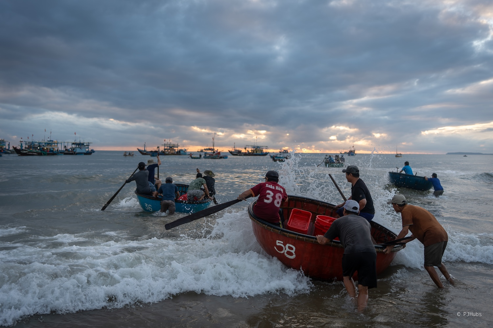

小时候和妈妈一起去海边散步，偶然说起海那边的土地，总是在给我描述出一番和“大陆仔”相对应的“越南仔”印象，我也是离开小岛后才后知后觉原来小岛上的人这么爱“仔”来形容一切外来人员。这次国庆假期用整整十天的时间去到了小时候站在海边畅想的国家，只是回京后第二天确诊甲流，痛苦了三天才恢复过来。回想起自己这一趟主要是去拍照，都是往人多的地方扎堆，不是被蚊子咬的两个小腿都是包就是被海边的水母蛰，刺激极啦！

## 筹备
我大概是在五一节后就想好了国庆想要去越南，并且还是打算一个人去，主要是对比了下泰国看着这么困难更是文化不同的国家一个人都闯下来了，越南就更不成问题。后来一直拖着，拖到了端午节假期从日本九州回来后对外继续旅行的状态得到了比较大的满足，也就没有太放在心上。直到整个七八月又被工作上的事情搞得状态起起伏伏，很是不爽，本来是一件三四个人一起做的事情，短暂告一段落后，现在变成了只有你自己一个人要全部承担起来所有大小事，我觉得这已经不是抗不抗压、不设边界的事情，这就是不合理。

刚好那段时间碰上了半年绩效期，说实话我只是写了五句话就结束了，因为实在是没有任何状态去包装它了，爱咋咋地，甚至有天晚上我无意间重听了《波西米亚狂想曲》，直接给我听哭了，凌晨的夜里我坐在书桌前想了很多关于自己未来的一些事情。调整完状态后的结果就是外界现在任何对我的评价都无用了，我这个人的好与坏，行或不行，都不再是其他人的意志所转移。换句话说，做好该做的，去做想做的。

因此，我马上让自己发生一些能够快速转变拿到结果的状态转变，一点点从既有框架中跳出来。比如马上安排越南签证、换钱、预定机票和酒店、查行程攻略等等这些小事，并且给自己下了一个 ddl，在国庆假期前把 PFollow 最新版给肝出来。好在结果都拿到了，PFollow 最新版出来了，国庆行程也得以全部搞定了，表弟在九月中上旬中途加入，收拾行囊，重新拿起两个月未曾开过机的相机，出发。

我们这次行程途径河内、顺化、会安、岘港和胡志明这五座城市。当然还有极个别具备同样特色的城市我们因为时间关系没能够去到，比如越南东南方欠缺了一大片，此行只有北、中、南三点。主打一个疯狂拍照，疯狂走路，甚至出发前一天我还多买了一张 256G 的 SD 卡，这样总共能拍九千张照片。

## 河内
很好，我们落地河内以及在河内逛的两天没有遇到大风大雨。当时正值南海几大台风接二连三扑向广东、海南和越南方位，稍不注意极有可能既无法落地也无法飞走的情况。但我们在出发前一天也额外买了一张从河内去顺化的火车票，本来我的预期就是坐火车南下，去感受下这条年纪过百的米轨火车，当时在泰国坐的火车体验太好了，虽然是自然风硬座，但直到今天都还在念念不忘。只是没想到从河内去顺化的飞机、火车和大巴这三大交通方式里，火车看着应该是最便宜的方式居然是最贵的，机票才 275，火车票居然要 369。

落地河内后，我着急忙慌的赶紧和表弟联系上，说我们先都去排队出海关，找白人多的队伍，如果被暗示要小费直接微笑，一直笑等等之类的，后来出海关后才发现啥也没有，啥也没问，就这么自然而然的完成了，好感度 +1。表弟和我的飞机落地时间差了不到 20 分钟，我们坐上去往市区酒店的公交大巴，一个人是 15000 越南盾。

我们在河内订的是两晚 Airbnb，精挑细选了很久，事实证明 Airbnb 很好的做到了图片长什么样现实里就什么样，但没有拍照上传的地方那真的全是坑，洗澡水不光不热水压还巨小，房间里的各种设施没有被上传照片的地方都很陈旧，尤其是那个入户门，我觉得完全就是形同虚设，以后去这种欠发达地区旅行订民宿的话会再仔细考虑考虑，虽然才三百多两晚，但我认为对比当地月收入水平，这个价格已经不低了。

从公交大巴车找了距离民宿最近的站点下车后，马上就围上来了一堆招呼你坐“客先死”的人力车夫，一开始我们还挺感兴趣想试试，但搜了下发现不是明码标价，纯看车夫心情开价。出来玩我认为贵点就贵点是完全可以接受的，毕竟体验新鲜东西总是要成本的，但这种看人下菜碟的方式实在是很难让人心情愉悦，更何况有不少还没到下车点就被赶下车，甚至多收一倍钱的情况。

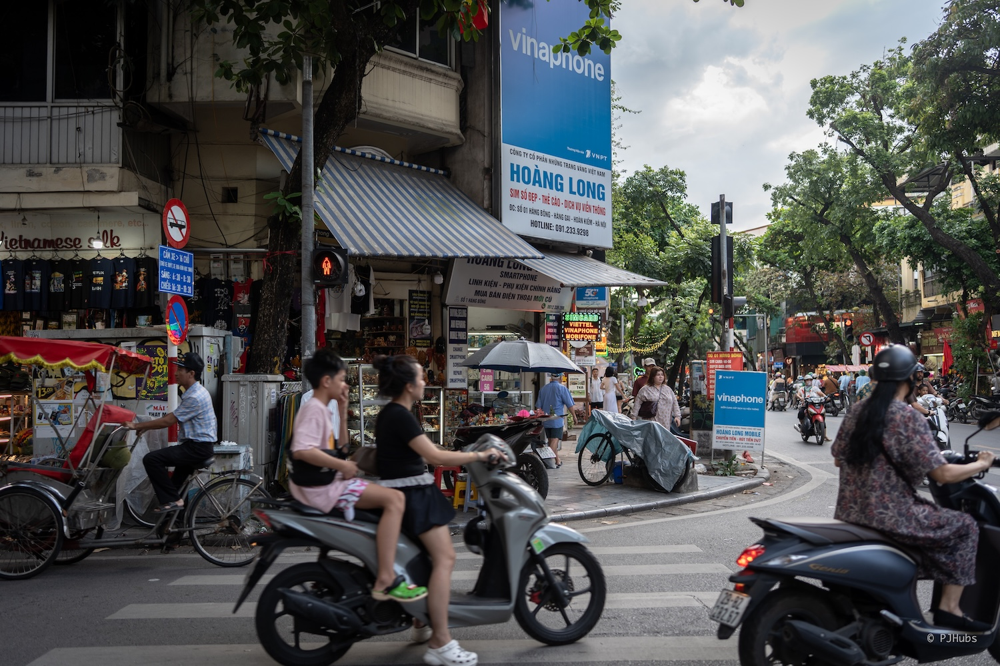

绕过揽客的车夫们后，我们走进一条小巷里，迎面而来的就是无止尽的“机车洪流”，越南印象这就来了！虽然此情此景对于生活在越南对面小岛的我来说不陌生，但数量很陌生啊！如果你没有找准机会穿过马路，那这些不知从哪冒出来的摩托机车就像奔涌而来的洪流一般把你吃掉。我和表弟跟着一位白人小哥身后，安全的在越南穿过第一条马路。

我们先到还剑湖才能到民宿。在还剑湖附近看到了更加庞大的机车群、小摊贩和游客团，还剑湖附近是一片被隔离起来只允许行人通行的小广场，当天正在举办一场越南当地的车企 VinFast 活动，在后几天中我们在马路上看到了大量的 VinFast，车型不光很酷价格也很顶，品牌性质上约等于我们的比亚迪。

在民宿简单收拾后，下楼找了家越南粉店吃粉，这家粉店可不简单。我原本以为越南粉都是汤粉，因为我在北京吃的越南粉确实也都全是汤粉，没想到这家居然是拌粉，很爽口很解暑，一连吃了两顿。刚开始还纳闷怎么没有汤粉，到后面我们在岘港时怎么也找不到类似的拌粉，十分可惜。可能跟我们住在老城区附近有关，楼下也是一堆吃的，我们也是要离开河内了才后知后觉每天根本不需要花费那么多的心思去翻去查到底吃什么，其实只需要注意街边小店里哪家饭点时坐着的人多，直接进去就行了。

吃好拌粉后外面突然临降瓢泼大雨，此时夜色已近，店铺都开起了灯光，照射在大雨浇灌过的街道上，整幅画面非常有活力非常有特色。等了一会雨停后，走在老城区里才知道雨后老街区的苦，全是小水坑，有时候为了躲避身后疯狂滴滴滴的摩托车只能往水坑里踩，再加上河内老城区街道的卫生条件本身就堪忧，这雨后的漫步走起来是真费劲。

慢慢的就走到了河内特色火车街，雨后的火车街实在是的太闷热了，都快喘不上来气了，再加上里面挤了大量的阿三，那味道只能说非常刺激，但不得不说这火车轨道两旁的商铺到了晚上开起灯来别有一番风味，值得来看一看。最后我们选择了一家在半露天的小吧，点了两杯喝的和一盘薯条，这价格是真贵啊，一杯鸡尾酒居然要二十多万，一瓶河内啤酒七万越南盾。

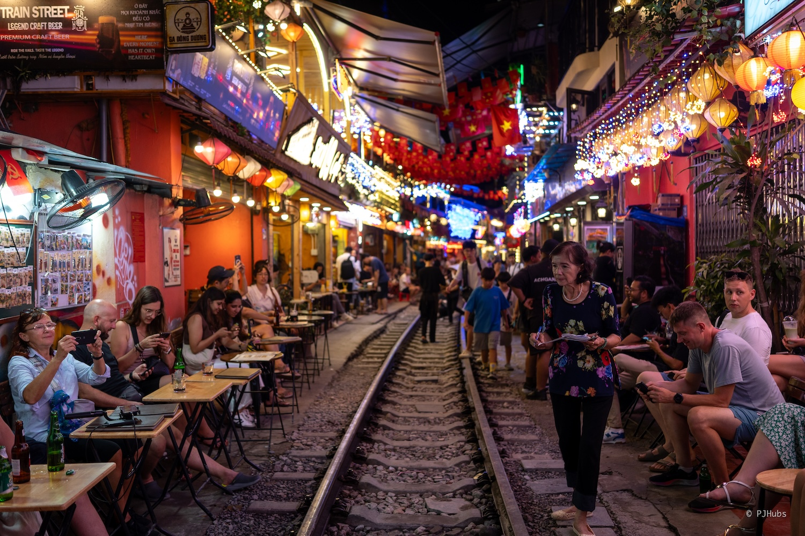

我们重新走回了还剑湖，雨后小广场附近人少了很多，往前走到木偶戏剧院大门前发现聚集的人非常多，想必一定很有趣（留个伏笔，很难评），马上我们就订了两张明晚 17 点半的木偶剧，期待能够感受到一些不同的文化。再往前走人就变多了起来，尤其是绕着还剑湖跑步的人，络绎不绝。好在是秋季，在越南这几个城市中，只要是夜晚在湖边、海边小凉风就吹起来了，很舒服，特别适合坐着和朋友聊聊天，吃吃喝喝。

第二天我们的行程安排得比较暴走，只要能够在 17 点半前赶到还剑湖边上的木偶剧院就行，第一站先来到了文庙。可以说越南整体就没多少古建，不是说没啥历史沉淀，而是在几十年前的那场战争中全被炸没了。因此现在看到的不管是真的遗迹还是复建的，都有种挥之不去的“琼东西”外加一个福建的建筑风格，个人猜测也有可能是因为这四省渔民和生活条件较差，向外走是个更好的求生之道。

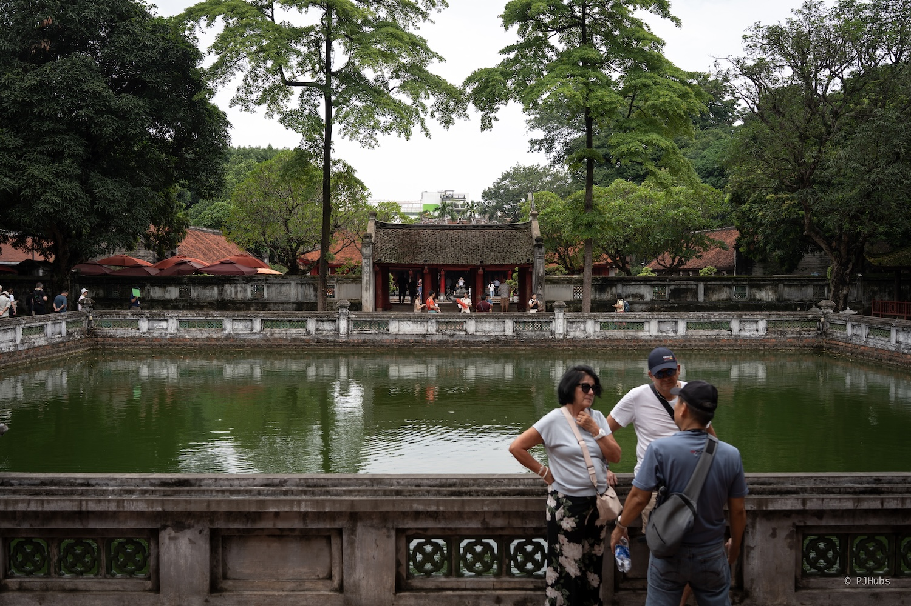

文庙的建筑规格和占地虽说都不算大，但已经足以可以看出这里的历史地位之高了，直到现在都有不少越南当地家长带着自己的小孩儿前来拜拜，只是无人在引导正确的拜拜方式，比较随意。我们仔细的逛了每一个房间，柱子两旁的对联、每一个厅堂上的匾额都是汉字，一直在感叹这种书同文的地区怎么就变成了现如今这样。这个喃字一开始我们还没怎么遇到，后面在海边的一些墓地群上偶然看到了似汉字又不像的字，仔细一查后才明白是“喃字”。

从文庙出来后我们准备去往升龙皇城，但因为太热，我们找了一家当地小有名气的咖啡店 Cong Coffee。这家咖啡店招牌主打的是椰子咖啡，味道比较正常没有啥出彩的地方，导致了后面我们多次遇到都没再往里走一步。坐着坐着就下大雨了，眼瞅着台风正在逐步登陆越南，我们心里都在为明天的行程担心。

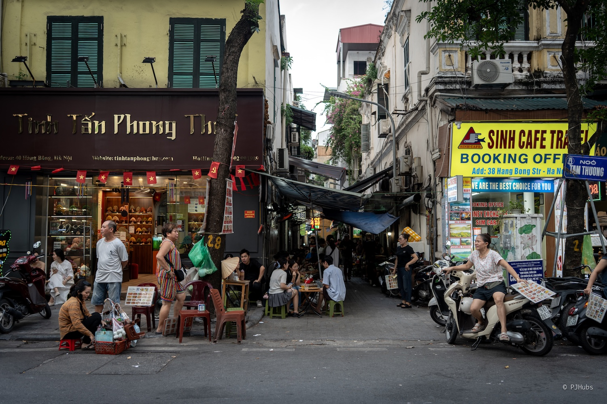

升龙皇城去之前确实做过攻略也搜过一些资料，很多人都说啥也没有，没必要大热天的专门跑这一趟。但我想的是毕竟也算是个皇城遗址，多少应该都有点东西可以看看。后来事实证明，有些话真得听，尤其是几乎往一边倒的评价更是应该仔细琢磨。升龙皇城一人 7 万越南盾，除了买票前就可以目之所及的城楼外，就只剩下最后面的一栋巨闷热的二层小楼，啥也没有了。中间全是围挡和大门紧闭的小房子，莫名其妙的走了一圈。游客也非常少，除了我和表弟两人外，只剩下四五个本地人，这世界文化遗产还挺意外的。

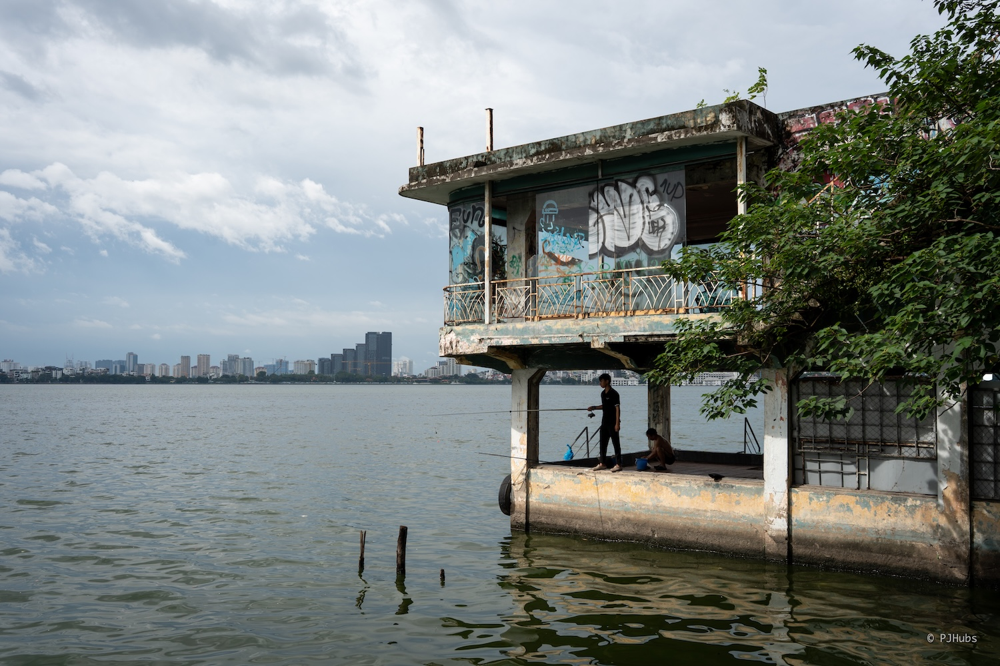

升龙皇城出来，本来想去看下胡志明陵，关闭了，估计是在准备什么活动，围挡都装起来了。想看下胡志明故居，却被告知短裤和背心无法进入，相当于这一大片原本规划好的景点全都去不了。我们只好绕了一大圈来到了西湖，终于能在西湖边上吹吹风了，栏杆边上还有不少在钓鱼的大哥，走过去还差点甩我身上。河内这西湖风景确实还可以，对比市内那嘈杂的机车轰鸣声，西湖是个不可多得适合散步聊天的好地方。

时间慢慢来到了午后，剩下的时间只够我们吃顿午晚饭就要去看木偶戏了，我们找到了一家能吹空调味道相当可以的饭馆。不得不说河内市区藏了不少宝藏饭馆，不管你在任何地方，只要打开地图看仔细一看就能绝对能够发现惊喜。我们这回终于吃上了沾汤的越南粉，之前是看陈曦的视频，他很推荐这种吃法。对比纯汤粉，这种汤头和米粉分开的吃法我是更喜欢的，尤其是汤头里的汤汁味道真的好，现在写到这想起来肚子又开始呱呱叫了。

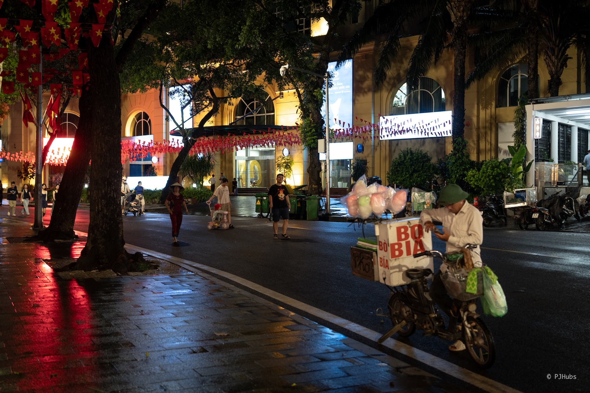

干完这一顿后，我们慢慢散步去还剑湖边上的木偶剧院。因为已经在 klook 上买好票了，到了现场后直接换票进去即可，我们选的最贵的一类，36 一人，位置确实挺靠前的。推荐大家都买最贵的一档，本身没多少钱，木偶又那么小，越往前坐看得越清晰。我以为这种民俗表演几乎每小时一场应该坐不满，没想到我们选的这个场次连二楼都坐满了。

正常木偶戏看下来我和表弟两个人都不好了，刚开场那段时间还能配合着鼓个掌，到后面我已经麻了，怎么会有如此抽象的行为存在，并且这些个木偶的表情也太诡异了，特别像丧葬用品的纸人表情。我心想，假设木偶戏也从当初流传过来，怎么流传过来如此畸形的表情和造型呢？特别是先上场的扎着两个小辫、大白脸、红嘴唇的小孩木偶，我觉得能把小孩儿吓哭了，再加上现场那红绿黄的灯光效果和舞台造景，怎么看怎么怪怪的。

从剧院出来后，找了家小饭馆吃了顿法棍。对于越南法棍我反而没有任何感觉，主要是太干巴了，既不适合当早餐也不适合当路边餐，总得搭配着大量的水喝。反而是纯法棍加红酒炖牛腩我非常喜欢，味道真是棒极了，最后用面包把人碗底都刮干净了，后厨收回去都不用洗了，十分推荐！

回到民宿后我们就开始收拾行李，等待着明天的天气来决定是选择飞机还是火车。

## 顺化
第三天我们四点半起床后一看手机，果不其然飞机延误到了 12 点才起飞，果断洗漱去赶 6 点整的火车。而越捷这飞机延误没超过 4 小时只给代金券不退钱，虽然才两百多但心里还是有些不爽，以后选择廉航得默认有缺点。

从民宿走到河内火车站我们已经在前一天晚上冒着雨测试了一遍，大概需要 10 分钟即可。我们今天坐的这趟车从河内到胡志明，早上 6 点发车到第三天凌晨 4 点多结束。到了火车站就直接上车了，没有安检，只有检票，啊不，只有看票。工作人员甚至都没做人票核验，我怀疑这票如果是 P 的都有可能上车，但上车后还会有工作人员前后巡逻，估计也就只能上车了。

化了 369 元一人的空调软卧下铺，据我表弟说，只比国内软卧空间稍微大一点点，没有好到哪里去。我们一直到了下午 3 点多才中途上来一对母子，当时我睡了一觉迷迷糊糊知道要进站了，隐约的感觉我们所在的这个车厢要进来人，跟我表弟赶紧说把门锁打开。这对母子的妈妈想跟我换下铺，我打量了下，没缺胳膊少腿，神情正常没生病，衣着光鲜亮丽，甚至观感比我还好，果断拒绝。只是叽里呱啦交流半天才算搞懂要换下铺，刚睡醒的我脑子懵的根本没心情搞这些。反观这对母子的儿子，年纪看着和我们相仿，判断出我们是中国人，但一开始拿不准，先问了是不是台湾人，我们果断拒绝，并纠正是中国人。然后这小哥开始用充满广西口音的中文跟我们有一搭没一搭的聊起来了。

火车前半程我看到了大量被台风天肆虐的良田和村庄，真的是全是水啊！一眼望不到头，明明距离海边还有一段距离，但这黄糊糊的水就这么粘着铁轨，蔓延到天边。虽然火车的速度不快，但连着好几个小时窗外的景色都是如此，甚至好几户人家都淹到了半个大门高了，好几次让我回想到了小时候台风天的噩梦，都是台风肆虐区的人们，这种痛苦太懂了。

但这运行在百年前铁轨上的火车啊，那是真的慢，如果说它一直按照这个速度行驶也没问题，可是如果对面要来车，那就要会车，会车根本不是我们认为的正常行驶过程中会车，而是找到一个可以会车的地方等着，一直等到对面的火车来。没记错的话至少停了五次，每次都是十几二十分钟，甚至最长的一次等了整整一个小时。后来挨到晚上 22 点多到达顺化时我们算了下，如果中途没有停车，都是一直这么开着下来是完全准时的，这时刻表上的时间完全没有计算会车等待，非常坑。拿出手机一看，延误到中午 12 点的飞机，已经中午 14 点到达顺化了。

因为没有正经吃晚饭，我们到达后找到了酒店马上就出门找吃的，google map 上看了几家说是 24 小时营业的饭馆全都关门了，只能随便找了一家看着还可以，但有很多人在吆喝喝酒的地方吃饭了。我其实很不喜欢这种场合，因为稍不注意对方喝在兴头上，高低给你来一下子，那就十分不美好了。好在我们找的这家饭馆味道非常不错，吃到了黄油烤肉和本次行程里最好吃的炒面，早知道当时我们就再点一份了，此后在越南的其他的地方均再未找到类似口味的炒面。

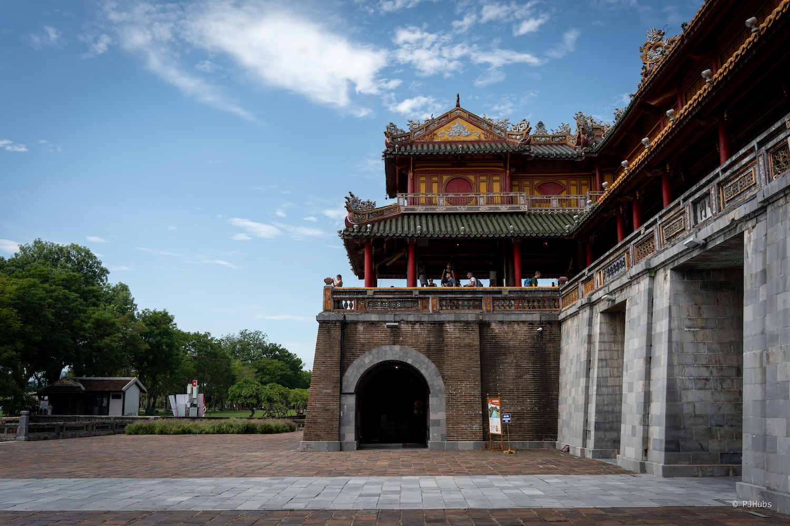

第二天一大早我们直奔顺化皇城，这是越南近代最后一个朝代阮朝的皇城，虽然也是被日本人重新扶持起来，很类似中国伪满洲国的形式，但这个皇城可逛可看可感受的比河内的升龙皇城好太多了，当然，门票也是高了将近六倍。如果想要把整个皇城逛完，那大热天下通过走路这个形式可太痛苦了，但如果只是想走南边一些的内城而放弃外城的话，那一上午的时间完全足够了。顺化皇城最有特色的就是“午门”和一路上的各种殿和阁楼，一切看起来都那么的 mini。

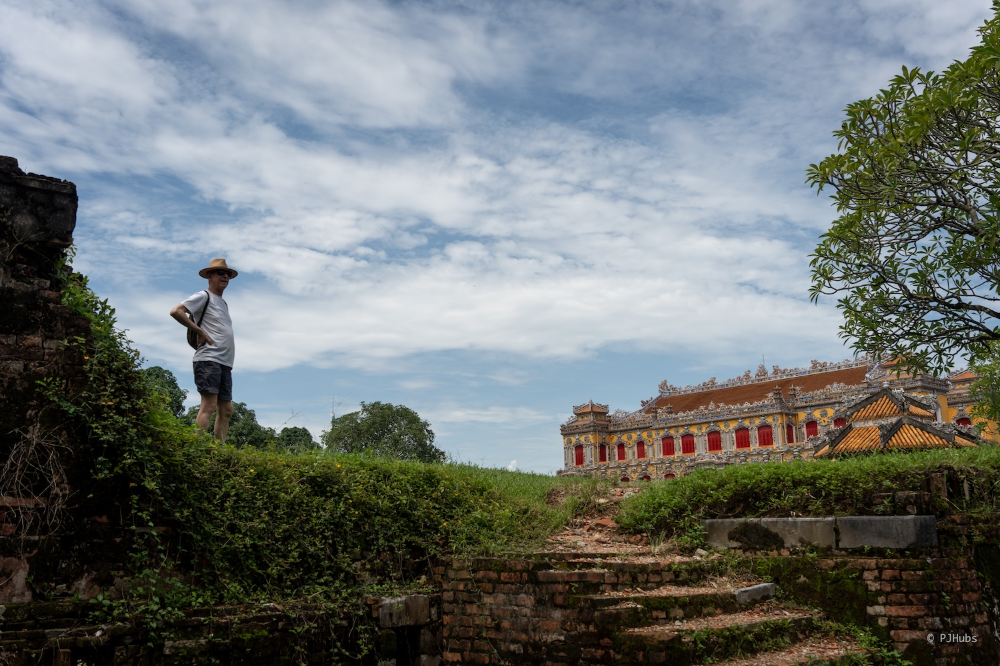

说实话一开始我也是抱着一种“审视”的角度来感受这一切，但逛着逛着就放弃了这个想法，因为这比日本、泰国还抽象，中西或者中法混合得太浓烈了，如果用“小圆明园”来形容这一切估计还能更好一些。可见法国殖民的深入时间如果再长一些，这种抽象程度会更上一层楼，完全发展成了完全不同的“越式风格”。

因为白天的阳光和天气还是过于燥热了，我们从皇城出来后找了家咖啡馆喝东西休息，没有空调，完全就靠着店里的风扇把我们冷却下来。心想着下午一定不能再用这种 city walk 的方式继续了，那得中暑了，果断搜索电动车租赁。找到了一家评价还算不错的，但此时时间已经过了中午 12 点，老板还想打马虎眼收我们一天的钱，一天是 15 万越南盾，和老板说我们只用今天半天，8 万越南盾即可。直到我们第二次租车才发现，他们说的“一天”，指的是 24 小时，换句话说，我们只用了 12 点到 18 点这不到 6 个小时的时间就给了老板一半的钱...

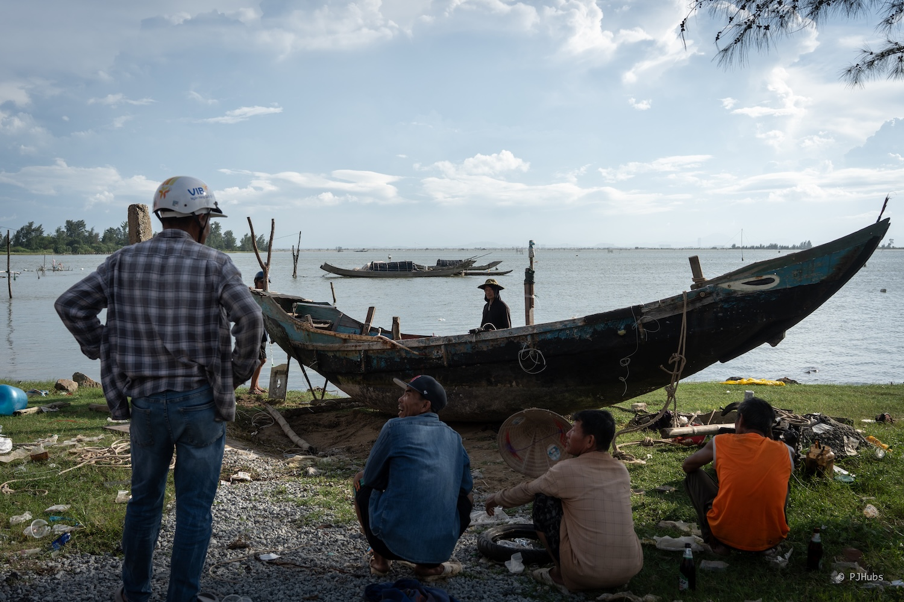

骑上小摩托后，我们马上开车去海边。这一路上的小风吹着实在是太舒服了，好几眼恍惚中以为到了我老家的海边，大水牛、水稻田、马路上晒的谷子、虾塘和鱼塘，几乎就是一模一样。到达海边后，果然没什么人，走到海边看了下，海水也不透彻，岸边沙滩上小垃圾也不少，沙子也不细，只有零星的几个老外还在坚持在这种环境下晒日光浴。我们顺着海边继续骑小电驴，开着开着就来到了一片小渔船聚集地，伫足观看了一会儿渔民们收渔网，也拍了一些照片，刚好有一群人在给一艘渔船调头。

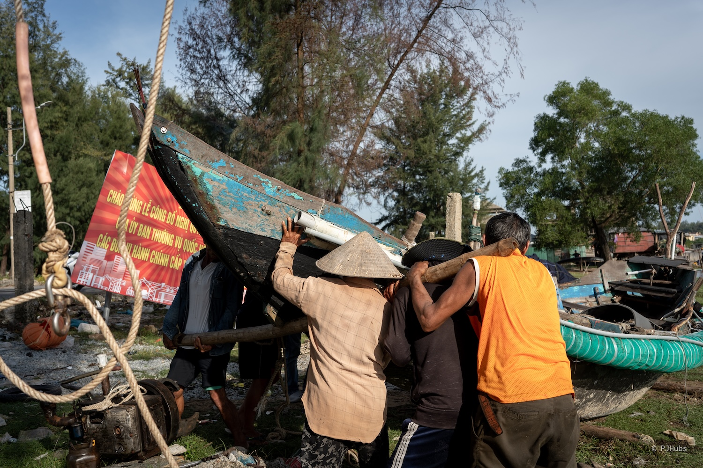

我们顺着海岸线一直往南开，看地图正在走的这段路正处在一个被内湖和北部湾包含在内的“舌形”区域里。路两旁的坟头真是大开我的眼界，刚开始我们以为是什么当地的宗祠，仔细一看根本不是，每家每户都给自家的坟头修建了无比豪华的牌坊、门厅和亭子，放眼望去满山遍野的“xx亭”、“xx阁”，越南人民对死者是真舍得花钱啊，反而是他们自己住的房子却没这么多花里胡哨的“盘龙柱”和“飞龙鼎”。

重新回到顺化市区还了摩托车后，我们去到了一家吃冷饮甜点的小店，想着今天实在是炎热就不吃啥大鱼大肉了，没想到先来了一碗榴莲什么茶，把我们两个都腻得上天了，正餐还是得吃正餐的饭。逛了顺化夜市和香河夜景，没想到香河边上有这么多的年轻人，大家就这么席地而坐在岸提上，笑着闹着，河面上的微风那么一吹，此情此景果然令人陶醉。

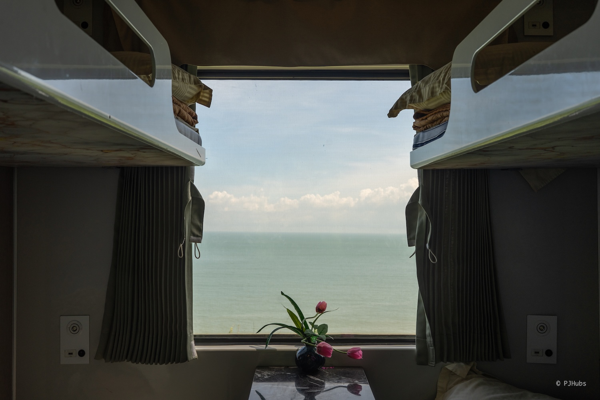

隔天我们继续买了火车票，坐火车去岘港，去感受越南海边悬崖火车精华路段。有考虑过直接从顺化打车去会安，但 Grab 上这种路线需要将近四百元人民币，如果四个人甚至三个人满座的话都能忍，但我们还是选择先火车到岘港，再打车去会安。这条路线确实挺美的，但我们所在的空调软卧窗户无法打开，导致火车车厢曲折前进的画面不能把头伸出去好好的感受，再加上越南火车的车厢连接处大门也是关闭的，没有泰国那么自由，整体体验下来并不如泰国的火车来得刺激。

## 会安
从岘港火车打车去会安半个多小时，会安的酒店是我们此行住得最舒服的一家，叫“薇府酒店”，都是直译的，虽然名字看上去有点怪怪的，但两晚四百多的价格完全值得！尤其给人一种完全“种在”热带雨林的氛围，有泳池、台球桌、理发铺，远离古城喧闹区，但走 10 分钟又到了古城，一切显得刚刚好，尤其是早餐，更是这几天的顶峰，赞不绝口。

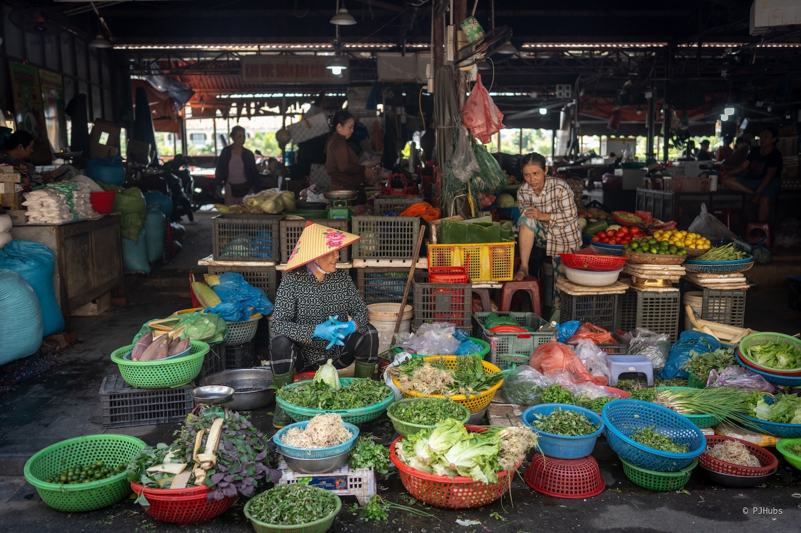

到达会安后刚好一天中酷热的时间已过，我们选择了一家可以坐在河边吃饭的位置，整个午饭过程中凉风习习，非常舒服。会安很有清迈的感觉，这几天在会安所体验到的、感受到的都让我们觉得在越南的这几个城市中，会安整体给人的感觉是最好的。但逛会安古城最好是下午 16 点后再出门，16 点之前都是酷热难耐，走在古城里只会遭受炙热阳光的无尽照射。我们原本在河边嘬着甘蔗柠檬水就这么惬意的带到夕阳时分，但越待越困，果断先回酒店歇一会。发现了此时台球桌居然没人，开一局。开的这一局台球被我表弟干爆了，到房间里休息着把最热的时候挨过去了，夕阳时分我们才慢悠悠的从开着空调风扇凉爽的房间中出来。

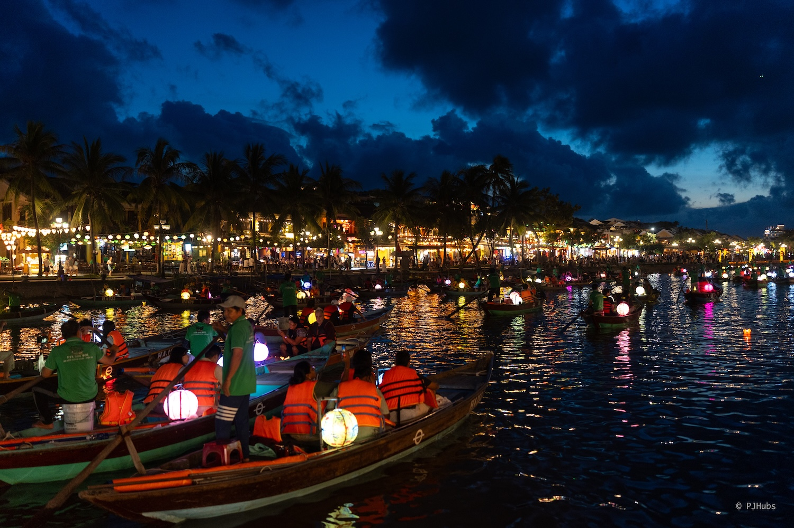

不得不说顶着世界遗产的会安古镇多少是有点东西的，夜景真是绝美！如果说我们云南的丽江古镇是中国当代商业化古镇的头牌，代表了我们国家当下背景的最强古镇，这算一种美的话，那会安古镇就完全是另外一种美。会安古镇正如我们在国内所游历过的众多古镇一样，有着非常多的商业化气息，在古城里晃悠时我也时不时的发出这到底是小商品批发市场还是古镇。但时间来到了晚上，一切都变得不一样了，这种美我希望你有机会可以亲自来感受一番。什么都不需要做，就静静地待在岸边，看着河面上那一艘艘挂着越南灯笼的游船划过，这画面真的很漂亮很舒服。

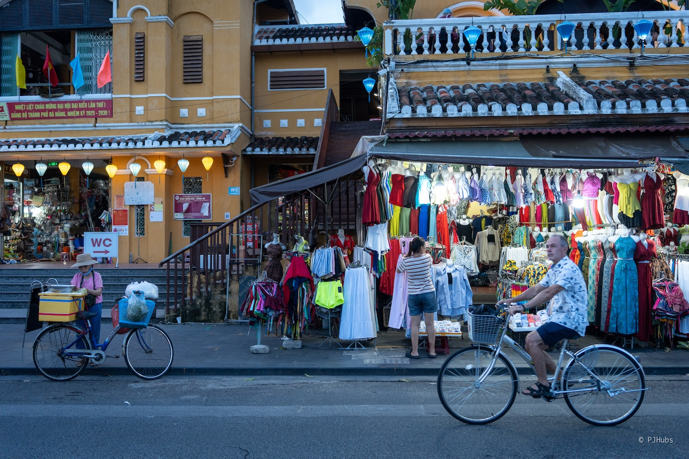

游客我倒觉得还好，如果人再多一倍的话确实是会感觉有一些拥挤，但我们是国庆节 1 号当天晚上逛的古镇夜景，游客确实不算多。我们来来回回在河边南北方向上走了好几趟，就想更完整的去看看这会安夜晚的美，逛到最后还是没忍住，也花了钱做了游船。在岸上和船上的感受也的确不一样，在穿过小桥时我果断的和桥面上的老外进行了一番“how are you！”“I'm fine，think you，and you?”的操作，把桥上的老外给整得捧腹大笑，我就知道这一招好使。

游船上岸后，我们看到了附近正在敲锣打鼓的舞龙舞狮，可惜刚上岸就结束了。我推测不应该结束这么早，跟着舞龙舞狮的队伍走了两三公里，手里拿着的相机快门一刻也没停下来，仔细观察着眼前发生的画面，不停的调整着相机取景框里的构图，生怕遗漏了什么有意思的画面。但我跟了一路，除了中途开了一个烟雾器后啥也没发生，后来越走越拐到居民区里去了，我们也就没有继续跟着。找了一家路边的饭馆吃了顿饭，不得不说旅游区里的物价就是高啊，但味道非常好，我们点了两份牛肉饭和一份炒空心菜，味道都非常好。炒空心菜在北京几乎没机会吃，但每次来东南亚最喜欢吃的就是空心菜，越南的空心菜不像泰国那样是甜口的，是完全不同的味道，值得尝试。

转天我们在酒店享受了一顿绝美的早餐后，找了家摩托车租赁店，租了一辆 50cc 排量的摩托车，24 小时是 20 万越南盾，保险 5 万，马不停蹄的赶往玩耍椰子船的目的地。到了椰子船玩耍的附近后，才现在的拉客手段已经发展到你还开着摩托在路上，老板页开着摩托就在大马路上和你肩并肩交流，甚至还能有手腾出来伸给你名片，把坐在摩托车后座上的我看得一愣一愣的。

椰子船这里坑挺多的，我的建议依旧是自己上小红书搜，不管是不是广告先心里先有个预期价格，直接去到定位去到某一家，就算想坑你但我们已经有了心里价位，再怎么坑都不怕。实际上到了现场我们发现提供椰子船服务确实有很多家，但实际上划起来后，大家已经划分好哪几条船是哪个服务商的，蓝色短袖只能找蓝色长袖的人转椰子船，黄色短袖只能找黄色长袖的人转椰子船，谁都不允许把客人互相交换。换句话说，我们以为自己已经精挑细选过了，但实际上现场已经被默默的分好了，你不不管找谁，其实都是一家，所谓的拉客也只是把客人拉到自家服务提供商的圈子里，避免你到其他服务商去消费。

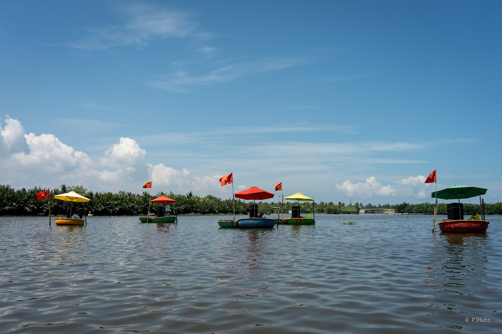

所以实际上椰子船体验下来居然意外的好，船夫的情绪价值给的非常好，甚至我觉得都有些尴尬。先问了你从哪里来，比如从中国来的就一路喊“中国加油”、“China No 1”，如果是台湾或者韩国，以此类推。刚开始还可能觉得新鲜，到后面真是求求了别再喊了，脚拇指都要扣破椰子船了。两个人的椰子船总共 15 万越南盾，如果中途想要感受转椰子船，需要换到另外一艘稍微大些的船上，额外付款一人 10 万。价格方面我个人觉得还好，但这个旋转椰子船还是推荐大家不要尝试了，就远观其他人的效果即可，自己上去真的是要了老命了。一开始确实还挺新鲜，新鲜感都在，但到了后面因为一直在转，突然间转到了一定的圈数后，眩晕感猛的一下就上来了，到后面我连撑着腰部的力气都要没了，撞得腰部很痛。好在后面转够了圈数也就停了下来，要不然我真的是直接把早饭全都给干了出来。

椰子船行程结束后，我们找了家附近非常有格调的咖啡馆缓一缓被椰子船转晕的脑子。这家咖啡馆非常有特色，总共两层，除了咖啡和饮料服务外，整个二层的木质小楼全都是手作，木雕、特色服饰、乐器、小的雕刻啥都有，眼睛歇不下来，最后纠结了好久只买了一个冰箱贴，本来还想买一个小木雕作品，但想到最后会被当成猫咪的玩物，咬咬牙也就作罢了。咖啡也非常好喝！我依旧点的椰子冰沙咖啡，椰子是鲜榨的冰沙，咖啡是单独一杯，想加多少自己加到冰沙里。椰子冰沙的口感非常好，反而后面把咖啡倒进去后还不好喝了。

我们就这么听着店里温柔的音乐，吹着电风扇的凉风，坐在眼前全是绿色的、充满各种手作雕刻的环境里，就这么安静的待着，啥也不想，就我们两个客人，店主在旁边织当地特色的服饰。休息了差不多一个小时后我们重新开着摩托车来到了会安的海边——安邦海滩。这个海滩非常热闹，对比前两天去的顺化海边高下立判。

水质和沙子质量都不错，岸边有很多沙滩椅，沙滩椅上也都长满了老外，很近的岸边就是吃喝的小饭馆，每一家饭馆都面朝大海，画面非常治愈。我们找了一家人还算多的饭馆吃了一碗蛤蜊汤和一份炒粉，蛤蜊汤还是逃不过放香茅的下场，早知道让老板放冬瓜了。但味道整体吃下来还是不错的，饭后就着一瓶凉爽的啤酒，吹着海风，好不惬意。太阳没有那么晒后，我们下海游了一会儿，没有家里那边的还那么咸，拿着沙子拍打在身上稍微防晒一些。越待着越觉得会安好，强行把人都拉慢了下来，不要想那么多有的没的，安安静静地感受和体验就好。

在会安的第三天我们打算去看鱼市。这个鱼市是我从大哥发的照片里发现的，但大哥发照片的时候没有发定位，我找了好多类似的照片都没能找到准确的位置，反而是找到了一个距离会安 51km 的鱼市，据说是整个越南中部地区最大的鱼市，就是距离会安的距离稍微远点，来回得 100 km。仔细想了想我们还是决定要去，鱼市宜早不宜晚，我们决定 3 点半就起床，4 点准时从酒店出发，摩托车开 50km 大晚上的最快也得一小时，到达后大概 5 点出头，希望能赶上。实际上这一路上的路况太好了，从未见过如此笔直不带拐弯的道路，我们从纯黑的天空骑到了鱼肚白的天空，只有最后的一段未修好的路完全没有路灯，纯靠过往车辆的车头灯照射，甚至就在这种情况下还有想着超车的司机，直接把我们逼停了，驾驶技术确实野蛮。

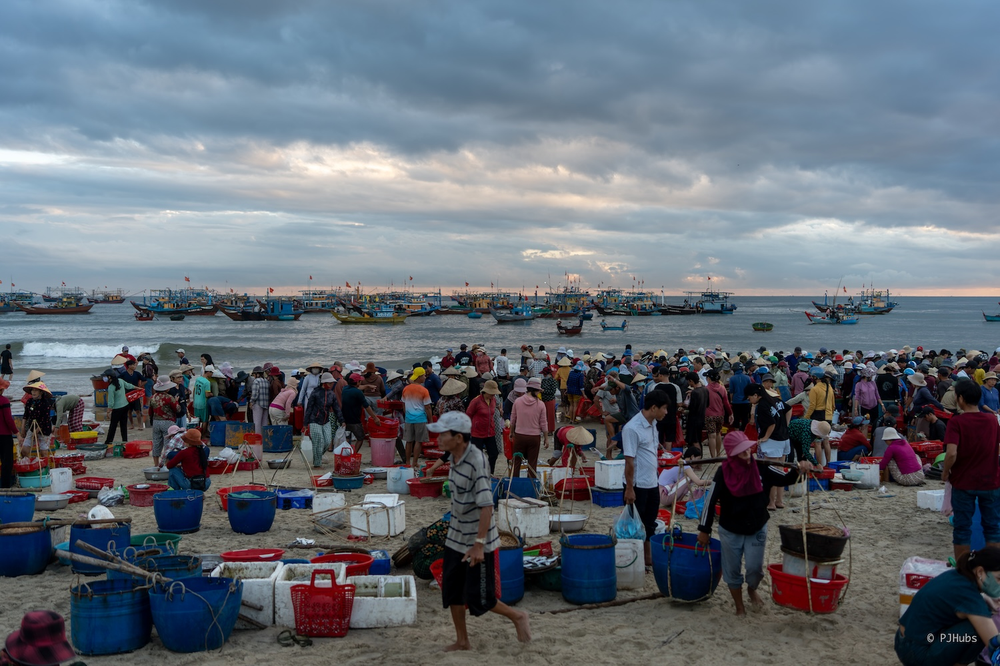

经历了一个小时的摩托行驶后总算到达了鱼市入口。我把摩托交给表弟后直接端着相机就冲入人群，终于看到了绝美的、充满动感的画面，相机的快门在那一段时间里就没有松开后，几乎也没有时间去构图，完全凭着感觉去拍。一开始我还穿着鞋，躲着海浪，逐渐发现如果这样我无法深入到海浪里去，会错过很多好的画面，果断把鞋脱了丢到一旁，冲入海中。

大概拍了一个小时，估摸着得有八九百张照片，椰子船在此时此刻都活过来了，不再是昨天供游客嘻嘻哈哈的椰子船，而是渔民们奔跑在岸边和渔船之间的工具。因为早上的浪还不小，椰子船本身是个圆形，中间塞满了渔获，想要更快的从渔船上卸货到岸上交易，就必须多人控制一条椰子船，众人齐心协力的控制椰子船的平衡和速度，多运一趟就能够比其他人多挣一趟渔获的钱。如果在会安住的是民宿，我们当时都想直接现场就买几斤海鲜了，那鱿鱼和沙丁鱼看着真是新鲜真是香啊，刚好早上没吃早餐的我们，看着这都是一盘盘香气四溢的海鲜啊！

重新回到酒店后是早上的七点多，因为凌晨开着摩托车出去这么一趟，我和表弟都没有经验忘了带条外套，两个人就这么吹着凌晨的凉风开了一小时，回到酒店后的我猛干了两杯热乎的咖啡才慢慢缓过来，回酒店简单洗漱了下沉沉睡去。大概是 11 点左右我们收拾好东西就退房还摩托车去了，重新打车回到岘港。

## 岘港
按照去年国庆去泰国普吉岛度假的经验，我对东南亚的海边其实是抱有很多念想的，想着能不能在岘港的海边也复刻一遍去年我在普吉岛酒店阳台上看海景的舒服。实际体验下来，阳台上确实能够直接看到海边，但和普吉岛的感觉完全不同，酒店只给我们安排到了 3 楼，楼下还是几家海鲜店，到了晚上非常嘈杂，体验不是特别好。

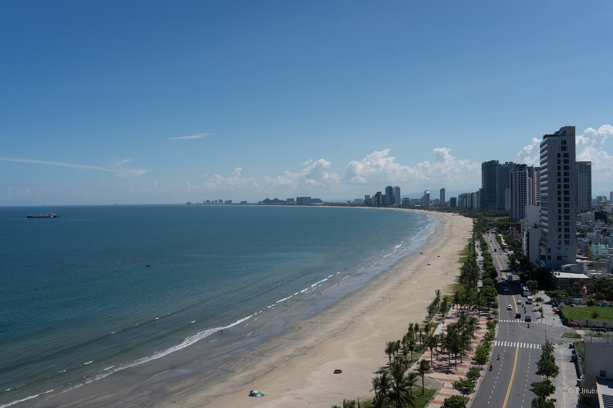

虽然海景是能够看到了，但我们订的这家酒店也就除了能够看到海景，白天这附近根本没啥吃的，从会安到岘港的当天中午我们还计划着附近随便吃个午饭，然后去两家比较有特色的咖啡馆看看，没想到光是在这附近找吃的，就吃了 5 家闭门羹，不是关闭就是搬迁，要不然就是过了营业时间，找到最后一点脾气没有，都饿过劲了，直接走路到咖啡馆，跳过了这顿午饭。后来我们晚上回到酒店后仔细研究了下才发现，酒店餐厅啥都有，而且配送上门，价格不算贵，我们完全没有必要中午顶着个大太阳在太阳底下瞎走。推荐大家来岘港要么预算打满，住更好的就带你，能够在房间里安安静静的、美美的看海，要么就直接住到市区里，吃喝方便，旅行在外我们目的之一就是感受当地的美食，吃不好和睡不好都是旅行中的噩梦。

我们冒着大太阳走到了岘港北部的一个渔船修理厂，这里有一家非常有特色的咖啡厅，推荐大家有机会都来，不管是拍照还是咖啡都非常好喝，不得不说越南人做咖啡确实有一套，还不贵。我顺着修理厂的堤坝拍了不少照片，是有点小时候在八所港附近的感觉，但没有一点鱼腥臭味，本来想更进一步找到进入大型拆船点，但绕来绕去愣是没找到入口，也就作罢。

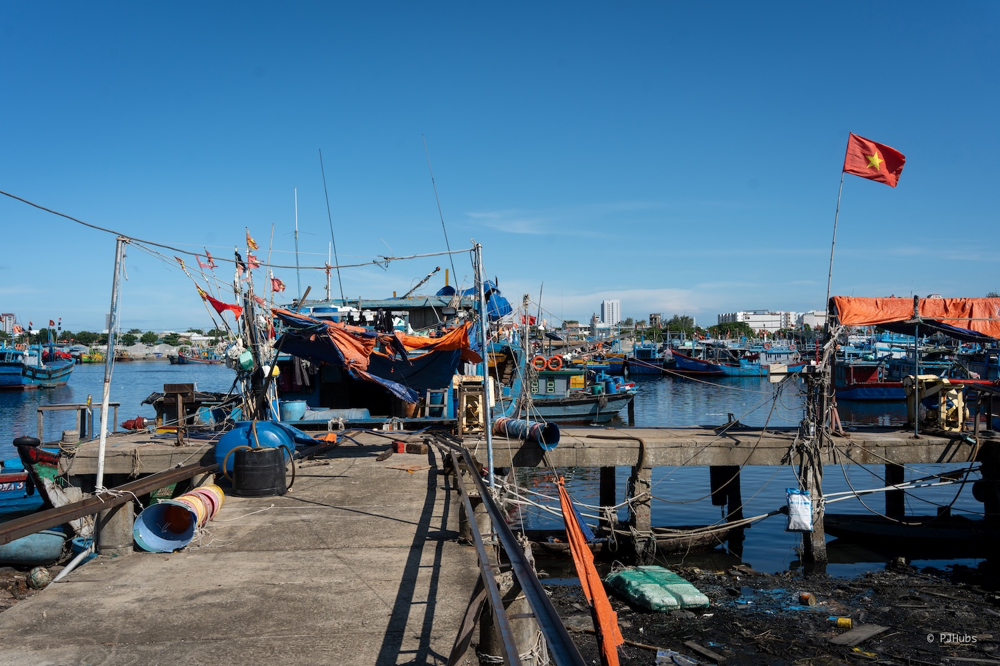

在咖啡厅休息了一会，肚子更饿了，我们直接打车去了一家吃蟹肉汤粉的地方。这蟹肉汤粉味道还可以，就是量太少，我们没有选择在一家吃饱，而是换了一家牛肉汤粉店继续吃。比较难受的是牛肉汤粉里居然也放了香茅，这味道一开始确实挺新鲜的，但吃多了到现在真的有些难受，而且也搞不明白，为什么这些汤的口味都是甜甜的，吃多了是很腻人的。吃饱喝足后，我们打算走几公里回到海边。正值下班高峰期，城区里的路况极差，后面越走越没有地方下脚，摩托车都开到人行道上来了，每一个红绿灯都堵了巨多的摩托车，多到要溢出挤占人行道的空间了，这几个路口我们穿着拖鞋左闪右躲的走得很难受。好不容易走到海边，天色也暗了下来，没有赶上岘港海边的夕阳，光着脚在沙滩上就这么一直走到了酒店。

本来我们打算晚上就这么洗漱好了躺床上了，没想到突然听到楼下又开始敲锣打鼓，走到阳台定睛一看，原来是对面海滩大门处又有舞狮队，之前在会安古城夜游时我一直没能够完整的看一场舞狮表演，这回就发生在家门口不想再错过了，纠结了几分钟后还是决定重新穿好衣服下楼。

我拿着相机一直在往前挤，总算挤到了前面第二排，舞狮队在开始前给小朋友们发糖果，周围围了好几圈看热闹的人，好几次我都能感觉到旁边的人呼吸喘气怼我脸上了，我怀疑自己的甲流就是在这个时候埋下雷的。可能是因为中国太大了，我在国内都没见过几次舞狮，只有隔三差五碰上了新店营业会请舞狮队，但每次来东南亚总是会时不时的在大街上看到。我不敢说谁把舞狮文化继承得好，只可能是我在假期都在往东南亚的旅游城市跑，当地华人团体可能就瞄准了这个旅游市场。

舞狮环节时间并不长，大概持续了半个小时就结束了，前面铺垫了大量的醒狮环节，高潮部分是踩高桩。舞狮舞龙可能看过那么两三次、熟悉后内心会趋于平静吧，比较在国内在北京都没什么机会接触到这些优秀的中华文化。表演结束人员都散开后，我们过个马路来到酒店楼下的一家海鲜店，吃了顿海鲜夜宵，小鱿鱼很好吃，口感很好非常嫩，价格 120 元人民币一公斤，对比我家的海鲜市场那可真是捡了大便宜。

第二天懒洋洋的起床后，我们先去酒店把早餐给吃了，对比之下今天这家酒店的早餐和过去几天的差距就体现出来了，全方位的下降。早餐结束后我们去到了酒店顶层，坐在吧台小桌子上静静地看了好久岘港的海景和城景，没想到刚九十点海滩边就如此多的人。我们换上泳裤准备在酒店的泳池里扑腾一把。刚开始还算顺利，但表弟的右脚踢到了酒店泳池的一块未闭合的瓷砖，给干出血了，我当时心里一惊，深怕搞出什么破伤风，赶紧让表弟下楼找前台消毒。

因此今天哪也去不了，虽然原计划就是打算在房间阳台看海，但这回算是连在老城区里逛逛找吃的也不得行了。在阳台上坐了一小时实在是腻了，拿手机扫了下酒店餐厅的菜单，没想到价格还挺实惠，两杯饮品仅需 10 万越南盾。在房间里一直待到了下午三四点左右，实在是待不住了，决定拿着相机下楼去海边走走，看看能不能拍到一些好照片。

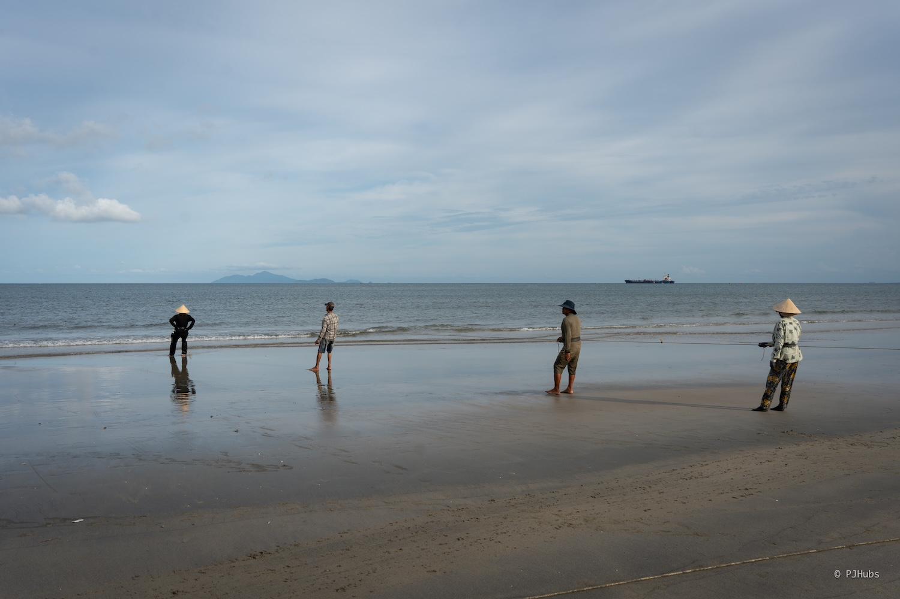

这么一下楼居然让我发现好几处正在收网的渔民，果断拿着相机来回奔跑在沙滩上，一会儿拍收网的渔民，一会儿拍补网的大叔，一会儿拍卖新鲜渔获的小贩们，好不乐乎。他们下的是横跨几十米长的大网，需要左右两边多达十几号人一起用绑在腰上的拉网工具协助，刚开始我以为是两张网，后来两边慢慢的越走越近才反应过来原来一张超大网，我心里盘算着着一上岸绝对是满满的一大兜啊！

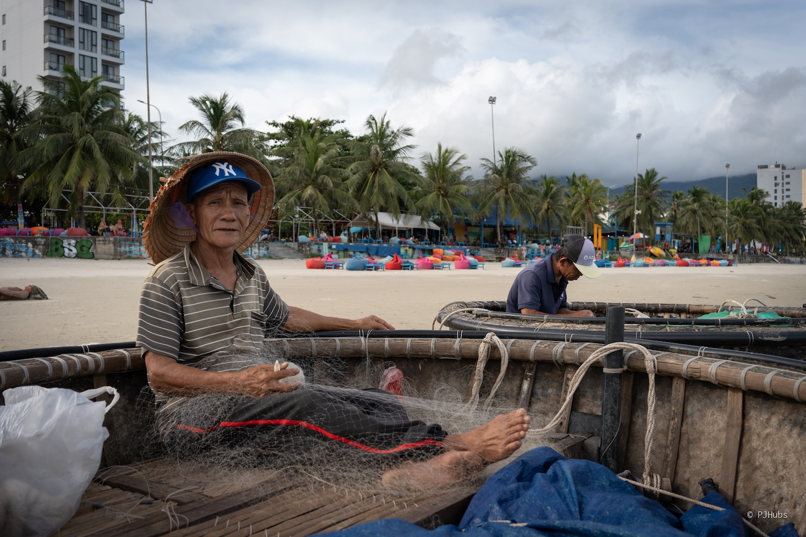
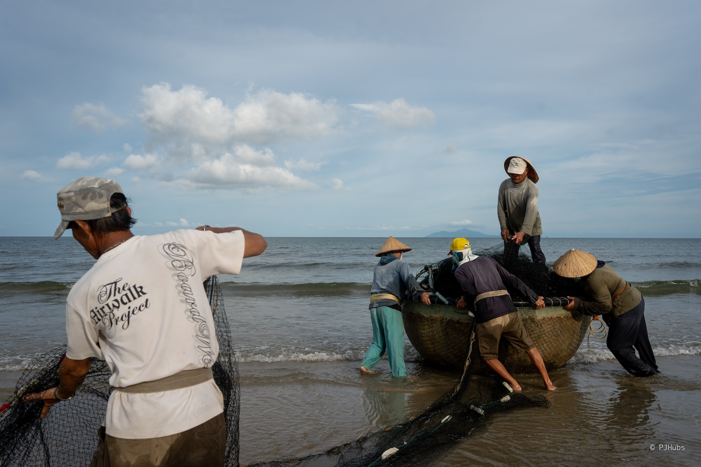

然而网收上岸后才发现全是一些小鱼小虾，有几条带鱼，小鱿鱼也有，但更多的是水母，为了拍照我自己的脚都被水母蛰了好几处。一开始我没意识到被水母蛰了，后来亲眼看到脚下飘过三四头水母才后知后觉这附近因为收渔网的关系已经全是水母了。第一次被水母蛰，挺疼的，但这些水母应该没啥毒性，就是常规蛰人，要不然这些渔民们应该会全副武装。

可能是因为整个白天没怎么活动，我和表弟夜色将近了依旧不是很饿，但正餐想着还是多少得吃点，选择沙滩边的一家小店，坐在沙滩椅上喝着椰子水吃着鱿鱼面。不得不说越南椰子水真甜椰子肉真嫩啊，值得推荐！鱿鱼面也好吃，小鱿鱼吃着很新鲜，面汤味道也很好喝，把我们的胃口全都给吊起来了，汤都嗦得干干净净的。但海边我们没有坐多久，坐了一会儿总感觉蚊子老是贴上大腿，这几天在越南大腿上已经全是小包了，但我们两个大男人谁都没有带驱蚊水，又爱穿短裤，主打一个硬扛。这也是我后来甲流怀疑的一个病毒传播方式。

## 胡志明
从岘港到胡志明我们选择了飞机，岘港机场国内出发厅非常小。越竹航空可以不用取票直接线上免费值机过安检即可，越捷航空可以在大厅自助值机打印登机牌，我们 6 点 52 分到达的机场，7 点 09 分就在登机口坐着等登机了，大家可以参考一下行程安排。

胡志明市反而是我们在越南的这几个城市中最担心的一个地方，因为在查攻略的过程中刷到了很多游客都在胡志明被抢手机，我们甚至冒出过当需要查地图的时候一人望风一人看手机避免被抢的策略。后来实际体验中我们确实也没有被抢，整体非常安全，体验和越南的其他几个城市一样，但多少内心还是有一些担心。

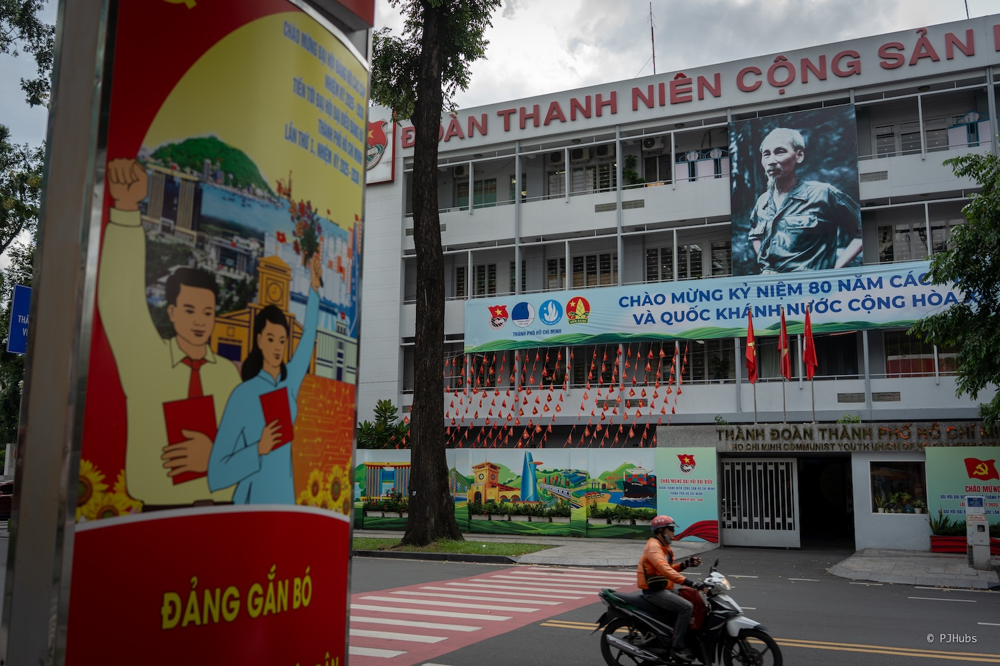

胡志明市中心非常干净非常大气整洁漂亮，给人一种完全是另外一个国家的感觉，不光是城市建设，就连大街上的人和物都有一种全新的感觉。当天晚上我们选择坐了夜游巴士，两人 30 万越南盾，总共 45 分钟，很推荐。晚上坐在全景大巴上，看着胡志明市的夜景，吹着晚风，确实很惬意很舒服。大巴经过的几个地方有点像香港，也有点像上海，总之也确实有一种现代化城市的感觉，非常值得坐上这么一次。晚饭我们选择了吃一顿越南麦当劳，味道倒是中规中矩，摩卡冰沙好喝。晚上老城区里能逛的小店不少，能逛的地方也很多，但景点的范五老街我们当天晚上完全没记起来要去，第二天晚上要回去了才记起来原来还有这么一条街。

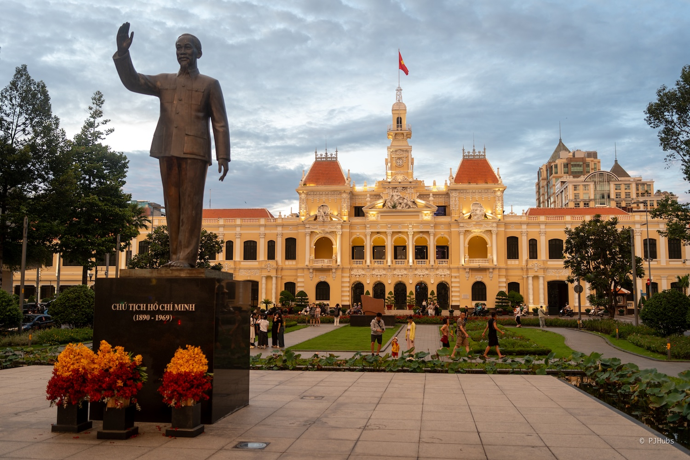

凌晨 5 点半左右表弟就到达胡志明机场开始回国的行程了，而我则要晚一天。第二天一早我选择了慢悠悠的吃一顿五星级酒店的早餐后才出发去看战争纪念馆。这战争纪念馆我原本打算是随便找一个有空调的凉快地方，没想到居然给我看得心情沉重了。整个纪念馆外围都是美军遗留下来的飞机大炮和坦克，内部很多展虽然都是的图片展，但这一张张图片太震撼人心了，尤其是三楼的生化武器展，大厅侧面放了两个福尔马林泡着的大头和双头婴，全是因为当时美军洒下的生化武器“橙剂”导致的，更别说满墙的畸形儿，看着实在是太难受了。再结合当下整个地缘政治关系，越南和美国的这种错综复杂的关系，现在有种说法越南人因为那段时间太痛了，但为了现在能够吃饱饭、过上好日子，他们不愿意提起那段令人痛苦难受的时间发生的事情，想要忘掉它，想要朝前看。

怀着沉重的心情从纪念馆出来了，很推荐大家有机会到胡志明市玩耍时能够抽出小半天的时间去这个纪念馆看看。我找到了一家小巷里的咖啡馆，一下点了两杯咖啡，打开播客，选了一期讲关于越南经济发展的节目，就这么惬意的度过了一个充满阳光的午后。下午我找了一家按摩店洗脸，原意是想去做个脸部按摩和洗头的，但和老板沟通有误，脸部按摩是做了，非常舒服，我第一次理解了女生，第一次感受到了自己的脸是脸，被认真对待了。但洗头这个事被理解错了，完全没有给我进行洗头，只有按摩，早知道直接搜帝王洗头不搞这种弯弯绕绕的事情了。

晚饭过后，我找了一家纪念品商店，给有猫狗的小伙伴们选了一些纪念品，回酒店领回背包就出发去机场了，这次整整十天的越南行程也就到此结束了！

## 总结
整趟行程下来总共拍了六千多张照片，二十多分钟的视频，拍照是拍爽了，彻底拍爽了，完美的达到了我对越南行程一开始规划时的所有安排，甚至中途还冒出了不少惊喜。如果你也想去到越南进行一次畅快的人文纪实拍照之旅，除了可以参考我的行程外，有机会也可以直接当面找我聊，绝对事无巨细的安排到位。

很多人都说越南很想八九十年代的中国，但实际上体验下来我个人觉得越南永远无法成为下一个中国，会被譬如人才密度这种类似的微观因素拿捏，人口不算少，但高素质、对口的专业人才非常匮乏，无法支撑起同类型产业共存，容易出现 A 工厂招一个主管，明天被新开的 B 工厂涨薪挖走，接着后天被同样新开的 C 工厂再涨薪挖走，综合对比下来性价比其实并不算高。但一两个产业是完全没问题的。

还有一点是“成为下一个中国”这种说法太大国沙文主义了，不要老想成为中国，做一个快乐的越南就行。再加上越南的针对外资不搞用市场换技术的方式，因为市场就不大，这种方式它搞不来。房价上涨的趋势远超薪资，工资两三千，房价两三万，也根本没法做转移支付。

那么我去这些地方为什么要拍照呢？很难回答，但目前我的答案是，如果不拍照很多地方我就不想去了，因为没有拍照这个行为让我和当地连接，我没有了武装自己的勇气。拿着相机，我好像变了一个人，带上了一个全新的面具，可能是想拍出好照片，会让自己更健谈更外向感官更打开，会去到当地常规景点之外更加本地化的地方，确实会为了出片而做出一些胆子更大的事情。

期待我的下一趟旅程吧！！！