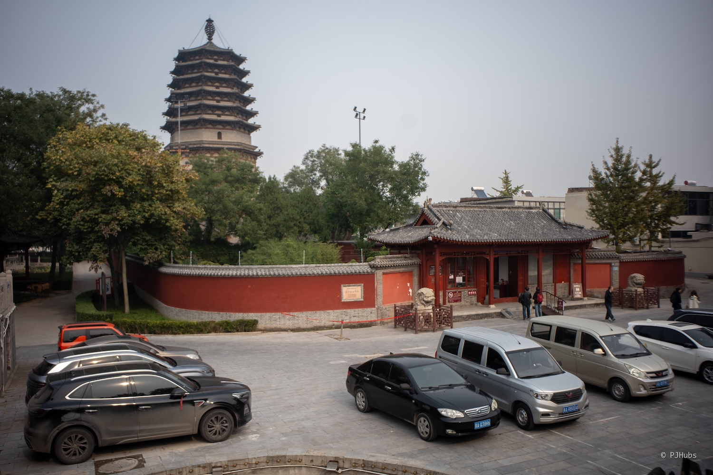
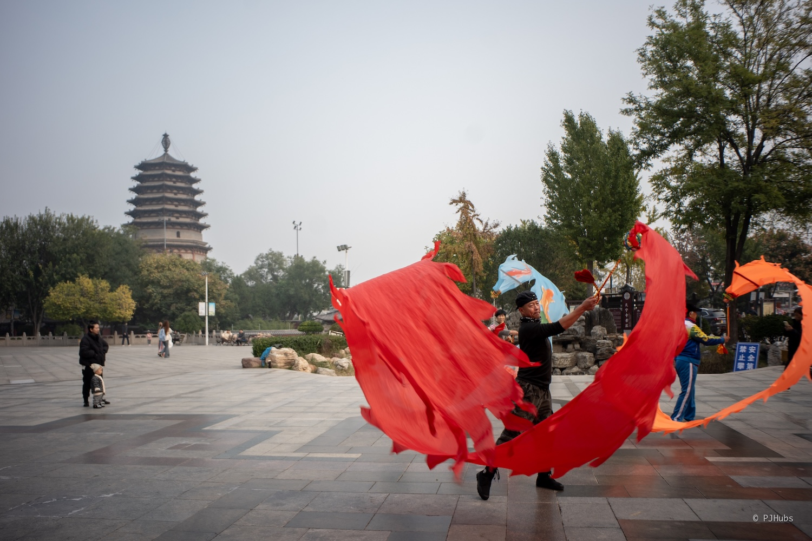
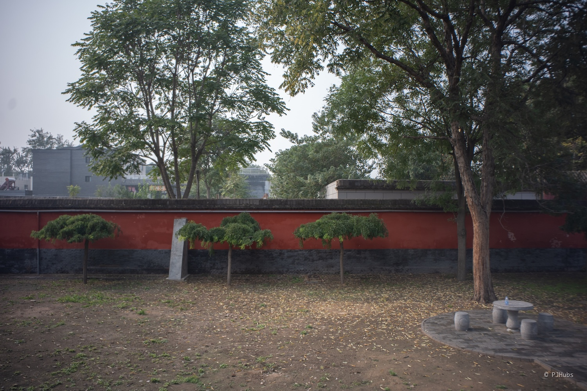
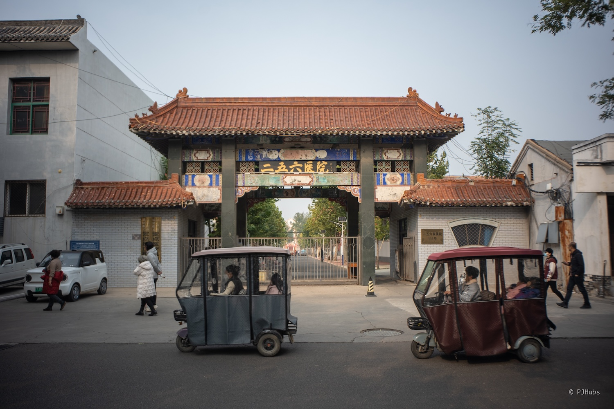
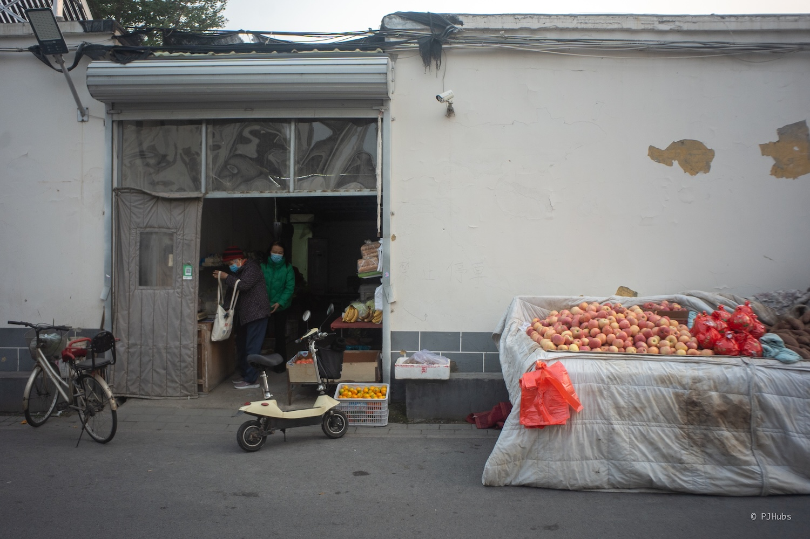
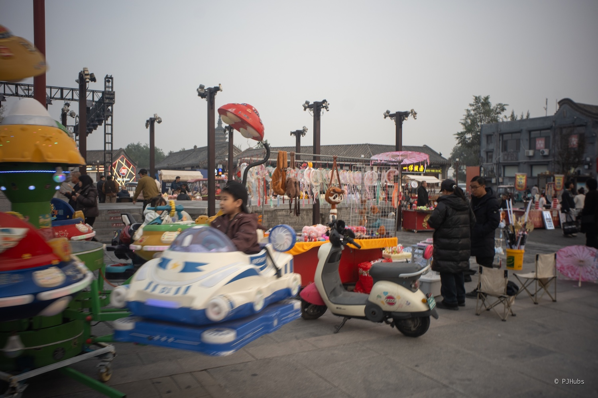

“这么近，那么美，周末去河北”，这是我第一次响应号召，主动选择周末去河北逛一逛正定古城，也是第一次正儿八经的在国内坐绿皮火车硬座。在正定古城里走了整整 25km，“九楼四塔八大寺，二十四座金牌楼”基本上也看了个大概，正定好啊！得来啊！

## 前言
从国庆假期的快乐里回归平常后，我尝试在秋日北京的街头拍了几次照，想着能够继续去年自己开启的摄影项目，但实际体验下来感受很不好，北京有太多限制太多拒绝太多“破 tm xx，有什么可拍的”，这些东西每次都会走在北京街头时出现。作为一名摄影爱好者，我无法共情他们，更无法接受自己只能在这种地方拍照。

我原本是打算去天津的，想走在海河边看看津门，距离上一次去天津已经是 21 年的春天，那会和两个骑车的小伙伴从北京骑到了天津，在天津过了一晚，看了相声。再上一次去天津就是大一暑假那会带着老师朋友的两个初中小朋友旅行时一起到达。说来也是有趣，到现在差不多 10 年了，这两位小朋友们都已经从初中生到大学了。但可惜的是周末正好碰上了天津马拉松，我担心周日那天路段限制较多，也就作罢。

后来就选择了正定，想去看正定古城。因为我从小没见过古城，也没见过什么“古”的东西，就老想去看古建，看不懂也喜欢看，去感受和千百年来的历史正面碰撞。多次站在这些古建面前，脑子里总是不假思索的想象古人曾经和我同在一片屋檐下，看着几乎同样的天，站着几乎同样的地，甚至可能面前的佛像、屋顶或石雕都是一样的，时间这种虚拟的东西就这么具像化在了眼前。

这次到正定我主动选择了坐绿皮火车，首先是价格真的便宜啊！只需要高铁的三分之一。其次是速度也不算慢，只比高铁多了一个半小时，早上早点出发到了正定正好是古城苏醒的时间。最后是我只有在特别小的时候坐过绿皮，脑子里的印象只剩下一扇窗户，外面是嗖嗖而过的树叶，我想找找儿时的感觉。然而事实上这绿皮火车发展得已经比我小时候好太多了，窗户不能打开了（至少我坐的这趟），居然还有空调了，只是这空气非常不流通，感觉里面有点味儿，呆久了有点闷，座位也比较挤，舒适度跟高铁没法比。但奇怪的是那种绿皮火车的感觉居然完全没有，比较可惜儿时那种绿皮火车的感觉找不到了，可能以后往西南方向去再坐绿皮火车会找到吧。

住宿的话，因为正定古城相对较大一些，我直接选择在古城里的酒店。一开始是想默认就选全季的，住过几次全季和华住会旗下的连锁酒店，体验非常好，基本上已经成为了我外出旅行的默认选择了。但全季在正定古城里的店很少，而且位置都相对偏远，最后选择了如家精选。到达酒店前台时还未到 11 点，居然已经可以办理入住了。打开房门一看，几乎和全季的配置一模一样。但价格不算便宜，居然要 287 一晚上。

## 古城
这次来正定的主要目的就是“治眼睛”，在越南看的古建让我的眼睛非常难受，总感觉很憋屈，其实目的就是看古建、看塔和拍照。正定城内古建筑极多，有“九楼四塔八大寺，二十四座金牌楼”，我也是冲着这些来的，来之前也看了些视频介绍，实地参观后感觉确实很适合像我这样一个人拿着相机走走逛逛。大家对相机对拍照的宽容度比北京高太多了，瞬间就被治好了，大街上根本没人管你拍啥，随便你怎么拍。

因为这次去的是古城，主要也是在拍建筑，特意把沉浸在包里大半年的七工匠残幅 18mm f6.3 的饼干头带上，替换掉我一直在用的适马这颗 35mm 定焦头。七工匠的这个饼干头氛围感十足，本身画质就不好，但反而是这种不好的画质营造出了一种氛围感，基本不需要做多少后期甚至完全不需要修图，准备后续继续拿这个饼干头继续拍。

再加上出发去正定之前的那个周末去 798 看了富士影像周展览，摸到了富士 GFX 100 RF，不得不说这台机子是我摸过所有富士机子里手感最舒服的，特别精致，完全没有其他残幅机子塑料感那么重也没有其他中画幅机子那么压手。再加上现在的我特别喜欢新地形，想结合国内景观特色，拍出自己的风格，反而是前两年那种街头摄影的风格逐步摒弃。但因为目前三万多的价格，以及现有机子用顺了，下不去狠手，希望未来有个机会可以拿下。

在酒店办理好入住后，出门就看到了天宁寺。天宁寺有一个小广场，正好迎面碰上一对在舞健身龙的大爷大妈，抓住机会拿着相机拍了不少照片。不得不说 28mm 拍起来就是比 35mm 顺手多了，不光能够给照片交代的环境信息更多了，就连所谓精准对焦都可以放弃了，反正广角头加小光圈只需要负责构图就好了，都是实的。

### 日
找了家最近的且评分还不错的饭馆吃了午饭，点了带皮驴肉、驴杂汤和驴肉烧麦，整体吃下来非常咸，只有驴肉烧麦味道还可以，但没有驴肉味儿，还是怀念前两年在呼市吃的羊肉烧麦，那一口下去是真满足啊！

天宁寺我个人认为没必要买票进去，虽然我后来还是买了一张联票，因为看这种古塔站在底下反而看不到全貌和巍峨的感觉，除非这个塔里能够进去，或者内部还有连带一些历史遗迹。而恰好天宁寺景区里只有一个凌霄塔，在围墙外面正好和买票进去获得最佳观看角度距离是一样的。尤其在天宁寺西边还有一段亭子廊桥，再加上周围好几处在下围棋的大爷，这个画面太有古城慢悠悠的感觉了。

我的酒店刚好处在正定古城的几大古建的中间，这就导致了动线设计得有问题，一条街走了四遍。从天宁寺出来后去看了府文庙，整个府文庙景区只有我一个人，别说游客了都没见到工作人员，大门敞开的免费进入。府文庙实地感受下来只靠一个元代的戟门就撑起了国宝，虽然这里面确实有不少历史痕迹，但观感实在是奇妙。府文庙过个马路，对面就是一块大唐水灾赈灾功德碑，当地政府为了保护这块碑石把它挡得严严实实的，只留下一个木栅栏的洞口供游人参观，只能隐约看出碑文汉字。

这是我第一次折返，从府文庙出来原路返回走到开元寺。开元寺也是一个可以不花钱走在路上就可以基本上看完整体构造的景点，但开元寺推荐买票进入，因为里面现存的唐代钟楼就是当年林徽因爬上去的那个钟楼。刚过检票口就可以看到开元寺的景点机位，经过了大量网友筛选过的机位就是好啊！如果你不赶时间的话，就这么站在这里望着眼前的这塔这楼，任思绪随风飘动，只看似水流年。开元寺里有全国最大的赑屃，重大 106 吨，我仔细看完了关于发现、挖掘和保护它的介绍，没想到也是一个“王侯将相，宁有种乎”的故事。旁边有两只头靠头，看着非常像在蛐蛐人的石狮子，他们好像就一直在背后蛐蛐人，非常有趣。

这是我第二次折返。开元寺到隆兴寺的最短距离就是要原路返回到我所入住的酒店那条街，然后继续往东走。隆兴寺基本上属于正定必来的古建，被称为“中国十大名寺”，确实有不少东西，但最有特色的千手千眼观音所在的大悲阁正在整体修缮中，查了下资料一直得持续到 27 年，看来是场大修，只能寄希望于未来的自己再来一次了。但好在摩尼殿一切正常，里面的壁画和倒座观音都是真迹，就连整个摩尼殿内的柱子也仅仅只换过一根，尤其是倒座观音，一整面墙都是非常精美的木雕。但游客会稍微多一些，但游客多也有游客多的好处，我蹭了好几个旅游团的讲解，也略知一二了。

从隆兴寺出来后，我原本打算继续第三次折返原路到广惠寺，但想了下还是更想去街头巷尾看看生活在这座千年古城里的老百姓是怎么样的，选了一条可以穿过一片居民区的路线。走在这座充满北方特色的小镇上，一种难言之情就涌上了心头，我作为一个南方以南的人生活在了北方整整十年，这种长期的割裂感让我每当面对强烈的南北方差异时，这种难言之隐就浮现出来了。幸亏现在喜欢出门拍拍照，可以通过拍照这种方式记录下来，可能以后的自己可以用文字的方式来表达出这种难言之隐吧。总之秋天北方小镇的街景很萧瑟，一个人走在古城大街上，进行思考、进行自我对话很舒服。

到达正定的时间还是太晚了，应该早上八九点就出门逛，早上 11 点开始逛还是来不及，而联票上的最后一个景点——广惠寺是下午 5 点关门，达到广惠寺检票口时已经是下午 4 点。不过好在广惠寺主要参观的对象也就是华塔自身，没有太多的负担，适合坐在椅子上慢慢看着充满历史的华塔和鸽子。华塔旁边有一个纪念碑，我仔细研读了说明，没想到居然是一件如此感人的事情。

1947 年第二次解放正定战役打响，时任副团长的赵生明率战士突袭进城，残敌逃入广惠寺华塔负隅顽抗，据守华塔二层平台，居高临下扫射。此时若用重武器，清除残敌易如反掌，但古塔也将毁于一旦。赵生明果断命令不用炮轰，改用轻武器，减少对塔身损害。经过激战，敌人被消灭，华塔得以保存，赵生明却不幸被敌击中，壮烈牺牲，年仅30岁。战后，晋察冀军区追授赵生明为“大功功臣”，正定人民为纪念他，将他牺牲时所在的南门里街改为“生明街”，后口口相传为现在的“生民街”。1984年，正定县委、县政府在生民街设立赵生明烈士纪念碑，后移至广惠寺遗址院内。

这几座寺庙和塔的逛下来感受真挺好的，非常适合周末短途出行，但最好是请个高质量讲解加迅速转场，可看的东西不少。但我这趟的目的依旧是拍照，确实拍出了一些自己喜欢的照片，这些照片现在看起来可能没有那么地引人共情，但我坚信再过二十年、三十年，甚至五十年后绝对是一笔无比珍贵的财富，因为这就是纪实摄影的魅力所在，必须经过时间长河的洗礼，价值才能凸显。

### 夜
正定古城的夜景很克制，没有特别夸张，只在主干道上和核心区域有夜景装饰，游客逛起来不会特别累，没有赶场的感觉。我选择了一家打着非遗名号的面馆，点了一碗三根排骨面、一份八大碗之一的扣肘子和乾隆白菜。高估了自己的胃口，低谷了河北的饭量，应该只要一根排骨面就行了，吃到后面还剩了两块排骨，十分浪费。但依旧是咸，这里只有排骨面值得再来嗦一碗。

到了夜晚，古城内的古塔门都被打上了光，但都是一样的黄色暖光灯，特色不足，除看有点意外，再看多几眼就有点惊吓了，打光的方式也都是一水的从下往上，略微惊悚。反观南城门的夜景灯光层次就非常多，看起来非常大气，不过做这些事情都是需要钱的，倒也能理解。走在古城夜晚的街道上，在道路两旁熙熙攘攘的多了不少游客，也有很多小摊贩推着车在卖小吃，但处在古城西北角最大的小商品市场夜市没来得及去，我选择去了荣国府。

荣国府如果是“红楼迷”应该会比较喜欢，比较有代入感，价格不贵仅需 40 元，可以慢慢走慢慢看，夜景灯光有惊喜。但夜游荣国府大部分人都是去看小剧场表演的，整体看下里我觉得非常无聊，但还是那句话，如果你是一个红楼迷看到如此实景一定会很怀念，可惜我不是，只能观其表面了。

从荣国府走回酒店的路上是我今天第三次折返回同一条路，这一天就走了 24 公里，膝盖已有些隐隐作痛，虽然感觉也没有去多少地方，但这实打实三万多的步数可真是一步都没有少。

## 博物馆
第二天一大早就来到了博物馆，仔细一看才发现人家叫“河北博物院”而不是博物馆。广场上很多人家长带着小朋友来喂鸽子，这应该是官方默许的行为，已经有小摊贩在开着喇叭叫卖鸽子粮了。我在广场上看了一会儿鸽子，模糊间想是回到了几年前在南京中山陵的音乐台。那会在音乐台第一次见到如此多鸽子，玩得不亦乐乎。

河北博物院里好东西确实不少，光是镇馆之宝就看了五六件，我特别喜欢讲“燕赵大地”的展馆，这回对战国七雄总算有一些具体的形态了解了。尤其是神秘的中山国，博物院里专门布置了一个展馆，仔细梳理了一遍中山国的来龙去脉，属于是大惊喜了！个人认为除了洛阳博物馆外，河北博物院排第二，质量极高。

河北博物院没有严格的按照从古至今的时间顺序来布展，虽然也有专门讲新旧石器时代的展馆，但纯粹是因为河北省内的百万年移植几乎全在这，这么牛逼的事情完全值得一个展馆给大众好好的、仔细的讲述一遍。剩下的展馆几乎都在讲河北独特的历史，包括我前面说的燕赵大地和中山国，非常有特色，主要是人家不管文案资料丰富，实物材料也极大充裕，再加上人流量没有像国博那么多，整体的游览体验也很好。

## 总结
正定古城还有不少值得挖掘的东西，虽然官方一直在推文旅推保护，实际上古城里可看的东西确实也不少，但我个人认为依旧可以继续挖掘，整个正定古城外加石家庄省城的文旅资源完全可以再上一层楼。现在的整体的基础游玩体验是有了，但的总感觉少了一口气，进一步挖掘“周末到河北”的旅游特色路线，这么好的招牌不要浪费，先期待一波吧。

但吃的是真不行，好咸，总以为自己已经适应了北方菜系，直到这趟正定古城之旅才发现自己完全没有适应，之前的都是错觉，尤其是那种看着旁边食客吃得津津有味，而我只想给菜加点白水的画面就想笑。这趟周末的正定古城之旅我非常满意，希望下一次再去时可以好好的找一个讲解，漫步在古城街道上，好好的感受这座历史厚重的北方小城。

最近这段时间工作上的事情不忙，状态也逐步的调整过来了，尤其是给自己定了一个 ddl 后，感觉工作和生活上的状态都发生了一些变化，很开心能够看到自己的这些变化。回想到 8 月份那会儿的自己实在是痛苦，各种纠结和郁闷，虽不至抑郁，但内心状态变化起伏之大，极其罕见。

好了！期待我的下一次旅行吧！