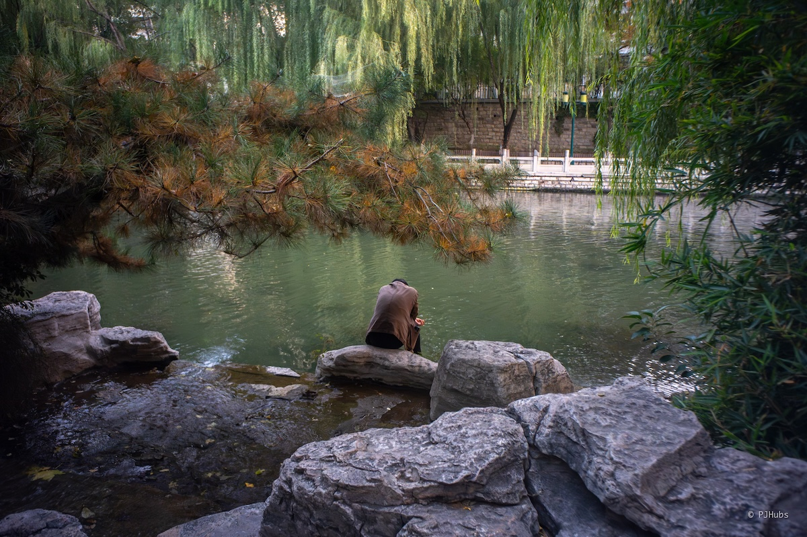
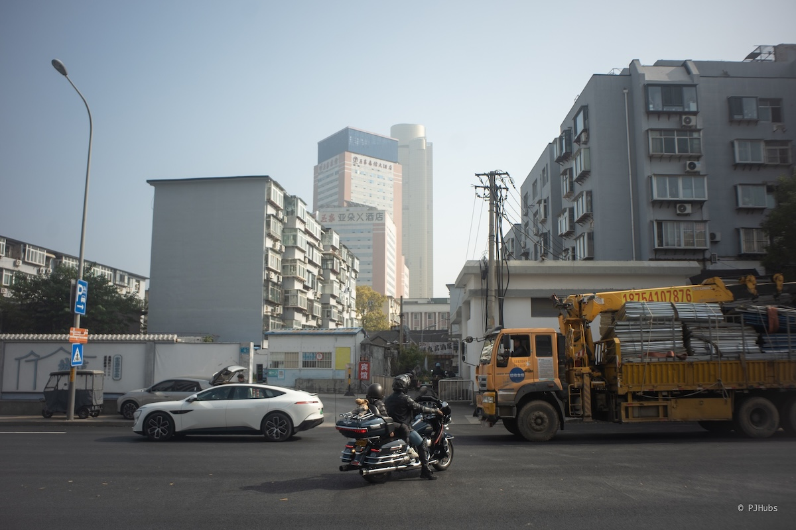
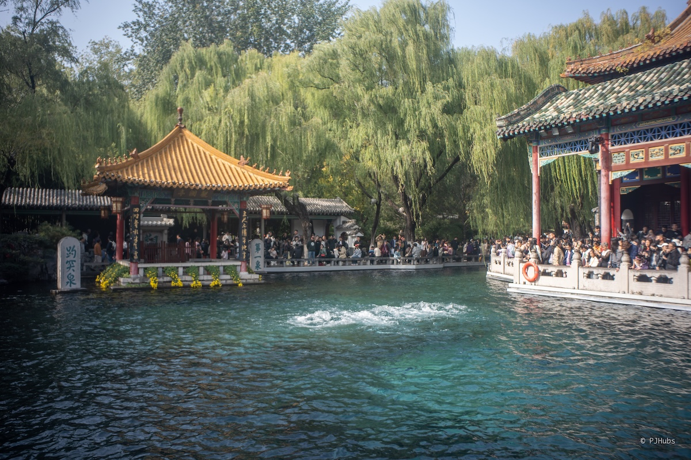
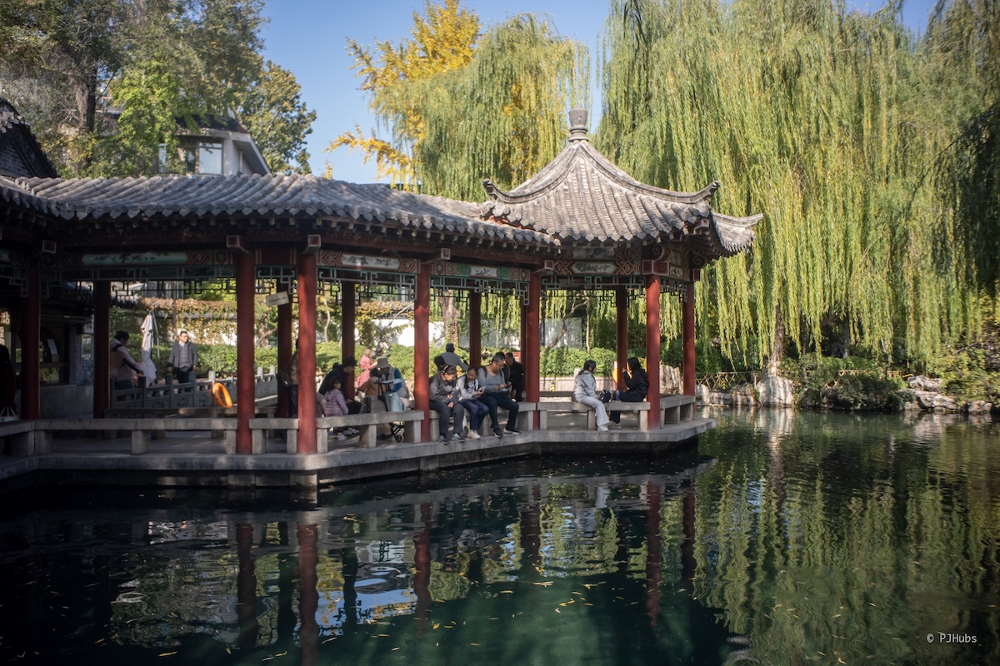
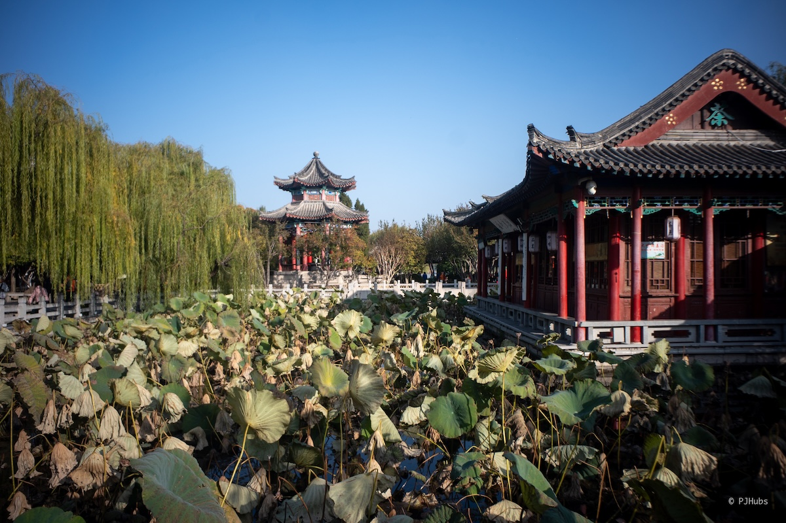
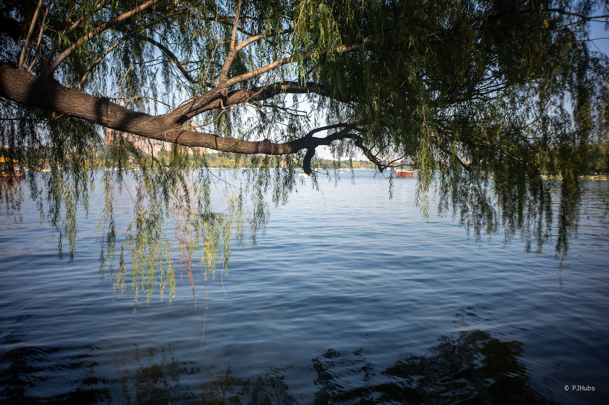
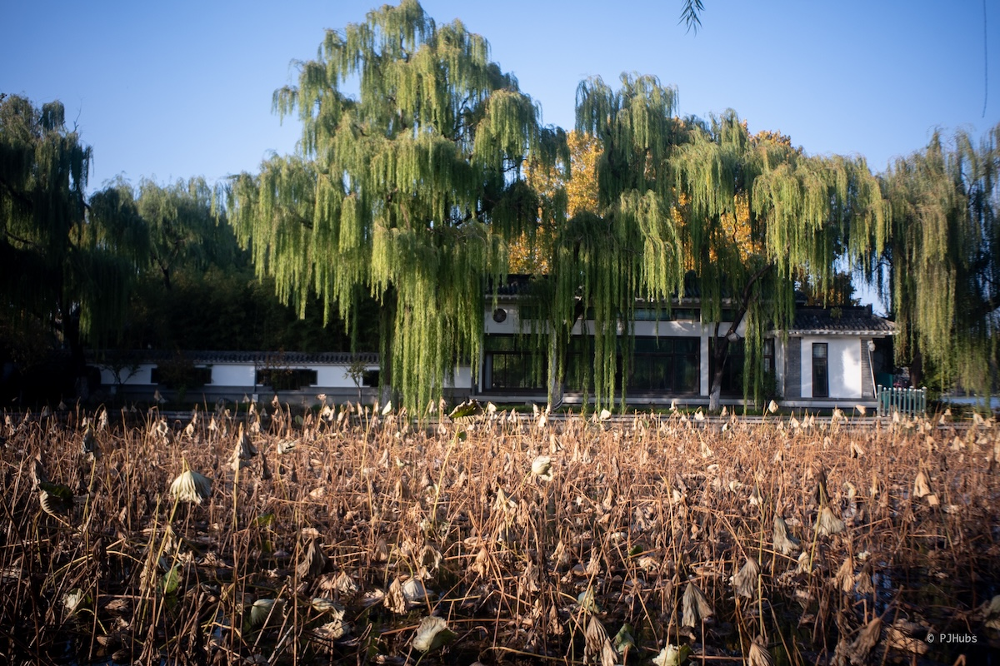
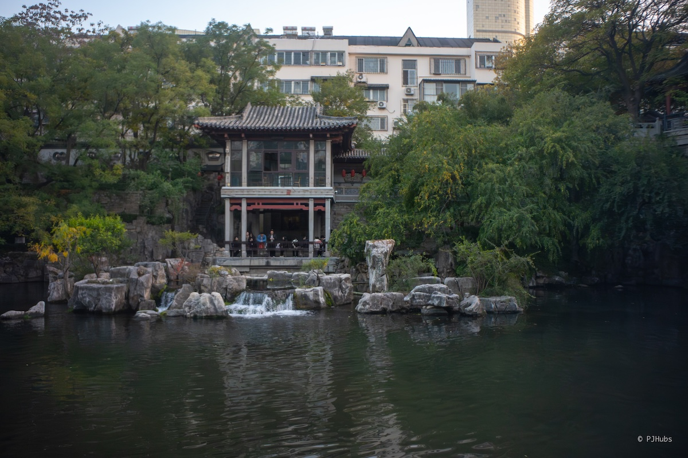
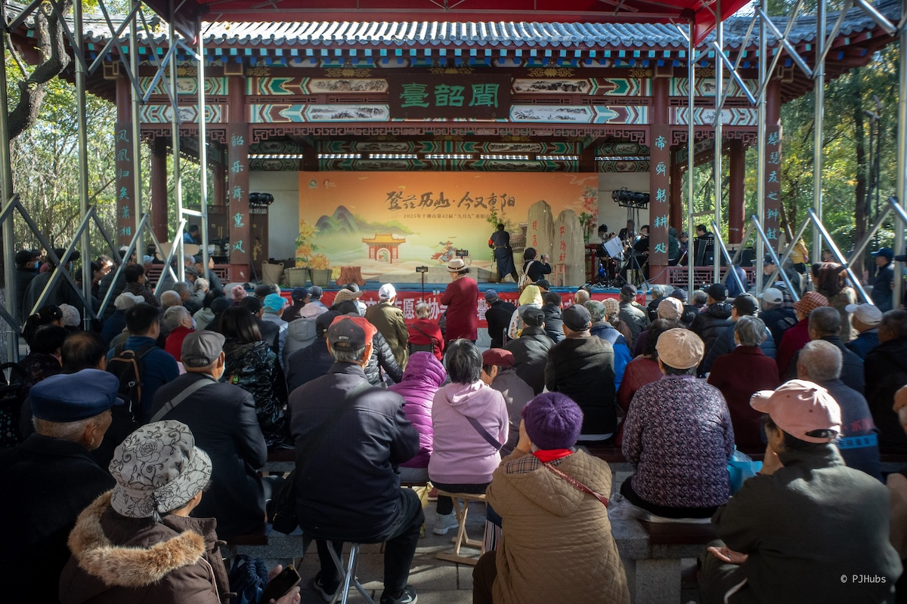

又是新的一趟周末之旅！这次来到了山东济南，在夏日炎炎时就时常刷到济南的泉水咕咕往上溢出，甚至多年不再出水的泉口也都开始一起咕咕咕，漫步在济南古城里确实感受到了所谓“小江南”的感觉，甚至还恍惚中以为到了丽江。后来查了资料才知道济南居然也是“中国软件名城”，再一细看，大名鼎鼎的浪潮集团就诞生于济南。

## 又是周末
这是我第二个周末城市游了，之前在 23 年初疫情放开后年初那段时间这么浪了一段时间，浪到后面已经彻底提不起劲了，一直歇到了五一假期才缓过来。这回主要是想模拟下 ddl 到之后的生活方式，可能到了那个时间节点后，自己会有相当长的一段时间会保持这种旅行状态漂浮在世界各地，当然可能会先聚焦在中国大地上。不光是想进一步的了解自己的祖国，更是想仔细的看一看生活在这片广袤无际土地上这群人。

这次选择了济南完全是因为今年夏天时经常会刷到说济南好多泉眼都恢复了，甚至多年枯竭的泉眼也都开始冒水了，甚至都漫到路面上来了，我还没怎么见过咕咕往外冒水的泉眼。好几次高铁南下时从济南西站路过但都未曾停留，这次准备好好的领略一番泉城风貌。

从北京南站出发一路南下，刚过房山就迎来了阵阵浓雾，刚开始浓雾还不算大，顶部能看到一些蓝天的样子。随着高铁列车往河北省境内腹地开去，浓雾越发茂密，起初只是感觉到有浓雾袭来，随后是远处的画面有些不清晰，再到后面已然是窗外铁路栏杆都模糊了。此景让我回忆起了 16 年底第一次南下去武汉参加比赛，也是坐在高铁动车上，遇到了一模一样的浓雾，唯一的不同是还伴随着呛鼻的味道，后来实在是呛得受不了只能在座位上戴着口罩，画面很是魔幻。

查了下天气才发现原来每到秋冬季节，河北平原这一大片地方只要遇到没有气流影响的无风天气，就必然会遇到大雾，再加上省内大量的工业区、燃料、焚烧等排放，稍不注意就会造成和这次我所见到一样的画面。本来上车时还挺困，毕竟是早上 8 点出头的高铁，但看到窗外这浓厚的雾霾画面，心里的思绪也慢慢飘动了起来。

## 济南古城
将近 10 点，我到达了济南西站。济南的天气不错，完全没有收到河北省内的大雾霾天气影响，进入山东德州时天气没有好转还在担心这次自己会不会在茫茫大雾中前进，好在完全没有影响。

估计这几次周末之行去的都是周边省城的原因，济南的物价也不低呀，为了不太降低走了一天劳累的我晚上整体睡眠质量，选择了华住会旗下的你好酒店，虽然和全季系列不能混为一谈，但价格也来到了 240 的区间，还是有些小小的肉疼。但唯一安慰到自己的事地理位置还不错，济南古城南边的泉城广场继续往南 200 米就到了。达到酒店时也无需等待，直接就入住了，看到房间环境后也算测试出了结论，以后的酒店标准还可以再低一些。

泉城广场比较正常，中规中矩的一个城市广场，有大家都有的广场舞，也有大家都有的下沉商业街，甚至也有招婚启示。招婚启示我重点看了下，条件写的都很好，业余兴趣爱好都不错，都很年轻基本上都是 92、93 年，工资也不低大概七八千，甚至也都是现在人见人爱的公务员、老师之类的稳定工作，越看越感觉自己貌似不太配来逛，看着如此优秀的条件如果要讲究传统美德“门当户对”的话，这年头凑一对儿也太难了点。

泉城广场的西边就是趵突泉，我在走向趵突泉南门的路上远远望过去宛如黑洞一般吸收了几乎那一片的人群，估计这泉里得有不少游客呀。趵突泉门票 40 元，最终整体体验下来不算贵，园区整体除了趵突泉泉眼附近的那一小片地方非常非常挤以外，其余地方倒也还好。为了吸引游客，泉水中放养了大量的锦鲤，前段时间也经常刷到安保提醒游客不要再喂鱼了，都胖得都快游不动了。像如此脆弱的、长时间的自然景观济南政府必然也会给这个“天下第一泉”大量的补贴，要不然真的有可能我们这一代人都见不到了。

趵突泉景区里有大量园林造景，慢慢走慢慢逛，不经意间就会发现一片阳光洒在湖面上，照射出湖底的绿植和锦鲤，这一抹红绿相间的画面确实把历史上趵突泉的美都重叠了起来，我的屁股就反复的在这个湖边坐坐，在那个湖边蹭蹭。但观察到的结果是，貌似游人们都很难有静下心来“观赏”眼前事物的想法，听到最多的是“哦哟，这个鱼真大也”，“这个水真清楚啊”，“这个景不错”等。我会更期待游人们的下一步，想看看他们下一步会怎么对待自己发出的这些感叹这些赞美，但事实是匆匆拍了一张照或者边走边说，也就这么经过了。

仔细回想了下自己好像从未有过这种“经过”的状态，可能是从小就没怎么旅行过，都是上了大学出了社会才慢慢的、逐步的去触碰这个真实的世界，也有可能其他人都习以为常了，并不觉得眼前的景色如何。但我就是总感觉可惜，我们本应该可以借此发展出下一步，更进一步的去描绘出眼前的画面，它的来源，它为何而美，它让自己感受到了什么。长久以往，我们自己就会有一套感受美的方法论，体验美的方式，往大了说，这个群体这个民族的审美也就出来了。

我们这个群体这个民族的审美是有的，但那些都太宏大了，落到我们个人身上，其实绝大部分人都不知何为”美“，我是最近这几年通过摄影这个方式绕了一个大弯才了解到何为美，因为我总想让自己拍出来的照片更有深度更有美感，可能我不追求决定性瞬间，但我想在一张照片一副画面里表达出一些东西来，这些事情是需要对美的感知对美的理解支撑的。

在趵突泉的北门有一处游船点，还纳闷为什么没人排队，走上前一问原来今天从趵突泉出发，甚至是济南古城里的所有游船都没票了，这是跑在古城水道上的游船，不是公园里的那种游船。略微失望的走出了景区，趵突泉北门外对面就是五龙潭，但我不想这么快的就衔接上下一个泉，还在回味趵突泉。刚好看到有一家鲁菜馆人气很旺，走上前拿了个号，没想到一个人吃饭也得等 9 桌，这也得一小时了，我稍加思索后还是决定午饭延后吃，先去逛了五龙潭。

五龙潭的人流量对比趵突泉骤减，虽泉水的姿色不如趵突泉那么粗狂，但如果你对泉水喷涌之景并无念想，只是想看看泉水是怎么一回事，那和趵突泉隔着一条马路的五龙潭就是最佳选择。五龙潭里有一片很大的湖，如果你并不赶路，完全可以用半小时的时间喝一次大碗茶。我本身对茶没有想法，再加上也不愿意用静态的方式来看动态的泉水，我喜欢通过多个角度和层次观察，也就作罢。五龙潭本身是免费的，园子里有大量的亲水区域供小朋友玩耍，水质远比各种水上乐园甚至泳池里的水来得放心，看到了好几个小朋友就这么光着脚踩在水里，甚至还有更小的小朋友直接就趴在了水里，只不过秋天的济南还是有些凉意，可以想象出来五龙潭的夏天是多么的热闹了。

在五龙潭待的时间不长，不到一个小时就出来了，主要是肚子也饿了，原计划是沿着去往大明湖的路边随便找一家饭馆对付两口完事，只是没想到这一路上的饭馆并不多，好不容易找到的一家推门而入居然也已人满为患，站了许久都不见服务员上前来招呼，也就出门继续找下一家饭馆。最终找到了一家看着还算有些高档的饭馆，再次推门而入找了个位置坐下，把几大特色菜都给点了个遍，把子肉、九转大肠、糖醋黄鱼、奶汤蒲菜统统都点了。

实际上吃下来只有把子肉是真的香，期待了很久的九转大肠是最意外的难吃，不确定是九转大肠就是这种甜臭味儿还是这家饭馆做的不行，一个小砂锅总共 9 个大肠，本身这道菜价格就不便宜，我硬是咬着牙吃到了只剩下最后一个，吃最后一口大肠时差点没忍住想把嘴里的这一大坨全吐出来，反正以后都不会再吃了。糖醋黄鱼端上来时我马上就闻到了一股奇怪的、类似脚臭的酸味儿，服务员只是端上桌问我拍不拍照这一会儿 5 秒钟的时间，这股酸味儿久久不能散去，胃口骤减一半。我一直以为醋是有独特的、开胃的香味，而不是今天这饭酸臭味儿。但最后都吃得差不多了，但一结账这四道菜和一碗白米饭收了我 291 元实在是不甘心啊！蹲一个有缘人能够让我对鲁菜有改观，要不然可能以后都要绕着走了。吃饱喝足从饭馆走出来后我胃就不舒服，不是那种反胃的想吐，而是一种像是吃错东西了的想吐，一直顶在胃顶部很难受，最后在大明湖里走了差不多半个多小时，大量的喝水才缓过来。

大明湖就在饭馆前面不远的地方，我对大明湖的初印象只有“大明湖畔边的夏雨荷”，甚至都清楚这句话到底来自哪里，在 vlog 中以为是当年乾隆下江南时真的遇到了夏雨荷，真的和夏雨荷发生了什么故事，实际上完全只是《还珠格格》里虚假出来的桥段，十分尴尬。大明湖的确实不小，个人觉得和颐和园相比面积差不了太多，但颐和园的“可去度”完全没有大明湖这么亲民。每次去颐和园总觉得是个事，不能像大明湖这样饭后遛弯儿似的随意。

大明湖整体呈东西走势，最东边有一座超然楼，可登顶望远济南城区面貌，我原意确实是想登顶一探究竟，但一想到隔日要去千佛山，目之所及之处比超然楼更大更远也就作罢。除了一大片的湖面外，陆上也有大量的造景，穿梭在亭台楼阁和小桥流水间，除了游人确实有点多，难以静下心来细细琢磨这大明湖的历史外，不失为一个散步的好去处。我从南门进入，绕了整整一圈再次回到了南门附近，从这个岔路口出去马路对面曲水亭街，真正的济南古城中心区。

曲水亭街这附近给我一种非常强烈的江南水乡之景，甚至搭配着路边的小酒吧，真有丽江的感觉了，怪不得济南也会有被称为“小江南”。在曲水亭街越往南走，这种江南之景越发动人，如果专门挑一个工作日或者淡季时间来慢慢的走一走，一定会特别惬意特别舒服。只是今天这古城里古装拍照的小姐姐们实在是太多了，几乎每一个景色还算可以的转角都被旅拍的人群占满，游玩体验不高，只能寄希望于未来的自己有机会可以挑一个合适的时间再来仔细看看了。

曲水亭街再往南到芙蓉街附近就进入了古城里我今天遇到的第一条小吃街。小吃街在我初高中高中那几年我非常喜欢去，甚至每次周末了就冲着小吃街专门从郊区的学校坐一个多小时的公交车专门去小吃街爽吃，但那会的小吃街也不多，所售卖的食物种类也很有大江南北的特色，再加上人口流动量远不如今天这般快速，能够在南国吃到一份桂林米粉已是莫大的幸事。但到了大学的这段时间里仿佛以为都按下了加速键，几乎全国任何一个市县，不管大小一律都会有一条小吃街，这当然是件好事，但时过境迁，一条小吃街上售卖的食物在这里和在那里几乎完全一样，找不出任何的特色，宛如复制粘贴一般流水线生产。

当然，我也理解这是一件商业化行为，“市场”这只大手必然会做出应有的调节，人们喜欢什么就会大批量的生产出什么。只是我作为一名游客，作为一名所谓“接班人”，更希望看到的是来到一座城市可以感受到这座城市的特色。特别是食物，食物是最直接感受到一个地方与众不同的点，打好这一点可以让一座城市的旅行体验更上一层楼。

我快速的走过占满了整条芙蓉街的小吃店铺，闻着令人反胃的大鱿鱼和臭豆腐，终于来到了护城河边。济南的护城河没有北京的护城河那么威严，反而充满了一种秀气，等待着你来感受。真要去找北京有没有和济南护城河相似的感觉，倒也是能找得出来，东直门外大街的亮马河就有这种感觉。顺着护城河一直往南走就来到了黑虎泉，走向黑虎泉的护城河边只有零星的几个人，虽然处在深秋，但也毫无寒意，只觉得鼻腔有一种湿润的舒服，但到了黑虎泉游船站附近游人就开始多了起来。

黑虎泉附近不只有黑虎泉一处泉眼，总共有三处，分散在古城西南角，其中黑虎泉以水量最大、气势最好拔得头筹。黑虎泉的泉水来自其出水口背后的小山体中，每秒泉水喷涌量达四百多升，仅次于趵突泉。更有意思的是，这里有大量拎着水桶来接泉水的人，政府也在附近修建了扫码出水的直饮水设备，我原本也想打一瓶泉水回酒店房间煮开试试，但望着这同样排队接泉水的人也就作罢了。黑虎泉这个地方很推荐，确实很有特色，附近的泉水和护城河形成了和趵突泉、大明湖完全不同的景观，值得一来。

天色渐晚，我继续沿着护城河北上绕道来到了宽厚里。只是没想到居然有是个小吃街，为了避免再被鱿鱼和臭豆腐熏得一身臭我马上找了最近的一条路出来了。在马路边上正好看到了济南特色“花车”，看着这满大街装饰着粉色灯光和假花瓣儿的三轮车，有一种宛如来到了东南亚的感觉。搜了下资料，但望着这同样排队接泉水的人也就作罢了，主要是违规运营和交通违规，再加上节假日期间大量挤占在景点门口，一些打不到网约车的游客会被花车漫天要价，有损城市形象。交通违规这个点我觉得没问题，但其他的点我都不太认可，我觉得最好的办法是，既然民间已经形成了花车这种现象，且不管你怎么禁需求依旧旺盛依旧不死，那就做一个顺水推舟的事情，规范化运营后，把济南花车的这个招牌打出去，彻底打响。在这种时代背景下，能够自发的形成一个独特的城市符号，可前往不要再按灭了，这就是一座城市与众不同的地方呀！

随后我来到了济南恒隆广场，摸到了 iPhone Air，这台设备是真好啊！好到一模到真机就想马上拥有的感觉。上一次有这种感觉还是 iPhone 12 Pro 系列，我记得当时自己已经冲到店里买了 iPhone 12 mini，想要接触 mini 的机型回忆到 iPhone 4 时代的感觉，但很可惜只用了一个周末后我就去退货了。但现在想起来依旧觉得很可惜，mini 机型现在已经绝版了，不是预算紧张的情况下值得留下一台。还抱着侥幸心理问了下店员有没有 Vision Pro 新出的双层编制头带，一开始店员居然跟我说有现货！把我激动坏了，后来真要付款了仔细一查其实根本没货，现在 apple store app 上买已经要一个月后才能送达了。这双层编制头带确实好，比之前的单层和双圈对脸部的压力都更小，非常值得购入。

至此，在济南的第一天只在晚上 18 点左右就回到了酒店，胃因为午饭吃的九转大肠依旧有些不舒服，只在便利店买了两盒奶和一根玉米就回酒店休息了。

## 千佛山

第二天我原本想着早些起床爬个千佛山下午再去博物馆，订了个 7 点半的闹钟，愣是磨叽到了 9 点才去吃早餐，将近 10 点了才到达千佛山。好巧不巧，正好碰上了九月九重阳登山节，比昨天在趵突泉多出大几倍的人流量挤在千佛山的登山路上，千佛山未正式开始爬山前的这段路其实很宽，但道路两旁排满了摆摊的小贩儿，卖什么的都要，观察下来卖山货、特产、民俗手工艺品的居多，仔细看的话远比逛小吃街有意思多了。甚至还有我看着非常像样板戏的唱戏班子在表演，台下坐了乌泱乌泱的大娘大爷，有点我想象中北方农村里戏台看戏的感觉了。

在正式开始登山前会先景观四窟万象这个额外收费的内部景点，如果你之前从未感受过石窟艺术，看过真正的四大四窟，那非常适合来到这里对石窟艺术有一个初步的印象，一定能够让你大为震撼。中国四大石窟除了麦积山石窟外我都参观过，就算如此我都认为值得有必要来一趟，可以说四窟万象把中国石窟和石刻文化之精华做了一个浓缩汇报，有些是一比一复刻，有些是按比例尺复刻，有大有小、飞天入地、应有尽有。我原本以为可能只是短短的一段路，走过去再走回来就结束了，没想到我和大家一样走在里面时都发出了“啊？还有啊？还能往里走啊？”的感叹。听说夏天如果进入窟中只有 18 度，可以在门口售票处租借毛毯入内，想想就刺激。

千佛山为济南三大名胜之一，不算高非常好爬，只需要稍微垫个脚尖就轻松拿下。但确实人还是太多了，再加上山顶区域本身就不大，到顶后也没怎么有空隙让你好好的看看风景，古人登高望远心里总能畅快一番，但现如今我们登高望远时人声鼎沸，很难有一个让自己静下心来的环境好好感受，但看到远处西北方向的济南 CBD 的天际线一景，确实不错，回到家中查阅资料时才发现济南居然是中国软件名城，再定睛一看，原来大名鼎鼎的浪潮科技就诞生于济南，甚至有一条路就被命名为“浪潮路”。

登顶后时间快到中午 12 点了，肚子还不算饿，左躲右闪的绕过源源不断同样想要登山的游人后终于赶在 12 点出头坐在了去往山东博物馆的车上，只是没想到最近济南的天气太好，外出玩耍的人和车都非常多，12 点出头坐上车的我，居然快中午 1 点了才进入博物馆内，只能加快参观博物馆的步伐了。

## 博物馆
一进入到山东博物馆就被震撼到了，通顶大厅的设计营造出了大气磅礴的山东印象，位于四五层楼高的天花板上赫然镶嵌了一块巨大的镇馆之宝——鲁国大玉壁，后来看到了真正的大玉壁后，大厅天花板上的这块超大玉壁可能得是实物的几百倍大，十分震撼。

可能我还没从上周河北博物院中走出来，这次来到山东博物馆后看到的这些展品和策展思路反而觉得比较普通和正常，几大镇馆之宝看完也没有觉得有震撼或者精美的感觉，甚至有些凑数。但现在此时此刻再去重新回忆山东博物馆的策展思路和展品其实依旧算上乘之作了，有着比河北博物院更丰富的展馆和展品资源，总共三层共计 15 个展馆，对比河北博物院的 9 个展馆都快翻倍了，再加上当时的我总想着看精华看重点，很多策展文案都没有仔细去看，匆匆而过，一心惦记着不要错过回京的高铁时间。导致最终只用了 1 个小时的时间就逛完了几个重点展馆，很多有意思的临时展馆都没来得及看，以后要专门留大半天的时间去逛去看省博，绝对不能再像这次一样匆忙了。

更有意思的是紧赶慢赶逛博物馆的时间，出来才下午两点左右，我寻思不如去旁边的万象城好好的吃个午饭再去高铁站不迟，边逛边找边搜，最终还吃了凑凑火锅，还选了畅吃套餐，边吃边等服务员上菜，吃好后还慢悠悠的继续吃着水果刷着手机。最终我结帐离开万象城，准备打车去济南西站时看到了预估时间居然要 51 分钟后整个人懵了。现在是 15 点 10 分，还没有走到马路边的上车点，就算立马上车到达高铁站后只剩下 19 分钟的时间让自己安检和检票，路上再多堵那么一会直接就错过了。

坐上车后我当机立断马上改签，往后延了 40 分钟且被迫多加了 100 元买了一等座才解决。换句话说就是，我既没有把博物馆逛爽了，饭也吃得着急，还耽误了行程，多付了钱，到家的时间也晚了，折腾这么一圈你说是为啥呢，当初直接从博物馆出来去高铁站吃多好啊！更离谱的是，济南西站里的二层一圈全是吃的，都不需要排队，从安检结束到坐下仅需 5 分钟。

坐在返京高铁座位上的我反思折腾这一圈也得到了一些教训，首先是绝对不要贪多，本身周末之行勉强算一天半的行程时间就很紧张，这也要看那也要做这一来二去的很容易就衔接不上导致后面的行程受影响。其次是既然决定去到了一个去看去感受一样东西，那就此时此刻的安安心心的踏踏实实的看去琢磨，不要老担心后面会怎么样，大不了做好眼前事后面的都不要，做一件就要做好一件。最后是风险意识把控得还不够，总想着风险后置，有时候确实想太多想太远没用，但想几个小时之后的事马上就会发生的事有个未雨绸缪还是好的。

## 总结
济南确实是个不错的地方，对比石家庄来说我个人认为更宜居一些，有水有山有文化有历史有底蕴，甚至还有很多城市羡慕的高新技术产业，重点是整体人口素质更高啊，孔孟之道繁盛之地的省会城市。我原本对这块地方的打算是爬完泰山再来济南，但这么规划的话几年过去了都不能成行，多多少少都至少需要完整的两天，很能匹配上我对周末行的诉求。

山东除去青岛、威海这是第三个城市了，下一次专门再来山东也不知猴年马月了。之前也跟一些小伙伴聊过，最近开启的这段旅行计划是我的第三阶段。第一阶段是 23 年疫情结束开始的也是周末行，不过会偶尔额外的多请一天假，把北京周末一些经典的、著名的城市给好好的参观一番，比如大同、呼和浩特、洛阳、大连等，专门去看一些历史古迹。第二阶段是 24 年开始的出国行，并一直持续到现在，步子迈得更大，想去亲身感受一些不同的文化不同的叙事方式不同的人和事。目前是到了第三阶段，经历了前面的第一和第二阶段后，我没有变得疲倦，反而是对周围的事物更加期待了，想去关注一些小人物和小事情，去到一些小地方，比如天津的蓟县、南昌、喀什这种对比前面去过的一些不那么著名的地方，这个阶段会一直持续下去，有机会我会去到更多的小地方。

还有我更想做到的第四阶段，我想要无拘无束的去走在中国大地上，有一本书就叫《中国大地上》，是一本旅行文学的扛鼎之作，作者保罗·索鲁在1986年乘火车穿越中国二十余省市，把在这些省市的经历所见所闻记录了下来，给我们呈现出了中国改革开放初期的社会变迁。我也很想去做一件类似这样的事情，但我不想去做这种宏大背景下的事情，就想去看看这片赤土上生活着的大人物小人物们，去看这些或大或小的城市。

这一天我不知道什么时候才能来临，但有种预感应该快了吧？