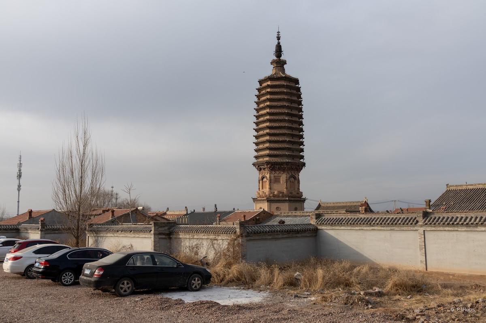
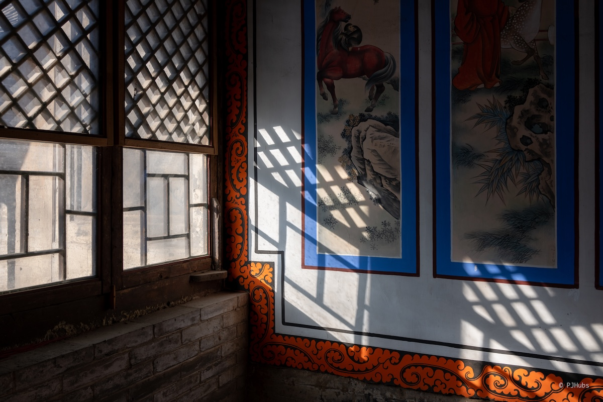
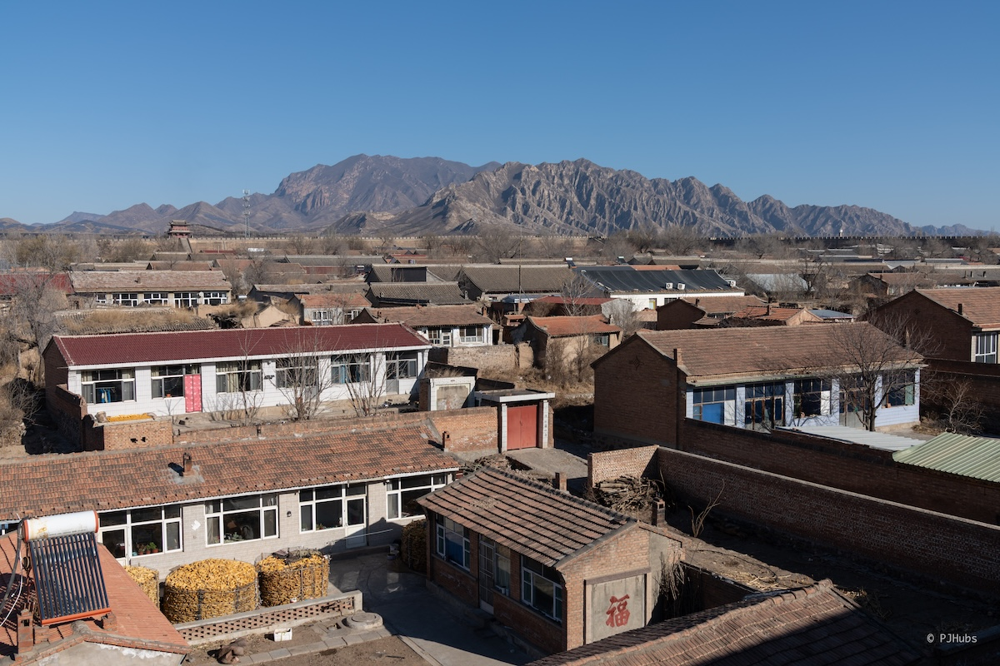
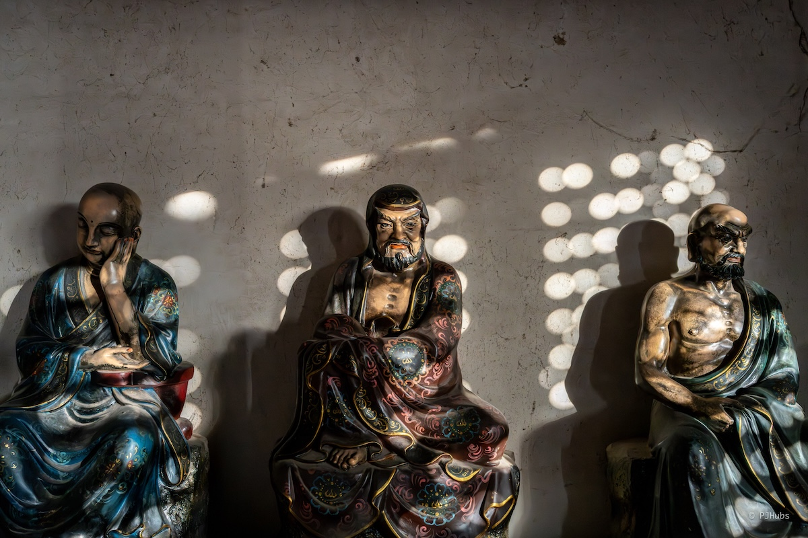
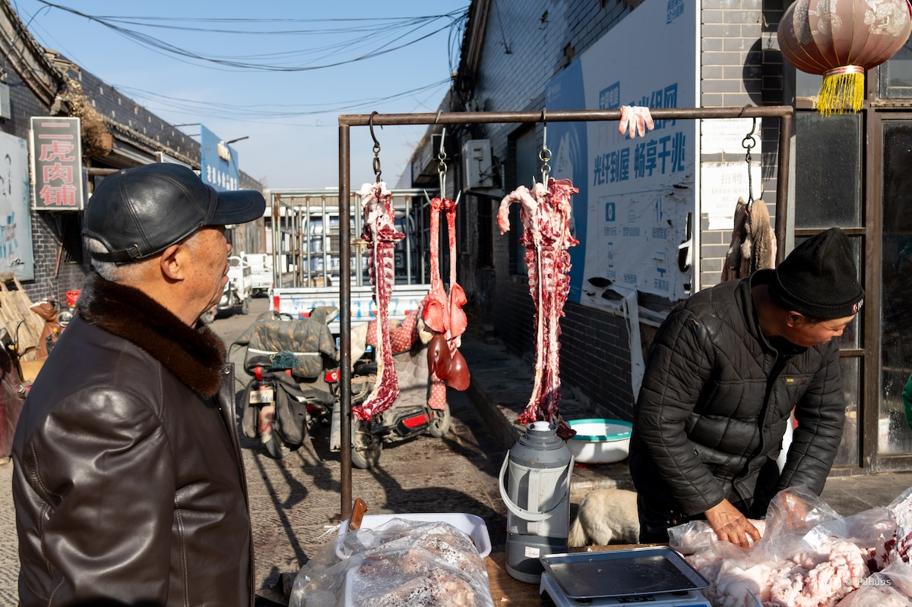
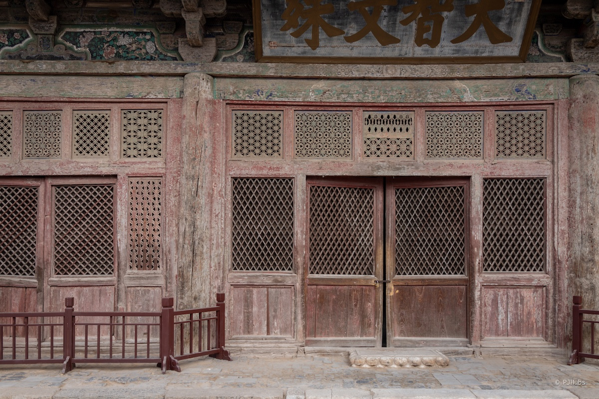

用了 5 天时间完成了鸡鸣驿-宣化-蔚县-暖泉-涞源-保定-新城这几个地方“巡边”旅行，好好的看了古城和辽代遗构，从此八大辽构只剩下山西应县和辽宁锦州义县的两处，都是交通相对发达且开发完善的景点，不用过苦日子了。鸡鸣驿和暖泉古镇给我的印象最为深刻，反而期待最大的蔚州古城有些失望。从宣化开始，后续的行程全部使用滴滴顺风车完成，顺风车是这个时代第二伟大的发明，因为第一是货拉拉。

## 行程规划
整个 12 月我都没有外出旅行过，虽不合常理，但主要原因是我在全力以赴用一个月的时间完成几个 app 的收尾工作。很庆幸有如此完整、如此长的一段时间留给自己一心专门写产品。在完成阶段性的产品开发后，心里已经痒痒很久要出去哪里走走逛逛了。

每当有想在北京周边看看的想法时，鸡鸣驿总是会冒出来占据一部分的空间。两年前就想骑车去鸡鸣驿，因为鸡鸣驿地处北京延庆正西方向不远处，从北京家里出发仅需不到 150km 即可到达。但周末这么一来一回几乎没有时间可以好好的在鸡鸣驿古城里闲逛，也就一直作罢。因此这趟行程优先把鸡鸣驿打头阵，再依次安排剩余内容。

在查询鸡鸣驿的信息过程中，连带发现了周边有“土木堡之变”的遗址，顺着这条历史脉络的提示，进而想到了宣化。宣化作为明代九边重镇之一，作为安禄山起兵和屯兵之地，确实该去，正好逛了一天后可以作为休息点停留一晚。

既然已经到了宣化，那目光就要往河北省的左半部行政区域寻找下一个地方，此时蔚县就冒了出来。我是从之喜的视频中了解到蔚县的，想的也是骑车。从北京出发，走京蔚高速仅需两小时即可到达。蔚县周边走国道往涞源方向去的话，有太行八陉之一的飞狐陉可以一骑，景色非常好，是骑车佬的梦中情路。

并且作为后晋割让给辽国的燕云十六州的蔚州之一，不管是北宋还是南宋，针对燕云十六州屡攻不下，已然成结。后来元灭金，明灭元，以“恢复中华”号召北伐，从此才完成了从后晋到明朝，从汉族王朝中遗失再回归汉族王朝，共计 430 年整。蔚县这座城无疑不是一部历史，必须得来。更何况蔚县西南方向还有一名为“暖泉古镇”的古堡聚集地，也有“打树花”可以看，更得来了！

蔚县就这么加入了行程列表中，此时行程已经达到了尾部，应该逐步返程。原计划我是打算从蔚县到保定，但在翻阅地图的过程中发现了二者中间的必经之地涞源。搜了下涞源有什么可以看的，这么一搜可不得了，八大辽构之首的阁院寺居然就在涞源，并且地处城区中心，交通便利。再仔细一查阁院寺的亮点，这么一查还是不得了，阁院寺的文殊殿正面的那几扇窗棂整体被称为“中国古窗棂博物馆”，涵盖了从辽金明清到民国几大时期的木雕窗棂，真的是把“一眼千年”具像化了，涞源也得来！

在看阁院寺的信息过程中，猛的发现八大辽构我已经看了一大半了！努把力基本上就要看完了。发现过保定回京的必经之路上也会经过另外一个八大辽构的开善寺，就在高碑店东南方向的新城镇。因此也把新城镇作为旅行中的一站加入了行程中。这趟行程误打误撞的把八大辽构快凑齐了，以后只剩下应县木塔和辽宁锦州义县的奉国寺了。

## 鸡鸣驿
鸡鸣驿去一趟还算容易，并没有网上说的那么费劲。首先从北京北站出发，直达下花园北站下高铁，出站后跟着出租车指示牌 30 元一位直达鸡鸣驿北门。回程的话依旧如此，我原本计划记下了来时的出租车司机电话，准备再用 30 元打车回去，确实怕滴滴叫不到车。但就这么试了一下，居然马上就有人接单了！重新回到下花园北站仅需 13 元，气的我直拍大腿。

鸡鸣驿从名字上就可以看出它的历史背景，它的定位一直都是作为邮政系统中的一员而存在。目前也是全国最大的古驿站，且还是“活着”的古驿站，整个古城墙内外区域现行政区划为鸡鸣驿乡。与之类似的古驿站大都成为了遗址，甚至都只剩下了地基的大土堆了，比如甘肃的悬泉置，现在去看也就看个念想了。

更有意思的一点，1900 八国联军进京后，慈禧“西狩”，连夜出逃北京，第一夜就夜宿鸡鸣驿内。现在在鸡鸣驿的古城主干道上，抬头一望就能够看到一个黑色木牌上写着“一九零零年，慈禧西行时曾在此留宿一宿”。按照四合院的制式，主人或者身份高贵之人应该住正房，但慈禧担心刺客以及奔波劳碌，和光绪帝各选了东西耳房入住。这段历史作为和我们最近的一件大事，也算是给鸡鸣驿的旅游观光增加了一大乐趣。

如果你对这些历史不感兴趣，而是像我一样就冲着古城墙内大量的明清民居而来，那可就大饱眼福了！鸡鸣驿的城墙、城楼均为原物，保存得非常好！尤其是当你从东城门登上城墙，往西北方向一望，那巍巍鸡鸣山拔地而起，独特的山体形状突然出现在你的眼前，这一切看得我实在是觉得不真实。

走在城墙上边走边看，晒着冬日的暖阳，看着城墙里的民居，混杂着狗吠、鸡鸣、羊咩和牛牟声，还有堆积在院墙之内的玉米，这一眼望去，黄的、红的、蓝的、绿的，多种颜色混杂在一起构成了一幅萧瑟肃杀的边塞之景。我绕了城墙一圈，拍了很多照片，下次还想再来。

## 宣化
从鸡鸣驿逛完后时间才 13 点半左右，我连忙改签原定晚上 18 点半出发去宣化的高铁为 14 点出发回怀来再折返宣化的高铁。这么一来，居然能够争取出了多半天的时间在宣化城内逛逛。

宣化，作为明朝九边重镇之一，也是安禄山起兵之处，本身承载的历史地位就不用我这个半路出家的访古之人来转达了。此次去宣化除了看三座城门楼子外也就是作为中途转发站，南下蔚县。宣化古城虽然确实也是个全国重点文物保护单位，但仅仅只是把大新门周边的七千多米城墙以及城内三座城门整体作为文保单位，除此之外啥也没有。

我觉得更难受的一点是就算只看这三座城门，经过这么多年的战乱和王朝更迭，只留下了城门基座本身，原本的楼阁早已毁于战火，再加上冬日出行，没有什么额外的表演且最大的清远楼内也不让进入登高，确实没啥看的。反而是这些游览重点之外的几处地方让我有些意外。

比如时恩寺，没想到它居然也是个全国重点文保！一过山门我就被庑殿顶的大殿惊喜到了，没想到无意之举想着消磨些时间逛到的时恩寺居然是个庑殿顶制式。一般情况下，庑殿顶和皇家的关系很深，皇家之下普通老百姓甚至达官显贵也只能到歇山顶。果不其然，按照记载，明朝在土木堡之变后开始整顿边防，时恩寺是当时宣府新建的寺院之一。

随后我还去到了清真南大寺，虽然仅仅只是个宣化区级文保单位，但查了下资料才发现居然和北京牛街清真寺、包头大清真寺并称为中国“北方三大清真寺”。礼拜大殿我隔着窗户看到了精美的地毯，清心楼和望月楼两座阁楼中式清真寺在早上的日光透照下格外梦幻。整个宣化古城的核心区就通过三座城楼连接起来的南大街附近，从早到晚都是一派喧闹繁华的景象。我已经很久没有见过类似喧闹的场景了，繁华程度和王府井大街不相上下，宣化南大街更接地气一些。

因为我是第一天午后到达的宣化，再加上第二天上午基本上宣化古城的核心几个看点都走完了，本身也都是城市景观没有什么特色，一切都井然有序。就算是坐在街头，也无可观察留意的细节，反而南大街附近的这一大片喧嚣让我实在是心烦。来到拱极门楼下，尝试叫了一次滴滴顺风车前往蔚县，没想到顺势开启了我此次行车的顺风车之旅，赞不绝口。

## 蔚县
第二天午后就到达了蔚县，选了一家距离蔚县汽车客运站不远处的华住会旗下的全季酒店，是原本预计一路大巴出行而定的，要是知道后面可以一路顺风车回京，花费在住宿上的钱还可以再节省一些。

后续出行我应该还是会大量依赖华住会旗下的酒店，目前住过城际、全季、汉庭和你好，也看了他们的创始人传记，很对我的胃口。再加上我住过的这几家连锁酒店品质已经完全达到甚至超出了预期，尤其是全季，内部的房间装修每一处细微末节的配色都深得我心，甚至冒出过以后自己家就按照全季的风格一比一复刻了。

蔚县的主要看点首当其冲的就是玉皇阁，但很可惜玉皇阁要赶在年前修缮完毕，把广场给整理出来，近期也就不开放参观了。剩下的几个古建我原本以为得逛好久，没想到居然在抵达蔚县的当天下午除了鼓楼外全部看了一遍，本身并不是急行军参观，还是慢慢的逛慢慢的看，景点之间的行程都还是腿着去的。可想而知，蔚县不看玉皇阁会失去多大的乐趣。

蔚州古城里北方民居特色较浓，但整体有些失望，最主要的原因还是因为玉皇阁未开放，其他的景点不足以支撑起对蔚县的期待。再加上从鼓楼往南走后，整条步行街主干道两旁几乎全是卖电动车的商铺，多到我这个兼容性如此好的人都很难理解，甚至开始怀疑是不是蔚县要把这条街打造成“电动车一条街”作为特色。

重新回到古城南门时已经 17 点过了，一开始我还没意识到问题的严重性，想着冬天的夜晚很冷，今天就早点打车回酒店歇着，明天再去暖泉古镇罢了。我在滴滴上稍微等了一会才叫到车，还纳闷不应该很快的接单吗，没想到足足在冷天中站了十几分钟，太阳一下山温度骤降，冻得手疼，冷得电宝都无法给手机充进电。本身古城南门距离酒店也就 2km 远，如果不是太冷也就走回去了。但这车动都不动，怀疑被摆了一道，遂决定跑回酒店，顺便暖暖身子。

从古城出去后才发现交通彻底被堵死，短短的双向两车道，两侧路边还停着大量的车子，电动车和老头乐还在不停的穿梭，本身就不宽的道路就这样被堵得动弹不得。我边跑边寻思，这才周一，如果每天都是如此甚至周末还会加剧堵车情况的话，住这附近也太难受了，正所谓“想致富先修路”啊！

因此我果断决定第三天打车前往暖泉古镇，那里有更为特色的民居和古堡。

## 暖泉古镇
来回暖泉古镇的交通也挺有意思的，从蔚县汽车站确实是有政府官方运营的白色小巴车前往暖泉，但我去程选择了直接滴滴 40 元叫车直接到达。在去程的路上，司机师傅跟我说现在这附近很难叫到车回蔚县，可以坐公交，我听到这心里就咯噔了一下。本身我是不慌的，因为这年头有钱确实可以使鬼推磨，大不了推开一个超市大门，找老板帮忙找个车，不管多少钱总归是能回去的。但就因为司机师傅这么一说，我心里就不得不一直在想着这事。

好在后来重新回到了古镇的市集中心发现了回蔚县的白色小巴车，心里的大石才放了下来，因为有一辆出现在这附近就说明会源源不断的出现。后来逛完后才发现确实如此，每天定点发车一辆接一辆，每人仅需 5 元就可以从暖泉回到蔚县，来时亦如此。甚至第一次乘坐小巴仅需 1 元，1 元哪！这年头就连矿泉水都没有 1 元的了，实属良心，太良心了！

暖泉古镇是三个古堡村子合并而成，分别为北官堡、中小堡和西古堡，其中西古堡整体为全国重点文保单位。据说暖泉还是打树花的发源地，目前在同步申请国家级非遗过程中。镇子南边有室内和室外两个观看打树花的地方，但我此时前往的时间不对，最近的一次打树花只能等待春节假期了。在北官堡的城门正面我看到了因为打树花而飞溅在城墙之上的铁锈痕迹，很明显，很震撼。无数次的铁水泼洒飞溅在城门之上，似乎也代表了生活在暖泉古镇这篇土地上世世代代生活的遗迹，我站在这座城门前伫足许久，思绪乱飞。

我先看的北官堡和中小堡，最后才是西古堡。西古堡因为是全国文保单位而整体得到的保护远超其它两堡，虽然这三堡都紧贴在一起，但一名之别宛如一山之隔哪。堡子都很有特色，尤其是西古堡，不愧是国家级文保单位，不光是历史典故就连建筑都十分具有特色。

我刚走进西古堡大门，就有一骑着电动车的大姐拦住我问，是否需要讲解。一般这种情况下我都是直接没啥好脾气的直接说不要走人，但你一言我一语搭话的过程中，发现这大姐语气平和，性格不错，可以一试，决定花 40 元找大姐进行讲解，她给我说了这么一个故事。

暖泉古镇的传奇富商董汝翠，少年失怙流浪至此，被郭员外收留后入赘。他曾承诺守郭家信义、拓家业版图，凭借踏实肯干的品性，将郭家产业扩张数十倍，跻身蔚州巨贾。顺治年间灾荒，他兑现济民之诺，设粥厂赈济灾民；践行兴镇之诺，独资修石桥、建地藏寺与双耳戏楼，筑八进董家大院，还迁辛孟庄集市至暖泉，奠定古镇商贸核心地位。其守信重义的事迹载于史册，遗留的宅院、古桥等，成为暖泉古镇人文底蕴的鲜活印记。

大家边给我说着这个故事，边带着我在西古堡里走街串巷，一会儿让我看看这门檐木雕，一会儿让我看看这深宅大院，一会儿带我登高远眺，在讲解的最后和大姐拍了张合影，相约下次再来时再叙。

暖泉古镇比较推荐上午前往，一下车就可以感受到早市的热闹。当街宰羊，小狗就从血盆里趁人不注意叼走一块，吃的胸前血红一片。北方市集和南方市集完全不一样，北方市集较为粗放狂野，所卖之物大多也是山野之味，精细之作不多。此次暖泉之行唯一遗憾是没能看到打树花，下次再来时可能就会绕过这些村镇，直接去寻找比如西大神堡之类的老古堡，但这种玩法可能骑车更合适更自由一些，谁知道呢，总之先期待下一次吧。

## 涞源
准备从蔚县离开时，还在纠结到底是直接顺风车去保定还是在涞源停一下。这么一搜涞源有啥可看时，才发现原来八大辽构之首的阁院寺就在涞源！瞬间就重新激起了我凑满八大辽构的心。

去往涞源我还是选择了顺风车，我一下单就马上被人接单了，心里踏实了不少，下单从涞源到保定的顺风车时没想道刚一确认付款马上就被接单了，有点惊喜，心里暖暖的彻底踏实了。

之所以把阁院寺作为八大辽构之首原因也很简单，它是八大辽代建筑中年纪最大的，且从未落架修缮过，大殿内外所有一切都是原汁原味古建味道。正面的大门和窗户上的窗棂分别排布着从辽、金、明清再到民国的木雕窗棂，就像一本书一样，记录着这历朝历代的痕迹。也正因此，阁院寺也被称为“古窗棂博物馆”。更有意思的是，在大殿也就是文殊殿的左侧窗户窗棂上有一梵文，其形状很像 08 年北京奥运会的“京”字会徽，相传会徽的灵感也有其一部分功劳。

阁院寺只在今年五一假期期间短暂的正式开放过，其他时间均没有官方的开放时间。但我还是想着天无绝人之路，假设就算是没能进到大殿里看一眼，隔着院墙，垫着脚尖远远的瞅上一眼也算来过吧。没想到顺风车刚一停下，我就碰上了几位刚参观完毕的游客，连忙问是否能够参观，他们摆摆手说“随便进”，大喜！

在前往涞源的那一天晚上我确实看了不少介绍阁院寺的视频，也看了不少阁院寺的照片，但就算如此当我站在阁院寺的文殊殿前那一刻，一种无语言表的震撼之感涌上心头，我就这么和千年前的古人在此刻相遇了。我仔仔细细，里里外外的看着、望着、瞅着眼前的这一切，不放过每一处细节，也绕着大殿走了几圈。文殊殿的斗拱确实很有特色，但我这个外行也就看个热闹，隐约间能够看到斗拱木头上的描画。

正准备离开时，有一大哥突然把我喊住，问我要不要讲解，要不要进大殿里看一看。我心里突然震惊！难道这就是小红书上说的那位神秘的“文保员”？就是那个能够给你打开大殿，让你可以一览使用了“减柱法”营造出空旷之感，却仅需 20 元的文保员！我赶紧小鸡啄米似的点头，“好好好”。

就这样，我终于在伴随着文保员浓厚的口音下，听得似懂非懂，时不时的哼唧两声附和。没想到大殿内也是精华！巨大的斗拱在大殿内更是一览无余，真的是仅需四根大柱就可以撑起面阔三间的庑殿顶屋檐，历经千百年来不曾动摇。

从阁院寺出来后，我转向前往泰山宫，那里还有一座同为全国文保的兴文塔。在前往泰山宫途中经过了涞源的市集，也是浓浓的北方市集味道，卖着好多好吃的，但我本身对北方大集上的食物没啥好感也就匆匆走过。

泰山宫原称“泰山奶奶庙”，目前为道教宗教活动场所，每年泰山庙庙会门庭若市，好不热闹。而旁边的兴文塔原意是当地富贾为了改变涞源本地文运风水所造，风水先生说涞源此地位于八卦巽方位，需要建一高层建筑方能改运。泰山宫下紧靠着的就是拒马河源，两大池子底下常年涌出泉水，清澈见底且冬日不冻，不少在湖边钓鱼的人。当日涞源无风，两个湖面上宛如两面镜子般倒影出掉光了叶子的树干，四仰八叉的树干和湖面倒影互称镜像，站在湖面前久了竟还有点恍惚。

但涞源的交通太不方便了，刚好卡在太行山里，不管从哪里来都得进山，但进山的话，此行无火车，必须自驾或者大巴。如果不是因为有顺风车如此美好的东西，估计阁院寺我是更难看到了。从蔚县去涞源的话，如果走国道可以领略飞狐陉的险峻，蔚县地处平原，周围一圈山脉把蔚县包围了。从蔚县出发一直往山里开时，我一直盯着车窗外的小五台山，心里想着这要是夏天来骑一趟车能爽飞！

## 保定、新城镇
从涞源到保定也是午后，办理好入住后我就飞奔大慈阁，生怕在保定不到 24 小时的时间里来不及好好的看完。然后事实上整体比较失望，虽然大慈阁确实是全国文保且清代建筑也算古建，但给我感觉非常不对。虽然一直在说“不到大慈阁，何曾到保定”，但现如今当我站在阁楼之上时，心中那种奇怪的感觉不知如何表达。在大慈阁上只待了一会就离开了，实在是没啥看的一个宗教场所，其中的文物在文革时期也都不知下落。

也看了直隶总督府，不请讲解很难看出个所以然，我不想再听这些故事了，就只请豆包简单的概括总结了下大概了解了下其历史背景也就作罢。反而是从总督府西门外的光园让我有些小惊喜，独特的红白配色小建筑，居然和民国大总统曹锟关系不小，并且多位名人大家均有关系，也算有点特色。

保定名声在外，和石家庄河北省会城市“争夺”的故事早有耳闻，反复迁移的故事也算有趣，最终还是周总理按下了停止键，不过对比保定，石家庄很多人都说没什么历史底蕴，就是个庄，纯靠交通占据上风。但不得不说保定的驴肉火烧确为一绝，与别的地方驴肉火烧完全不一样，写到此处，肚子又饿的呱呱叫了。尤其是那一杯“火烧拿铁”，我看着架在拿铁之上的小火烧愣了好久，好吃，也好喝。

最后一天从保定离开时，我原本打算是高铁直接返京结束了算了，但因为前面被涞源的阁院寺激起了看完八大辽构的心，果断决定途中先过下高碑店的新城镇，去把开善寺看了。

相传，开善寺还跟“澶渊之盟”典故有些联系。辽和宋在澶州签订和平盟约，结束了战争状态，代价却是北宋每年向辽输送“岁币”，银 10 万两、绢 20 万匹，至雄州交割，而开善寺地处边界重要节点，据说有作为过存放交割物资之地。但就从开善寺大殿制式来说，辽构继承唐制，寺内大殿还出土了唐风格的千手千眼观音造像，也反映出了辽对中原文化的接纳。

开善寺相对阁院寺维护的更好，持续开放，侧面铁皮大门进入后刷身份证即可入寺，在 23 年 8 月的那次洪水还把开善寺给淹了，正点大门底部能够看到两年多前的那次大洪水的痕迹，开善寺正殿本身就在一米多高的基座之上，洪水还能淹没至大门之下，可想而知当年那波洪水有多吓人了。当时的我也只是看过一些视频，门头沟城区都惨不忍睹，甚至常去骑车的潭王路路口的小村庄直到今年都无法复原，满目疮痍。

不过新城镇从 1966 年开始做了三年县政府所在地，整体没啥看的，也没怎么发展起来，整体就一开善寺可看。我就在这小镇里来回走动，主要就两条街，最后不得不在唯一一家的蜜雪冰城里坐着等顺风车回京。

## 总结
这一趟出行把我最近一段时间的心情都给抚平了不少，也看淡了很多事，人这一生没有什么东西是放不下的，也没有什么东西是必须要完成或取得的。越是看重一个东西，看重一件事，最后结果不好反而会懊恼许久。

就比如这次出行的交通方式选择上，从宣化开始往后的行程公共交通只有大巴，但大巴的时间不够自由且速度过慢。原本规划这趟旅行就是按照乘坐大巴的计划来的，如果我一切以大巴的时间安排去做，如果没赶上一趟车导致错失或者匆忙看过一眼，我可能每天都在提心吊胆着。

反而在路途中发现了顺风车这个东西，能够完全甚至超出我的旅行预期，可以到你楼下接你并送到目的地楼下，才彻底解开了我的心结，让我完全的放松下来去感受这趟行程。但如果我没有出门，转而因为担心风大或者交通不便而放弃了这趟旅行，去了别的地方，那顺风车这个好东西我可能会更晚的发现。不得不说，顺风车是我认为继货拉拉之后，这个时代我们第二伟大的发明。这也算是给了我后续一个更加大胆的旅行方式，可以更加从容的面对以后的旅行。

此外，我还慢慢的对古建有了更多的了解。前几年买过梁思成所写的《中国建筑史》，只看了开头几页就抓耳挠腮看不下去，不管是图画本身难解其意，就连书中所用文字读起来都有些晦涩难懂。现在我觉得自己可以尝试再重读一次，说不定有些额外的收获。反而这一路上拍照倒不是主要的了，而是想去到某个地方，亲眼看一看历史遗迹，放下了很多拍照的执念。虽然还是带相机去旅行，但更多想要的拍照的仪式感，而不是出片的执念。

这一路上虽然只有短短的 5 天，但每天过的好充实，回味起来都是在路上的细节，就算没有拍到好的照片，居然还比之前拍到好照片的时候更加满足，已经迫不及待的想开始下一趟旅行了！

