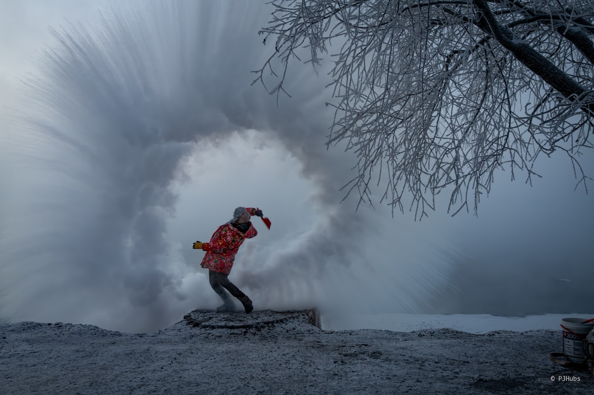

小时候家里在做宾馆接待运输瓜果蔬菜的挂卡时，总能看到很多“黑吉辽”开头的车牌，那时涉事未深的我只是觉得这些光着膀子叔叔们的口音很有意思，经常会模仿逗得他们捧腹大笑，这就算是我对东北的第一印象了吧。到了初中时，我遇到了第一次改变人生轨迹，来自哈尔滨的恩师夫妇，把我从一个沉迷网络游戏的不良少年“改邪归正”。现在，我终于踏上了东北真正的黑土地！

## 规划
东北三省黑吉辽我只去过辽宁，吉林和黑龙江一直没有找到合适的机会去，不光是辽阔，就算是特种兵式旅行没个七八天下不来。其次想要体验到东北最核心的“冷”也得等到冬季来临，但过了十一国庆后，下半年就只剩下个元旦假期，怎么凑都很难凑出个可以特种兵东北的假期，之前也就一直作罢。

结束了上一次《巡边》旅行后，趁着空档就马上和小伙伴们开启了真正的东北之行，我们一行四人，预计用 10 天的时间从北京出发，过沈阳、长春、长白山，最后到达哈尔滨后回京。为了这趟旅行我们专门买了一波防寒装备，长款加厚羽绒服、加厚手套啥的都整上了，就为了迎接大寒节气下的东北！我把这次东北旅行命名为《白山黑水》。

我们大概的行程规划是这样的。先从北京到沈阳，沈阳的主要目的是早市和泡澡，接着从沈阳去长春，长春主要是过一晚后起个大早去吉林看雾凇。随后就来到了此次行程最重要的地方——长白山，争取上长白山天池和户外温泉，感受零下二十几度的温泉泡澡。最后一站就是哈尔滨了，要去看索菲亚大教堂、逛中央大街和玩冰雪大世界，最后以侵华日军第 731 部队旧址结尾。

## 沈阳
出高铁站就感受到了凛冽的空气，在户外哈哈笑久了后牙齿是会痛的，还挺有意思。到达沈阳北站的时间是下午两点多，刚好可以卡一个工业博物馆的营业时间，这就是我们的第一站了。

位于沈阳市铁西区的工业博物馆全称为“中国工业博物馆”，原址之上就是原本的铸造厂，上世纪 50 年代期间曾是亚洲最大专业化铸造企业。这份庞大从进入“铸造馆”展区内立马就感受到了，从未见过如此宏大的室内建筑，站在一角望去，游人就如蚂蚁般渺小。但博物馆内另外一个重要“机床馆”展区我却没有太大兴致，可能是因为小时候家里的铝合金门窗压控机器接触多了，现在再看到这些充满机油污渍的机床设备，内心有些厌恶，匆匆走过。

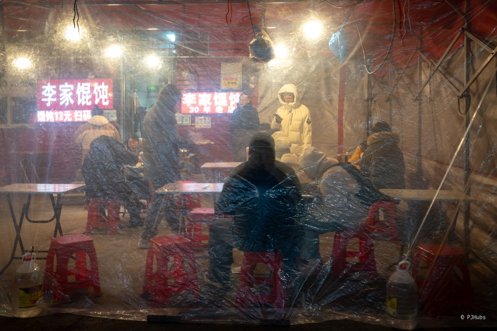

随后办理好入住后，就出门去夜市了。沈阳的夜市主要是两个，分别是“彩电塔”和“西塔”夜市，这两个夜市各自有特色。彩电塔相对本地化一些，都是东北本地的特色食物，比如鸡架之流，而西塔则几乎就是朝鲜半岛美食圈了，甚至还有“朝鲜馆”官方食府，主营冷面。我们两个夜市都逛了，在彩电塔吃了醋喷鸡架和冰沙口感的蓝莓糖葫芦，这两样食物太特色了，第一次吃鸡架还是醋喷味儿的，味道不错。

第二天我们专门去到了小河沿早市，刚到大门口下车就看到了高高挂起的“东北第一早市”招牌。虽然我对早市没有啥感觉，但敢称在东北称第一那确实应该有点东西才对。实际逛下来发现东西确实不少，如果是从头开始吃起的话，确实一家一家逛可以吃个几天不重样，并且有好几家铺子前排了老长的队伍了。我们也凑了个热闹排了个“蛋堡”，味道确实好，与之前在其他地方吃的蛋堡味道都不一样，值得一试。

更有意思的是，往后走路过了几家卖馄炖的店铺，门前站了几个东北大娘，穿着花棉袄拿着红扇子，朝着路过的行人大声呼喊“宝贝～宝贝快来”。第一次路过时见到此景确实惊了一下，居然还能如此叫卖，但不得不说这种形式确实很抓眼，至少把我抓住了，往后逛的过程中心里一直在想着待会回头去大娘店里吃一碗馄炖。但就是这么一惦记，后来再次回到大娘店里坐着吃了馄炖后，才后知后觉味道太一般了，越是叫卖的花样多，确实品质不咋样啊。

整个小河沿早市不短，行人众多，吃喝也多，挑得人眼花缭乱。我们除了蛋堡外还买了另外几样特色小吃，比如粘豆包这个最奇怪的食物。可能是之前对粘豆包想象过多，被“豆包”二字迷了眼，一口气买了 6 个，老板说有三种味道都可以都尝尝试试。进入嘴中才发现粘豆包既不是我们想象的软糯口感也不是香甜的味道，总之确实不好吃，后面看到酒店早餐里搭配的粘豆包也都直接忽略了。

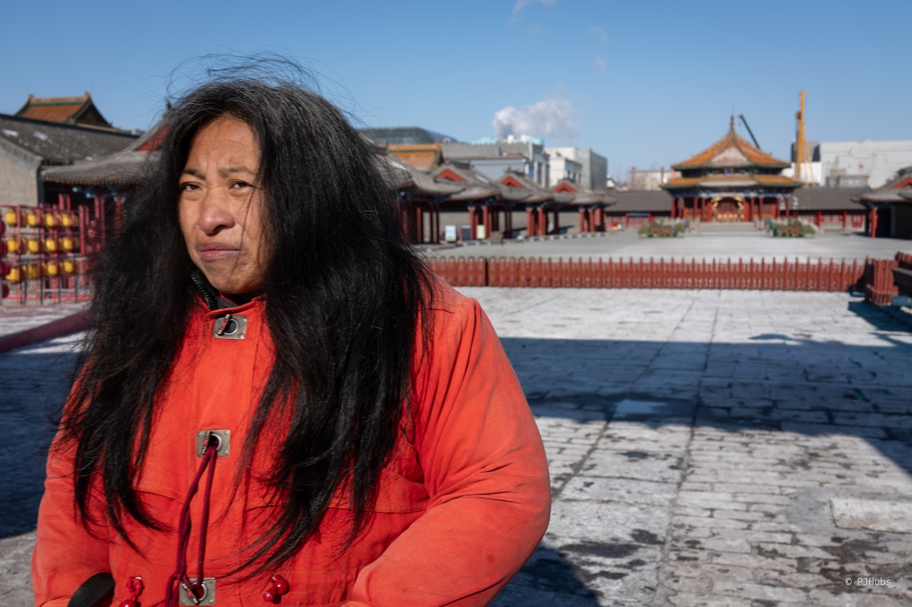

早市后回酒店休息一会儿就出发去辽宁省博了。在我去过的这些个博物馆里先前的排名是这样的，稳坐第一的是洛阳博物馆，其次是河北省博，第三名没有，空缺中。现在辽宁省博要和洛阳博物馆并列第一了，只差一点就可以超过，非常值得专门来一趟。我们一行四人报名了讲解服务，一人 30 元。辽宁省博的不光是藏品丰富，总共三层的展区里展馆类型更是丰富，有明清瓷器、纹样、印章等不同方向类型的展区，怪不得网上大家都说如果想好好看好好逛，怎么也得来两天。

下午就回酒店拿行李后开开心心的去泡澡了！我们在选择哪家洗浴中心时确实遇到了不少问题，当时正值周日，虽然不是人最多的周六，但这个时代不上班的人也是不少啊！如果我们选择了常见的比如泡泡森林、沐里沐外等，那不可避免的干啥都需要排队，但吃喝玩乐上估计会丰富不少。但如果我们不想耗费时间在各种项目的排队上，那整体可能吃喝玩乐的品质会下降，甚至还考虑过私汤的选项。直到回酒店取寄存的行李了，我们还在不停的找。最后综合了我们的整体诉求，既要泡澡舒服还要能有水果饮料的自助，还能提供客房住宿一晚，选择了永利汇这家洗浴中心。

可能是之前工作上的团建去洗浴中心太多了，一些东西已经无法刺激到了我，比如北京的九号温泉和曲水兰亭，深圳的汤崎等等，这些之前团建去的洗浴中心项目繁多，不光玩的好环境好，就连吃喝都是一等一的好。但就算如此，沈阳的永利汇泡澡池子之大还是超出了我的想象，搓澡价格也很优惠，仅需 79 元，几乎是北京搓澡的一半了。但永利汇的吃喝就比较一般，预期之内吧。还有一个意外的点是娱乐区里居然有个小舞台，老板找了几个歌手来唱歌，坐在帐篷里或者躺椅上，还是惬意的。

在洗浴中心的客房睡了一觉后，就出发去长春了，四个人的洗浴到最后人均仅三百多，还是实惠不少，如果你之前未曾去过洗浴中心，可以在沈阳玩耍后去一趟，但没有必要专门为了洗浴来沈阳。

## 长春
也是午后到达长春，第一站我们选择了去“这有山”商场。一开始我确实没想明白为何要专门规划一段时间去一家商场，后来进去后才发现确实很有特色，商场里的店铺都“依山而建”，按照坡度一家叠着一家往上盖，游客也需要往上爬一节又一节的楼梯逛街，整体确实有意思。

此时时间还算充裕，我们看到了这有山马路对面的长春电影博物馆还在营业时间，打算来一个计划之外的安排，先逛一圈电影博物馆。只是没想到这个电影博物馆的门票如此之贵，居然要 90 元一人，讲解费需要 170 元，但来都来了也就买了。长春电影博物馆前身是日本人和伪满州国政府出资建立的“满州映画协会”，简称为“满映”，后来随着战局更迭，为了保护宝贵的遗产，制片厂多次更换地址，最终重回长春。

讲解员在介绍前面的黑白主旋律阶段的电影史时我感触不深，但越到后面，到了改革开放之后，自己熟悉的片子多了起来，认识的演员也多了，熟悉感也回来了。没想到长春电影制片厂参与制作过这么多部优秀有趣的电影，比如《五朵金花》、《白毛女》等，甚至就连《热辣滚动》、《731》都有参与其中。但不管怎么说，我还是觉得这 90 元的门票太贵了，而且讲解员的 170 元也不便宜，虽然确实能学到一些东西，但心里始终觉得这 90 元一人的门票钱花得心里不太舒服。

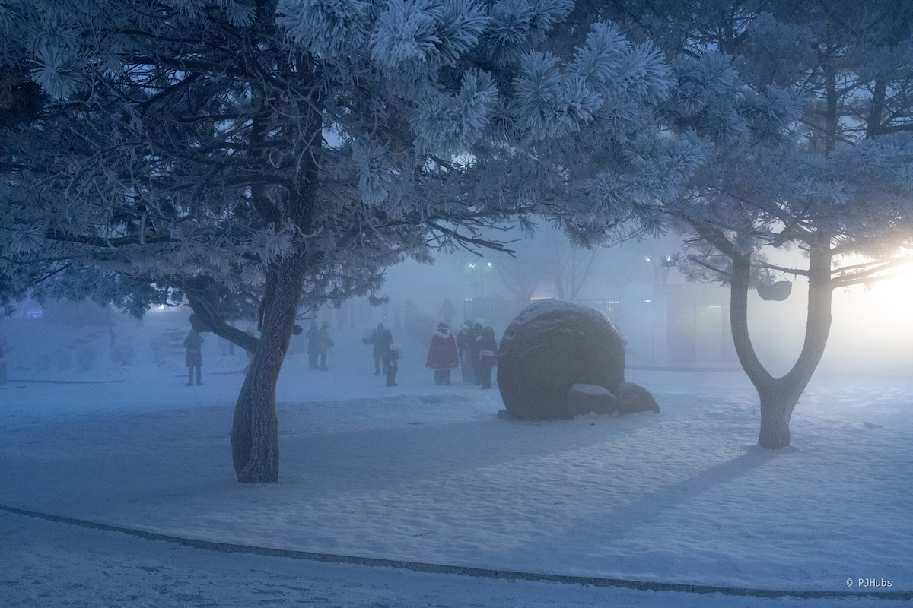

隔天一大早我们凌晨 4 点起床，就为了坐从长春出发到吉林最早的一班高铁去看雾凇。早上 5 点 22 分出发，到达吉林 6 点出头，打车到小雾凇岛景区，也就是“万缕银丝”这个地方正好天亮，雾凇还未掉落。在我们到达吉林的前一天是五星雾凇，我们当天只是两星雾凇，但就算是两星雾凇也让我们震撼得不行，从未见过雾凇的我，在寒冷刺骨的松花江边好好的享受了一把。

在万缕银丝这个地方附近其实就是松花江的岸边小公园，没有收费的地方，也没有管理人员，如果晚来加周末再加五星雾凇的话，那 7 点左右必然是堵得严严实实。小公园里有很多抱着小狐狸让游客拍照的人，虽然狐狸确实很耐寒，但我一直对这种使用动物来谋取利益的行为厌恶，包括各种动物园在内。虽然抱着小狐狸拍一次照只要 10 元，但动物嘛，必然有它的野性和天性所在，鬼知道这些人为了掩盖小狐狸的特点背后做了什么乱七八糟的事情。

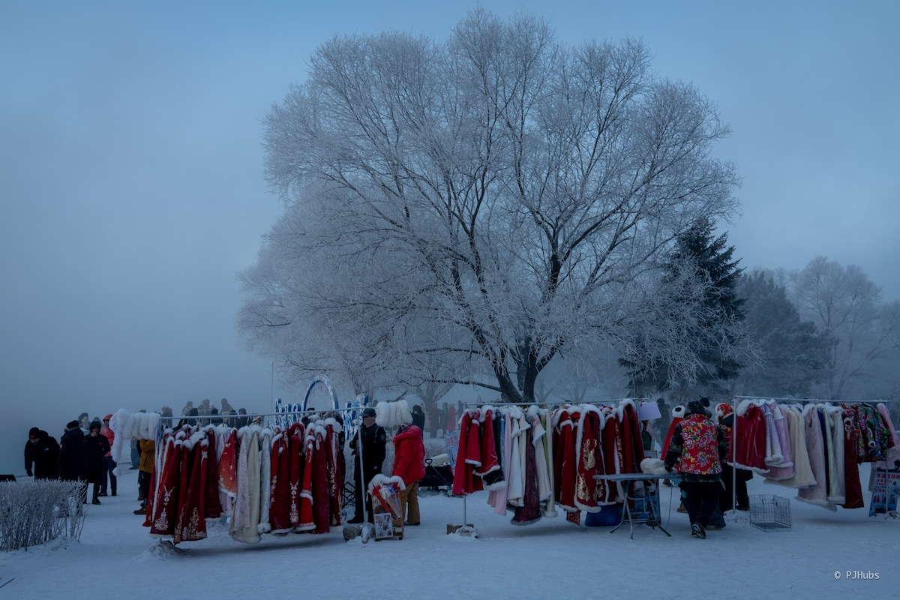
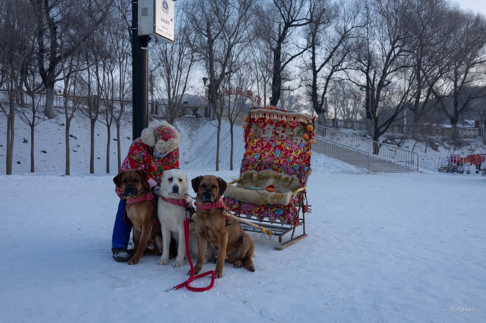

我们雾凇只看了差不多一小时，因为实在是太冷了。对日出前的河边温度没有预判，没有穿上最厚的衣服导致看雾凇的这一天早上是在东北这么多天以来最冷的一次，真的是从脚拇指冷到手指，甚至相机都冻上了一层霜，脱了手套的手碰到相机时，瞬间就冻得刺痛。

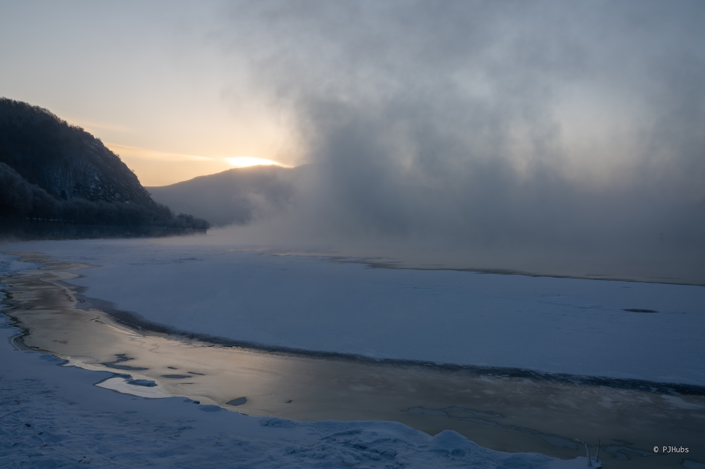

看完雾凇后就马上坐高铁回了长春，坐在去往吉林高铁站的滴滴上时，滴滴师傅跟我们说了一些吉林的有趣的历史，并踩了一脚长春，说长春啥都是新的，不像吉林这般有历史厚重感。其实我也能理解，毕竟像我一样匆匆来到吉林只是看一眼雾凇，并没有给吉林留下更多的时间去感受它，作为一名当地人每次听到游客们都如此匆忙的来去，必然也要拯救一波自己的家乡。

回到长春后，居然还能赶得上酒店的早餐！吃了顿热乎的早餐后回到房间休整了一会，真的是冻得人哪哪都疼，太佩服生活在东北的人了。缓过来后我和女票打车去了长春净月潭，看了网上的消息说是有蓝冰可看。所谓蓝冰就是从水库的大水池里切割出的大冰块，堆积在一片区域里，大冰块叠加着大冰块形成了一个现代化景观——蓝冰。

但净月潭居然还是个 5A 景区，景区道路绕一圈共计 18 公里，坐在摆渡车上看到居然有大冬天在公园里跑步的跑团，不过想想也是，一圈 18 公里正好适合拉一个长距离有氧训练。除了蓝冰之外，净月潭还有好多冰上项目可玩，但我们对此都兴趣不大，在蓝冰区域拍好照后也就坐上了返程的摆渡车出景区回酒店了。

在长春的最后一站当然就是去伪满皇宫了。我一直对清朝末期和伪满州时期的历史感兴趣，不管是因为这是距离我们最近的一个封建王朝，也是记录的历史影像和文字最多的时期，很多东西较难作假，再加上这段时间多个历史事件的交汇碰撞，不管几次进入这段历史中都觉得十分有趣。

对伪满皇宫的初印象是《末代皇帝》这部电影，是在大学时宿舍里看的，给了当时的我不小的震撼，并对其中的一些画面记忆至今。当我进入伪满皇宫勤政殿中时，电影中的那些画面就在我的眼前重合上了，这种感觉很奇妙。看到婉容的房间，溥仪对她的不闻不问都在这一个小小的房间里具象化了。

只是这种“兴亚式”建筑风格在伪满皇宫景区和长春的顺天大街两旁屡见不鲜，从一开始的新奇再到后面的异样感，实在是奇怪，太奇怪了。尤其是看到一些建筑老照片上的山花横放的屋檐顶，就好像从天守阁上切割下来了再拼上几根罗马柱，哪哪都觉得奇怪。

## 长白山
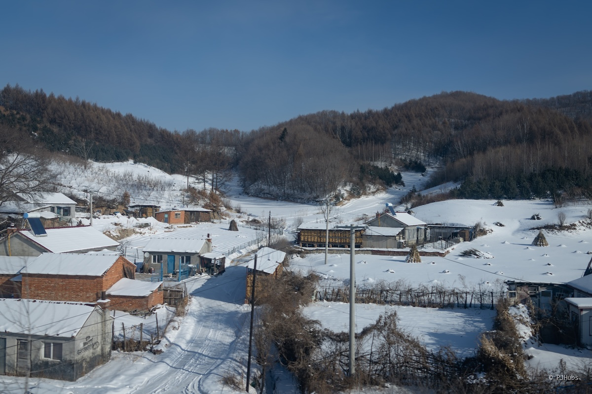
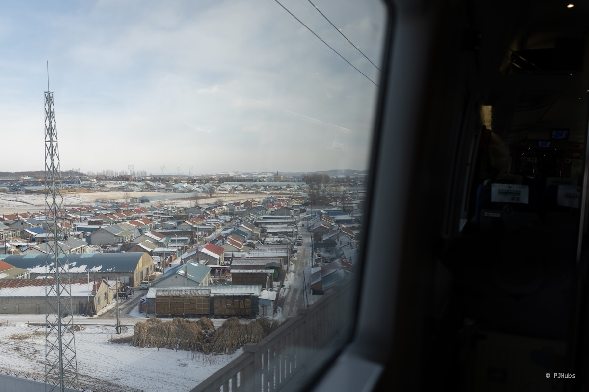

长白山是此次行程的重点，我们花了重金选了一家据说是原生温泉水的户外温泉酒店。到达长白山下的二道白河镇后住在了附近一片相对便宜的宜必思，没想到 400 元出头一晚的酒店已经是这二道白河镇上相对便宜的酒店了，真是难以相信。

我们在从长春去到长白山站的高铁上联系好了第二天去雾凇漂流的行程，顺带让司机帮我们订上了下午去雪地穿越的雪地摩托。各种摩托坐了也开过不少，但唯独雪地摩托这种类型从未接触过，心情马上就开心了不少，毕竟前几天的早起已有了不少疲惫感。

雪地穿越确实有意思，雪地摩托的构造前面是雪橇后面是轮子，油味儿很大，摩托也不是拧把的，而是通过右手的拇指按下把手的行程来加速或者减速。开到后面大拇指也快冻僵了，因为需要持续的按住摩托才能前进，大冬天的在雪林里血液不流通，很容易手疼。绕一圈包括中途的拍照休息点大概四十分钟左右，路况比较颠，两人一辆车的话，坐在后座的人会比较难受，因为看不清前方路况，颠簸没有预判。

雪地摩托结束后，我们让司机师傅送到了二道白河边上，顺着二道白河走了一段路，风景确实很好看，可以看出当地政府确实给小镇的美化花费了不少心思，值得一个大大的赞！二道白河边上就是云顶市集，云顶市集里就是逛街吃饭的地方，此外还有一个收费 20 元每人的云顶天宫大雪雕。白天来看云顶天宫可能会不错，晚上的话我总觉得灯光有些怪异和俗气。

我们在云顶市集逛了一家长白山文创店，买了两个用长白山一些本地材料，比如松果、松叶枝做成的各种小动物形状冰箱贴。我很喜欢买这种冰箱贴，但挑到合适的，有当地特色的冰箱贴太难了，本来打算 26 年开始不再买冰箱贴的，但给长白山的这两个猫头鹰冰箱贴破例了。

来长白山玩耍，除了上山去看天池另外一个安排就是雾凇漂流了，我们选择的是大泉河漂流。可能是对雾凇漂流的预期过大，几乎是把这趟行程的所有期待都放在了雾凇漂流上，抱了很高的预期，导致我们看到现场的漂流情况时有些失落。首先是雾凇非常少，几乎没有，远不及在吉林松花江边看到的两星雾凇一半。其次除了雾凇本身之外的景色很平淡，没有让我们感到有特别的地方。还是那句话，还是一开始的预期太高了，导致落差太大。

看完雾凇我们就转场去了长白山北坡景区里的蓝景温泉酒店，就是前面说的花了重金预定的酒店。到了酒店才后知后觉，我们认为的重金预算居然有如此多的人都能拿得出来，光是排队办理入住就等了小一会儿。酒店赠送了一次三小时的雪票，我们本身对滑雪兴趣不大，就和女票在雪场里坐坐缆车走走看看，在雪场最高点喝了杯咖啡，远观了长白山主峰，在雪场最高点玩了趟在地上画大字。没想到这无心之举居然成为了这趟旅程中唯一画大字的地方，原本我们以为不缺雪的大东北几乎天天都可以画大字呢。

这家蓝景酒店的温泉名声在外，说起这家酒店的名字本地人都知道，都是说从长白山流下来的温泉稀释后降温所得。我们去泡时已接近日落时分，温度马上就下来了，在户外零下二十几度的天气里泡着温泉，头发沾点水顺着雾气很快就形成了“头发雾凇”，非常有趣。我选择了一个温度较高的池子泡一会儿站起来吹一会儿冷风，模拟冷热水交替泡，就这样爽爽的度过了惬意的半小时。

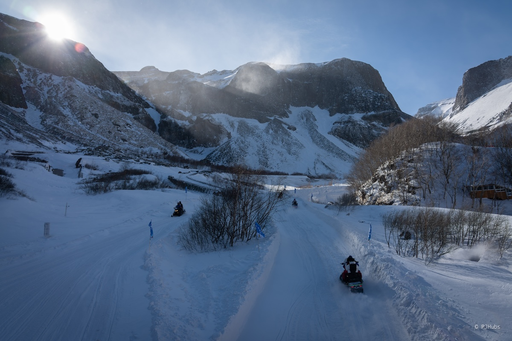

冬天的长白山天池景区开放时间窗口很短，经常碰见的是连续好几天关闭，然后根据每天早上凌晨天气情况开放几个小时，可以认为是可遇不可求。但综合下来看，长白山西坡上天池的概率会比北坡大，我们先找黄牛买了西坡的门票，但隔天一早起床后看到长白山景区公众号发文说西坡和北坡天池景区均关闭后，才连忙马上找黄牛退了西坡的票重新买了北坡的票。要不然我们还得绕一大圈从北坡感到长白山站，坐高铁到长白山西站再去西坡景区，大半天的时间都耗在路上了。

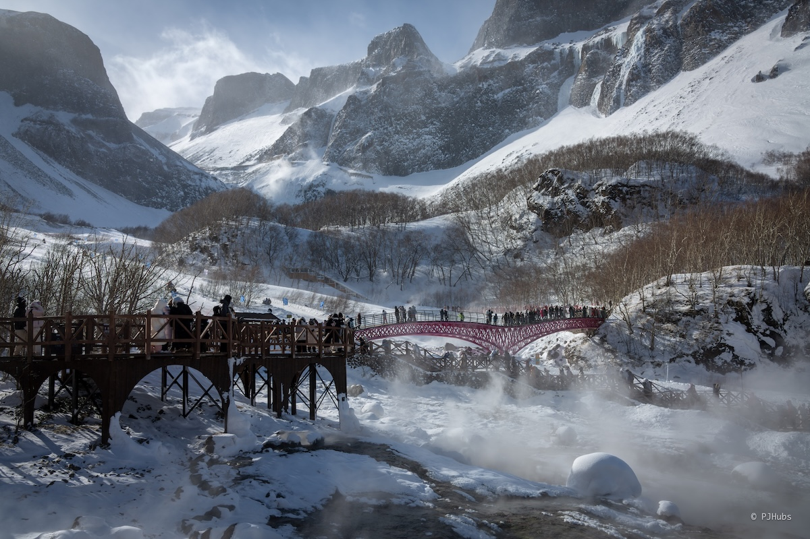

长白山北坡景区里看不到天池，还可以看长白瀑布和温泉群，以及山下的几个小景点。长白瀑布在冬天只能远观一小处，实在是没有什么特别的地方，但看长白瀑布的地方被长白山群像大手一样包围起来，还是比较震撼。再加上时不时的一阵大风吹起雪地上的雪末，砸在脸上细细碎碎的雪粒也算刺激。我们没有在长白山景区待太久，因为还是预期太大，再加上天池景区不开，只能说看的自然景观大差不差，还是值得来一趟。

## 哈尔滨
哈尔滨是我们本次行程的最后一站。上一次想来哈尔滨是去年 7 月底时想通绿皮火车睡一晚过去，想着用周末两天特种兵玩一圈哈尔滨，但后来没成型还是因为我是在从北京骑车去往蓟县的路上知道预定成功的，到达蓟县后身心俱疲，完全没有心思去规划下一周末去哈尔滨的事，也就把行程都给取消了。

在哈尔滨的第一站我们放好行李后就直奔远东地区最大的东正教教堂。看到索菲亚大教堂的第一眼就被它极具特色的穹顶和穹顶之上的十字架所吸引，东正教的十字架非常有特色，通过镜子来装饰十字架本身，再加上十字架底部的一根斜向上的木条，让人一眼就能发现这就是纯正的东正教教堂。

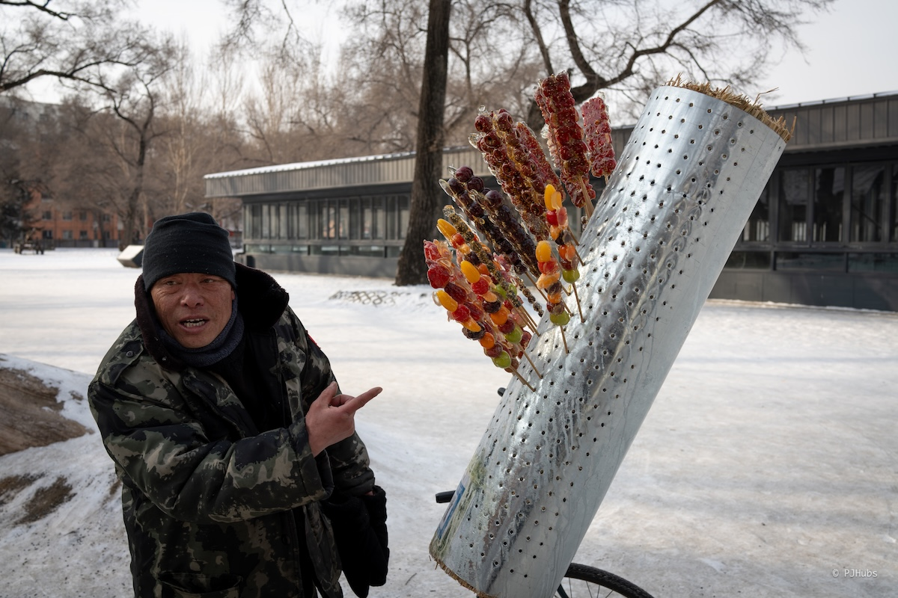

目前教堂已经经过了一次完整的修复，看上去很新但特色还是有。应该是当地政府为了迎接一波周末的游客，接连不断的教堂里上演一出又一出的音乐表演，有拉小提琴、弹钢琴，甚至还有阁楼之上的手风琴，站在人群之中和大家一起抬头往上看，这一幕画面太有感觉了！

距离索菲亚教堂西面不远处就是哈尔滨中央大街。中央大街名气很大，不光曾经是亚洲最长商业街也是中国最早的商业街之一，光是这条街本身就是 4A。大街两旁有不少特色的小吃，我们在大冬天里买了烟囱面包冰激凌，50 元还带一份咖啡，味道确实好，但就是边吃边抖腿，冷得最后只能回到市内才能吃得差不多。

大街两侧的商铺所售卖之物确实也有当地特色，红肠和俄罗斯商品占据了大半条街，天黑后大街上的灯饰也不错，值得来看看。我们从南向北走到大街的尽头，尽头处是哈尔滨冰雪嘉年华，和冰雪大世界很类似，一个是纯玩另外一个是纯看外加赠送的一些游玩项目。我们几个在松花江上的冰雪嘉年华玩了“冰上猜丁壳”，两个人并排的蹲在光滑冰面上猜丁壳，赢了的人可以用脚侧面踹向输的人双脚，输了的人因为蹲在光滑的冰面上重心不稳会被赢了的人较大概率的踹倒。这个小游戏还挺有意思的，适合男生玩。

新的一天来了！我们坐地铁来到了冰雪大世界，我对冰雪大世界其实经过了这么多天的行程后，其实已经没啥预期了，兴致也不算特别大，但就想着毕竟这是一个连续举办了二十七年的活动，多少都会有些东西可以看的。检票进入园区后，果然不出所料，马上就被眼前的一片片冰雕给震撼住了，怪不得大家都说来哈尔滨冰雪大世界主要是看冰雕的，至于什么大话题和摩天轮都是附赠给你的。

我特别喜欢冰雪大世界里的黄鹤楼，把黄鹤楼的秀气都雕刻出来了，在白天日光照射下蓝白色的黄鹤楼特别有感觉。至于冰雪大世界里的游玩项目，真的是我去过这些个游乐景区里配套做的最差的，它明明可以有 N 种让游客舒服一些的选择，偏偏选择了让游客在大冬天里抱着个手机定时的反复抢票。赤裸裸的把玩不到项目是游客自己的问题，成功转移了矛盾，我对这种方式抱有很大的意见，意见大到下次可能不会再来冰雪大世界了。

天黑后的冰雪大世界内有两个舞台可以看表演，各有特色。带蹦迪的是左右哥的那一侧舞台，之前在网上刷到的
主持人在舞台上喊”xxx，你的身份证“，台下的观众马上跟着喊”掉啦“的片段就是在这里发生的。当时刷到看了几个视频还觉得挺有趣的，但后来仔细一想并且还亲自参与到其中就觉得有点奇怪，怎么会每次表演时都恰好有人掉身份证恰好有人丢了包呢？站在台下的我逐渐怀疑这里面有极大的戏剧成分。

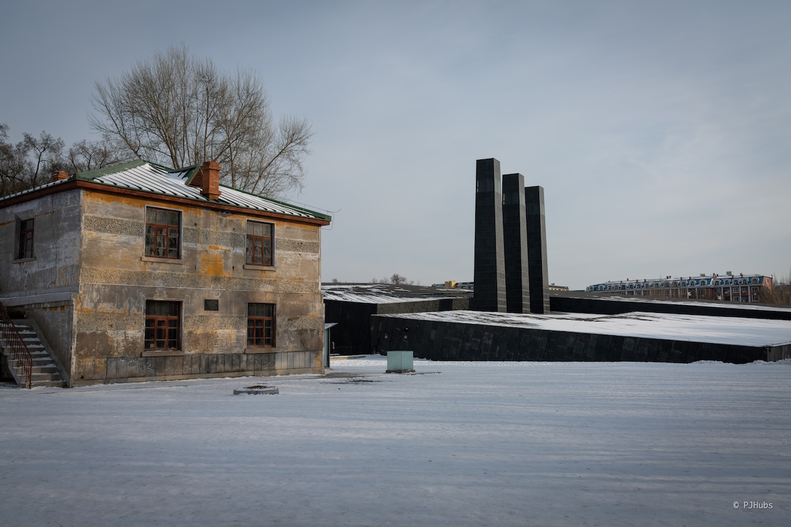

在哈尔滨的最后一天我们去了侵华日军第 731 部队旧址。在来哈尔滨之前我们看了《731》这部电影，看得人真是心里难受，有时候确实挺不愿意去回首这段历史的，就和现在的越南和菲律宾政府类似，为了国家和人民的发展，当下的时局让他们不得不拒绝回首那段历史，放下包袱，和曾经迫害他们人民的人合作，国家的未来才有希望。

看完整个 731 部队旧址后，心情确实很沉重，很多东西也不想再做过多的表达，大家现在都能理解，还是那句话”历史莫敢忘，吾辈当自强“。

## 总结
在东北三省的这 10 天的行程里，可以说彻底的把“玩雪”这件事给弄透彻了，下次再去东北也不知何时了，这 10 天看上去似乎很充裕，但很多想去的地方还是去不了，比如沈阳故宫和九一八历史博物馆。有意思的一点是从哈尔滨到漠河的距离居然是哈尔滨到广东梅州的距离一致，可见东北之大有多大了。如果非要说下一趟行程的话，我想去东北骑车，骑漠满公路。从漠河开始到满洲里，差不多八百公里出头，会经过呼伦贝尔大草原。但也说不好，毕竟这一年想做的事情太多啦！

好了，下一趟行程即将开始归家之旅，但我还在规划，没想好今年过年怎么回家。不想再像之前一样买了张机票就飞回去，想换一种方式回家，期待吧！