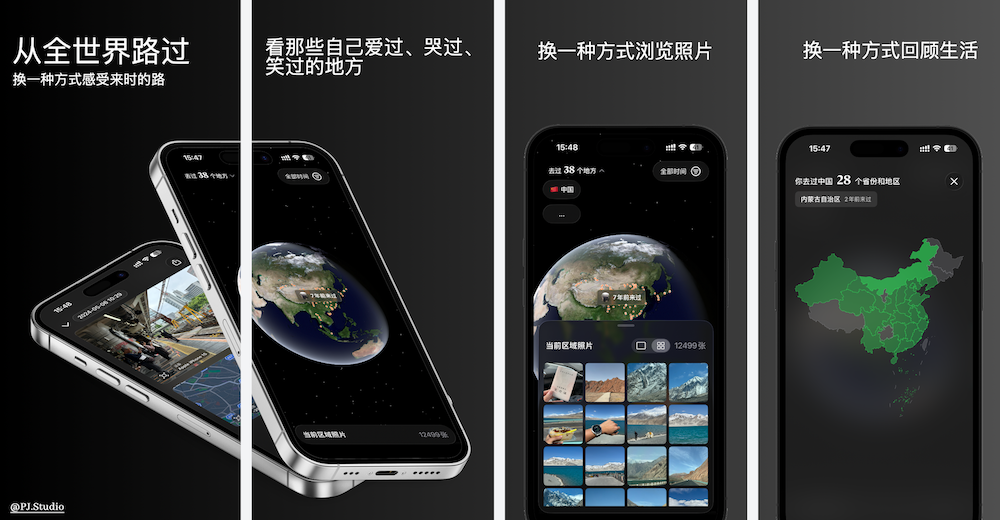
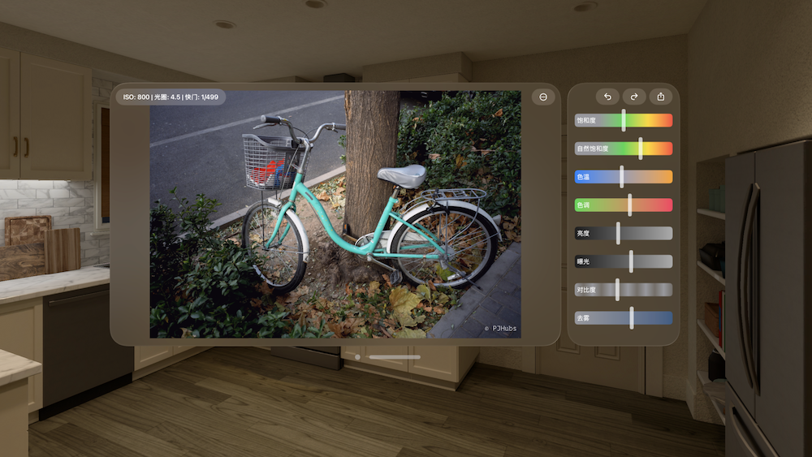
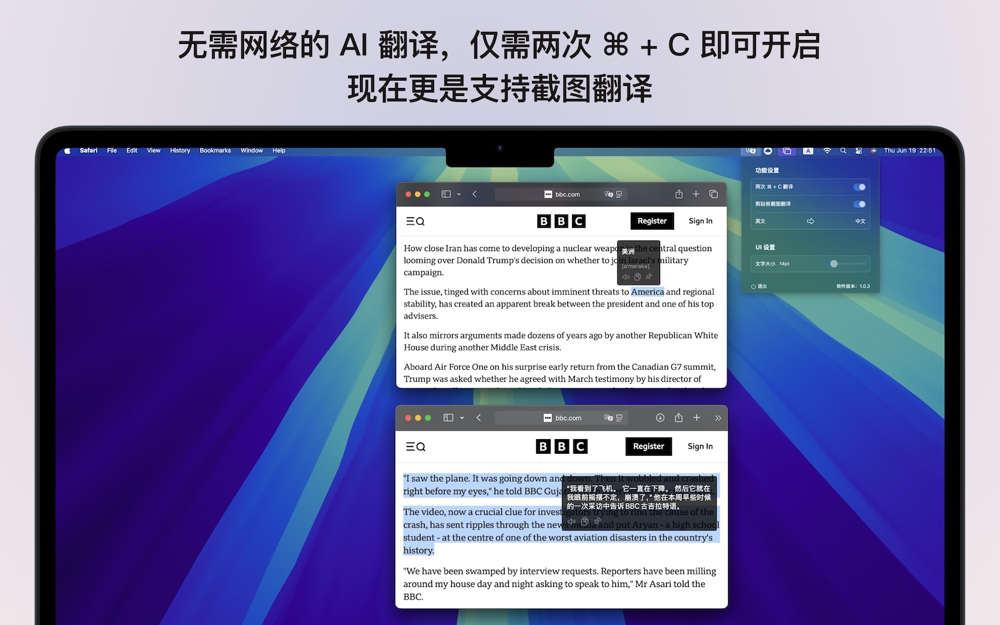
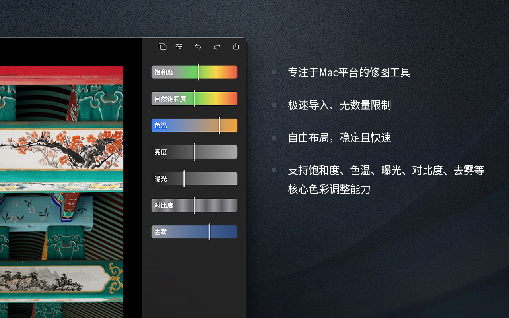
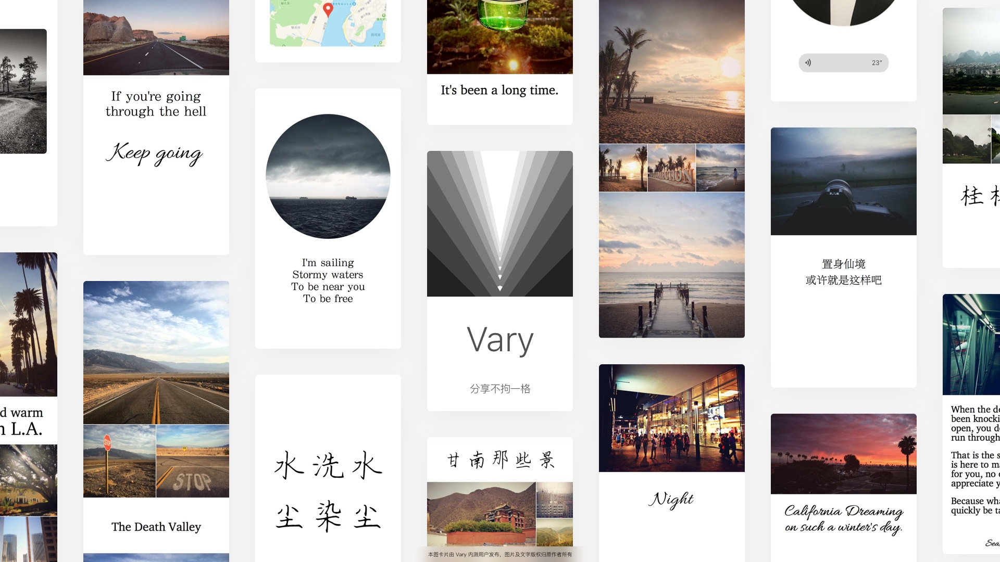
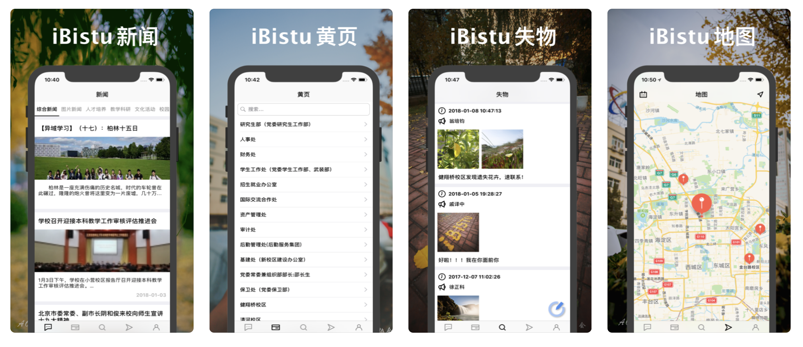

# Hi~ 我是翁培钧
我的 ID 是`PJHubs`。喜欢做一些有趣的事情，对技术有敬仰，对生活有追求，这里会分享一些在学习或生活上完整的、成体系的看法和总结。一些相信：

* 世上好人多
* 年轻人不应该迷茫
* 有事解决，没事读书
* 自我对话，自我排解，自我成长

## 作品

PFollow ([App Store](https://apps.apple.com/cn/app/pfollow/id6742342382)) | 自己从全世界路过的地方
--- | --- 

PhotoP Studio ([App Store](https://apps.apple.com/cn/app/photop-studio/id6739296926)) | 开启空间修图全新体验！
--- | --- 

TranslateP ([App Store](https://apps.apple.com/cn/app/translatep/id6737735627?l=en-GB&mt=12)) | 无需网络的 AI 翻译，仅需两次 cmd + c
--- | --- 

PhotoP ([App Store](https://apps.apple.com/cn/app/photop/id1639575048)) | 专注 macOS 平台的修图工具
--- | --- 

星球罐子（[App Store](https://apps.apple.com/hk/app/%E6%98%9F%E7%90%83%E7%BD%90%E5%AD%90/id1502901744)）| 拥有属于你的宇宙
--- | --- 

Vary（[App Store](https://apps.apple.com/cn/app/vary/id1190496148)） | 重量级创作工具，轻量级社交网络
--- | --- 

iBistu | 信息科大移动校园应用 
--- | --- 

旅行

南昌、蓟县、九寨沟县、红原县、阿坝县、四姑娘山镇、潮州、澳门、喀什、泉州、阳朔、桂林、珠海、香港、威海、怀来、鄂尔多斯、深圳、大理、丽江、大连、呼和浩特、洛阳、大同、崇礼、厦门、福州、苏州、南京、广州、青岛、杭州、舟山、上海、德令哈、大柴旦、丹霞镇、张掖、敦煌、亚丁、成都、张家界、乌鲁木齐、吐鲁番、青海、重庆、西安、武汉、北京、天津、海南

福冈、福津、熊本、鹿儿岛、新加坡、曼谷、清迈、普吉岛、釜山、大阪、京都、宇治、奈良、东京、横滨、镰仓、圣何塞、旧金山

工作经历

* 客户端 [@字节跳动](https://bytedance.com/zh)  2019.07 ~ 至今
    - 剪映/CapCut
    - 西瓜视频
    - 今日头条
* 大前端 [@滴滴出行](https://www.didiglobal.com)  2017.11 ~ 2019.05
    - 滴滴数据
    - 北极星
* iOS [@蜗牛睡眠](http://www.seblong.com)  2017.07 ~ 2017.10
    - 蜗牛睡不着

教育

* 软件工程 [@信息科大](http://www.bistu.edu.cn) 2015 ~ 2019
* 高中 [@海师附中](http://hsfz.hainnu.edu.cn/) 2012 ~ 2015
* 初中 [@海南省东方市第二中学]()
* 小学 [@海南省东方市铁路小学]()
* 幼儿园 [@海南省东方市铁路幼儿园]()

奖项

主体 | 奖项
--- | ---
2023 剪映 - 专业版 | Q4 “取得超出预期的成果”
2022 剪映 - 专业版 | 9~10 双月“取得超出预期的成果”
2022 字节校园 | 优秀讲师
2022 首届西瓜视频客户端开发挑战赛 | 年度最佳导师
2021 西瓜视频 - iOS | 3~4 双月业务先锋奖
2020 掘金 12 月专栏 | 月度作者奖
2020 西瓜视频 - iOS | 3~4 双月业务先锋奖
2019 [《Swift 游戏开发》](https://xiaozhuanlan.com/pjhubs-swift-game)小专栏 | 优秀开发专栏
2019 西瓜视频 - iOS | 9~10 双月团队贡献奖
[**北京信息科技大学毕业设计**](https://github.com/windstormeye/PIGPEN-Docs) | 优秀
北京信息科技大学计算机学院毕业设计 | 优秀
[** WWDC19 Scholarship**](https://github.com/windstormeye/WWDC19_brocadeOfLiNationality) | Accepted
[2018 全国移动互联创新大赛（华北赛区）](https://github.com/windstormeye/Peek) | 三等奖
[**首届中国 iOS 应用开发大赛**](https://github.com/windstormeye/CampusPlus) | 三等奖
**2017 Google Android 全国大学生移动互联网创新挑战赛** | 银奖
2017 北京信息科技大学计算机学院大创 | 国家级 *2
2016 全国高校互联网移动应用创新大赛 | 三等奖
2016 全国大学生移动应用创新大赛 | 优胜奖
第一届北京信息科技大学“校友杯”创业大赛 | 铜奖
第 26 届海南省青少年科技创新大赛 | 三等奖

活动

活动 | 职位
--- | ---
2024 移动应用创新赛 创新启航 - 字节训练营 | 嘉宾
2022 字节跳动 x 武汉大学前沿技术课程 | 讲师
2022 剪映 x 高校开学季 | 讲师
2022 WWDC22 内参 -[《Swift Playgrounds 指北》](https://xiaozhuanlan.com/topic/9107542836) | 作者
2022 首届西瓜视频客户端挑战赛 | 专家评审团
2022 字节校园 x 西瓜视频客户端系列讲座 | 讲师
2020 北京信息科技大学计算机学院《开源软件开发技术》课程 | 导师
2020 北京大学教育学院 - 远程编程学习分享 | 嘉宾
2020 freeCodeCamp 《更高效更有趣的学习编程和编程教学》| 嘉宾
2019 知识小集 | iOS 专栏作者
2019 北京师范大学 iOS Club 学生沙龙 | 讲师
2019 [CodeLab](https://www.codelab.club) - 国家图书馆少年儿童馆 少儿编程活动 | 技术志愿者
2019 北京信息科技大学计算机学院《开源软件开发技术》课程 | 导师
2019 [CodeLab](https://www.codelab.club) - 北京外国语大学 少儿编程活动 | 技术志愿者
2019 Apple Store 西单店“六一儿童节”编程特别活动 [@TimCook](https://m.weibo.cn/5524254784/4378269463566752) | 嘉宾
2019 第一届北京信息科技大学编程马拉松（BISTUHackathon）| 技术顾问
2019 北京 Qcon 全球软件开发大会 | 讲师助理
WTM 2019 @ GDG Beijing:《Python 从 0 到 1》| 助教
[iOSCaff 社区](https://learnku.com/docs/the-swift-programming-language/4.2) Swift 4.2 官方文档中文翻译 | 审校团队 & 译者
2018 GCD in BISTU“女性一日编程”活动 [@ifLab](https://www.iflab.org/2018/11/04/iflab-cgc01/) | 负责人
2017 北京 Qcon 全球软件开发大会 | 讲师助理
2016 Archsummit 全球架构师峰会 | 讲师助理
2016 北京马拉松 | 线路志愿者
2015 北京半程马拉松 | 志愿者

